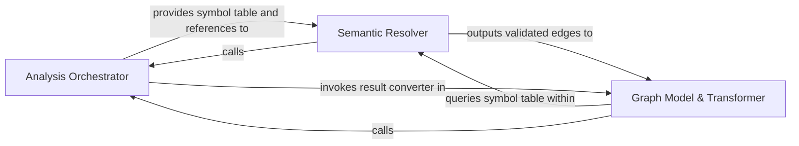

## Details

Builds the global call graph by coordinating symbol discovery and resolving cross-file references.

### Analysis Orchestrator [[Expand]](./Analysis_Orchestrator.md)
Acts as the central controller for the analysis lifecycle, managing the LSP client for symbol extraction and coordinating the symbol table population.

**Related Classes/Methods**:

- `static_analyzer.engine.call_graph_builder.CallGraphBuilder`:23-302
- `static_analyzer.engine.lsp_client.LSPClient`:31-820
- `static_analyzer.engine.symbol_table.SymbolTable.register_symbols`:61-167

**Source Files:**

- [`static_analyzer/__init__.py`](https://github.com/CodeBoarding/CodeBoarding/blob/main/.codeboardingstatic_analyzer/__init__.py)
  - `static_analyzer.__init__.StaticAnalyzer.get_file_symbols` ([L406-L429](https://github.com/CodeBoarding/CodeBoarding/blob/main/.codeboardingstatic_analyzer/__init__.py#L406-L429)) - Method
- [`static_analyzer/engine/call_graph_builder.py`](https://github.com/CodeBoarding/CodeBoarding/blob/main/.codeboardingstatic_analyzer/engine/call_graph_builder.py)
  - `static_analyzer.engine.call_graph_builder.CallGraphBuilder.build` ([L44-L118](https://github.com/CodeBoarding/CodeBoarding/blob/main/.codeboardingstatic_analyzer/engine/call_graph_builder.py#L44-L118)) - Method
  - `static_analyzer.engine.call_graph_builder.CallGraphBuilder._discover_symbols` ([L126-L171](https://github.com/CodeBoarding/CodeBoarding/blob/main/.codeboardingstatic_analyzer/engine/call_graph_builder.py#L126-L171)) - Method
  - `static_analyzer.engine.call_graph_builder.CallGraphBuilder._send_sync_probe` ([L187-L199](https://github.com/CodeBoarding/CodeBoarding/blob/main/.codeboardingstatic_analyzer/engine/call_graph_builder.py#L187-L199)) - Method
  - `static_analyzer.engine.call_graph_builder.CallGraphBuilder._postprocess_edges` ([L218-L274](https://github.com/CodeBoarding/CodeBoarding/blob/main/.codeboardingstatic_analyzer/engine/call_graph_builder.py#L218-L274)) - Method
  - `static_analyzer.engine.call_graph_builder.CallGraphBuilder._build_package_deps` ([L276-L302](https://github.com/CodeBoarding/CodeBoarding/blob/main/.codeboardingstatic_analyzer/engine/call_graph_builder.py#L276-L302)) - Method
- [`static_analyzer/engine/edge_build_context.py`](https://github.com/CodeBoarding/CodeBoarding/blob/main/.codeboardingstatic_analyzer/engine/edge_build_context.py)
  - `static_analyzer.engine.edge_build_context.EdgeBuildContext` ([L13-L18](https://github.com/CodeBoarding/CodeBoarding/blob/main/.codeboardingstatic_analyzer/engine/edge_build_context.py#L13-L18)) - Class
- [`static_analyzer/engine/hierarchy_builder.py`](https://github.com/CodeBoarding/CodeBoarding/blob/main/.codeboardingstatic_analyzer/engine/hierarchy_builder.py)
  - `static_analyzer.engine.hierarchy_builder.HierarchyBuilder` ([L19-L200](https://github.com/CodeBoarding/CodeBoarding/blob/main/.codeboardingstatic_analyzer/engine/hierarchy_builder.py#L19-L200)) - Class
- [`static_analyzer/engine/language_adapter.py`](https://github.com/CodeBoarding/CodeBoarding/blob/main/.codeboardingstatic_analyzer/engine/language_adapter.py)
  - `static_analyzer.engine.language_adapter.LanguageAdapter.build_reference_key` ([L103-L109](https://github.com/CodeBoarding/CodeBoarding/blob/main/.codeboardingstatic_analyzer/engine/language_adapter.py#L103-L109)) - Method
  - `static_analyzer.engine.language_adapter.LanguageAdapter.get_package_for_file` ([L119-L133](https://github.com/CodeBoarding/CodeBoarding/blob/main/.codeboardingstatic_analyzer/engine/language_adapter.py#L119-L133)) - Method
  - `static_analyzer.engine.language_adapter.LanguageAdapter.probe_before_open` ([L172-L182](https://github.com/CodeBoarding/CodeBoarding/blob/main/.codeboardingstatic_analyzer/engine/language_adapter.py#L172-L182)) - Method
  - `static_analyzer.engine.language_adapter.LanguageAdapter.get_probe_timeout_minimum` ([L184-L192](https://github.com/CodeBoarding/CodeBoarding/blob/main/.codeboardingstatic_analyzer/engine/language_adapter.py#L184-L192)) - Method
  - `static_analyzer.engine.language_adapter.LanguageAdapter.get_all_packages` ([L328-L343](https://github.com/CodeBoarding/CodeBoarding/blob/main/.codeboardingstatic_analyzer/engine/language_adapter.py#L328-L343)) - Method
- [`static_analyzer/engine/lsp_client.py`](https://github.com/CodeBoarding/CodeBoarding/blob/main/.codeboardingstatic_analyzer/engine/lsp_client.py)
  - `static_analyzer.engine.lsp_client.LSPClient.document_symbol` ([L271-L280](https://github.com/CodeBoarding/CodeBoarding/blob/main/.codeboardingstatic_analyzer/engine/lsp_client.py#L271-L280)) - Method
- [`static_analyzer/engine/models.py`](https://github.com/CodeBoarding/CodeBoarding/blob/main/.codeboardingstatic_analyzer/engine/models.py)
  - `static_analyzer.engine.models.SymbolInfo` ([L14-L30](https://github.com/CodeBoarding/CodeBoarding/blob/main/.codeboardingstatic_analyzer/engine/models.py#L14-L30)) - Class
  - `static_analyzer.engine.models.Edge` ([L34-L38](https://github.com/CodeBoarding/CodeBoarding/blob/main/.codeboardingstatic_analyzer/engine/models.py#L34-L38)) - Class
  - `static_analyzer.engine.models.CallFlowGraph` ([L42-L57](https://github.com/CodeBoarding/CodeBoarding/blob/main/.codeboardingstatic_analyzer/engine/models.py#L42-L57)) - Class
  - `static_analyzer.engine.models.CallFlowGraph.from_edge_set` ([L49-L57](https://github.com/CodeBoarding/CodeBoarding/blob/main/.codeboardingstatic_analyzer/engine/models.py#L49-L57)) - Method
  - `static_analyzer.engine.models.LanguageAnalysisResult` ([L61-L68](https://github.com/CodeBoarding/CodeBoarding/blob/main/.codeboardingstatic_analyzer/engine/models.py#L61-L68)) - Class
  - `static_analyzer.engine.models.AnalysisResults` ([L71-L101](https://github.com/CodeBoarding/CodeBoarding/blob/main/.codeboardingstatic_analyzer/engine/models.py#L71-L101)) - Class
  - `static_analyzer.engine.models.AnalysisResults.__init__` ([L74-L75](https://github.com/CodeBoarding/CodeBoarding/blob/main/.codeboardingstatic_analyzer/engine/models.py#L74-L75)) - Method
  - `static_analyzer.engine.models.AnalysisResults.add_language_result` ([L77-L78](https://github.com/CodeBoarding/CodeBoarding/blob/main/.codeboardingstatic_analyzer/engine/models.py#L77-L78)) - Method
  - `static_analyzer.engine.models.AnalysisResults.get_languages` ([L80-L81](https://github.com/CodeBoarding/CodeBoarding/blob/main/.codeboardingstatic_analyzer/engine/models.py#L80-L81)) - Method
  - `static_analyzer.engine.models.AnalysisResults.get_hierarchy` ([L83-L86](https://github.com/CodeBoarding/CodeBoarding/blob/main/.codeboardingstatic_analyzer/engine/models.py#L83-L86)) - Method
  - `static_analyzer.engine.models.AnalysisResults.get_cfg` ([L88-L91](https://github.com/CodeBoarding/CodeBoarding/blob/main/.codeboardingstatic_analyzer/engine/models.py#L88-L91)) - Method
  - `static_analyzer.engine.models.AnalysisResults.get_package_dependencies` ([L93-L96](https://github.com/CodeBoarding/CodeBoarding/blob/main/.codeboardingstatic_analyzer/engine/models.py#L93-L96)) - Method
  - `static_analyzer.engine.models.AnalysisResults.get_source_files` ([L98-L101](https://github.com/CodeBoarding/CodeBoarding/blob/main/.codeboardingstatic_analyzer/engine/models.py#L98-L101)) - Method
- [`static_analyzer/engine/protocols.py`](https://github.com/CodeBoarding/CodeBoarding/blob/main/.codeboardingstatic_analyzer/engine/protocols.py)
  - `static_analyzer.engine.protocols.SymbolNaming.build_qualified_name` ([L18-L26](https://github.com/CodeBoarding/CodeBoarding/blob/main/.codeboardingstatic_analyzer/engine/protocols.py#L18-L26)) - Method
  - `static_analyzer.engine.protocols.SymbolNaming.build_reference_key` ([L28-L28](https://github.com/CodeBoarding/CodeBoarding/blob/main/.codeboardingstatic_analyzer/engine/protocols.py#L28-L28)) - Method
- [`static_analyzer/engine/symbol_table.py`](https://github.com/CodeBoarding/CodeBoarding/blob/main/.codeboardingstatic_analyzer/engine/symbol_table.py)
  - `static_analyzer.engine.symbol_table.SymbolTable.symbols` ([L42-L44](https://github.com/CodeBoarding/CodeBoarding/blob/main/.codeboardingstatic_analyzer/engine/symbol_table.py#L42-L44)) - Method
  - `static_analyzer.engine.symbol_table.SymbolTable.class_to_ctors` ([L57-L59](https://github.com/CodeBoarding/CodeBoarding/blob/main/.codeboardingstatic_analyzer/engine/symbol_table.py#L57-L59)) - Method
  - `static_analyzer.engine.symbol_table.SymbolTable.register_symbols` ([L61-L167](https://github.com/CodeBoarding/CodeBoarding/blob/main/.codeboardingstatic_analyzer/engine/symbol_table.py#L61-L167)) - Method
  - `static_analyzer.engine.symbol_table.SymbolTable.build_indices` ([L169-L188](https://github.com/CodeBoarding/CodeBoarding/blob/main/.codeboardingstatic_analyzer/engine/symbol_table.py#L169-L188)) - Method

### Semantic Resolver [[Expand]](./Semantic_Resolver.md)
The intelligence layer that performs name resolution and reference linking, mapping call sites to canonical definitions.

**Related Classes/Methods**:

- `static_analyzer.engine.edge_builder.build_edges_via_references`:33-122
- `static_analyzer.engine.edge_builder._resolve_definitions`:279-368
- `static_analyzer.engine.symbol_table.SymbolTable.get_canonical_name`:279-294

**Source Files:**

- [`static_analyzer/engine/call_graph_builder.py`](https://github.com/CodeBoarding/CodeBoarding/blob/main/.codeboardingstatic_analyzer/engine/call_graph_builder.py)
  - `static_analyzer.engine.call_graph_builder.CallGraphBuilder._build_edges` ([L120-L124](https://github.com/CodeBoarding/CodeBoarding/blob/main/.codeboardingstatic_analyzer/engine/call_graph_builder.py#L120-L124)) - Method
  - `static_analyzer.engine.call_graph_builder.CallGraphBuilder._bulk_did_open` ([L173-L185](https://github.com/CodeBoarding/CodeBoarding/blob/main/.codeboardingstatic_analyzer/engine/call_graph_builder.py#L173-L185)) - Method
- [`static_analyzer/engine/edge_builder.py`](https://github.com/CodeBoarding/CodeBoarding/blob/main/.codeboardingstatic_analyzer/engine/edge_builder.py)
  - `static_analyzer.engine.edge_builder.build_edges_via_references` ([L33-L122](https://github.com/CodeBoarding/CodeBoarding/blob/main/.codeboardingstatic_analyzer/engine/edge_builder.py#L33-L122)) - Function
  - `static_analyzer.engine.edge_builder._prepare_trackable_symbols` ([L125-L156](https://github.com/CodeBoarding/CodeBoarding/blob/main/.codeboardingstatic_analyzer/engine/edge_builder.py#L125-L156)) - Function
  - `static_analyzer.engine.edge_builder._process_references_for_position` ([L159-L218](https://github.com/CodeBoarding/CodeBoarding/blob/main/.codeboardingstatic_analyzer/engine/edge_builder.py#L159-L218)) - Function
  - `static_analyzer.engine.edge_builder.build_edges_via_definitions` ([L226-L255](https://github.com/CodeBoarding/CodeBoarding/blob/main/.codeboardingstatic_analyzer/engine/edge_builder.py#L226-L255)) - Function
  - `static_analyzer.engine.edge_builder._build_definition_lookups` ([L258-L276](https://github.com/CodeBoarding/CodeBoarding/blob/main/.codeboardingstatic_analyzer/engine/edge_builder.py#L258-L276)) - Function
  - `static_analyzer.engine.edge_builder._resolve_definitions` ([L279-L368](https://github.com/CodeBoarding/CodeBoarding/blob/main/.codeboardingstatic_analyzer/engine/edge_builder.py#L279-L368)) - Function
  - `static_analyzer.engine.edge_builder._resolve_implementations` ([L371-L431](https://github.com/CodeBoarding/CodeBoarding/blob/main/.codeboardingstatic_analyzer/engine/edge_builder.py#L371-L431)) - Function
  - `static_analyzer.engine.edge_builder._is_valid_edge` ([L439-L451](https://github.com/CodeBoarding/CodeBoarding/blob/main/.codeboardingstatic_analyzer/engine/edge_builder.py#L439-L451)) - Function
  - `static_analyzer.engine.edge_builder._resolve_definition_to_symbol` ([L454-L495](https://github.com/CodeBoarding/CodeBoarding/blob/main/.codeboardingstatic_analyzer/engine/edge_builder.py#L454-L495)) - Function
  - `static_analyzer.engine.edge_builder._best_candidate` ([L498-L506](https://github.com/CodeBoarding/CodeBoarding/blob/main/.codeboardingstatic_analyzer/engine/edge_builder.py#L498-L506)) - Function
- [`static_analyzer/engine/language_adapter.py`](https://github.com/CodeBoarding/CodeBoarding/blob/main/.codeboardingstatic_analyzer/engine/language_adapter.py)
  - `static_analyzer.engine.language_adapter.LanguageAdapter.edge_strategy` ([L290-L296](https://github.com/CodeBoarding/CodeBoarding/blob/main/.codeboardingstatic_analyzer/engine/language_adapter.py#L290-L296)) - Method
- [`static_analyzer/engine/models.py`](https://github.com/CodeBoarding/CodeBoarding/blob/main/.codeboardingstatic_analyzer/engine/models.py)
  - `static_analyzer.engine.models.SymbolInfo.definition_location` ([L28-L30](https://github.com/CodeBoarding/CodeBoarding/blob/main/.codeboardingstatic_analyzer/engine/models.py#L28-L30)) - Method
- [`static_analyzer/engine/progress.py`](https://github.com/CodeBoarding/CodeBoarding/blob/main/.codeboardingstatic_analyzer/engine/progress.py)
  - `static_analyzer.engine.progress.ProgressLogger` ([L22-L83](https://github.com/CodeBoarding/CodeBoarding/blob/main/.codeboardingstatic_analyzer/engine/progress.py#L22-L83)) - Class
  - `static_analyzer.engine.progress.ProgressLogger.__init__` ([L25-L42](https://github.com/CodeBoarding/CodeBoarding/blob/main/.codeboardingstatic_analyzer/engine/progress.py#L25-L42)) - Method
  - `static_analyzer.engine.progress.ProgressLogger.set_postfix` ([L44-L45](https://github.com/CodeBoarding/CodeBoarding/blob/main/.codeboardingstatic_analyzer/engine/progress.py#L44-L45)) - Method
  - `static_analyzer.engine.progress.ProgressLogger.update` ([L47-L60](https://github.com/CodeBoarding/CodeBoarding/blob/main/.codeboardingstatic_analyzer/engine/progress.py#L47-L60)) - Method
  - `static_analyzer.engine.progress.ProgressLogger.finish` ([L62-L65](https://github.com/CodeBoarding/CodeBoarding/blob/main/.codeboardingstatic_analyzer/engine/progress.py#L62-L65)) - Method
  - `static_analyzer.engine.progress.ProgressLogger._log` ([L67-L83](https://github.com/CodeBoarding/CodeBoarding/blob/main/.codeboardingstatic_analyzer/engine/progress.py#L67-L83)) - Method
- [`static_analyzer/engine/protocols.py`](https://github.com/CodeBoarding/CodeBoarding/blob/main/.codeboardingstatic_analyzer/engine/protocols.py)
  - `static_analyzer.engine.protocols.SymbolNaming` ([L15-L32](https://github.com/CodeBoarding/CodeBoarding/blob/main/.codeboardingstatic_analyzer/engine/protocols.py#L15-L32)) - Class
  - `static_analyzer.engine.protocols.SymbolNaming.is_class_like` ([L30-L30](https://github.com/CodeBoarding/CodeBoarding/blob/main/.codeboardingstatic_analyzer/engine/protocols.py#L30-L30)) - Method
  - `static_analyzer.engine.protocols.SymbolNaming.is_callable` ([L32-L32](https://github.com/CodeBoarding/CodeBoarding/blob/main/.codeboardingstatic_analyzer/engine/protocols.py#L32-L32)) - Method
  - `static_analyzer.engine.protocols.EdgeBuildAdapter` ([L35-L48](https://github.com/CodeBoarding/CodeBoarding/blob/main/.codeboardingstatic_analyzer/engine/protocols.py#L35-L48)) - Class
  - `static_analyzer.engine.protocols.EdgeBuildAdapter.references_batch_size` ([L39-L39](https://github.com/CodeBoarding/CodeBoarding/blob/main/.codeboardingstatic_analyzer/engine/protocols.py#L39-L39)) - Method
  - `static_analyzer.engine.protocols.EdgeBuildAdapter.references_per_query_timeout` ([L42-L42](https://github.com/CodeBoarding/CodeBoarding/blob/main/.codeboardingstatic_analyzer/engine/protocols.py#L42-L42)) - Method
  - `static_analyzer.engine.protocols.EdgeBuildAdapter.should_track_for_edges` ([L44-L44](https://github.com/CodeBoarding/CodeBoarding/blob/main/.codeboardingstatic_analyzer/engine/protocols.py#L44-L44)) - Method
  - `static_analyzer.engine.protocols.EdgeBuildAdapter.is_class_like` ([L46-L46](https://github.com/CodeBoarding/CodeBoarding/blob/main/.codeboardingstatic_analyzer/engine/protocols.py#L46-L46)) - Method
  - `static_analyzer.engine.protocols.EdgeBuildAdapter.is_callable` ([L48-L48](https://github.com/CodeBoarding/CodeBoarding/blob/main/.codeboardingstatic_analyzer/engine/protocols.py#L48-L48)) - Method
- [`static_analyzer/engine/symbol_table.py`](https://github.com/CodeBoarding/CodeBoarding/blob/main/.codeboardingstatic_analyzer/engine/symbol_table.py)
  - `static_analyzer.engine.symbol_table.SymbolTable.find_containing_symbol` ([L190-L241](https://github.com/CodeBoarding/CodeBoarding/blob/main/.codeboardingstatic_analyzer/engine/symbol_table.py#L190-L241)) - Method
  - `static_analyzer.engine.symbol_table.SymbolTable.lift_to_callable` ([L243-L265](https://github.com/CodeBoarding/CodeBoarding/blob/main/.codeboardingstatic_analyzer/engine/symbol_table.py#L243-L265)) - Method
  - `static_analyzer.engine.symbol_table.SymbolTable.get_equivalent_names` ([L267-L277](https://github.com/CodeBoarding/CodeBoarding/blob/main/.codeboardingstatic_analyzer/engine/symbol_table.py#L267-L277)) - Method
  - `static_analyzer.engine.symbol_table.SymbolTable.get_canonical_name` ([L279-L294](https://github.com/CodeBoarding/CodeBoarding/blob/main/.codeboardingstatic_analyzer/engine/symbol_table.py#L279-L294)) - Method
  - `static_analyzer.engine.symbol_table.SymbolTable.is_local_variable` ([L296-L328](https://github.com/CodeBoarding/CodeBoarding/blob/main/.codeboardingstatic_analyzer/engine/symbol_table.py#L296-L328)) - Method

### Graph Model & Transformer [[Expand]](./Graph_Model_Transformer.md)
Manages the structural representation of the call graph and converts internal engine symbols into the public-facing schema.

**Related Classes/Methods**:

- `static_analyzer.graph.CallGraph`:85-827
- `static_analyzer.engine.result_converter.convert_to_codeboarding_format`:17-122
- `static_analyzer.analysis_cache.merge_results`:393-422

**Source Files:**

- [`agents/validation.py`](https://github.com/CodeBoarding/CodeBoarding/blob/main/.codeboardingagents/validation.py)
  - `agents.validation._build_cluster_edge_lookup` ([L586-L613](https://github.com/CodeBoarding/CodeBoarding/blob/main/.codeboardingagents/validation.py#L586-L613)) - Function
  - `agents.validation._check_edge_between_cluster_sets` ([L616-L654](https://github.com/CodeBoarding/CodeBoarding/blob/main/.codeboardingagents/validation.py#L616-L654)) - Function
- [`static_analyzer/analysis_cache.py`](https://github.com/CodeBoarding/CodeBoarding/blob/main/.codeboardingstatic_analyzer/analysis_cache.py)
  - `static_analyzer.analysis_cache.StaticAnalysisCache.__init__` ([L69-L71](https://github.com/CodeBoarding/CodeBoarding/blob/main/.codeboardingstatic_analyzer/analysis_cache.py#L69-L71)) - Method
  - `static_analyzer.analysis_cache.invalidate_files` ([L336-L390](https://github.com/CodeBoarding/CodeBoarding/blob/main/.codeboardingstatic_analyzer/analysis_cache.py#L336-L390)) - Function
  - `static_analyzer.analysis_cache.merge_results` ([L393-L422](https://github.com/CodeBoarding/CodeBoarding/blob/main/.codeboardingstatic_analyzer/analysis_cache.py#L393-L422)) - Function
  - `static_analyzer.analysis_cache._collect_invalidated_edge` ([L425-L433](https://github.com/CodeBoarding/CodeBoarding/blob/main/.codeboardingstatic_analyzer/analysis_cache.py#L425-L433)) - Function
  - `static_analyzer.analysis_cache._validate_no_dangling_references` ([L436-L469](https://github.com/CodeBoarding/CodeBoarding/blob/main/.codeboardingstatic_analyzer/analysis_cache.py#L436-L469)) - Function
- [`static_analyzer/analysis_result.py`](https://github.com/CodeBoarding/CodeBoarding/blob/main/.codeboardingstatic_analyzer/analysis_result.py)
  - `static_analyzer.analysis_result.AnalysisData` ([L41-L70](https://github.com/CodeBoarding/CodeBoarding/blob/main/.codeboardingstatic_analyzer/analysis_result.py#L41-L70)) - Class
  - `static_analyzer.analysis_result.AnalysisData.from_dict` ([L50-L58](https://github.com/CodeBoarding/CodeBoarding/blob/main/.codeboardingstatic_analyzer/analysis_result.py#L50-L58)) - Method
  - `static_analyzer.analysis_result.InvalidatedAnalysis` ([L74-L77](https://github.com/CodeBoarding/CodeBoarding/blob/main/.codeboardingstatic_analyzer/analysis_result.py#L74-L77)) - Class
- [`static_analyzer/cluster_relations.py`](https://github.com/CodeBoarding/CodeBoarding/blob/main/.codeboardingstatic_analyzer/cluster_relations.py)
  - `static_analyzer.cluster_relations.ClusterRelation` ([L19-L25](https://github.com/CodeBoarding/CodeBoarding/blob/main/.codeboardingstatic_analyzer/cluster_relations.py#L19-L25)) - Class
  - `static_analyzer.cluster_relations.build_component_relations` ([L42-L83](https://github.com/CodeBoarding/CodeBoarding/blob/main/.codeboardingstatic_analyzer/cluster_relations.py#L42-L83)) - Function
- [`static_analyzer/constants.py`](https://github.com/CodeBoarding/CodeBoarding/blob/main/.codeboardingstatic_analyzer/constants.py)
  - `static_analyzer.constants.NodeType` ([L86-L137](https://github.com/CodeBoarding/CodeBoarding/blob/main/.codeboardingstatic_analyzer/constants.py#L86-L137)) - Class
- [`static_analyzer/engine/adapters/csharp_adapter.py`](https://github.com/CodeBoarding/CodeBoarding/blob/main/.codeboardingstatic_analyzer/engine/adapters/csharp_adapter.py)
  - `static_analyzer.engine.adapters.csharp_adapter.CSharpAdapter.is_reference_worthy` ([L262-L264](https://github.com/CodeBoarding/CodeBoarding/blob/main/.codeboardingstatic_analyzer/engine/adapters/csharp_adapter.py#L262-L264)) - Method
- [`static_analyzer/engine/adapters/php_adapter.py`](https://github.com/CodeBoarding/CodeBoarding/blob/main/.codeboardingstatic_analyzer/engine/adapters/php_adapter.py)
  - `static_analyzer.engine.adapters.php_adapter.PHPAdapter` ([L12-L50](https://github.com/CodeBoarding/CodeBoarding/blob/main/.codeboardingstatic_analyzer/engine/adapters/php_adapter.py#L12-L50)) - Class
  - `static_analyzer.engine.adapters.php_adapter.PHPAdapter.language` ([L15-L16](https://github.com/CodeBoarding/CodeBoarding/blob/main/.codeboardingstatic_analyzer/engine/adapters/php_adapter.py#L15-L16)) - Method
  - `static_analyzer.engine.adapters.php_adapter.PHPAdapter.language_enum` ([L19-L20](https://github.com/CodeBoarding/CodeBoarding/blob/main/.codeboardingstatic_analyzer/engine/adapters/php_adapter.py#L19-L20)) - Method
  - `static_analyzer.engine.adapters.php_adapter.PHPAdapter.lsp_command` ([L23-L24](https://github.com/CodeBoarding/CodeBoarding/blob/main/.codeboardingstatic_analyzer/engine/adapters/php_adapter.py#L23-L24)) - Method
  - `static_analyzer.engine.adapters.php_adapter.PHPAdapter.language_id` ([L27-L28](https://github.com/CodeBoarding/CodeBoarding/blob/main/.codeboardingstatic_analyzer/engine/adapters/php_adapter.py#L27-L28)) - Method
  - `static_analyzer.engine.adapters.php_adapter.PHPAdapter.get_lsp_init_options` ([L33-L34](https://github.com/CodeBoarding/CodeBoarding/blob/main/.codeboardingstatic_analyzer/engine/adapters/php_adapter.py#L33-L34)) - Method
  - `static_analyzer.engine.adapters.php_adapter.PHPAdapter.get_workspace_settings` ([L36-L44](https://github.com/CodeBoarding/CodeBoarding/blob/main/.codeboardingstatic_analyzer/engine/adapters/php_adapter.py#L36-L44)) - Method
  - `static_analyzer.engine.adapters.php_adapter.PHPAdapter.is_reference_worthy` ([L46-L47](https://github.com/CodeBoarding/CodeBoarding/blob/main/.codeboardingstatic_analyzer/engine/adapters/php_adapter.py#L46-L47)) - Method
- [`static_analyzer/engine/language_adapter.py`](https://github.com/CodeBoarding/CodeBoarding/blob/main/.codeboardingstatic_analyzer/engine/language_adapter.py)
  - `static_analyzer.engine.language_adapter.LanguageAdapter.is_reference_worthy` ([L273-L284](https://github.com/CodeBoarding/CodeBoarding/blob/main/.codeboardingstatic_analyzer/engine/language_adapter.py#L273-L284)) - Method
- [`static_analyzer/engine/result_converter.py`](https://github.com/CodeBoarding/CodeBoarding/blob/main/.codeboardingstatic_analyzer/engine/result_converter.py)
  - `static_analyzer.engine.result_converter.convert_to_codeboarding_format` ([L17-L122](https://github.com/CodeBoarding/CodeBoarding/blob/main/.codeboardingstatic_analyzer/engine/result_converter.py#L17-L122)) - Function
  - `static_analyzer.engine.result_converter._map_symbol_kind` ([L125-L134](https://github.com/CodeBoarding/CodeBoarding/blob/main/.codeboardingstatic_analyzer/engine/result_converter.py#L125-L134)) - Function
- [`static_analyzer/engine/symbol_table.py`](https://github.com/CodeBoarding/CodeBoarding/blob/main/.codeboardingstatic_analyzer/engine/symbol_table.py)
  - `static_analyzer.engine.symbol_table.SymbolTable.primary_file_symbols` ([L47-L49](https://github.com/CodeBoarding/CodeBoarding/blob/main/.codeboardingstatic_analyzer/engine/symbol_table.py#L47-L49)) - Method
- [`static_analyzer/graph.py`](https://github.com/CodeBoarding/CodeBoarding/blob/main/.codeboardingstatic_analyzer/graph.py)
  - `static_analyzer.graph.LocationKey` ([L38-L45](https://github.com/CodeBoarding/CodeBoarding/blob/main/.codeboardingstatic_analyzer/graph.py#L38-L45)) - Class
  - `static_analyzer.graph.Edge` ([L70-L82](https://github.com/CodeBoarding/CodeBoarding/blob/main/.codeboardingstatic_analyzer/graph.py#L70-L82)) - Class
  - `static_analyzer.graph.Edge.get_source` ([L75-L76](https://github.com/CodeBoarding/CodeBoarding/blob/main/.codeboardingstatic_analyzer/graph.py#L75-L76)) - Method
  - `static_analyzer.graph.Edge.get_destination` ([L78-L79](https://github.com/CodeBoarding/CodeBoarding/blob/main/.codeboardingstatic_analyzer/graph.py#L78-L79)) - Method
  - `static_analyzer.graph.CallGraph` ([L85-L827](https://github.com/CodeBoarding/CodeBoarding/blob/main/.codeboardingstatic_analyzer/graph.py#L85-L827)) - Class
  - `static_analyzer.graph.CallGraph.add_node` ([L110-L147](https://github.com/CodeBoarding/CodeBoarding/blob/main/.codeboardingstatic_analyzer/graph.py#L110-L147)) - Method
  - `static_analyzer.graph.CallGraph.has_node` ([L149-L151](https://github.com/CodeBoarding/CodeBoarding/blob/main/.codeboardingstatic_analyzer/graph.py#L149-L151)) - Method
  - `static_analyzer.graph.CallGraph._resolve_name` ([L153-L155](https://github.com/CodeBoarding/CodeBoarding/blob/main/.codeboardingstatic_analyzer/graph.py#L153-L155)) - Method
  - `static_analyzer.graph.CallGraph.add_edge` ([L157-L172](https://github.com/CodeBoarding/CodeBoarding/blob/main/.codeboardingstatic_analyzer/graph.py#L157-L172)) - Method
  - `static_analyzer.graph.CallGraph.filter` ([L174-L200](https://github.com/CodeBoarding/CodeBoarding/blob/main/.codeboardingstatic_analyzer/graph.py#L174-L200)) - Method
  - `static_analyzer.graph.CallGraph.union` ([L202-L226](https://github.com/CodeBoarding/CodeBoarding/blob/main/.codeboardingstatic_analyzer/graph.py#L202-L226)) - Method
  - `static_analyzer.graph.CallGraph._prune_cluster_cache` ([L228-L253](https://github.com/CodeBoarding/CodeBoarding/blob/main/.codeboardingstatic_analyzer/graph.py#L228-L253)) - Method
  - `static_analyzer.graph.CallGraph.filter_by_files` ([L333-L358](https://github.com/CodeBoarding/CodeBoarding/blob/main/.codeboardingstatic_analyzer/graph.py#L333-L358)) - Method
  - `static_analyzer.graph.CallGraph.filter_by_nodes` ([L360-L375](https://github.com/CodeBoarding/CodeBoarding/blob/main/.codeboardingstatic_analyzer/graph.py#L360-L375)) - Method
  - `static_analyzer.graph.CallGraph._llm_str_detailed` ([L755-L780](https://github.com/CodeBoarding/CodeBoarding/blob/main/.codeboardingstatic_analyzer/graph.py#L755-L780)) - Method
- [`static_analyzer/incremental_orchestrator.py`](https://github.com/CodeBoarding/CodeBoarding/blob/main/.codeboardingstatic_analyzer/incremental_orchestrator.py)
  - `static_analyzer.incremental_orchestrator._filter_to_live_files` ([L305-L338](https://github.com/CodeBoarding/CodeBoarding/blob/main/.codeboardingstatic_analyzer/incremental_orchestrator.py#L305-L338)) - Function
- [`static_analyzer/language_results.py`](https://github.com/CodeBoarding/CodeBoarding/blob/main/.codeboardingstatic_analyzer/language_results.py)
  - `static_analyzer.language_results.ControlFlowGraph.merge` ([L21-L31](https://github.com/CodeBoarding/CodeBoarding/blob/main/.codeboardingstatic_analyzer/language_results.py#L21-L31)) - Method
- [`static_analyzer/node.py`](https://github.com/CodeBoarding/CodeBoarding/blob/main/.codeboardingstatic_analyzer/node.py)
  - `static_analyzer.node.Node` ([L9-L69](https://github.com/CodeBoarding/CodeBoarding/blob/main/.codeboardingstatic_analyzer/node.py#L9-L69)) - Class
  - `static_analyzer.node.Node.__init__` ([L12-L27](https://github.com/CodeBoarding/CodeBoarding/blob/main/.codeboardingstatic_analyzer/node.py#L12-L27)) - Method
  - `static_analyzer.node.Node.entity_label` ([L29-L31](https://github.com/CodeBoarding/CodeBoarding/blob/main/.codeboardingstatic_analyzer/node.py#L29-L31)) - Method
  - `static_analyzer.node.Node.added_method_called_by_me` ([L59-L63](https://github.com/CodeBoarding/CodeBoarding/blob/main/.codeboardingstatic_analyzer/node.py#L59-L63)) - Method

### [FAQ](https://github.com/CodeBoarding/GeneratedOnBoardings/tree/main?tab=readme-ov-file#faq)