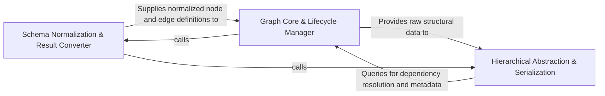

## Details

Manages the structural representation of the call graph and converts internal engine symbols into the public-facing schema.

### Schema Normalization & Result Converter
Acts as the entry point for the subsystem, translating heterogeneous outputs from various language analyzers into the standardized CodeBoarding schema.

**Related Classes/Methods**:

- `static_analyzer.engine.result_converter.convert_to_codeboarding_format`:17-122
- `static_analyzer.engine.result_converter._map_symbol_kind`:125-134

**Source Files:**

- [`agents/validation.py`](https://github.com/CodeBoarding/CodeBoarding/blob/main/.codeboardingagents/validation.py)
  - `agents.validation._build_cluster_edge_lookup` ([L586-L613](https://github.com/CodeBoarding/CodeBoarding/blob/main/.codeboardingagents/validation.py#L586-L613)) - Function
  - `agents.validation._check_edge_between_cluster_sets` ([L616-L654](https://github.com/CodeBoarding/CodeBoarding/blob/main/.codeboardingagents/validation.py#L616-L654)) - Function
- [`static_analyzer/analysis_cache.py`](https://github.com/CodeBoarding/CodeBoarding/blob/main/.codeboardingstatic_analyzer/analysis_cache.py)
  - `static_analyzer.analysis_cache.StaticAnalysisCache.__init__` ([L69-L71](https://github.com/CodeBoarding/CodeBoarding/blob/main/.codeboardingstatic_analyzer/analysis_cache.py#L69-L71)) - Method
  - `static_analyzer.analysis_cache.invalidate_files` ([L336-L390](https://github.com/CodeBoarding/CodeBoarding/blob/main/.codeboardingstatic_analyzer/analysis_cache.py#L336-L390)) - Function
  - `static_analyzer.analysis_cache.merge_results` ([L393-L422](https://github.com/CodeBoarding/CodeBoarding/blob/main/.codeboardingstatic_analyzer/analysis_cache.py#L393-L422)) - Function
  - `static_analyzer.analysis_cache._collect_invalidated_edge` ([L425-L433](https://github.com/CodeBoarding/CodeBoarding/blob/main/.codeboardingstatic_analyzer/analysis_cache.py#L425-L433)) - Function
  - `static_analyzer.analysis_cache._validate_no_dangling_references` ([L436-L469](https://github.com/CodeBoarding/CodeBoarding/blob/main/.codeboardingstatic_analyzer/analysis_cache.py#L436-L469)) - Function
- [`static_analyzer/analysis_result.py`](https://github.com/CodeBoarding/CodeBoarding/blob/main/.codeboardingstatic_analyzer/analysis_result.py)
  - `static_analyzer.analysis_result.AnalysisData` ([L41-L70](https://github.com/CodeBoarding/CodeBoarding/blob/main/.codeboardingstatic_analyzer/analysis_result.py#L41-L70)) - Class
  - `static_analyzer.analysis_result.AnalysisData.from_dict` ([L50-L58](https://github.com/CodeBoarding/CodeBoarding/blob/main/.codeboardingstatic_analyzer/analysis_result.py#L50-L58)) - Method
  - `static_analyzer.analysis_result.InvalidatedAnalysis` ([L74-L77](https://github.com/CodeBoarding/CodeBoarding/blob/main/.codeboardingstatic_analyzer/analysis_result.py#L74-L77)) - Class
- [`static_analyzer/cluster_relations.py`](https://github.com/CodeBoarding/CodeBoarding/blob/main/.codeboardingstatic_analyzer/cluster_relations.py)
  - `static_analyzer.cluster_relations.ClusterRelation` ([L19-L25](https://github.com/CodeBoarding/CodeBoarding/blob/main/.codeboardingstatic_analyzer/cluster_relations.py#L19-L25)) - Class
  - `static_analyzer.cluster_relations.build_component_relations` ([L42-L83](https://github.com/CodeBoarding/CodeBoarding/blob/main/.codeboardingstatic_analyzer/cluster_relations.py#L42-L83)) - Function
- [`static_analyzer/engine/adapters/csharp_adapter.py`](https://github.com/CodeBoarding/CodeBoarding/blob/main/.codeboardingstatic_analyzer/engine/adapters/csharp_adapter.py)
  - `static_analyzer.engine.adapters.csharp_adapter.CSharpAdapter.is_reference_worthy` ([L262-L264](https://github.com/CodeBoarding/CodeBoarding/blob/main/.codeboardingstatic_analyzer/engine/adapters/csharp_adapter.py#L262-L264)) - Method
- [`static_analyzer/engine/language_adapter.py`](https://github.com/CodeBoarding/CodeBoarding/blob/main/.codeboardingstatic_analyzer/engine/language_adapter.py)
  - `static_analyzer.engine.language_adapter.LanguageAdapter.is_reference_worthy` ([L273-L284](https://github.com/CodeBoarding/CodeBoarding/blob/main/.codeboardingstatic_analyzer/engine/language_adapter.py#L273-L284)) - Method

### Graph Core & Lifecycle Manager
The central engine for graph operations, managing the CallGraph lifecycle, storage, name resolution, and graph algebra.

**Related Classes/Methods**:

- `static_analyzer.graph.CallGraph`:85-827
- `static_analyzer.graph.CallGraph.add_node`:110-147
- `static_analyzer.graph.CallGraph.union`:202-226
- `static_analyzer.graph.CallGraph._resolve_name`:153-155

**Source Files:**

- [`static_analyzer/constants.py`](https://github.com/CodeBoarding/CodeBoarding/blob/main/.codeboardingstatic_analyzer/constants.py)
  - `static_analyzer.constants.NodeType` ([L86-L137](https://github.com/CodeBoarding/CodeBoarding/blob/main/.codeboardingstatic_analyzer/constants.py#L86-L137)) - Class
- [`static_analyzer/engine/adapters/php_adapter.py`](https://github.com/CodeBoarding/CodeBoarding/blob/main/.codeboardingstatic_analyzer/engine/adapters/php_adapter.py)
  - `static_analyzer.engine.adapters.php_adapter.PHPAdapter` ([L12-L50](https://github.com/CodeBoarding/CodeBoarding/blob/main/.codeboardingstatic_analyzer/engine/adapters/php_adapter.py#L12-L50)) - Class
  - `static_analyzer.engine.adapters.php_adapter.PHPAdapter.language` ([L15-L16](https://github.com/CodeBoarding/CodeBoarding/blob/main/.codeboardingstatic_analyzer/engine/adapters/php_adapter.py#L15-L16)) - Method
  - `static_analyzer.engine.adapters.php_adapter.PHPAdapter.language_enum` ([L19-L20](https://github.com/CodeBoarding/CodeBoarding/blob/main/.codeboardingstatic_analyzer/engine/adapters/php_adapter.py#L19-L20)) - Method
  - `static_analyzer.engine.adapters.php_adapter.PHPAdapter.lsp_command` ([L23-L24](https://github.com/CodeBoarding/CodeBoarding/blob/main/.codeboardingstatic_analyzer/engine/adapters/php_adapter.py#L23-L24)) - Method
  - `static_analyzer.engine.adapters.php_adapter.PHPAdapter.language_id` ([L27-L28](https://github.com/CodeBoarding/CodeBoarding/blob/main/.codeboardingstatic_analyzer/engine/adapters/php_adapter.py#L27-L28)) - Method
  - `static_analyzer.engine.adapters.php_adapter.PHPAdapter.get_lsp_init_options` ([L33-L34](https://github.com/CodeBoarding/CodeBoarding/blob/main/.codeboardingstatic_analyzer/engine/adapters/php_adapter.py#L33-L34)) - Method
  - `static_analyzer.engine.adapters.php_adapter.PHPAdapter.get_workspace_settings` ([L36-L44](https://github.com/CodeBoarding/CodeBoarding/blob/main/.codeboardingstatic_analyzer/engine/adapters/php_adapter.py#L36-L44)) - Method
  - `static_analyzer.engine.adapters.php_adapter.PHPAdapter.is_reference_worthy` ([L46-L47](https://github.com/CodeBoarding/CodeBoarding/blob/main/.codeboardingstatic_analyzer/engine/adapters/php_adapter.py#L46-L47)) - Method
- [`static_analyzer/engine/result_converter.py`](https://github.com/CodeBoarding/CodeBoarding/blob/main/.codeboardingstatic_analyzer/engine/result_converter.py)
  - `static_analyzer.engine.result_converter.convert_to_codeboarding_format` ([L17-L122](https://github.com/CodeBoarding/CodeBoarding/blob/main/.codeboardingstatic_analyzer/engine/result_converter.py#L17-L122)) - Function
  - `static_analyzer.engine.result_converter._map_symbol_kind` ([L125-L134](https://github.com/CodeBoarding/CodeBoarding/blob/main/.codeboardingstatic_analyzer/engine/result_converter.py#L125-L134)) - Function
- [`static_analyzer/engine/symbol_table.py`](https://github.com/CodeBoarding/CodeBoarding/blob/main/.codeboardingstatic_analyzer/engine/symbol_table.py)
  - `static_analyzer.engine.symbol_table.SymbolTable.primary_file_symbols` ([L47-L49](https://github.com/CodeBoarding/CodeBoarding/blob/main/.codeboardingstatic_analyzer/engine/symbol_table.py#L47-L49)) - Method
- [`static_analyzer/graph.py`](https://github.com/CodeBoarding/CodeBoarding/blob/main/.codeboardingstatic_analyzer/graph.py)
  - `static_analyzer.graph.CallGraph._resolve_name` ([L153-L155](https://github.com/CodeBoarding/CodeBoarding/blob/main/.codeboardingstatic_analyzer/graph.py#L153-L155)) - Method
  - `static_analyzer.graph.CallGraph._prune_cluster_cache` ([L228-L253](https://github.com/CodeBoarding/CodeBoarding/blob/main/.codeboardingstatic_analyzer/graph.py#L228-L253)) - Method
  - `static_analyzer.graph.CallGraph._llm_str_detailed` ([L755-L780](https://github.com/CodeBoarding/CodeBoarding/blob/main/.codeboardingstatic_analyzer/graph.py#L755-L780)) - Method

### Hierarchical Abstraction & Serialization
Transforms the dense internal graph into human-readable and LLM-optimized formats using clustering and multi-level serialization.

**Related Classes/Methods**:

- `static_analyzer.analysis_cache.merge_results`:393-422

**Source Files:**

- [`static_analyzer/graph.py`](https://github.com/CodeBoarding/CodeBoarding/blob/main/.codeboardingstatic_analyzer/graph.py)
  - `static_analyzer.graph.LocationKey` ([L38-L45](https://github.com/CodeBoarding/CodeBoarding/blob/main/.codeboardingstatic_analyzer/graph.py#L38-L45)) - Class
  - `static_analyzer.graph.Edge` ([L70-L82](https://github.com/CodeBoarding/CodeBoarding/blob/main/.codeboardingstatic_analyzer/graph.py#L70-L82)) - Class
  - `static_analyzer.graph.Edge.get_source` ([L75-L76](https://github.com/CodeBoarding/CodeBoarding/blob/main/.codeboardingstatic_analyzer/graph.py#L75-L76)) - Method
  - `static_analyzer.graph.Edge.get_destination` ([L78-L79](https://github.com/CodeBoarding/CodeBoarding/blob/main/.codeboardingstatic_analyzer/graph.py#L78-L79)) - Method
  - `static_analyzer.graph.CallGraph` ([L85-L827](https://github.com/CodeBoarding/CodeBoarding/blob/main/.codeboardingstatic_analyzer/graph.py#L85-L827)) - Class
  - `static_analyzer.graph.CallGraph.add_node` ([L110-L147](https://github.com/CodeBoarding/CodeBoarding/blob/main/.codeboardingstatic_analyzer/graph.py#L110-L147)) - Method
  - `static_analyzer.graph.CallGraph.has_node` ([L149-L151](https://github.com/CodeBoarding/CodeBoarding/blob/main/.codeboardingstatic_analyzer/graph.py#L149-L151)) - Method
  - `static_analyzer.graph.CallGraph.add_edge` ([L157-L172](https://github.com/CodeBoarding/CodeBoarding/blob/main/.codeboardingstatic_analyzer/graph.py#L157-L172)) - Method
  - `static_analyzer.graph.CallGraph.filter` ([L174-L200](https://github.com/CodeBoarding/CodeBoarding/blob/main/.codeboardingstatic_analyzer/graph.py#L174-L200)) - Method
  - `static_analyzer.graph.CallGraph.union` ([L202-L226](https://github.com/CodeBoarding/CodeBoarding/blob/main/.codeboardingstatic_analyzer/graph.py#L202-L226)) - Method
  - `static_analyzer.graph.CallGraph.filter_by_files` ([L333-L358](https://github.com/CodeBoarding/CodeBoarding/blob/main/.codeboardingstatic_analyzer/graph.py#L333-L358)) - Method
  - `static_analyzer.graph.CallGraph.filter_by_nodes` ([L360-L375](https://github.com/CodeBoarding/CodeBoarding/blob/main/.codeboardingstatic_analyzer/graph.py#L360-L375)) - Method
- [`static_analyzer/incremental_orchestrator.py`](https://github.com/CodeBoarding/CodeBoarding/blob/main/.codeboardingstatic_analyzer/incremental_orchestrator.py)
  - `static_analyzer.incremental_orchestrator._filter_to_live_files` ([L305-L338](https://github.com/CodeBoarding/CodeBoarding/blob/main/.codeboardingstatic_analyzer/incremental_orchestrator.py#L305-L338)) - Function
- [`static_analyzer/language_results.py`](https://github.com/CodeBoarding/CodeBoarding/blob/main/.codeboardingstatic_analyzer/language_results.py)
  - `static_analyzer.language_results.ControlFlowGraph.merge` ([L21-L31](https://github.com/CodeBoarding/CodeBoarding/blob/main/.codeboardingstatic_analyzer/language_results.py#L21-L31)) - Method
- [`static_analyzer/node.py`](https://github.com/CodeBoarding/CodeBoarding/blob/main/.codeboardingstatic_analyzer/node.py)
  - `static_analyzer.node.Node` ([L9-L69](https://github.com/CodeBoarding/CodeBoarding/blob/main/.codeboardingstatic_analyzer/node.py#L9-L69)) - Class
  - `static_analyzer.node.Node.__init__` ([L12-L27](https://github.com/CodeBoarding/CodeBoarding/blob/main/.codeboardingstatic_analyzer/node.py#L12-L27)) - Method
  - `static_analyzer.node.Node.entity_label` ([L29-L31](https://github.com/CodeBoarding/CodeBoarding/blob/main/.codeboardingstatic_analyzer/node.py#L29-L31)) - Method
  - `static_analyzer.node.Node.added_method_called_by_me` ([L59-L63](https://github.com/CodeBoarding/CodeBoarding/blob/main/.codeboardingstatic_analyzer/node.py#L59-L63)) - Method

### [FAQ](https://github.com/CodeBoarding/GeneratedOnBoardings/tree/main?tab=readme-ov-file#faq)