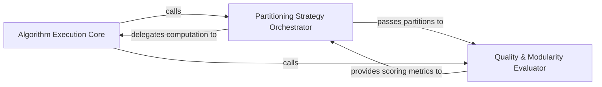

## Details

Executes mathematical clustering algorithms on the call graph to identify initial logical boundaries and evaluates partitioning strategies using modularity scoring.

### Algorithm Execution Core
Provides the low-level mathematical implementation for community detection, handling graph object conversion and Leiden algorithm optimization.

**Related Classes/Methods**:

- `static_analyzer.leiden_utils.find_partition`:37-63
- `static_analyzer.graph.detect_communities`:21-34

**Source Files:**

- [`static_analyzer/cluster_helpers.py`](https://github.com/CodeBoarding/CodeBoarding/blob/main/.codeboardingstatic_analyzer/cluster_helpers.py)
  - `static_analyzer.cluster_helpers._detect_communities` ([L195-L232](https://github.com/CodeBoarding/CodeBoarding/blob/main/.codeboardingstatic_analyzer/cluster_helpers.py#L195-L232)) - Function
- [`static_analyzer/graph.py`](https://github.com/CodeBoarding/CodeBoarding/blob/main/.codeboardingstatic_analyzer/graph.py)
  - `static_analyzer.graph.CallGraph._cluster_with_algorithm` ([L441-L451](https://github.com/CodeBoarding/CodeBoarding/blob/main/.codeboardingstatic_analyzer/graph.py#L441-L451)) - Method
  - `static_analyzer.graph.CallGraph._cluster_at_level` ([L486-L506](https://github.com/CodeBoarding/CodeBoarding/blob/main/.codeboardingstatic_analyzer/graph.py#L486-L506)) - Method

### Partitioning Strategy Orchestrator
Acts as the controller for the partitioning process, managing the lifecycle of clustering attempts and algorithmic configurations.

**Related Classes/Methods**:

- `static_analyzer.graph.CallGraph._try_all_algorithms`:508-526
- `static_analyzer.graph.CallGraph._cluster_with_algorithm`:441-451

**Source Files:**

- [`static_analyzer/graph.py`](https://github.com/CodeBoarding/CodeBoarding/blob/main/.codeboardingstatic_analyzer/graph.py)
  - `static_analyzer.graph.CallGraph._get_abstract_node_name` ([L429-L439](https://github.com/CodeBoarding/CodeBoarding/blob/main/.codeboardingstatic_analyzer/graph.py#L429-L439)) - Method
  - `static_analyzer.graph.CallGraph._score_clustering` ([L453-L484](https://github.com/CodeBoarding/CodeBoarding/blob/main/.codeboardingstatic_analyzer/graph.py#L453-L484)) - Method
  - `static_analyzer.graph.CallGraph._try_all_algorithms` ([L508-L526](https://github.com/CodeBoarding/CodeBoarding/blob/main/.codeboardingstatic_analyzer/graph.py#L508-L526)) - Method
  - `static_analyzer.graph.CallGraph._map_candidates_to_original` ([L528-L552](https://github.com/CodeBoarding/CodeBoarding/blob/main/.codeboardingstatic_analyzer/graph.py#L528-L552)) - Method

### Quality & Modularity Evaluator
Quantifies the quality of partitions using modularity-inspired scoring to ensure high node coverage and structural integrity.

**Related Classes/Methods**:

- `static_analyzer.graph.CallGraph._score_clustering`:453-484

**Source Files:**

- [`static_analyzer/graph.py`](https://github.com/CodeBoarding/CodeBoarding/blob/main/.codeboardingstatic_analyzer/graph.py)
  - `static_analyzer.graph.detect_communities` ([L21-L34](https://github.com/CodeBoarding/CodeBoarding/blob/main/.codeboardingstatic_analyzer/graph.py#L21-L34)) - Function
- [`static_analyzer/leiden_utils.py`](https://github.com/CodeBoarding/CodeBoarding/blob/main/.codeboardingstatic_analyzer/leiden_utils.py)
  - `static_analyzer.leiden_utils.partition_to_clusters` ([L26-L34](https://github.com/CodeBoarding/CodeBoarding/blob/main/.codeboardingstatic_analyzer/leiden_utils.py#L26-L34)) - Function
  - `static_analyzer.leiden_utils.find_partition` ([L37-L63](https://github.com/CodeBoarding/CodeBoarding/blob/main/.codeboardingstatic_analyzer/leiden_utils.py#L37-L63)) - Function

### [FAQ](https://github.com/CodeBoarding/GeneratedOnBoardings/tree/main?tab=readme-ov-file#faq)