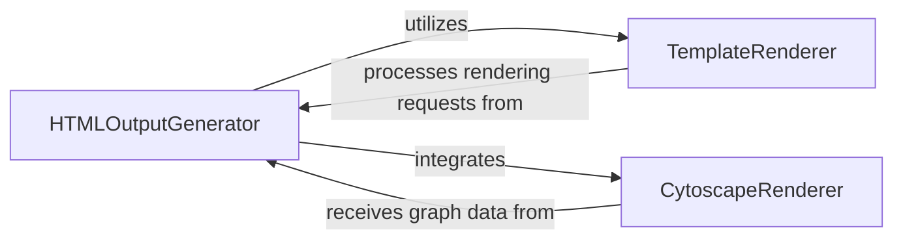

## Details

Produces interactive HTML documentation, rendering analysis insights and diagrams into a web-friendly format. It utilizes templates and potentially libraries like Cytoscape for dynamic visualizations.

### HTMLOutputGenerator
Produces interactive HTML documentation, rendering analysis insights and diagrams into a web-friendly format. It utilizes templates and potentially libraries like Cytoscape for dynamic visualizations.

**Related Classes/Methods**:

- <a href="https://github.com/CodeBoarding/CodeBoarding/blob/main/.codeboardingoutput_generators/html.py" target="_blank" rel="noopener noreferrer">`repos.codeboarding.output.html.generate_html`</a>
- <a href="https://github.com/CodeBoarding/CodeBoarding/blob/main/.codeboardingoutput_generators/html.py" target="_blank" rel="noopener noreferrer">`repos.codeboarding.output.html.generate_html_file`</a>

### TemplateRenderer
A utility component responsible for applying HTML templates to data. It abstracts the templating logic, allowing HTMLGenerator to focus on content assembly.

**Related Classes/Methods**:

- <a href="https://github.com/CodeBoarding/CodeBoarding/blob/main/.codeboardingoutput_generators/html_template.py" target="_blank" rel="noopener noreferrer">`repos.codeboarding.output.html_template.populate_html_template`</a>

### CytoscapeRenderer
Specializes in generating interactive graph visualizations using the Cytoscape.js library. It transforms graph-like analysis data into a format suitable for dynamic display within the HTML output.

**Related Classes/Methods**:

- <a href="https://github.com/CodeBoarding/CodeBoarding/blob/main/.codeboardingoutput_generators/html.py" target="_blank" rel="noopener noreferrer">`repos.codeboarding.output.html.generate_cytoscape_data`</a>

### [FAQ](https://github.com/CodeBoarding/GeneratedOnBoardings/tree/main?tab=readme-ov-file#faq)