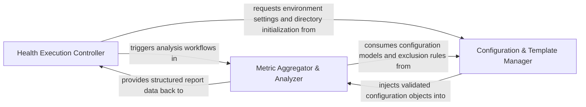

## Details

Acts as the central control plane for the health subsystem, managing the lifecycle of health check runs and aggregating metrics into a structured report.

### Health Execution Controller
Acts as the primary entry point and lifecycle manager for health check operations, handling CLI transitions, environment configuration, and the high-level coordination of the health run.

**Related Classes/Methods**:

- `health_main.main`:97-148
- `health_main._run_health_checks`:74-94
- `vscode_constants.update_config`:72-74

**Source Files:**

- [`health_main.py`](https://github.com/CodeBoarding/CodeBoarding/blob/main/.codeboardinghealth_main.py)
  - `health_main.run_health_check_local` ([L29-L49](https://github.com/CodeBoarding/CodeBoarding/blob/main/.codeboardinghealth_main.py#L29-L49)) - Function
  - `health_main.run_health_check_remote` ([L52-L71](https://github.com/CodeBoarding/CodeBoarding/blob/main/.codeboardinghealth_main.py#L52-L71)) - Function
  - `health_main._run_health_checks` ([L74-L94](https://github.com/CodeBoarding/CodeBoarding/blob/main/.codeboardinghealth_main.py#L74-L94)) - Function
  - `health_main.main` ([L97-L148](https://github.com/CodeBoarding/CodeBoarding/blob/main/.codeboardinghealth_main.py#L97-L148)) - Function
- [`logging_config.py`](https://github.com/CodeBoarding/CodeBoarding/blob/main/.codeboardinglogging_config.py)
  - `logging_config.setup_logging` ([L14-L71](https://github.com/CodeBoarding/CodeBoarding/blob/main/.codeboardinglogging_config.py#L14-L71)) - Function
  - `logging_config.add_file_handler` ([L74-L95](https://github.com/CodeBoarding/CodeBoarding/blob/main/.codeboardinglogging_config.py#L74-L95)) - Function
  - `logging_config._resolve_log_path` ([L98-L120](https://github.com/CodeBoarding/CodeBoarding/blob/main/.codeboardinglogging_config.py#L98-L120)) - Function
  - `logging_config._fix_console_encoding` ([L123-L136](https://github.com/CodeBoarding/CodeBoarding/blob/main/.codeboardinglogging_config.py#L123-L136)) - Function
- [`utils.py`](https://github.com/CodeBoarding/CodeBoarding/blob/main/.codeboardingutils.py)
  - `utils.get_artifact_dir` ([L44-L52](https://github.com/CodeBoarding/CodeBoarding/blob/main/.codeboardingutils.py#L44-L52)) - Function
- [`vscode_constants.py`](https://github.com/CodeBoarding/CodeBoarding/blob/main/.codeboardingvscode_constants.py)
  - `vscode_constants.get_bin_path` ([L5-L12](https://github.com/CodeBoarding/CodeBoarding/blob/main/.codeboardingvscode_constants.py#L5-L12)) - Function
  - `vscode_constants.update_command_paths` ([L15-L62](https://github.com/CodeBoarding/CodeBoarding/blob/main/.codeboardingvscode_constants.py#L15-L62)) - Function
  - `vscode_constants.update_config` ([L72-L74](https://github.com/CodeBoarding/CodeBoarding/blob/main/.codeboardingvscode_constants.py#L72-L74)) - Function

### Metric Aggregator & Analyzer
The core logic engine that processes raw static analysis data into high-level health metrics, calculates scores, and generates structured HealthReport objects.

**Related Classes/Methods**:

- `health.runner.run_health_checks`:193-242
- `health.runner._aggregate_file_summaries`:145-171
- `health.models.HealthReport`:122-135
- `static_analyzer.__init__.get_static_analysis`:774-802

**Source Files:**

- [`diagram_analysis/diagram_generator.py`](https://github.com/CodeBoarding/CodeBoarding/blob/main/.codeboardingdiagram_analysis/diagram_generator.py)
  - `diagram_analysis.diagram_generator.DiagramGenerator.pre_analysis.get_static_with_new_analyzer` ([L284-L293](https://github.com/CodeBoarding/CodeBoarding/blob/main/.codeboardingdiagram_analysis/diagram_generator.py#L284-L293)) - Function
- [`health/models.py`](https://github.com/CodeBoarding/CodeBoarding/blob/main/.codeboardinghealth/models.py)
  - `health.models.FileHealthSummary` ([L110-L119](https://github.com/CodeBoarding/CodeBoarding/blob/main/.codeboardinghealth/models.py#L110-L119)) - Class
  - `health.models.HealthReport` ([L122-L135](https://github.com/CodeBoarding/CodeBoarding/blob/main/.codeboardinghealth/models.py#L122-L135)) - Class
- [`health/runner.py`](https://github.com/CodeBoarding/CodeBoarding/blob/main/.codeboardinghealth/runner.py)
  - `health.runner._relativize_path` ([L66-L68](https://github.com/CodeBoarding/CodeBoarding/blob/main/.codeboardinghealth/runner.py#L66-L68)) - Function
  - `health.runner._compute_overall_score` ([L134-L142](https://github.com/CodeBoarding/CodeBoarding/blob/main/.codeboardinghealth/runner.py#L134-L142)) - Function
  - `health.runner._aggregate_file_summaries` ([L145-L171](https://github.com/CodeBoarding/CodeBoarding/blob/main/.codeboardinghealth/runner.py#L145-L171)) - Function
  - `health.runner._relativize_report_paths` ([L174-L190](https://github.com/CodeBoarding/CodeBoarding/blob/main/.codeboardinghealth/runner.py#L174-L190)) - Function
  - `health.runner.run_health_checks` ([L193-L242](https://github.com/CodeBoarding/CodeBoarding/blob/main/.codeboardinghealth/runner.py#L193-L242)) - Function
- [`static_analyzer/__init__.py`](https://github.com/CodeBoarding/CodeBoarding/blob/main/.codeboardingstatic_analyzer/__init__.py)
  - `static_analyzer.__init__.StaticAnalyzer` ([L169-L771](https://github.com/CodeBoarding/CodeBoarding/blob/main/.codeboardingstatic_analyzer/__init__.py#L169-L771)) - Class
  - `static_analyzer.__init__.get_static_analysis` ([L774-L802](https://github.com/CodeBoarding/CodeBoarding/blob/main/.codeboardingstatic_analyzer/__init__.py#L774-L802)) - Function

### Configuration & Template Manager
Manages persistence, initialization of health directories, and loading of configuration schemas and exclusion patterns for the health subsystem.

**Related Classes/Methods**:

- `health.config.load_health_config`:128-172
- `health.config.initialize_health_dir`:86-97
- `health.models.HealthCheckConfig`:138-186
- `diagram_analysis.diagram_generator.DiagramGenerator._run_health_report`:148-166

**Source Files:**

- [`diagram_analysis/diagram_generator.py`](https://github.com/CodeBoarding/CodeBoarding/blob/main/.codeboardingdiagram_analysis/diagram_generator.py)
  - `diagram_analysis.diagram_generator.DiagramGenerator._run_health_report` ([L148-L166](https://github.com/CodeBoarding/CodeBoarding/blob/main/.codeboardingdiagram_analysis/diagram_generator.py#L148-L166)) - Method
- [`health/config.py`](https://github.com/CodeBoarding/CodeBoarding/blob/main/.codeboardinghealth/config.py)
  - `health.config._initialize_template` ([L76-L83](https://github.com/CodeBoarding/CodeBoarding/blob/main/.codeboardinghealth/config.py#L76-L83)) - Function
  - `health.config.initialize_health_dir` ([L86-L97](https://github.com/CodeBoarding/CodeBoarding/blob/main/.codeboardinghealth/config.py#L86-L97)) - Function
  - `health.config._load_health_exclude_patterns` ([L100-L125](https://github.com/CodeBoarding/CodeBoarding/blob/main/.codeboardinghealth/config.py#L100-L125)) - Function
  - `health.config.load_health_config` ([L128-L172](https://github.com/CodeBoarding/CodeBoarding/blob/main/.codeboardinghealth/config.py#L128-L172)) - Function
- [`health/models.py`](https://github.com/CodeBoarding/CodeBoarding/blob/main/.codeboardinghealth/models.py)
  - `health.models.HealthCheckConfig` ([L138-L186](https://github.com/CodeBoarding/CodeBoarding/blob/main/.codeboardinghealth/models.py#L138-L186)) - Class

### [FAQ](https://github.com/CodeBoarding/GeneratedOnBoardings/tree/main?tab=readme-ov-file#faq)