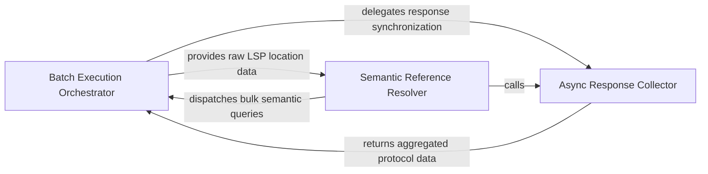

## Details

An optimization layer designed for bulk analysis tasks, grouping multiple LSP requests to reduce overhead and improve warmup speeds.

### Batch Execution Orchestrator
The core execution engine responsible for transforming high-level analysis tasks into parallelized LSP operations, managing asynchronous dispatch of bulk queries to maximize throughput.

**Related Classes/Methods**: _None_

**Source Files:**

- [`static_analyzer/engine/lsp_client.py`](https://github.com/CodeBoarding/CodeBoarding/blob/main/.codeboardingstatic_analyzer/engine/lsp_client.py)
  - `static_analyzer.engine.lsp_client.LSPClient._position_params` ([L488-L493](https://github.com/CodeBoarding/CodeBoarding/blob/main/.codeboardingstatic_analyzer/engine/lsp_client.py#L488-L493)) - Method
  - `static_analyzer.engine.lsp_client.LSPClient._next_response` ([L603-L624](https://github.com/CodeBoarding/CodeBoarding/blob/main/.codeboardingstatic_analyzer/engine/lsp_client.py#L603-L624)) - Method
  - `static_analyzer.engine.lsp_client.LSPClient._collect_batch_responses` ([L626-L676](https://github.com/CodeBoarding/CodeBoarding/blob/main/.codeboardingstatic_analyzer/engine/lsp_client.py#L626-L676)) - Method

### Async Response Collector
A stateful management layer that monitors the LSP communication channel to synchronize batch completion, correlating request IDs with JSON-RPC responses and handling timeouts.

**Related Classes/Methods**: _None_

**Source Files:**

- [`static_analyzer/engine/lsp_client.py`](https://github.com/CodeBoarding/CodeBoarding/blob/main/.codeboardingstatic_analyzer/engine/lsp_client.py)
  - `static_analyzer.engine.lsp_client.LSPClient.send_definition_batch` ([L341-L348](https://github.com/CodeBoarding/CodeBoarding/blob/main/.codeboardingstatic_analyzer/engine/lsp_client.py#L341-L348)) - Method
  - `static_analyzer.engine.lsp_client.LSPClient.send_implementation_batch` ([L366-L373](https://github.com/CodeBoarding/CodeBoarding/blob/main/.codeboardingstatic_analyzer/engine/lsp_client.py#L366-L373)) - Method
  - `static_analyzer.engine.lsp_client.LSPClient._send_batch` ([L495-L539](https://github.com/CodeBoarding/CodeBoarding/blob/main/.codeboardingstatic_analyzer/engine/lsp_client.py#L495-L539)) - Method

### Semantic Reference Resolver
The translation layer that converts raw protocol-specific data into domain-specific entities, performing post-processing like line number adjustment and component identifier assignment.

**Related Classes/Methods**: _None_

**Source Files:**

- [`static_analyzer/engine/lsp_client.py`](https://github.com/CodeBoarding/CodeBoarding/blob/main/.codeboardingstatic_analyzer/engine/lsp_client.py)
  - `static_analyzer.engine.lsp_client.LSPClient.send_references_batch` ([L298-L323](https://github.com/CodeBoarding/CodeBoarding/blob/main/.codeboardingstatic_analyzer/engine/lsp_client.py#L298-L323)) - Method
  - `static_analyzer.engine.lsp_client.LSPClient.send_references_batch.build_params` ([L316-L321](https://github.com/CodeBoarding/CodeBoarding/blob/main/.codeboardingstatic_analyzer/engine/lsp_client.py#L316-L321)) - Function

### [FAQ](https://github.com/CodeBoarding/GeneratedOnBoardings/tree/main?tab=readme-ov-file#faq)