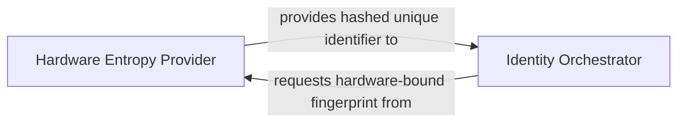

## Details

Manages the persistent identity of the tool installation by resolving unique device identifiers and ensuring event continuity across sessions.

### Hardware Entropy Provider
Responsible for the low-level extraction of unique hardware signals from the host machine, such as disk serial numbers and system UUIDs, to create a stable device identity.

**Related Classes/Methods**: _None_

**Source Files:**

- [`telemetry/device_id.py`](https://github.com/CodeBoarding/CodeBoarding/blob/main/.codeboardingtelemetry/device_id.py)
  - `telemetry.device_id._shell` ([L14-L16](https://github.com/CodeBoarding/CodeBoarding/blob/main/.codeboardingtelemetry/device_id.py#L14-L16)) - Function
  - `telemetry.device_id._linux_machine_id` ([L19-L24](https://github.com/CodeBoarding/CodeBoarding/blob/main/.codeboardingtelemetry/device_id.py#L19-L24)) - Function

### Identity Orchestrator
Acts as the primary interface for identity retrieval, implementing a hierarchical strategy that prioritizes environment variable overrides before falling back to the Hardware Entropy Provider.

**Related Classes/Methods**: _None_

**Source Files:**

- [`telemetry/events.py`](https://github.com/CodeBoarding/CodeBoarding/blob/main/.codeboardingtelemetry/events.py)
  - `telemetry.events._app_version` ([L41-L45](https://github.com/CodeBoarding/CodeBoarding/blob/main/.codeboardingtelemetry/events.py#L41-L45)) - Function
  - `telemetry.events.track_tech_stack` ([L73-L91](https://github.com/CodeBoarding/CodeBoarding/blob/main/.codeboardingtelemetry/events.py#L73-L91)) - Function
  - `telemetry.events.capture_error` ([L225-L240](https://github.com/CodeBoarding/CodeBoarding/blob/main/.codeboardingtelemetry/events.py#L225-L240)) - Function
- [`telemetry/schemas.py`](https://github.com/CodeBoarding/CodeBoarding/blob/main/.codeboardingtelemetry/schemas.py)
  - `telemetry.schemas.LanguageStat` ([L10-L13](https://github.com/CodeBoarding/CodeBoarding/blob/main/.codeboardingtelemetry/schemas.py#L10-L13)) - Class
  - `telemetry.schemas.RepoScanned` ([L16-L22](https://github.com/CodeBoarding/CodeBoarding/blob/main/.codeboardingtelemetry/schemas.py#L16-L22)) - Class

### [FAQ](https://github.com/CodeBoarding/GeneratedOnBoardings/tree/main?tab=readme-ov-file#faq)