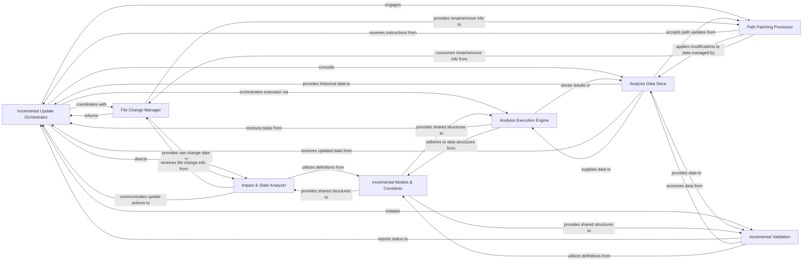

## Details

Acts as the central orchestrator for the incremental analysis process, coordinating change detection, cache interactions, and targeted re-analysis of modified code sections.

### Incremental Update Orchestrator
Acts as the central orchestrator for the incremental analysis process, coordinating change detection, cache interactions, and targeted re-analysis of modified code sections. It determines the overall strategy for an update.

**Related Classes/Methods**:

- <a href="https://github.com/CodeBoarding/CodeBoarding/blob/main/.codeboardingdiagram_analysis/incremental/updater.py" target="_blank" rel="noopener noreferrer">`diagram_analysis.incremental.updater.IncrementalUpdater.run_update`</a>
- <a href="https://github.com/CodeBoarding/CodeBoarding/blob/main/.codeboardingdiagram_analysis/incremental/updater.py" target="_blank" rel="noopener noreferrer">`diagram_analysis.incremental.updater.IncrementalUpdater.coordinate_pipeline`</a>
- <a href="https://github.com/CodeBoarding/CodeBoarding/blob/main/.codeboardingdiagram_analysis/incremental/updater.py" target="_blank" rel="noopener noreferrer">`diagram_analysis.incremental.updater.IncrementalUpdater.determine_strategy`</a>

### Analysis Data Store
Manages persistence and retrieval of analysis results and manifest data, handling loading previous states and saving updates to enable incremental processing. It acts as the system's memory for past analysis.

**Related Classes/Methods**:

- <a href="https://github.com/CodeBoarding/CodeBoarding/blob/main/.codeboardingdiagram_analysis/incremental/io_utils.py" target="_blank" rel="noopener noreferrer">`diagram_analysis.incremental.io_utils.AnalysisCacheManager.load_manifest`</a>
- <a href="https://github.com/CodeBoarding/CodeBoarding/blob/main/.codeboardingdiagram_analysis/incremental/io_utils.py" target="_blank" rel="noopener noreferrer">`diagram_analysis.incremental.io_utils.AnalysisCacheManager.save_results`</a>
- <a href="https://github.com/CodeBoarding/CodeBoarding/blob/main/.codeboardingdiagram_analysis/incremental/io_utils.py" target="_blank" rel="noopener noreferrer">`diagram_analysis.incremental.io_utils.AnalysisCacheManager.get_component_data`</a>

### File Change Manager
Identifies, categorizes, and manages file changes (additions, deletions, renames) within components, ensuring correct assignment of new files and removal of deleted ones from analysis scope.

**Related Classes/Methods**:

- <a href="https://github.com/CodeBoarding/CodeBoarding/blob/main/.codeboardingdiagram_analysis/incremental/file_manager.py" target="_blank" rel="noopener noreferrer">`diagram_analysis.incremental.file_manager.FileChangeDetector.detect_changes`</a>
- <a href="https://github.com/CodeBoarding/CodeBoarding/blob/main/.codeboardingdiagram_analysis/incremental/file_manager.py" target="_blank" rel="noopener noreferrer">`diagram_analysis.incremental.file_manager.FileChangeDetector.categorize_changes`</a>
- <a href="https://github.com/CodeBoarding/CodeBoarding/blob/main/.codeboardingdiagram_analysis/incremental/file_manager.py" target="_blank" rel="noopener noreferrer">`diagram_analysis.incremental.file_manager.FileChangeDetector.map_files_to_components`</a>

### Impact & State Analyzer
Assesses the impact of code changes on component structure and relationships, determining affected components and required update actions (patch, re-analyze, full re-analysis). It also evaluates the nature of changes to decide if incremental patching is possible or if a full re-expansion is required.

**Related Classes/Methods**:

- <a href="https://github.com/CodeBoarding/CodeBoarding/blob/main/.codeboardingdiagram_analysis/incremental/impact_analyzer.py" target="_blank" rel="noopener noreferrer">`diagram_analysis.incremental.impact_analyzer.ImpactAnalyzer.assess_impact`</a>
- <a href="https://github.com/CodeBoarding/CodeBoarding/blob/main/.codeboardingdiagram_analysis/incremental/impact_analyzer.py" target="_blank" rel="noopener noreferrer">`diagram_analysis.incremental.impact_analyzer.ImpactAnalyzer.determine_update_action`</a>
- <a href="https://github.com/CodeBoarding/CodeBoarding/blob/main/.codeboardingdiagram_analysis/incremental/component_checker.py" target="_blank" rel="noopener noreferrer">`diagram_analysis.incremental.component_checker.ComponentStateChecker.evaluate_component_changes`</a>
- <a href="https://github.com/CodeBoarding/CodeBoarding/blob/main/.codeboardingdiagram_analysis/incremental/component_checker.py" target="_blank" rel="noopener noreferrer">`diagram_analysis.incremental.component_checker.ComponentStateChecker.is_incremental_possible`</a>

### Analysis Execution Engine
Executes targeted analysis for specific impacted components or subgraphs when full re-expansion is unnecessary, and manages full re-analysis of components that cannot be incrementally updated, orchestrating re-execution of the analysis pipeline.

**Related Classes/Methods**:

- <a href="https://github.com/CodeBoarding/CodeBoarding/blob/main/.codeboardingdiagram_analysis/incremental/scoped_analysis.py" target="_blank" rel="noopener noreferrer">`diagram_analysis.incremental.scoped_analysis.ScopedAnalysisExecutor.execute_scoped_analysis`</a>
- <a href="https://github.com/CodeBoarding/CodeBoarding/blob/main/.codeboardingdiagram_analysis/incremental/reexpansion.py" target="_blank" rel="noopener noreferrer">`diagram_analysis.incremental.reexpansion.ComponentReexpansionEngine.run_full_reanalysis`</a>
- <a href="https://github.com/CodeBoarding/CodeBoarding/blob/main/.codeboardingdiagram_analysis/incremental/scoped_analysis.py" target="_blank" rel="noopener noreferrer">`diagram_analysis.incremental.analysis_engine.AnalysisExecutionEngine.dispatch_analysis_task`</a>

### Path Patching Processor
Updates file paths within analysis results and manifest to reflect renames or moves, ensuring consistency after structural codebase changes.

**Related Classes/Methods**:

- <a href="https://github.com/CodeBoarding/CodeBoarding/blob/main/.codeboardingdiagram_analysis/incremental/path_patching.py" target="_blank" rel="noopener noreferrer">`diagram_analysis.incremental.path_patching.PathPatcher.apply_path_updates`</a>
- <a href="https://github.com/CodeBoarding/CodeBoarding/blob/main/.codeboardingdiagram_analysis/incremental/path_patching.py" target="_blank" rel="noopener noreferrer">`diagram_analysis.incremental.path_patching.PathPatcher.update_manifest_paths`</a>
- <a href="https://github.com/CodeBoarding/CodeBoarding/blob/main/.codeboardingdiagram_analysis/incremental/path_patching.py" target="_blank" rel="noopener noreferrer">`diagram_analysis.incremental.path_patching.PathPatcher.adjust_result_paths`</a>

### Incremental Models & Constants
Defines data structures, enums (e.g., ChangeImpact, UpdateAction), and constants used across the subsystem, providing a common language and configuration.

**Related Classes/Methods**:

- <a href="https://github.com/CodeBoarding/CodeBoarding/blob/main/.codeboardingdiagram_analysis/incremental/models.py" target="_blank" rel="noopener noreferrer">`diagram_analysis.incremental.models.ChangeImpact`</a>
- <a href="https://github.com/CodeBoarding/CodeBoarding/blob/main/.codeboardingdiagram_analysis/incremental/models.py" target="_blank" rel="noopener noreferrer">`diagram_analysis.incremental.models.UpdateAction`</a>
- <a href="https://github.com/CodeBoarding/CodeBoarding/blob/main/.codeboardingdiagram_analysis/incremental/models.py" target="_blank" rel="noopener noreferrer">`diagram_analysis.incremental.models.AnalysisManifest`</a>
- <a href="https://github.com/CodeBoarding/CodeBoarding/blob/main/.codeboardingdiagram_analysis/incremental/models.py" target="_blank" rel="noopener noreferrer">`diagram_analysis.incremental.models.IncrementalConfig`</a>

### Incremental Validation
Validates the integrity and correctness of the incremental update process and its generated results, ensuring analysis remains accurate and consistent.

**Related Classes/Methods**:

- <a href="https://github.com/CodeBoarding/CodeBoarding/blob/main/.codeboardingdiagram_analysis/incremental/validation.py" target="_blank" rel="noopener noreferrer">`diagram_analysis.incremental.validation.IncrementalValidator.validate_integrity`</a>
- <a href="https://github.com/CodeBoarding/CodeBoarding/blob/main/.codeboardingdiagram_analysis/incremental/validation.py" target="_blank" rel="noopener noreferrer">`diagram_analysis.incremental.validation.IncrementalValidator.check_consistency`</a>
- <a href="https://github.com/CodeBoarding/CodeBoarding/blob/main/.codeboardingdiagram_analysis/incremental/validation.py" target="_blank" rel="noopener noreferrer">`diagram_analysis.incremental.validation.IncrementalValidator.verify_results`</a>

### [FAQ](https://github.com/CodeBoarding/GeneratedOnBoardings/tree/main?tab=readme-ov-file#faq)