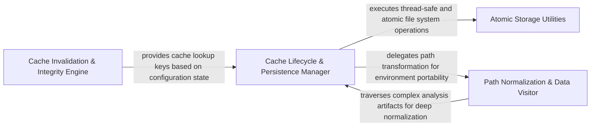

## Details

Manages the persistence and invalidation of static analysis data, ensuring portability by normalizing system paths and using signature-based invalidation for incremental updates.

### Cache Lifecycle & Persistence Manager [[Expand]](./Cache_Lifecycle_Persistence_Manager.md)
Orchestrates the high-level operations of the cache, including loading, saving, and flushing analysis data. It manages the mapping between analysis states and physical storage locations using SHA-based identifiers.

**Related Classes/Methods**:

- `static_analyzer.analysis_cache.StaticAnalysisCache.save`:219-276
- `static_analyzer.analysis_cache.StaticAnalysisCache.load_with_sha`:148-167
- `static_analyzer.__init__.StaticAnalyzer.flush_cache`:332-353
- `static_analyzer.analysis_cache.StaticAnalysisCache.pkl_path`:104-105

**Source Files:**

- [`diagram_analysis/diagram_generator.py`](https://github.com/CodeBoarding/CodeBoarding/blob/main/.codeboardingdiagram_analysis/diagram_generator.py)
  - `diagram_analysis.diagram_generator.DiagramGenerator._persist_static_analysis_artifact` ([L310-L317](https://github.com/CodeBoarding/CodeBoarding/blob/main/.codeboardingdiagram_analysis/diagram_generator.py#L310-L317)) - Method
- [`static_analyzer/__init__.py`](https://github.com/CodeBoarding/CodeBoarding/blob/main/.codeboardingstatic_analyzer/__init__.py)
  - `static_analyzer.__init__.StaticAnalyzer.__exit__` ([L206-L207](https://github.com/CodeBoarding/CodeBoarding/blob/main/.codeboardingstatic_analyzer/__init__.py#L206-L207)) - Method
  - `static_analyzer.__init__.StaticAnalyzer.stop_clients` ([L311-L330](https://github.com/CodeBoarding/CodeBoarding/blob/main/.codeboardingstatic_analyzer/__init__.py#L311-L330)) - Method
  - `static_analyzer.__init__.StaticAnalyzer.flush_cache` ([L332-L353](https://github.com/CodeBoarding/CodeBoarding/blob/main/.codeboardingstatic_analyzer/__init__.py#L332-L353)) - Method
  - `static_analyzer.__init__.StaticAnalyzer.load_cached_analysis` ([L373-L409](https://github.com/CodeBoarding/CodeBoarding/blob/main/.codeboardingstatic_analyzer/__init__.py#L373-L409)) - Method
- [`static_analyzer/analysis_cache.py`](https://github.com/CodeBoarding/CodeBoarding/blob/main/.codeboardingstatic_analyzer/analysis_cache.py)
  - `static_analyzer.analysis_cache.StaticAnalysisCache` ([L60-L276](https://github.com/CodeBoarding/CodeBoarding/blob/main/.codeboardingstatic_analyzer/analysis_cache.py#L60-L276)) - Class
  - `static_analyzer.analysis_cache.StaticAnalysisCache.__init__` ([L69-L71](https://github.com/CodeBoarding/CodeBoarding/blob/main/.codeboardingstatic_analyzer/analysis_cache.py#L69-L71)) - Method
  - `static_analyzer.analysis_cache.StaticAnalysisCache.pkl_path` ([L104-L105](https://github.com/CodeBoarding/CodeBoarding/blob/main/.codeboardingstatic_analyzer/analysis_cache.py#L104-L105)) - Method
  - `static_analyzer.analysis_cache.StaticAnalysisCache.sha_path` ([L108-L109](https://github.com/CodeBoarding/CodeBoarding/blob/main/.codeboardingstatic_analyzer/analysis_cache.py#L108-L109)) - Method
  - `static_analyzer.analysis_cache.StaticAnalysisCache.lock_path` ([L112-L113](https://github.com/CodeBoarding/CodeBoarding/blob/main/.codeboardingstatic_analyzer/analysis_cache.py#L112-L113)) - Method
  - `static_analyzer.analysis_cache.StaticAnalysisCache.read_tag_sha` ([L115-L129](https://github.com/CodeBoarding/CodeBoarding/blob/main/.codeboardingstatic_analyzer/analysis_cache.py#L115-L129)) - Method
  - `static_analyzer.analysis_cache.StaticAnalysisCache._read_tag_sha_unlocked` ([L131-L143](https://github.com/CodeBoarding/CodeBoarding/blob/main/.codeboardingstatic_analyzer/analysis_cache.py#L131-L143)) - Method
  - `static_analyzer.analysis_cache.StaticAnalysisCache._legacy_pkl_path` ([L145-L146](https://github.com/CodeBoarding/CodeBoarding/blob/main/.codeboardingstatic_analyzer/analysis_cache.py#L145-L146)) - Method
  - `static_analyzer.analysis_cache.StaticAnalysisCache.load_with_sha` ([L148-L167](https://github.com/CodeBoarding/CodeBoarding/blob/main/.codeboardingstatic_analyzer/analysis_cache.py#L148-L167)) - Method
  - `static_analyzer.analysis_cache.StaticAnalysisCache.get` ([L169-L181](https://github.com/CodeBoarding/CodeBoarding/blob/main/.codeboardingstatic_analyzer/analysis_cache.py#L169-L181)) - Method
  - `static_analyzer.analysis_cache.StaticAnalysisCache._get_unlocked` ([L183-L217](https://github.com/CodeBoarding/CodeBoarding/blob/main/.codeboardingstatic_analyzer/analysis_cache.py#L183-L217)) - Method
  - `static_analyzer.analysis_cache.StaticAnalysisCache.save` ([L219-L276](https://github.com/CodeBoarding/CodeBoarding/blob/main/.codeboardingstatic_analyzer/analysis_cache.py#L219-L276)) - Method

### Path Normalization & Data Visitor [[Expand]](./Path_Normalization_Data_Visitor.md)
Ensures cache portability by recursively traversing analysis artifacts to convert absolute system paths to relative project paths, allowing cache files to be shared across different environments.

**Related Classes/Methods**:

- `static_analyzer.analysis_cache.StaticAnalysisCache._relativize`:79-91
- `static_analyzer.analysis_cache.StaticAnalysisCache._absolutize`:93-101
- `static_analyzer.language_results.LanguageResults.visit_paths`:144-149
- `repo_utils.path_utils.to_relative_path`:23-32

**Source Files:**

- [`repo_utils/path_utils.py`](https://github.com/CodeBoarding/CodeBoarding/blob/main/.codeboardingrepo_utils/path_utils.py)
  - `repo_utils.path_utils.to_relative_path` ([L23-L32](https://github.com/CodeBoarding/CodeBoarding/blob/main/.codeboardingrepo_utils/path_utils.py#L23-L32)) - Function
  - `repo_utils.path_utils.to_absolute_path` ([L35-L41](https://github.com/CodeBoarding/CodeBoarding/blob/main/.codeboardingrepo_utils/path_utils.py#L35-L41)) - Function
- [`static_analyzer/analysis_cache.py`](https://github.com/CodeBoarding/CodeBoarding/blob/main/.codeboardingstatic_analyzer/analysis_cache.py)
  - `static_analyzer.analysis_cache.StaticAnalysisCache._to_relative` ([L73-L74](https://github.com/CodeBoarding/CodeBoarding/blob/main/.codeboardingstatic_analyzer/analysis_cache.py#L73-L74)) - Method
  - `static_analyzer.analysis_cache.StaticAnalysisCache._to_absolute` ([L76-L77](https://github.com/CodeBoarding/CodeBoarding/blob/main/.codeboardingstatic_analyzer/analysis_cache.py#L76-L77)) - Method
  - `static_analyzer.analysis_cache.StaticAnalysisCache._relativize` ([L79-L91](https://github.com/CodeBoarding/CodeBoarding/blob/main/.codeboardingstatic_analyzer/analysis_cache.py#L79-L91)) - Method
  - `static_analyzer.analysis_cache.StaticAnalysisCache._absolutize` ([L93-L101](https://github.com/CodeBoarding/CodeBoarding/blob/main/.codeboardingstatic_analyzer/analysis_cache.py#L93-L101)) - Method
- [`static_analyzer/graph.py`](https://github.com/CodeBoarding/CodeBoarding/blob/main/.codeboardingstatic_analyzer/graph.py)
  - `static_analyzer.graph.ClusterResult.visit_paths` ([L72-L77](https://github.com/CodeBoarding/CodeBoarding/blob/main/.codeboardingstatic_analyzer/graph.py#L72-L77)) - Method
  - `static_analyzer.graph.Edge.visit_paths` ([L116-L120](https://github.com/CodeBoarding/CodeBoarding/blob/main/.codeboardingstatic_analyzer/graph.py#L116-L120)) - Method
  - `static_analyzer.graph.CallGraph.visit_paths` ([L304-L310](https://github.com/CodeBoarding/CodeBoarding/blob/main/.codeboardingstatic_analyzer/graph.py#L304-L310)) - Method
- [`static_analyzer/language_results.py`](https://github.com/CodeBoarding/CodeBoarding/blob/main/.codeboardingstatic_analyzer/language_results.py)
  - `static_analyzer.language_results.ControlFlowGraph` ([L21-L58](https://github.com/CodeBoarding/CodeBoarding/blob/main/.codeboardingstatic_analyzer/language_results.py#L21-L58)) - Class
  - `static_analyzer.language_results.ControlFlowGraph.visit_paths` ([L55-L58](https://github.com/CodeBoarding/CodeBoarding/blob/main/.codeboardingstatic_analyzer/language_results.py#L55-L58)) - Method
  - `static_analyzer.language_results.ClassHierarchy` ([L62-L80](https://github.com/CodeBoarding/CodeBoarding/blob/main/.codeboardingstatic_analyzer/language_results.py#L62-L80)) - Class
  - `static_analyzer.language_results.ClassHierarchy.visit_paths` ([L75-L80](https://github.com/CodeBoarding/CodeBoarding/blob/main/.codeboardingstatic_analyzer/language_results.py#L75-L80)) - Method
  - `static_analyzer.language_results.References` ([L84-L98](https://github.com/CodeBoarding/CodeBoarding/blob/main/.codeboardingstatic_analyzer/language_results.py#L84-L98)) - Class
  - `static_analyzer.language_results.References.visit_paths` ([L93-L98](https://github.com/CodeBoarding/CodeBoarding/blob/main/.codeboardingstatic_analyzer/language_results.py#L93-L98)) - Method
  - `static_analyzer.language_results.PackageDependencies` ([L102-L116](https://github.com/CodeBoarding/CodeBoarding/blob/main/.codeboardingstatic_analyzer/language_results.py#L102-L116)) - Class
  - `static_analyzer.language_results.PackageDependencies.visit_paths` ([L111-L116](https://github.com/CodeBoarding/CodeBoarding/blob/main/.codeboardingstatic_analyzer/language_results.py#L111-L116)) - Method
  - `static_analyzer.language_results.SourceFiles` ([L120-L131](https://github.com/CodeBoarding/CodeBoarding/blob/main/.codeboardingstatic_analyzer/language_results.py#L120-L131)) - Class
  - `static_analyzer.language_results.SourceFiles.visit_paths` ([L128-L131](https://github.com/CodeBoarding/CodeBoarding/blob/main/.codeboardingstatic_analyzer/language_results.py#L128-L131)) - Method
  - `static_analyzer.language_results.LanguageResults.visit_paths` ([L144-L149](https://github.com/CodeBoarding/CodeBoarding/blob/main/.codeboardingstatic_analyzer/language_results.py#L144-L149)) - Method

### Cache Invalidation & Integrity Engine [[Expand]](./Cache_Invalidation_Integrity_Engine.md)
Determines the validity of cached data by generating unique signatures based on model settings and project configurations, ensuring that changes in analysis parameters trigger a re-analysis.

**Related Classes/Methods**:

- `caching.cache.ModelSettings.signature`:288-289
- `caching.cache.ModelSettings.canonical_json`:284-286

**Source Files:**

- [`caching/cache.py`](https://github.com/CodeBoarding/CodeBoarding/blob/main/.codeboardingcaching/cache.py)
  - `caching.cache.ModelSettings.canonical_json` ([L284-L286](https://github.com/CodeBoarding/CodeBoarding/blob/main/.codeboardingcaching/cache.py#L284-L286)) - Method
  - `caching.cache.ModelSettings.signature` ([L288-L289](https://github.com/CodeBoarding/CodeBoarding/blob/main/.codeboardingcaching/cache.py#L288-L289)) - Method

### Atomic Storage Utilities [[Expand]](./Atomic_Storage_Utilities.md)
Provides low-level, thread-safe file system operations to ensure that cache persistence and migration are performed atomically, preventing partial writes or data corruption.

**Related Classes/Methods**:

- `static_analyzer.analysis_cache._atomic_copy`:321-336
- `static_analyzer.analysis_cache.copy_cache_files`:279-318

**Source Files:**

- [`static_analyzer/analysis_cache.py`](https://github.com/CodeBoarding/CodeBoarding/blob/main/.codeboardingstatic_analyzer/analysis_cache.py)
  - `static_analyzer.analysis_cache.copy_cache_files` ([L279-L318](https://github.com/CodeBoarding/CodeBoarding/blob/main/.codeboardingstatic_analyzer/analysis_cache.py#L279-L318)) - Function
  - `static_analyzer.analysis_cache._atomic_copy` ([L321-L336](https://github.com/CodeBoarding/CodeBoarding/blob/main/.codeboardingstatic_analyzer/analysis_cache.py#L321-L336)) - Function

### [FAQ](https://github.com/CodeBoarding/GeneratedOnBoardings/tree/main?tab=readme-ov-file#faq)