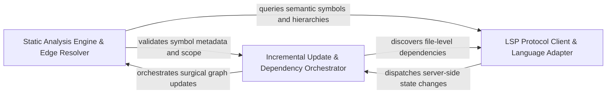

## Details

Coordinates the high-level logic for building and updating the codebase model, managing cross-boundary edges, and handling incremental updates.

### Static Analysis Engine & Edge Resolver [[Expand]](./Static_Analysis_Engine_Edge_Resolver.md)
The core engine responsible for the deterministic construction of the call graph, managing context for edge building and resolving symbol definitions.

**Related Classes/Methods**:

- `static_analyzer.engine.call_graph_builder.CallGraphBuilder`:24-341
- `static_analyzer.engine.edge_builder.DefinitionResolution`:42-46
- `static_analyzer.engine.edge_build_context.EdgeBuildContext`:14-22
- `static_analyzer.engine.edge_builder._resolve_definition_to_symbol`:520-551

**Source Files:**

- [`agents/change_status.py`](https://github.com/CodeBoarding/CodeBoarding/blob/main/.codeboardingagents/change_status.py)
  - `agents.change_status.ChangeStatus` ([L4-L9](https://github.com/CodeBoarding/CodeBoarding/blob/main/.codeboardingagents/change_status.py#L4-L9)) - Class
- [`agents/constants.py`](https://github.com/CodeBoarding/CodeBoarding/blob/main/.codeboardingagents/constants.py)
  - `agents.constants.LLMDefaults` ([L4-L7](https://github.com/CodeBoarding/CodeBoarding/blob/main/.codeboardingagents/constants.py#L4-L7)) - Class
  - `agents.constants.FileStructureConfig` ([L10-L13](https://github.com/CodeBoarding/CodeBoarding/blob/main/.codeboardingagents/constants.py#L10-L13)) - Class
  - `agents.constants.ModelCapabilities` ([L16-L38](https://github.com/CodeBoarding/CodeBoarding/blob/main/.codeboardingagents/constants.py#L16-L38)) - Class
- [`constants.py`](https://github.com/CodeBoarding/CodeBoarding/blob/main/.codeboardingconstants.py)
  - `constants.AppConfig` ([L11-L15](https://github.com/CodeBoarding/CodeBoarding/blob/main/.codeboardingconstants.py#L11-L15)) - Class
- [`diagram_analysis/run_mode.py`](https://github.com/CodeBoarding/CodeBoarding/blob/main/.codeboardingdiagram_analysis/run_mode.py)
  - `diagram_analysis.run_mode.RunMode` ([L8-L10](https://github.com/CodeBoarding/CodeBoarding/blob/main/.codeboardingdiagram_analysis/run_mode.py#L8-L10)) - Class
- [`static_analyzer/engine/call_graph_builder.py`](https://github.com/CodeBoarding/CodeBoarding/blob/main/.codeboardingstatic_analyzer/engine/call_graph_builder.py)
  - `static_analyzer.engine.call_graph_builder.CallGraphBuilder` ([L24-L341](https://github.com/CodeBoarding/CodeBoarding/blob/main/.codeboardingstatic_analyzer/engine/call_graph_builder.py#L24-L341)) - Class
  - `static_analyzer.engine.call_graph_builder.CallGraphBuilder.__init__` ([L27-L38](https://github.com/CodeBoarding/CodeBoarding/blob/main/.codeboardingstatic_analyzer/engine/call_graph_builder.py#L27-L38)) - Method
  - `static_analyzer.engine.call_graph_builder.CallGraphBuilder.build` ([L45-L122](https://github.com/CodeBoarding/CodeBoarding/blob/main/.codeboardingstatic_analyzer/engine/call_graph_builder.py#L45-L122)) - Method
  - `static_analyzer.engine.call_graph_builder.CallGraphBuilder._build_recycler` ([L124-L128](https://github.com/CodeBoarding/CodeBoarding/blob/main/.codeboardingstatic_analyzer/engine/call_graph_builder.py#L124-L128)) - Method
  - `static_analyzer.engine.call_graph_builder.CallGraphBuilder._build_edges` ([L130-L134](https://github.com/CodeBoarding/CodeBoarding/blob/main/.codeboardingstatic_analyzer/engine/call_graph_builder.py#L130-L134)) - Method
  - `static_analyzer.engine.call_graph_builder.CallGraphBuilder._probe_timeout` ([L136-L149](https://github.com/CodeBoarding/CodeBoarding/blob/main/.codeboardingstatic_analyzer/engine/call_graph_builder.py#L136-L149)) - Method
  - `static_analyzer.engine.call_graph_builder.CallGraphBuilder._discover_symbols` ([L151-L192](https://github.com/CodeBoarding/CodeBoarding/blob/main/.codeboardingstatic_analyzer/engine/call_graph_builder.py#L151-L192)) - Method
  - `static_analyzer.engine.call_graph_builder.CallGraphBuilder._bulk_did_open` ([L194-L206](https://github.com/CodeBoarding/CodeBoarding/blob/main/.codeboardingstatic_analyzer/engine/call_graph_builder.py#L194-L206)) - Method
  - `static_analyzer.engine.call_graph_builder.CallGraphBuilder._send_sync_probe` ([L208-L220](https://github.com/CodeBoarding/CodeBoarding/blob/main/.codeboardingstatic_analyzer/engine/call_graph_builder.py#L208-L220)) - Method
  - `static_analyzer.engine.call_graph_builder.CallGraphBuilder._warmup_references` ([L222-L237](https://github.com/CodeBoarding/CodeBoarding/blob/main/.codeboardingstatic_analyzer/engine/call_graph_builder.py#L222-L237)) - Method
  - `static_analyzer.engine.call_graph_builder.CallGraphBuilder._postprocess_edges` ([L239-L313](https://github.com/CodeBoarding/CodeBoarding/blob/main/.codeboardingstatic_analyzer/engine/call_graph_builder.py#L239-L313)) - Method
  - `static_analyzer.engine.call_graph_builder.CallGraphBuilder._build_package_deps` ([L315-L341](https://github.com/CodeBoarding/CodeBoarding/blob/main/.codeboardingstatic_analyzer/engine/call_graph_builder.py#L315-L341)) - Method
- [`static_analyzer/engine/edge_build_context.py`](https://github.com/CodeBoarding/CodeBoarding/blob/main/.codeboardingstatic_analyzer/engine/edge_build_context.py)
  - `static_analyzer.engine.edge_build_context.EdgeBuildContext` ([L14-L22](https://github.com/CodeBoarding/CodeBoarding/blob/main/.codeboardingstatic_analyzer/engine/edge_build_context.py#L14-L22)) - Class
- [`static_analyzer/engine/edge_builder.py`](https://github.com/CodeBoarding/CodeBoarding/blob/main/.codeboardingstatic_analyzer/engine/edge_builder.py)
  - `static_analyzer.engine.edge_builder.ImplementationQuery` ([L33-L38](https://github.com/CodeBoarding/CodeBoarding/blob/main/.codeboardingstatic_analyzer/engine/edge_builder.py#L33-L38)) - Class
  - `static_analyzer.engine.edge_builder.DefinitionResolution` ([L42-L46](https://github.com/CodeBoarding/CodeBoarding/blob/main/.codeboardingstatic_analyzer/engine/edge_builder.py#L42-L46)) - Class
  - `static_analyzer.engine.edge_builder.build_edges_via_references` ([L54-L156](https://github.com/CodeBoarding/CodeBoarding/blob/main/.codeboardingstatic_analyzer/engine/edge_builder.py#L54-L156)) - Function
  - `static_analyzer.engine.edge_builder._prepare_trackable_symbols` ([L159-L190](https://github.com/CodeBoarding/CodeBoarding/blob/main/.codeboardingstatic_analyzer/engine/edge_builder.py#L159-L190)) - Function
  - `static_analyzer.engine.edge_builder._process_references_for_position` ([L193-L270](https://github.com/CodeBoarding/CodeBoarding/blob/main/.codeboardingstatic_analyzer/engine/edge_builder.py#L193-L270)) - Function
  - `static_analyzer.engine.edge_builder.build_edges_via_definitions` ([L278-L307](https://github.com/CodeBoarding/CodeBoarding/blob/main/.codeboardingstatic_analyzer/engine/edge_builder.py#L278-L307)) - Function
  - `static_analyzer.engine.edge_builder._build_definition_lookups` ([L310-L328](https://github.com/CodeBoarding/CodeBoarding/blob/main/.codeboardingstatic_analyzer/engine/edge_builder.py#L310-L328)) - Function
  - `static_analyzer.engine.edge_builder._resolve_definitions` ([L331-L419](https://github.com/CodeBoarding/CodeBoarding/blob/main/.codeboardingstatic_analyzer/engine/edge_builder.py#L331-L419)) - Function
  - `static_analyzer.engine.edge_builder._resolve_implementations` ([L422-L482](https://github.com/CodeBoarding/CodeBoarding/blob/main/.codeboardingstatic_analyzer/engine/edge_builder.py#L422-L482)) - Function
  - `static_analyzer.engine.edge_builder._add_edge_site` ([L495-L496](https://github.com/CodeBoarding/CodeBoarding/blob/main/.codeboardingstatic_analyzer/engine/edge_builder.py#L495-L496)) - Function
  - `static_analyzer.engine.edge_builder._add_edge_call_site` ([L499-L502](https://github.com/CodeBoarding/CodeBoarding/blob/main/.codeboardingstatic_analyzer/engine/edge_builder.py#L499-L502)) - Function
  - `static_analyzer.engine.edge_builder._is_valid_edge` ([L505-L517](https://github.com/CodeBoarding/CodeBoarding/blob/main/.codeboardingstatic_analyzer/engine/edge_builder.py#L505-L517)) - Function
  - `static_analyzer.engine.edge_builder._resolve_definition_to_symbol` ([L520-L551](https://github.com/CodeBoarding/CodeBoarding/blob/main/.codeboardingstatic_analyzer/engine/edge_builder.py#L520-L551)) - Function
  - `static_analyzer.engine.edge_builder._best_candidate` ([L554-L562](https://github.com/CodeBoarding/CodeBoarding/blob/main/.codeboardingstatic_analyzer/engine/edge_builder.py#L554-L562)) - Function
- [`static_analyzer/engine/hierarchy_builder.py`](https://github.com/CodeBoarding/CodeBoarding/blob/main/.codeboardingstatic_analyzer/engine/hierarchy_builder.py)
  - `static_analyzer.engine.hierarchy_builder.HierarchyBuilder` ([L19-L200](https://github.com/CodeBoarding/CodeBoarding/blob/main/.codeboardingstatic_analyzer/engine/hierarchy_builder.py#L19-L200)) - Class
  - `static_analyzer.engine.hierarchy_builder.HierarchyBuilder.__init__` ([L22-L32](https://github.com/CodeBoarding/CodeBoarding/blob/main/.codeboardingstatic_analyzer/engine/hierarchy_builder.py#L22-L32)) - Method
  - `static_analyzer.engine.hierarchy_builder.HierarchyBuilder.build` ([L34-L111](https://github.com/CodeBoarding/CodeBoarding/blob/main/.codeboardingstatic_analyzer/engine/hierarchy_builder.py#L34-L111)) - Method
  - `static_analyzer.engine.hierarchy_builder.HierarchyBuilder._resolve_type_hierarchy_item` ([L113-L135](https://github.com/CodeBoarding/CodeBoarding/blob/main/.codeboardingstatic_analyzer/engine/hierarchy_builder.py#L113-L135)) - Method
  - `static_analyzer.engine.hierarchy_builder.HierarchyBuilder._infer_hierarchy_from_source` ([L137-L182](https://github.com/CodeBoarding/CodeBoarding/blob/main/.codeboardingstatic_analyzer/engine/hierarchy_builder.py#L137-L182)) - Method
  - `static_analyzer.engine.hierarchy_builder.HierarchyBuilder._link_hierarchy` ([L184-L200](https://github.com/CodeBoarding/CodeBoarding/blob/main/.codeboardingstatic_analyzer/engine/hierarchy_builder.py#L184-L200)) - Method
- [`static_analyzer/engine/language_adapter.py`](https://github.com/CodeBoarding/CodeBoarding/blob/main/.codeboardingstatic_analyzer/engine/language_adapter.py)
  - `static_analyzer.engine.language_adapter.LanguageAdapter.is_class_like` ([L293-L294](https://github.com/CodeBoarding/CodeBoarding/blob/main/.codeboardingstatic_analyzer/engine/language_adapter.py#L293-L294)) - Method
- [`static_analyzer/engine/lsp_client.py`](https://github.com/CodeBoarding/CodeBoarding/blob/main/.codeboardingstatic_analyzer/engine/lsp_client.py)
  - `static_analyzer.engine.lsp_client.LSPClient.pid` ([L261-L265](https://github.com/CodeBoarding/CodeBoarding/blob/main/.codeboardingstatic_analyzer/engine/lsp_client.py#L261-L265)) - Method
  - `static_analyzer.engine.lsp_client.LSPClient.did_open` ([L269-L294](https://github.com/CodeBoarding/CodeBoarding/blob/main/.codeboardingstatic_analyzer/engine/lsp_client.py#L269-L294)) - Method
  - `static_analyzer.engine.lsp_client.LSPClient.document_symbol` ([L321-L330](https://github.com/CodeBoarding/CodeBoarding/blob/main/.codeboardingstatic_analyzer/engine/lsp_client.py#L321-L330)) - Method
  - `static_analyzer.engine.lsp_client.LSPClient.references` ([L332-L345](https://github.com/CodeBoarding/CodeBoarding/blob/main/.codeboardingstatic_analyzer/engine/lsp_client.py#L332-L345)) - Method
- [`static_analyzer/engine/lsp_constants.py`](https://github.com/CodeBoarding/CodeBoarding/blob/main/.codeboardingstatic_analyzer/engine/lsp_constants.py)
  - `static_analyzer.engine.lsp_constants.EdgeStrategy` ([L41-L45](https://github.com/CodeBoarding/CodeBoarding/blob/main/.codeboardingstatic_analyzer/engine/lsp_constants.py#L41-L45)) - Class
- [`static_analyzer/engine/lsp_recycler.py`](https://github.com/CodeBoarding/CodeBoarding/blob/main/.codeboardingstatic_analyzer/engine/lsp_recycler.py)
  - `static_analyzer.engine.lsp_recycler.default_memory_budget` ([L37-L48](https://github.com/CodeBoarding/CodeBoarding/blob/main/.codeboardingstatic_analyzer/engine/lsp_recycler.py#L37-L48)) - Function
  - `static_analyzer.engine.lsp_recycler.LSPRecycler` ([L51-L142](https://github.com/CodeBoarding/CodeBoarding/blob/main/.codeboardingstatic_analyzer/engine/lsp_recycler.py#L51-L142)) - Class
  - `static_analyzer.engine.lsp_recycler.LSPRecycler.__init__` ([L54-L68](https://github.com/CodeBoarding/CodeBoarding/blob/main/.codeboardingstatic_analyzer/engine/lsp_recycler.py#L54-L68)) - Method
  - `static_analyzer.engine.lsp_recycler.LSPRecycler.before_batch` ([L70-L92](https://github.com/CodeBoarding/CodeBoarding/blob/main/.codeboardingstatic_analyzer/engine/lsp_recycler.py#L70-L92)) - Method
  - `static_analyzer.engine.lsp_recycler.LSPRecycler._recycle` ([L94-L136](https://github.com/CodeBoarding/CodeBoarding/blob/main/.codeboardingstatic_analyzer/engine/lsp_recycler.py#L94-L136)) - Method
  - `static_analyzer.engine.lsp_recycler.LSPRecycler._server_rss` ([L138-L142](https://github.com/CodeBoarding/CodeBoarding/blob/main/.codeboardingstatic_analyzer/engine/lsp_recycler.py#L138-L142)) - Method
- [`static_analyzer/engine/models.py`](https://github.com/CodeBoarding/CodeBoarding/blob/main/.codeboardingstatic_analyzer/engine/models.py)
  - `static_analyzer.engine.models.SymbolInfo` ([L14-L30](https://github.com/CodeBoarding/CodeBoarding/blob/main/.codeboardingstatic_analyzer/engine/models.py#L14-L30)) - Class
  - `static_analyzer.engine.models.SymbolInfo.definition_location` ([L28-L30](https://github.com/CodeBoarding/CodeBoarding/blob/main/.codeboardingstatic_analyzer/engine/models.py#L28-L30)) - Method
  - `static_analyzer.engine.models.Edge` ([L63-L68](https://github.com/CodeBoarding/CodeBoarding/blob/main/.codeboardingstatic_analyzer/engine/models.py#L63-L68)) - Class
  - `static_analyzer.engine.models.CallFlowGraph` ([L72-L87](https://github.com/CodeBoarding/CodeBoarding/blob/main/.codeboardingstatic_analyzer/engine/models.py#L72-L87)) - Class
  - `static_analyzer.engine.models.CallFlowGraph.from_edge_set` ([L79-L87](https://github.com/CodeBoarding/CodeBoarding/blob/main/.codeboardingstatic_analyzer/engine/models.py#L79-L87)) - Method
  - `static_analyzer.engine.models.LanguageAnalysisResult` ([L91-L104](https://github.com/CodeBoarding/CodeBoarding/blob/main/.codeboardingstatic_analyzer/engine/models.py#L91-L104)) - Class
- [`static_analyzer/engine/process_memory.py`](https://github.com/CodeBoarding/CodeBoarding/blob/main/.codeboardingstatic_analyzer/engine/process_memory.py)
  - `static_analyzer.engine.process_memory.physical_memory_bytes` ([L11-L16](https://github.com/CodeBoarding/CodeBoarding/blob/main/.codeboardingstatic_analyzer/engine/process_memory.py#L11-L16)) - Function
  - `static_analyzer.engine.process_memory.format_bytes` ([L19-L25](https://github.com/CodeBoarding/CodeBoarding/blob/main/.codeboardingstatic_analyzer/engine/process_memory.py#L19-L25)) - Function
  - `static_analyzer.engine.process_memory._linux_process_table` ([L28-L56](https://github.com/CodeBoarding/CodeBoarding/blob/main/.codeboardingstatic_analyzer/engine/process_memory.py#L28-L56)) - Function
  - `static_analyzer.engine.process_memory._ps_process_table` ([L59-L81](https://github.com/CodeBoarding/CodeBoarding/blob/main/.codeboardingstatic_analyzer/engine/process_memory.py#L59-L81)) - Function
  - `static_analyzer.engine.process_memory.process_tree_rss` ([L84-L104](https://github.com/CodeBoarding/CodeBoarding/blob/main/.codeboardingstatic_analyzer/engine/process_memory.py#L84-L104)) - Function
- [`static_analyzer/engine/progress.py`](https://github.com/CodeBoarding/CodeBoarding/blob/main/.codeboardingstatic_analyzer/engine/progress.py)
  - `static_analyzer.engine.progress.ProgressLogger` ([L22-L83](https://github.com/CodeBoarding/CodeBoarding/blob/main/.codeboardingstatic_analyzer/engine/progress.py#L22-L83)) - Class
  - `static_analyzer.engine.progress.ProgressLogger.__init__` ([L25-L42](https://github.com/CodeBoarding/CodeBoarding/blob/main/.codeboardingstatic_analyzer/engine/progress.py#L25-L42)) - Method
  - `static_analyzer.engine.progress.ProgressLogger.set_postfix` ([L44-L45](https://github.com/CodeBoarding/CodeBoarding/blob/main/.codeboardingstatic_analyzer/engine/progress.py#L44-L45)) - Method
  - `static_analyzer.engine.progress.ProgressLogger.update` ([L47-L60](https://github.com/CodeBoarding/CodeBoarding/blob/main/.codeboardingstatic_analyzer/engine/progress.py#L47-L60)) - Method
  - `static_analyzer.engine.progress.ProgressLogger.finish` ([L62-L65](https://github.com/CodeBoarding/CodeBoarding/blob/main/.codeboardingstatic_analyzer/engine/progress.py#L62-L65)) - Method
  - `static_analyzer.engine.progress.ProgressLogger._log` ([L67-L83](https://github.com/CodeBoarding/CodeBoarding/blob/main/.codeboardingstatic_analyzer/engine/progress.py#L67-L83)) - Method
- [`static_analyzer/engine/protocols.py`](https://github.com/CodeBoarding/CodeBoarding/blob/main/.codeboardingstatic_analyzer/engine/protocols.py)
  - `static_analyzer.engine.protocols.SymbolNaming` ([L15-L32](https://github.com/CodeBoarding/CodeBoarding/blob/main/.codeboardingstatic_analyzer/engine/protocols.py#L15-L32)) - Class
  - `static_analyzer.engine.protocols.SymbolNaming.build_qualified_name` ([L18-L26](https://github.com/CodeBoarding/CodeBoarding/blob/main/.codeboardingstatic_analyzer/engine/protocols.py#L18-L26)) - Method
  - `static_analyzer.engine.protocols.SymbolNaming.build_reference_key` ([L28-L28](https://github.com/CodeBoarding/CodeBoarding/blob/main/.codeboardingstatic_analyzer/engine/protocols.py#L28-L28)) - Method
  - `static_analyzer.engine.protocols.SymbolNaming.is_class_like` ([L30-L30](https://github.com/CodeBoarding/CodeBoarding/blob/main/.codeboardingstatic_analyzer/engine/protocols.py#L30-L30)) - Method
  - `static_analyzer.engine.protocols.SymbolNaming.is_callable` ([L32-L32](https://github.com/CodeBoarding/CodeBoarding/blob/main/.codeboardingstatic_analyzer/engine/protocols.py#L32-L32)) - Method
  - `static_analyzer.engine.protocols.EdgeBuildAdapter` ([L35-L51](https://github.com/CodeBoarding/CodeBoarding/blob/main/.codeboardingstatic_analyzer/engine/protocols.py#L35-L51)) - Class
  - `static_analyzer.engine.protocols.EdgeBuildAdapter.include_references_on_declaration_line` ([L39-L39](https://github.com/CodeBoarding/CodeBoarding/blob/main/.codeboardingstatic_analyzer/engine/protocols.py#L39-L39)) - Method
  - `static_analyzer.engine.protocols.EdgeBuildAdapter.references_batch_size` ([L42-L42](https://github.com/CodeBoarding/CodeBoarding/blob/main/.codeboardingstatic_analyzer/engine/protocols.py#L42-L42)) - Method
  - `static_analyzer.engine.protocols.EdgeBuildAdapter.references_per_query_timeout` ([L45-L45](https://github.com/CodeBoarding/CodeBoarding/blob/main/.codeboardingstatic_analyzer/engine/protocols.py#L45-L45)) - Method
  - `static_analyzer.engine.protocols.EdgeBuildAdapter.should_track_for_edges` ([L47-L47](https://github.com/CodeBoarding/CodeBoarding/blob/main/.codeboardingstatic_analyzer/engine/protocols.py#L47-L47)) - Method
  - `static_analyzer.engine.protocols.EdgeBuildAdapter.is_class_like` ([L49-L49](https://github.com/CodeBoarding/CodeBoarding/blob/main/.codeboardingstatic_analyzer/engine/protocols.py#L49-L49)) - Method
  - `static_analyzer.engine.protocols.EdgeBuildAdapter.is_callable` ([L51-L51](https://github.com/CodeBoarding/CodeBoarding/blob/main/.codeboardingstatic_analyzer/engine/protocols.py#L51-L51)) - Method
- [`static_analyzer/engine/symbol_table.py`](https://github.com/CodeBoarding/CodeBoarding/blob/main/.codeboardingstatic_analyzer/engine/symbol_table.py)
  - `static_analyzer.engine.symbol_table.SymbolTable` ([L16-L328](https://github.com/CodeBoarding/CodeBoarding/blob/main/.codeboardingstatic_analyzer/engine/symbol_table.py#L16-L328)) - Class
  - `static_analyzer.engine.symbol_table.SymbolTable.__init__` ([L23-L39](https://github.com/CodeBoarding/CodeBoarding/blob/main/.codeboardingstatic_analyzer/engine/symbol_table.py#L23-L39)) - Method
  - `static_analyzer.engine.symbol_table.SymbolTable.symbols` ([L42-L44](https://github.com/CodeBoarding/CodeBoarding/blob/main/.codeboardingstatic_analyzer/engine/symbol_table.py#L42-L44)) - Method
  - `static_analyzer.engine.symbol_table.SymbolTable.primary_file_symbols` ([L47-L49](https://github.com/CodeBoarding/CodeBoarding/blob/main/.codeboardingstatic_analyzer/engine/symbol_table.py#L47-L49)) - Method
  - `static_analyzer.engine.symbol_table.SymbolTable.file_symbols` ([L52-L54](https://github.com/CodeBoarding/CodeBoarding/blob/main/.codeboardingstatic_analyzer/engine/symbol_table.py#L52-L54)) - Method
  - `static_analyzer.engine.symbol_table.SymbolTable.class_to_ctors` ([L57-L59](https://github.com/CodeBoarding/CodeBoarding/blob/main/.codeboardingstatic_analyzer/engine/symbol_table.py#L57-L59)) - Method
  - `static_analyzer.engine.symbol_table.SymbolTable.register_symbols` ([L61-L167](https://github.com/CodeBoarding/CodeBoarding/blob/main/.codeboardingstatic_analyzer/engine/symbol_table.py#L61-L167)) - Method
  - `static_analyzer.engine.symbol_table.SymbolTable.build_indices` ([L169-L188](https://github.com/CodeBoarding/CodeBoarding/blob/main/.codeboardingstatic_analyzer/engine/symbol_table.py#L169-L188)) - Method
  - `static_analyzer.engine.symbol_table.SymbolTable.find_containing_symbol` ([L190-L241](https://github.com/CodeBoarding/CodeBoarding/blob/main/.codeboardingstatic_analyzer/engine/symbol_table.py#L190-L241)) - Method
  - `static_analyzer.engine.symbol_table.SymbolTable.lift_to_callable` ([L243-L265](https://github.com/CodeBoarding/CodeBoarding/blob/main/.codeboardingstatic_analyzer/engine/symbol_table.py#L243-L265)) - Method
  - `static_analyzer.engine.symbol_table.SymbolTable.get_equivalent_names` ([L267-L277](https://github.com/CodeBoarding/CodeBoarding/blob/main/.codeboardingstatic_analyzer/engine/symbol_table.py#L267-L277)) - Method
  - `static_analyzer.engine.symbol_table.SymbolTable.get_canonical_name` ([L279-L294](https://github.com/CodeBoarding/CodeBoarding/blob/main/.codeboardingstatic_analyzer/engine/symbol_table.py#L279-L294)) - Method
  - `static_analyzer.engine.symbol_table.SymbolTable.is_local_variable` ([L296-L328](https://github.com/CodeBoarding/CodeBoarding/blob/main/.codeboardingstatic_analyzer/engine/symbol_table.py#L296-L328)) - Method

### Incremental Update & Dependency Orchestrator [[Expand]](./Incremental_Update_Dependency_Orchestrator.md)
Manages the stateful evolution of the graph, identifying changed files and executing surgical updates to maintain consistency during codebase modifications.

**Related Classes/Methods**:

- `static_analyzer.incremental_orchestrator._rebuild_changed_file_edges`:111-129
- `static_analyzer.incremental_orchestrator._restore_cross_boundary_edges`:132-184
- `static_analyzer.__init__.StaticAnalyzer.discover_file_dependencies`:478-527
- `static_analyzer.internal_references.parent_qualified_name`:24-29

**Source Files:**

- [`static_analyzer/__init__.py`](https://github.com/CodeBoarding/CodeBoarding/blob/main/.codeboardingstatic_analyzer/__init__.py)
  - `static_analyzer.__init__.StaticAnalyzer.discover_file_dependencies` ([L478-L527](https://github.com/CodeBoarding/CodeBoarding/blob/main/.codeboardingstatic_analyzer/__init__.py#L478-L527)) - Method
- [`static_analyzer/engine/edge_builder.py`](https://github.com/CodeBoarding/CodeBoarding/blob/main/.codeboardingstatic_analyzer/engine/edge_builder.py)
  - `static_analyzer.engine.edge_builder._call_site` ([L490-L492](https://github.com/CodeBoarding/CodeBoarding/blob/main/.codeboardingstatic_analyzer/engine/edge_builder.py#L490-L492)) - Function
- [`static_analyzer/engine/language_adapter.py`](https://github.com/CodeBoarding/CodeBoarding/blob/main/.codeboardingstatic_analyzer/engine/language_adapter.py)
  - `static_analyzer.engine.language_adapter.LanguageAdapter.edge_strategy` ([L316-L322](https://github.com/CodeBoarding/CodeBoarding/blob/main/.codeboardingstatic_analyzer/engine/language_adapter.py#L316-L322)) - Method
- [`static_analyzer/engine/models.py`](https://github.com/CodeBoarding/CodeBoarding/blob/main/.codeboardingstatic_analyzer/engine/models.py)
  - `static_analyzer.engine.models.CallSite` ([L34-L59](https://github.com/CodeBoarding/CodeBoarding/blob/main/.codeboardingstatic_analyzer/engine/models.py#L34-L59)) - Class
  - `static_analyzer.engine.models.CallSite.from_lsp_position` ([L42-L43](https://github.com/CodeBoarding/CodeBoarding/blob/main/.codeboardingstatic_analyzer/engine/models.py#L42-L43)) - Method
  - `static_analyzer.engine.models.CallSite.human_line` ([L46-L47](https://github.com/CodeBoarding/CodeBoarding/blob/main/.codeboardingstatic_analyzer/engine/models.py#L46-L47)) - Method
  - `static_analyzer.engine.models.CallSite.human_column` ([L50-L51](https://github.com/CodeBoarding/CodeBoarding/blob/main/.codeboardingstatic_analyzer/engine/models.py#L50-L51)) - Method
  - `static_analyzer.engine.models.CallSite.lsp_line` ([L54-L55](https://github.com/CodeBoarding/CodeBoarding/blob/main/.codeboardingstatic_analyzer/engine/models.py#L54-L55)) - Method
  - `static_analyzer.engine.models.CallSite.lsp_column` ([L58-L59](https://github.com/CodeBoarding/CodeBoarding/blob/main/.codeboardingstatic_analyzer/engine/models.py#L58-L59)) - Method
- [`static_analyzer/engine/source_inspector.py`](https://github.com/CodeBoarding/CodeBoarding/blob/main/.codeboardingstatic_analyzer/engine/source_inspector.py)
  - `static_analyzer.engine.source_inspector.ParsedSource` ([L93-L95](https://github.com/CodeBoarding/CodeBoarding/blob/main/.codeboardingstatic_analyzer/engine/source_inspector.py#L93-L95)) - Class
  - `static_analyzer.engine.source_inspector.SourceUsageIndex` ([L99-L101](https://github.com/CodeBoarding/CodeBoarding/blob/main/.codeboardingstatic_analyzer/engine/source_inspector.py#L99-L101)) - Class
  - `static_analyzer.engine.source_inspector.SourceInspector` ([L104-L441](https://github.com/CodeBoarding/CodeBoarding/blob/main/.codeboardingstatic_analyzer/engine/source_inspector.py#L104-L441)) - Class
  - `static_analyzer.engine.source_inspector.SourceInspector.__init__` ([L107-L116](https://github.com/CodeBoarding/CodeBoarding/blob/main/.codeboardingstatic_analyzer/engine/source_inspector.py#L107-L116)) - Method
  - `static_analyzer.engine.source_inspector.SourceInspector.cache_stats` ([L118-L132](https://github.com/CodeBoarding/CodeBoarding/blob/main/.codeboardingstatic_analyzer/engine/source_inspector.py#L118-L132)) - Method
  - `static_analyzer.engine.source_inspector.SourceInspector.get_source_line` ([L134-L139](https://github.com/CodeBoarding/CodeBoarding/blob/main/.codeboardingstatic_analyzer/engine/source_inspector.py#L134-L139)) - Method
  - `static_analyzer.engine.source_inspector.SourceInspector.get_file_lines` ([L141-L149](https://github.com/CodeBoarding/CodeBoarding/blob/main/.codeboardingstatic_analyzer/engine/source_inspector.py#L141-L149)) - Method
  - `static_analyzer.engine.source_inspector.SourceInspector.is_invocation` ([L151-L156](https://github.com/CodeBoarding/CodeBoarding/blob/main/.codeboardingstatic_analyzer/engine/source_inspector.py#L151-L156)) - Method
  - `static_analyzer.engine.source_inspector.SourceInspector.is_callable_usage` ([L158-L163](https://github.com/CodeBoarding/CodeBoarding/blob/main/.codeboardingstatic_analyzer/engine/source_inspector.py#L158-L163)) - Method
  - `static_analyzer.engine.source_inspector.SourceInspector.is_reference_in_declaration_body` ([L165-L196](https://github.com/CodeBoarding/CodeBoarding/blob/main/.codeboardingstatic_analyzer/engine/source_inspector.py#L165-L196)) - Method
  - `static_analyzer.engine.source_inspector.SourceInspector.find_call_sites` ([L198-L215](https://github.com/CodeBoarding/CodeBoarding/blob/main/.codeboardingstatic_analyzer/engine/source_inspector.py#L198-L215)) - Method
  - `static_analyzer.engine.source_inspector.SourceInspector._read_file_bytes` ([L218-L226](https://github.com/CodeBoarding/CodeBoarding/blob/main/.codeboardingstatic_analyzer/engine/source_inspector.py#L218-L226)) - Method
  - `static_analyzer.engine.source_inspector.SourceInspector._parse` ([L228-L246](https://github.com/CodeBoarding/CodeBoarding/blob/main/.codeboardingstatic_analyzer/engine/source_inspector.py#L228-L246)) - Method
  - `static_analyzer.engine.source_inspector.SourceInspector._evict_trees` ([L248-L253](https://github.com/CodeBoarding/CodeBoarding/blob/main/.codeboardingstatic_analyzer/engine/source_inspector.py#L248-L253)) - Method
  - `static_analyzer.engine.source_inspector.SourceInspector._usage_index` ([L255-L283](https://github.com/CodeBoarding/CodeBoarding/blob/main/.codeboardingstatic_analyzer/engine/source_inspector.py#L255-L283)) - Method
  - `static_analyzer.engine.source_inspector.SourceInspector._parser_for` ([L285-L294](https://github.com/CodeBoarding/CodeBoarding/blob/main/.codeboardingstatic_analyzer/engine/source_inspector.py#L285-L294)) - Method
  - `static_analyzer.engine.source_inspector.SourceInspector._call_target_node` ([L296-L312](https://github.com/CodeBoarding/CodeBoarding/blob/main/.codeboardingstatic_analyzer/engine/source_inspector.py#L296-L312)) - Method
  - `static_analyzer.engine.source_inspector.SourceInspector._select_query_node` ([L314-L326](https://github.com/CodeBoarding/CodeBoarding/blob/main/.codeboardingstatic_analyzer/engine/source_inspector.py#L314-L326)) - Method
  - `static_analyzer.engine.source_inspector.SourceInspector._node_is_call_target` ([L328-L335](https://github.com/CodeBoarding/CodeBoarding/blob/main/.codeboardingstatic_analyzer/engine/source_inspector.py#L328-L335)) - Method
  - `static_analyzer.engine.source_inspector.SourceInspector._node_is_return_value` ([L338-L347](https://github.com/CodeBoarding/CodeBoarding/blob/main/.codeboardingstatic_analyzer/engine/source_inspector.py#L338-L347)) - Method
  - `static_analyzer.engine.source_inspector.SourceInspector._node_is_call_argument` ([L349-L358](https://github.com/CodeBoarding/CodeBoarding/blob/main/.codeboardingstatic_analyzer/engine/source_inspector.py#L349-L358)) - Method
  - `static_analyzer.engine.source_inspector.SourceInspector._parent_is_call_like` ([L361-L365](https://github.com/CodeBoarding/CodeBoarding/blob/main/.codeboardingstatic_analyzer/engine/source_inspector.py#L361-L365)) - Method
  - `static_analyzer.engine.source_inspector.SourceInspector._smallest_named_node_ending_at` ([L367-L378](https://github.com/CodeBoarding/CodeBoarding/blob/main/.codeboardingstatic_analyzer/engine/source_inspector.py#L367-L378)) - Method
  - `static_analyzer.engine.source_inspector.SourceInspector._smallest_named_node_covering_range` ([L380-L395](https://github.com/CodeBoarding/CodeBoarding/blob/main/.codeboardingstatic_analyzer/engine/source_inspector.py#L380-L395)) - Method
  - `static_analyzer.engine.source_inspector.SourceInspector._node_contains_point` ([L398-L407](https://github.com/CodeBoarding/CodeBoarding/blob/main/.codeboardingstatic_analyzer/engine/source_inspector.py#L398-L407)) - Method
  - `static_analyzer.engine.source_inspector.SourceInspector._node_covers_range` ([L410-L419](https://github.com/CodeBoarding/CodeBoarding/blob/main/.codeboardingstatic_analyzer/engine/source_inspector.py#L410-L419)) - Method
  - `static_analyzer.engine.source_inspector.SourceInspector._node_size` ([L422-L423](https://github.com/CodeBoarding/CodeBoarding/blob/main/.codeboardingstatic_analyzer/engine/source_inspector.py#L422-L423)) - Method
  - `static_analyzer.engine.source_inspector.SourceInspector._first_named_child_of_type` ([L425-L429](https://github.com/CodeBoarding/CodeBoarding/blob/main/.codeboardingstatic_analyzer/engine/source_inspector.py#L425-L429)) - Method
  - `static_analyzer.engine.source_inspector.SourceInspector._last_named_child_of_type` ([L431-L436](https://github.com/CodeBoarding/CodeBoarding/blob/main/.codeboardingstatic_analyzer/engine/source_inspector.py#L431-L436)) - Method
  - `static_analyzer.engine.source_inspector.SourceInspector._walk` ([L438-L441](https://github.com/CodeBoarding/CodeBoarding/blob/main/.codeboardingstatic_analyzer/engine/source_inspector.py#L438-L441)) - Method
- [`static_analyzer/engine/utils.py`](https://github.com/CodeBoarding/CodeBoarding/blob/main/.codeboardingstatic_analyzer/engine/utils.py)
  - `static_analyzer.engine.utils.uri_to_path` ([L16-L32](https://github.com/CodeBoarding/CodeBoarding/blob/main/.codeboardingstatic_analyzer/engine/utils.py#L16-L32)) - Function
  - `static_analyzer.engine.utils.definition_location` ([L35-L51](https://github.com/CodeBoarding/CodeBoarding/blob/main/.codeboardingstatic_analyzer/engine/utils.py#L35-L51)) - Function
- [`static_analyzer/incremental_orchestrator.py`](https://github.com/CodeBoarding/CodeBoarding/blob/main/.codeboardingstatic_analyzer/incremental_orchestrator.py)
  - `static_analyzer.incremental_orchestrator._rebuild_changed_file_edges` ([L111-L129](https://github.com/CodeBoarding/CodeBoarding/blob/main/.codeboardingstatic_analyzer/incremental_orchestrator.py#L111-L129)) - Function
  - `static_analyzer.incremental_orchestrator._restore_cross_boundary_edges` ([L132-L184](https://github.com/CodeBoarding/CodeBoarding/blob/main/.codeboardingstatic_analyzer/incremental_orchestrator.py#L132-L184)) - Function
  - `static_analyzer.incremental_orchestrator._edge_reference_call_sites` ([L187-L213](https://github.com/CodeBoarding/CodeBoarding/blob/main/.codeboardingstatic_analyzer/incremental_orchestrator.py#L187-L213)) - Function
  - `static_analyzer.incremental_orchestrator._add_outbound_edges_from_changed_files` ([L216-L267](https://github.com/CodeBoarding/CodeBoarding/blob/main/.codeboardingstatic_analyzer/incremental_orchestrator.py#L216-L267)) - Function
  - `static_analyzer.incremental_orchestrator._most_specific_node_at_position` ([L270-L294](https://github.com/CodeBoarding/CodeBoarding/blob/main/.codeboardingstatic_analyzer/incremental_orchestrator.py#L270-L294)) - Function
  - `static_analyzer.incremental_orchestrator._definition_nodes` ([L297-L330](https://github.com/CodeBoarding/CodeBoarding/blob/main/.codeboardingstatic_analyzer/incremental_orchestrator.py#L297-L330)) - Function
  - `static_analyzer.incremental_orchestrator._position_inside_node` ([L333-L339](https://github.com/CodeBoarding/CodeBoarding/blob/main/.codeboardingstatic_analyzer/incremental_orchestrator.py#L333-L339)) - Function
  - `static_analyzer.incremental_orchestrator._reference_matches_edge_kind` ([L342-L359](https://github.com/CodeBoarding/CodeBoarding/blob/main/.codeboardingstatic_analyzer/incremental_orchestrator.py#L342-L359)) - Function
- [`static_analyzer/internal_references.py`](https://github.com/CodeBoarding/CodeBoarding/blob/main/.codeboardingstatic_analyzer/internal_references.py)
  - `static_analyzer.internal_references.ReferenceNode` ([L10-L11](https://github.com/CodeBoarding/CodeBoarding/blob/main/.codeboardingstatic_analyzer/internal_references.py#L10-L11)) - Class
  - `static_analyzer.internal_references.parent_qualified_name` ([L24-L29](https://github.com/CodeBoarding/CodeBoarding/blob/main/.codeboardingstatic_analyzer/internal_references.py#L24-L29)) - Function
- [`static_analyzer/node.py`](https://github.com/CodeBoarding/CodeBoarding/blob/main/.codeboardingstatic_analyzer/node.py)
  - `static_analyzer.node.Node.is_callable` ([L33-L35](https://github.com/CodeBoarding/CodeBoarding/blob/main/.codeboardingstatic_analyzer/node.py#L33-L35)) - Method

### LSP Protocol Client & Language Adapter
Provides the low-level communication layer with Language Servers, abstracting JSON-RPC complexities and providing a unified interface for language-specific adapters.

**Related Classes/Methods**:

- `static_analyzer.engine.lsp_client.LSPClient`:44-918
- `static_analyzer.lsp_client.diagnostics.LSPDiagnostic`:27-58
- `static_analyzer.engine.lsp_client.LSPClient._handle_notification`:783-876

**Source Files:**

- [`static_analyzer/engine/adapters/rust_adapter.py`](https://github.com/CodeBoarding/CodeBoarding/blob/main/.codeboardingstatic_analyzer/engine/adapters/rust_adapter.py)
  - `static_analyzer.engine.adapters.rust_adapter.RustAdapter.wait_for_diagnostics` ([L109-L121](https://github.com/CodeBoarding/CodeBoarding/blob/main/.codeboardingstatic_analyzer/engine/adapters/rust_adapter.py#L109-L121)) - Method
  - `static_analyzer.engine.adapters.rust_adapter.RustAdapter.validate_workspace_ready` ([L123-L130](https://github.com/CodeBoarding/CodeBoarding/blob/main/.codeboardingstatic_analyzer/engine/adapters/rust_adapter.py#L123-L130)) - Method
- [`static_analyzer/engine/lsp_client.py`](https://github.com/CodeBoarding/CodeBoarding/blob/main/.codeboardingstatic_analyzer/engine/lsp_client.py)
  - `static_analyzer.engine.lsp_client._progress_indicates_failure` ([L28-L30](https://github.com/CodeBoarding/CodeBoarding/blob/main/.codeboardingstatic_analyzer/engine/lsp_client.py#L28-L30)) - Function
  - `static_analyzer.engine.lsp_client._progress_token` ([L33-L37](https://github.com/CodeBoarding/CodeBoarding/blob/main/.codeboardingstatic_analyzer/engine/lsp_client.py#L33-L37)) - Function
  - `static_analyzer.engine.lsp_client.MethodNotFoundError` ([L40-L41](https://github.com/CodeBoarding/CodeBoarding/blob/main/.codeboardingstatic_analyzer/engine/lsp_client.py#L40-L41)) - Class
  - `static_analyzer.engine.lsp_client.LSPClient` ([L44-L918](https://github.com/CodeBoarding/CodeBoarding/blob/main/.codeboardingstatic_analyzer/engine/lsp_client.py#L44-L918)) - Class
  - `static_analyzer.engine.lsp_client.LSPClient.__init__` ([L55-L102](https://github.com/CodeBoarding/CodeBoarding/blob/main/.codeboardingstatic_analyzer/engine/lsp_client.py#L55-L102)) - Method
  - `static_analyzer.engine.lsp_client.LSPClient.__enter__` ([L104-L106](https://github.com/CodeBoarding/CodeBoarding/blob/main/.codeboardingstatic_analyzer/engine/lsp_client.py#L104-L106)) - Method
  - `static_analyzer.engine.lsp_client.LSPClient.__exit__` ([L108-L109](https://github.com/CodeBoarding/CodeBoarding/blob/main/.codeboardingstatic_analyzer/engine/lsp_client.py#L108-L109)) - Method
  - `static_analyzer.engine.lsp_client.LSPClient.start` ([L111-L206](https://github.com/CodeBoarding/CodeBoarding/blob/main/.codeboardingstatic_analyzer/engine/lsp_client.py#L111-L206)) - Method
  - `static_analyzer.engine.lsp_client.LSPClient.shutdown` ([L208-L235](https://github.com/CodeBoarding/CodeBoarding/blob/main/.codeboardingstatic_analyzer/engine/lsp_client.py#L208-L235)) - Method
  - `static_analyzer.engine.lsp_client.LSPClient.restart` ([L237-L258](https://github.com/CodeBoarding/CodeBoarding/blob/main/.codeboardingstatic_analyzer/engine/lsp_client.py#L237-L258)) - Method
  - `static_analyzer.engine.lsp_client.LSPClient.did_change` ([L296-L307](https://github.com/CodeBoarding/CodeBoarding/blob/main/.codeboardingstatic_analyzer/engine/lsp_client.py#L296-L307)) - Method
  - `static_analyzer.engine.lsp_client.LSPClient.did_close` ([L309-L317](https://github.com/CodeBoarding/CodeBoarding/blob/main/.codeboardingstatic_analyzer/engine/lsp_client.py#L309-L317)) - Method
  - `static_analyzer.engine.lsp_client.LSPClient.send_references_batch` ([L347-L372](https://github.com/CodeBoarding/CodeBoarding/blob/main/.codeboardingstatic_analyzer/engine/lsp_client.py#L347-L372)) - Method
  - `static_analyzer.engine.lsp_client.LSPClient.send_references_batch.build_params` ([L365-L370](https://github.com/CodeBoarding/CodeBoarding/blob/main/.codeboardingstatic_analyzer/engine/lsp_client.py#L365-L370)) - Function
  - `static_analyzer.engine.lsp_client.LSPClient.definition` ([L374-L388](https://github.com/CodeBoarding/CodeBoarding/blob/main/.codeboardingstatic_analyzer/engine/lsp_client.py#L374-L388)) - Method
  - `static_analyzer.engine.lsp_client.LSPClient.send_definition_batch` ([L390-L397](https://github.com/CodeBoarding/CodeBoarding/blob/main/.codeboardingstatic_analyzer/engine/lsp_client.py#L390-L397)) - Method
  - `static_analyzer.engine.lsp_client.LSPClient.implementation` ([L399-L413](https://github.com/CodeBoarding/CodeBoarding/blob/main/.codeboardingstatic_analyzer/engine/lsp_client.py#L399-L413)) - Method
  - `static_analyzer.engine.lsp_client.LSPClient.send_implementation_batch` ([L415-L422](https://github.com/CodeBoarding/CodeBoarding/blob/main/.codeboardingstatic_analyzer/engine/lsp_client.py#L415-L422)) - Method
  - `static_analyzer.engine.lsp_client.LSPClient.type_hierarchy_prepare` ([L424-L435](https://github.com/CodeBoarding/CodeBoarding/blob/main/.codeboardingstatic_analyzer/engine/lsp_client.py#L424-L435)) - Method
  - `static_analyzer.engine.lsp_client.LSPClient.type_hierarchy_supertypes` ([L437-L442](https://github.com/CodeBoarding/CodeBoarding/blob/main/.codeboardingstatic_analyzer/engine/lsp_client.py#L437-L442)) - Method
  - `static_analyzer.engine.lsp_client.LSPClient.type_hierarchy_subtypes` ([L444-L449](https://github.com/CodeBoarding/CodeBoarding/blob/main/.codeboardingstatic_analyzer/engine/lsp_client.py#L444-L449)) - Method
  - `static_analyzer.engine.lsp_client.LSPClient.get_diagnostics_generation` ([L458-L461](https://github.com/CodeBoarding/CodeBoarding/blob/main/.codeboardingstatic_analyzer/engine/lsp_client.py#L458-L461)) - Method
  - `static_analyzer.engine.lsp_client.LSPClient.wait_for_diagnostics_quiesce` ([L463-L487](https://github.com/CodeBoarding/CodeBoarding/blob/main/.codeboardingstatic_analyzer/engine/lsp_client.py#L463-L487)) - Method
  - `static_analyzer.engine.lsp_client.LSPClient.wait_for_server_ready` ([L491-L514](https://github.com/CodeBoarding/CodeBoarding/blob/main/.codeboardingstatic_analyzer/engine/lsp_client.py#L491-L514)) - Method
  - `static_analyzer.engine.lsp_client.LSPClient.reset_ready_signal` ([L516-L525](https://github.com/CodeBoarding/CodeBoarding/blob/main/.codeboardingstatic_analyzer/engine/lsp_client.py#L516-L525)) - Method
  - `static_analyzer.engine.lsp_client.LSPClient.server_health` ([L528-L529](https://github.com/CodeBoarding/CodeBoarding/blob/main/.codeboardingstatic_analyzer/engine/lsp_client.py#L528-L529)) - Method
  - `static_analyzer.engine.lsp_client.LSPClient.server_health_message` ([L532-L533](https://github.com/CodeBoarding/CodeBoarding/blob/main/.codeboardingstatic_analyzer/engine/lsp_client.py#L532-L533)) - Method
  - `static_analyzer.engine.lsp_client.LSPClient._position_params` ([L537-L542](https://github.com/CodeBoarding/CodeBoarding/blob/main/.codeboardingstatic_analyzer/engine/lsp_client.py#L537-L542)) - Method
  - `static_analyzer.engine.lsp_client.LSPClient._send_batch` ([L544-L588](https://github.com/CodeBoarding/CodeBoarding/blob/main/.codeboardingstatic_analyzer/engine/lsp_client.py#L544-L588)) - Method
  - `static_analyzer.engine.lsp_client.LSPClient._send_request` ([L590-L626](https://github.com/CodeBoarding/CodeBoarding/blob/main/.codeboardingstatic_analyzer/engine/lsp_client.py#L590-L626)) - Method
  - `static_analyzer.engine.lsp_client.LSPClient._send_notification` ([L628-L635](https://github.com/CodeBoarding/CodeBoarding/blob/main/.codeboardingstatic_analyzer/engine/lsp_client.py#L628-L635)) - Method
  - `static_analyzer.engine.lsp_client.LSPClient._write_message` ([L637-L650](https://github.com/CodeBoarding/CodeBoarding/blob/main/.codeboardingstatic_analyzer/engine/lsp_client.py#L637-L650)) - Method
  - `static_analyzer.engine.lsp_client.LSPClient._next_response` ([L652-L673](https://github.com/CodeBoarding/CodeBoarding/blob/main/.codeboardingstatic_analyzer/engine/lsp_client.py#L652-L673)) - Method
  - `static_analyzer.engine.lsp_client.LSPClient._collect_batch_responses` ([L675-L725](https://github.com/CodeBoarding/CodeBoarding/blob/main/.codeboardingstatic_analyzer/engine/lsp_client.py#L675-L725)) - Method
  - `static_analyzer.engine.lsp_client.LSPClient._reader_loop` ([L729-L765](https://github.com/CodeBoarding/CodeBoarding/blob/main/.codeboardingstatic_analyzer/engine/lsp_client.py#L729-L765)) - Method
  - `static_analyzer.engine.lsp_client.LSPClient._handle_server_request` ([L767-L781](https://github.com/CodeBoarding/CodeBoarding/blob/main/.codeboardingstatic_analyzer/engine/lsp_client.py#L767-L781)) - Method
  - `static_analyzer.engine.lsp_client.LSPClient._handle_notification` ([L783-L876](https://github.com/CodeBoarding/CodeBoarding/blob/main/.codeboardingstatic_analyzer/engine/lsp_client.py#L783-L876)) - Method
  - `static_analyzer.engine.lsp_client.LSPClient._read_single_message` ([L878-L918](https://github.com/CodeBoarding/CodeBoarding/blob/main/.codeboardingstatic_analyzer/engine/lsp_client.py#L878-L918)) - Method
- [`static_analyzer/lsp_client/diagnostics.py`](https://github.com/CodeBoarding/CodeBoarding/blob/main/.codeboardingstatic_analyzer/lsp_client/diagnostics.py)
  - `static_analyzer.lsp_client.diagnostics.DiagnosticPosition` ([L11-L15](https://github.com/CodeBoarding/CodeBoarding/blob/main/.codeboardingstatic_analyzer/lsp_client/diagnostics.py#L11-L15)) - Class
  - `static_analyzer.lsp_client.diagnostics.DiagnosticRange` ([L19-L23](https://github.com/CodeBoarding/CodeBoarding/blob/main/.codeboardingstatic_analyzer/lsp_client/diagnostics.py#L19-L23)) - Class
  - `static_analyzer.lsp_client.diagnostics.LSPDiagnostic` ([L27-L58](https://github.com/CodeBoarding/CodeBoarding/blob/main/.codeboardingstatic_analyzer/lsp_client/diagnostics.py#L27-L58)) - Class
  - `static_analyzer.lsp_client.diagnostics.LSPDiagnostic.from_lsp_dict` ([L37-L50](https://github.com/CodeBoarding/CodeBoarding/blob/main/.codeboardingstatic_analyzer/lsp_client/diagnostics.py#L37-L50)) - Method
  - `static_analyzer.lsp_client.diagnostics.LSPDiagnostic.dedup_key` ([L52-L58](https://github.com/CodeBoarding/CodeBoarding/blob/main/.codeboardingstatic_analyzer/lsp_client/diagnostics.py#L52-L58)) - Method

### [FAQ](https://github.com/CodeBoarding/GeneratedOnBoardings/tree/main?tab=readme-ov-file#faq)