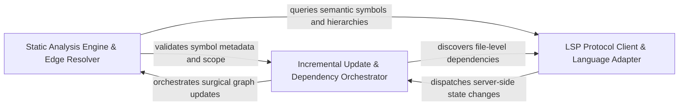

## Details

Coordinates the high-level logic for building and updating the codebase model, managing cross-boundary edges, and handling incremental updates.

### Static Analysis Engine & Edge Resolver [[Expand]](./Static_Analysis_Engine_Edge_Resolver.md)
The core engine responsible for the deterministic construction of the call graph, managing context for edge building and resolving symbol definitions.

**Related Classes/Methods**:

- `static_analyzer.engine.call_graph_builder.CallGraphBuilder`:23-329
- `static_analyzer.engine.edge_builder.DefinitionResolution`:42-46
- `static_analyzer.engine.edge_build_context.EdgeBuildContext`:13-18
- `static_analyzer.engine.edge_builder._resolve_definition_to_symbol`:507-538

**Source Files:**

- [`agents/change_status.py`](https://github.com/CodeBoarding/CodeBoarding/blob/main/.codeboardingagents/change_status.py)
  - `agents.change_status.ChangeStatus` ([L4-L9](https://github.com/CodeBoarding/CodeBoarding/blob/main/.codeboardingagents/change_status.py#L4-L9)) - Class
- [`agents/constants.py`](https://github.com/CodeBoarding/CodeBoarding/blob/main/.codeboardingagents/constants.py)
  - `agents.constants.LLMDefaults` ([L4-L7](https://github.com/CodeBoarding/CodeBoarding/blob/main/.codeboardingagents/constants.py#L4-L7)) - Class
  - `agents.constants.FileStructureConfig` ([L10-L13](https://github.com/CodeBoarding/CodeBoarding/blob/main/.codeboardingagents/constants.py#L10-L13)) - Class
  - `agents.constants.ModelCapabilities` ([L16-L38](https://github.com/CodeBoarding/CodeBoarding/blob/main/.codeboardingagents/constants.py#L16-L38)) - Class
- [`constants.py`](https://github.com/CodeBoarding/CodeBoarding/blob/main/.codeboardingconstants.py)
  - `constants.AppConfig` ([L11-L15](https://github.com/CodeBoarding/CodeBoarding/blob/main/.codeboardingconstants.py#L11-L15)) - Class
- [`diagram_analysis/run_mode.py`](https://github.com/CodeBoarding/CodeBoarding/blob/main/.codeboardingdiagram_analysis/run_mode.py)
  - `diagram_analysis.run_mode.RunMode` ([L8-L10](https://github.com/CodeBoarding/CodeBoarding/blob/main/.codeboardingdiagram_analysis/run_mode.py#L8-L10)) - Class
- [`static_analyzer/engine/call_graph_builder.py`](https://github.com/CodeBoarding/CodeBoarding/blob/main/.codeboardingstatic_analyzer/engine/call_graph_builder.py)
  - `static_analyzer.engine.call_graph_builder.CallGraphBuilder` ([L23-L329](https://github.com/CodeBoarding/CodeBoarding/blob/main/.codeboardingstatic_analyzer/engine/call_graph_builder.py#L23-L329)) - Class
  - `static_analyzer.engine.call_graph_builder.CallGraphBuilder.__init__` ([L26-L37](https://github.com/CodeBoarding/CodeBoarding/blob/main/.codeboardingstatic_analyzer/engine/call_graph_builder.py#L26-L37)) - Method
  - `static_analyzer.engine.call_graph_builder.CallGraphBuilder.build` ([L44-L119](https://github.com/CodeBoarding/CodeBoarding/blob/main/.codeboardingstatic_analyzer/engine/call_graph_builder.py#L44-L119)) - Method
  - `static_analyzer.engine.call_graph_builder.CallGraphBuilder._build_edges` ([L121-L125](https://github.com/CodeBoarding/CodeBoarding/blob/main/.codeboardingstatic_analyzer/engine/call_graph_builder.py#L121-L125)) - Method
  - `static_analyzer.engine.call_graph_builder.CallGraphBuilder._discover_symbols` ([L127-L180](https://github.com/CodeBoarding/CodeBoarding/blob/main/.codeboardingstatic_analyzer/engine/call_graph_builder.py#L127-L180)) - Method
  - `static_analyzer.engine.call_graph_builder.CallGraphBuilder._bulk_did_open` ([L182-L194](https://github.com/CodeBoarding/CodeBoarding/blob/main/.codeboardingstatic_analyzer/engine/call_graph_builder.py#L182-L194)) - Method
  - `static_analyzer.engine.call_graph_builder.CallGraphBuilder._send_sync_probe` ([L196-L208](https://github.com/CodeBoarding/CodeBoarding/blob/main/.codeboardingstatic_analyzer/engine/call_graph_builder.py#L196-L208)) - Method
  - `static_analyzer.engine.call_graph_builder.CallGraphBuilder._warmup_references` ([L210-L225](https://github.com/CodeBoarding/CodeBoarding/blob/main/.codeboardingstatic_analyzer/engine/call_graph_builder.py#L210-L225)) - Method
  - `static_analyzer.engine.call_graph_builder.CallGraphBuilder._postprocess_edges` ([L227-L301](https://github.com/CodeBoarding/CodeBoarding/blob/main/.codeboardingstatic_analyzer/engine/call_graph_builder.py#L227-L301)) - Method
  - `static_analyzer.engine.call_graph_builder.CallGraphBuilder._build_package_deps` ([L303-L329](https://github.com/CodeBoarding/CodeBoarding/blob/main/.codeboardingstatic_analyzer/engine/call_graph_builder.py#L303-L329)) - Method
- [`static_analyzer/engine/edge_build_context.py`](https://github.com/CodeBoarding/CodeBoarding/blob/main/.codeboardingstatic_analyzer/engine/edge_build_context.py)
  - `static_analyzer.engine.edge_build_context.EdgeBuildContext` ([L13-L18](https://github.com/CodeBoarding/CodeBoarding/blob/main/.codeboardingstatic_analyzer/engine/edge_build_context.py#L13-L18)) - Class
- [`static_analyzer/engine/edge_builder.py`](https://github.com/CodeBoarding/CodeBoarding/blob/main/.codeboardingstatic_analyzer/engine/edge_builder.py)
  - `static_analyzer.engine.edge_builder.ImplementationQuery` ([L33-L38](https://github.com/CodeBoarding/CodeBoarding/blob/main/.codeboardingstatic_analyzer/engine/edge_builder.py#L33-L38)) - Class
  - `static_analyzer.engine.edge_builder.DefinitionResolution` ([L42-L46](https://github.com/CodeBoarding/CodeBoarding/blob/main/.codeboardingstatic_analyzer/engine/edge_builder.py#L42-L46)) - Class
  - `static_analyzer.engine.edge_builder.build_edges_via_references` ([L54-L143](https://github.com/CodeBoarding/CodeBoarding/blob/main/.codeboardingstatic_analyzer/engine/edge_builder.py#L54-L143)) - Function
  - `static_analyzer.engine.edge_builder._prepare_trackable_symbols` ([L146-L177](https://github.com/CodeBoarding/CodeBoarding/blob/main/.codeboardingstatic_analyzer/engine/edge_builder.py#L146-L177)) - Function
  - `static_analyzer.engine.edge_builder._process_references_for_position` ([L180-L257](https://github.com/CodeBoarding/CodeBoarding/blob/main/.codeboardingstatic_analyzer/engine/edge_builder.py#L180-L257)) - Function
  - `static_analyzer.engine.edge_builder.build_edges_via_definitions` ([L265-L294](https://github.com/CodeBoarding/CodeBoarding/blob/main/.codeboardingstatic_analyzer/engine/edge_builder.py#L265-L294)) - Function
  - `static_analyzer.engine.edge_builder._build_definition_lookups` ([L297-L315](https://github.com/CodeBoarding/CodeBoarding/blob/main/.codeboardingstatic_analyzer/engine/edge_builder.py#L297-L315)) - Function
  - `static_analyzer.engine.edge_builder._resolve_definitions` ([L318-L406](https://github.com/CodeBoarding/CodeBoarding/blob/main/.codeboardingstatic_analyzer/engine/edge_builder.py#L318-L406)) - Function
  - `static_analyzer.engine.edge_builder._resolve_implementations` ([L409-L469](https://github.com/CodeBoarding/CodeBoarding/blob/main/.codeboardingstatic_analyzer/engine/edge_builder.py#L409-L469)) - Function
  - `static_analyzer.engine.edge_builder._add_edge_site` ([L482-L483](https://github.com/CodeBoarding/CodeBoarding/blob/main/.codeboardingstatic_analyzer/engine/edge_builder.py#L482-L483)) - Function
  - `static_analyzer.engine.edge_builder._add_edge_call_site` ([L486-L489](https://github.com/CodeBoarding/CodeBoarding/blob/main/.codeboardingstatic_analyzer/engine/edge_builder.py#L486-L489)) - Function
  - `static_analyzer.engine.edge_builder._is_valid_edge` ([L492-L504](https://github.com/CodeBoarding/CodeBoarding/blob/main/.codeboardingstatic_analyzer/engine/edge_builder.py#L492-L504)) - Function
  - `static_analyzer.engine.edge_builder._resolve_definition_to_symbol` ([L507-L538](https://github.com/CodeBoarding/CodeBoarding/blob/main/.codeboardingstatic_analyzer/engine/edge_builder.py#L507-L538)) - Function
  - `static_analyzer.engine.edge_builder._best_candidate` ([L541-L549](https://github.com/CodeBoarding/CodeBoarding/blob/main/.codeboardingstatic_analyzer/engine/edge_builder.py#L541-L549)) - Function
- [`static_analyzer/engine/hierarchy_builder.py`](https://github.com/CodeBoarding/CodeBoarding/blob/main/.codeboardingstatic_analyzer/engine/hierarchy_builder.py)
  - `static_analyzer.engine.hierarchy_builder.HierarchyBuilder` ([L19-L200](https://github.com/CodeBoarding/CodeBoarding/blob/main/.codeboardingstatic_analyzer/engine/hierarchy_builder.py#L19-L200)) - Class
  - `static_analyzer.engine.hierarchy_builder.HierarchyBuilder.__init__` ([L22-L32](https://github.com/CodeBoarding/CodeBoarding/blob/main/.codeboardingstatic_analyzer/engine/hierarchy_builder.py#L22-L32)) - Method
  - `static_analyzer.engine.hierarchy_builder.HierarchyBuilder.build` ([L34-L111](https://github.com/CodeBoarding/CodeBoarding/blob/main/.codeboardingstatic_analyzer/engine/hierarchy_builder.py#L34-L111)) - Method
  - `static_analyzer.engine.hierarchy_builder.HierarchyBuilder._resolve_type_hierarchy_item` ([L113-L135](https://github.com/CodeBoarding/CodeBoarding/blob/main/.codeboardingstatic_analyzer/engine/hierarchy_builder.py#L113-L135)) - Method
  - `static_analyzer.engine.hierarchy_builder.HierarchyBuilder._infer_hierarchy_from_source` ([L137-L182](https://github.com/CodeBoarding/CodeBoarding/blob/main/.codeboardingstatic_analyzer/engine/hierarchy_builder.py#L137-L182)) - Method
  - `static_analyzer.engine.hierarchy_builder.HierarchyBuilder._link_hierarchy` ([L184-L200](https://github.com/CodeBoarding/CodeBoarding/blob/main/.codeboardingstatic_analyzer/engine/hierarchy_builder.py#L184-L200)) - Method
- [`static_analyzer/engine/language_adapter.py`](https://github.com/CodeBoarding/CodeBoarding/blob/main/.codeboardingstatic_analyzer/engine/language_adapter.py)
  - `static_analyzer.engine.language_adapter.LanguageAdapter.is_class_like` ([L281-L282](https://github.com/CodeBoarding/CodeBoarding/blob/main/.codeboardingstatic_analyzer/engine/language_adapter.py#L281-L282)) - Method
- [`static_analyzer/engine/lsp_client.py`](https://github.com/CodeBoarding/CodeBoarding/blob/main/.codeboardingstatic_analyzer/engine/lsp_client.py)
  - `static_analyzer.engine.lsp_client.LSPClient.did_open` ([L239-L264](https://github.com/CodeBoarding/CodeBoarding/blob/main/.codeboardingstatic_analyzer/engine/lsp_client.py#L239-L264)) - Method
  - `static_analyzer.engine.lsp_client.LSPClient.document_symbol` ([L291-L300](https://github.com/CodeBoarding/CodeBoarding/blob/main/.codeboardingstatic_analyzer/engine/lsp_client.py#L291-L300)) - Method
- [`static_analyzer/engine/lsp_constants.py`](https://github.com/CodeBoarding/CodeBoarding/blob/main/.codeboardingstatic_analyzer/engine/lsp_constants.py)
  - `static_analyzer.engine.lsp_constants.EdgeStrategy` ([L29-L33](https://github.com/CodeBoarding/CodeBoarding/blob/main/.codeboardingstatic_analyzer/engine/lsp_constants.py#L29-L33)) - Class
- [`static_analyzer/engine/models.py`](https://github.com/CodeBoarding/CodeBoarding/blob/main/.codeboardingstatic_analyzer/engine/models.py)
  - `static_analyzer.engine.models.SymbolInfo` ([L14-L30](https://github.com/CodeBoarding/CodeBoarding/blob/main/.codeboardingstatic_analyzer/engine/models.py#L14-L30)) - Class
  - `static_analyzer.engine.models.SymbolInfo.definition_location` ([L28-L30](https://github.com/CodeBoarding/CodeBoarding/blob/main/.codeboardingstatic_analyzer/engine/models.py#L28-L30)) - Method
  - `static_analyzer.engine.models.Edge` ([L63-L68](https://github.com/CodeBoarding/CodeBoarding/blob/main/.codeboardingstatic_analyzer/engine/models.py#L63-L68)) - Class
  - `static_analyzer.engine.models.CallFlowGraph` ([L72-L87](https://github.com/CodeBoarding/CodeBoarding/blob/main/.codeboardingstatic_analyzer/engine/models.py#L72-L87)) - Class
  - `static_analyzer.engine.models.CallFlowGraph.from_edge_set` ([L79-L87](https://github.com/CodeBoarding/CodeBoarding/blob/main/.codeboardingstatic_analyzer/engine/models.py#L79-L87)) - Method
  - `static_analyzer.engine.models.LanguageAnalysisResult` ([L91-L104](https://github.com/CodeBoarding/CodeBoarding/blob/main/.codeboardingstatic_analyzer/engine/models.py#L91-L104)) - Class
- [`static_analyzer/engine/progress.py`](https://github.com/CodeBoarding/CodeBoarding/blob/main/.codeboardingstatic_analyzer/engine/progress.py)
  - `static_analyzer.engine.progress.ProgressLogger` ([L22-L83](https://github.com/CodeBoarding/CodeBoarding/blob/main/.codeboardingstatic_analyzer/engine/progress.py#L22-L83)) - Class
  - `static_analyzer.engine.progress.ProgressLogger.__init__` ([L25-L42](https://github.com/CodeBoarding/CodeBoarding/blob/main/.codeboardingstatic_analyzer/engine/progress.py#L25-L42)) - Method
  - `static_analyzer.engine.progress.ProgressLogger.set_postfix` ([L44-L45](https://github.com/CodeBoarding/CodeBoarding/blob/main/.codeboardingstatic_analyzer/engine/progress.py#L44-L45)) - Method
  - `static_analyzer.engine.progress.ProgressLogger.update` ([L47-L60](https://github.com/CodeBoarding/CodeBoarding/blob/main/.codeboardingstatic_analyzer/engine/progress.py#L47-L60)) - Method
  - `static_analyzer.engine.progress.ProgressLogger.finish` ([L62-L65](https://github.com/CodeBoarding/CodeBoarding/blob/main/.codeboardingstatic_analyzer/engine/progress.py#L62-L65)) - Method
  - `static_analyzer.engine.progress.ProgressLogger._log` ([L67-L83](https://github.com/CodeBoarding/CodeBoarding/blob/main/.codeboardingstatic_analyzer/engine/progress.py#L67-L83)) - Method
- [`static_analyzer/engine/protocols.py`](https://github.com/CodeBoarding/CodeBoarding/blob/main/.codeboardingstatic_analyzer/engine/protocols.py)
  - `static_analyzer.engine.protocols.SymbolNaming` ([L15-L32](https://github.com/CodeBoarding/CodeBoarding/blob/main/.codeboardingstatic_analyzer/engine/protocols.py#L15-L32)) - Class
  - `static_analyzer.engine.protocols.SymbolNaming.build_qualified_name` ([L18-L26](https://github.com/CodeBoarding/CodeBoarding/blob/main/.codeboardingstatic_analyzer/engine/protocols.py#L18-L26)) - Method
  - `static_analyzer.engine.protocols.SymbolNaming.build_reference_key` ([L28-L28](https://github.com/CodeBoarding/CodeBoarding/blob/main/.codeboardingstatic_analyzer/engine/protocols.py#L28-L28)) - Method
  - `static_analyzer.engine.protocols.SymbolNaming.is_class_like` ([L30-L30](https://github.com/CodeBoarding/CodeBoarding/blob/main/.codeboardingstatic_analyzer/engine/protocols.py#L30-L30)) - Method
  - `static_analyzer.engine.protocols.SymbolNaming.is_callable` ([L32-L32](https://github.com/CodeBoarding/CodeBoarding/blob/main/.codeboardingstatic_analyzer/engine/protocols.py#L32-L32)) - Method
  - `static_analyzer.engine.protocols.EdgeBuildAdapter` ([L35-L51](https://github.com/CodeBoarding/CodeBoarding/blob/main/.codeboardingstatic_analyzer/engine/protocols.py#L35-L51)) - Class
  - `static_analyzer.engine.protocols.EdgeBuildAdapter.include_references_on_declaration_line` ([L39-L39](https://github.com/CodeBoarding/CodeBoarding/blob/main/.codeboardingstatic_analyzer/engine/protocols.py#L39-L39)) - Method
  - `static_analyzer.engine.protocols.EdgeBuildAdapter.references_batch_size` ([L42-L42](https://github.com/CodeBoarding/CodeBoarding/blob/main/.codeboardingstatic_analyzer/engine/protocols.py#L42-L42)) - Method
  - `static_analyzer.engine.protocols.EdgeBuildAdapter.references_per_query_timeout` ([L45-L45](https://github.com/CodeBoarding/CodeBoarding/blob/main/.codeboardingstatic_analyzer/engine/protocols.py#L45-L45)) - Method
  - `static_analyzer.engine.protocols.EdgeBuildAdapter.should_track_for_edges` ([L47-L47](https://github.com/CodeBoarding/CodeBoarding/blob/main/.codeboardingstatic_analyzer/engine/protocols.py#L47-L47)) - Method
  - `static_analyzer.engine.protocols.EdgeBuildAdapter.is_class_like` ([L49-L49](https://github.com/CodeBoarding/CodeBoarding/blob/main/.codeboardingstatic_analyzer/engine/protocols.py#L49-L49)) - Method
  - `static_analyzer.engine.protocols.EdgeBuildAdapter.is_callable` ([L51-L51](https://github.com/CodeBoarding/CodeBoarding/blob/main/.codeboardingstatic_analyzer/engine/protocols.py#L51-L51)) - Method
- [`static_analyzer/engine/symbol_table.py`](https://github.com/CodeBoarding/CodeBoarding/blob/main/.codeboardingstatic_analyzer/engine/symbol_table.py)
  - `static_analyzer.engine.symbol_table.SymbolTable` ([L16-L328](https://github.com/CodeBoarding/CodeBoarding/blob/main/.codeboardingstatic_analyzer/engine/symbol_table.py#L16-L328)) - Class
  - `static_analyzer.engine.symbol_table.SymbolTable.__init__` ([L23-L39](https://github.com/CodeBoarding/CodeBoarding/blob/main/.codeboardingstatic_analyzer/engine/symbol_table.py#L23-L39)) - Method
  - `static_analyzer.engine.symbol_table.SymbolTable.symbols` ([L42-L44](https://github.com/CodeBoarding/CodeBoarding/blob/main/.codeboardingstatic_analyzer/engine/symbol_table.py#L42-L44)) - Method
  - `static_analyzer.engine.symbol_table.SymbolTable.primary_file_symbols` ([L47-L49](https://github.com/CodeBoarding/CodeBoarding/blob/main/.codeboardingstatic_analyzer/engine/symbol_table.py#L47-L49)) - Method
  - `static_analyzer.engine.symbol_table.SymbolTable.file_symbols` ([L52-L54](https://github.com/CodeBoarding/CodeBoarding/blob/main/.codeboardingstatic_analyzer/engine/symbol_table.py#L52-L54)) - Method
  - `static_analyzer.engine.symbol_table.SymbolTable.class_to_ctors` ([L57-L59](https://github.com/CodeBoarding/CodeBoarding/blob/main/.codeboardingstatic_analyzer/engine/symbol_table.py#L57-L59)) - Method
  - `static_analyzer.engine.symbol_table.SymbolTable.register_symbols` ([L61-L167](https://github.com/CodeBoarding/CodeBoarding/blob/main/.codeboardingstatic_analyzer/engine/symbol_table.py#L61-L167)) - Method
  - `static_analyzer.engine.symbol_table.SymbolTable.build_indices` ([L169-L188](https://github.com/CodeBoarding/CodeBoarding/blob/main/.codeboardingstatic_analyzer/engine/symbol_table.py#L169-L188)) - Method
  - `static_analyzer.engine.symbol_table.SymbolTable.find_containing_symbol` ([L190-L241](https://github.com/CodeBoarding/CodeBoarding/blob/main/.codeboardingstatic_analyzer/engine/symbol_table.py#L190-L241)) - Method
  - `static_analyzer.engine.symbol_table.SymbolTable.lift_to_callable` ([L243-L265](https://github.com/CodeBoarding/CodeBoarding/blob/main/.codeboardingstatic_analyzer/engine/symbol_table.py#L243-L265)) - Method
  - `static_analyzer.engine.symbol_table.SymbolTable.get_equivalent_names` ([L267-L277](https://github.com/CodeBoarding/CodeBoarding/blob/main/.codeboardingstatic_analyzer/engine/symbol_table.py#L267-L277)) - Method
  - `static_analyzer.engine.symbol_table.SymbolTable.get_canonical_name` ([L279-L294](https://github.com/CodeBoarding/CodeBoarding/blob/main/.codeboardingstatic_analyzer/engine/symbol_table.py#L279-L294)) - Method
  - `static_analyzer.engine.symbol_table.SymbolTable.is_local_variable` ([L296-L328](https://github.com/CodeBoarding/CodeBoarding/blob/main/.codeboardingstatic_analyzer/engine/symbol_table.py#L296-L328)) - Method

### Incremental Update & Dependency Orchestrator [[Expand]](./Incremental_Update_Dependency_Orchestrator.md)
Manages the stateful evolution of the graph, identifying changed files and executing surgical updates to maintain consistency during codebase modifications.

**Related Classes/Methods**:

- `static_analyzer.incremental_orchestrator._rebuild_changed_file_edges`:111-129
- `static_analyzer.incremental_orchestrator._restore_cross_boundary_edges`:132-184
- `static_analyzer.__init__.StaticAnalyzer.discover_file_dependencies`:463-512
- `static_analyzer.internal_references.parent_qualified_name`:24-29

**Source Files:**

- [`static_analyzer/__init__.py`](https://github.com/CodeBoarding/CodeBoarding/blob/main/.codeboardingstatic_analyzer/__init__.py)
  - `static_analyzer.__init__.StaticAnalyzer.discover_file_dependencies` ([L463-L512](https://github.com/CodeBoarding/CodeBoarding/blob/main/.codeboardingstatic_analyzer/__init__.py#L463-L512)) - Method
- [`static_analyzer/engine/edge_builder.py`](https://github.com/CodeBoarding/CodeBoarding/blob/main/.codeboardingstatic_analyzer/engine/edge_builder.py)
  - `static_analyzer.engine.edge_builder._call_site` ([L477-L479](https://github.com/CodeBoarding/CodeBoarding/blob/main/.codeboardingstatic_analyzer/engine/edge_builder.py#L477-L479)) - Function
- [`static_analyzer/engine/language_adapter.py`](https://github.com/CodeBoarding/CodeBoarding/blob/main/.codeboardingstatic_analyzer/engine/language_adapter.py)
  - `static_analyzer.engine.language_adapter.LanguageAdapter.edge_strategy` ([L304-L310](https://github.com/CodeBoarding/CodeBoarding/blob/main/.codeboardingstatic_analyzer/engine/language_adapter.py#L304-L310)) - Method
- [`static_analyzer/engine/models.py`](https://github.com/CodeBoarding/CodeBoarding/blob/main/.codeboardingstatic_analyzer/engine/models.py)
  - `static_analyzer.engine.models.CallSite` ([L34-L59](https://github.com/CodeBoarding/CodeBoarding/blob/main/.codeboardingstatic_analyzer/engine/models.py#L34-L59)) - Class
  - `static_analyzer.engine.models.CallSite.from_lsp_position` ([L42-L43](https://github.com/CodeBoarding/CodeBoarding/blob/main/.codeboardingstatic_analyzer/engine/models.py#L42-L43)) - Method
  - `static_analyzer.engine.models.CallSite.human_line` ([L46-L47](https://github.com/CodeBoarding/CodeBoarding/blob/main/.codeboardingstatic_analyzer/engine/models.py#L46-L47)) - Method
  - `static_analyzer.engine.models.CallSite.human_column` ([L50-L51](https://github.com/CodeBoarding/CodeBoarding/blob/main/.codeboardingstatic_analyzer/engine/models.py#L50-L51)) - Method
  - `static_analyzer.engine.models.CallSite.lsp_line` ([L54-L55](https://github.com/CodeBoarding/CodeBoarding/blob/main/.codeboardingstatic_analyzer/engine/models.py#L54-L55)) - Method
  - `static_analyzer.engine.models.CallSite.lsp_column` ([L58-L59](https://github.com/CodeBoarding/CodeBoarding/blob/main/.codeboardingstatic_analyzer/engine/models.py#L58-L59)) - Method
- [`static_analyzer/engine/source_inspector.py`](https://github.com/CodeBoarding/CodeBoarding/blob/main/.codeboardingstatic_analyzer/engine/source_inspector.py)
  - `static_analyzer.engine.source_inspector.ParsedSource` ([L85-L87](https://github.com/CodeBoarding/CodeBoarding/blob/main/.codeboardingstatic_analyzer/engine/source_inspector.py#L85-L87)) - Class
  - `static_analyzer.engine.source_inspector.SourceUsageIndex` ([L91-L93](https://github.com/CodeBoarding/CodeBoarding/blob/main/.codeboardingstatic_analyzer/engine/source_inspector.py#L91-L93)) - Class
  - `static_analyzer.engine.source_inspector.SourceInspector` ([L96-L400](https://github.com/CodeBoarding/CodeBoarding/blob/main/.codeboardingstatic_analyzer/engine/source_inspector.py#L96-L400)) - Class
  - `static_analyzer.engine.source_inspector.SourceInspector.__init__` ([L99-L104](https://github.com/CodeBoarding/CodeBoarding/blob/main/.codeboardingstatic_analyzer/engine/source_inspector.py#L99-L104)) - Method
  - `static_analyzer.engine.source_inspector.SourceInspector.get_source_line` ([L106-L111](https://github.com/CodeBoarding/CodeBoarding/blob/main/.codeboardingstatic_analyzer/engine/source_inspector.py#L106-L111)) - Method
  - `static_analyzer.engine.source_inspector.SourceInspector.get_file_lines` ([L113-L121](https://github.com/CodeBoarding/CodeBoarding/blob/main/.codeboardingstatic_analyzer/engine/source_inspector.py#L113-L121)) - Method
  - `static_analyzer.engine.source_inspector.SourceInspector.is_invocation` ([L123-L128](https://github.com/CodeBoarding/CodeBoarding/blob/main/.codeboardingstatic_analyzer/engine/source_inspector.py#L123-L128)) - Method
  - `static_analyzer.engine.source_inspector.SourceInspector.is_callable_usage` ([L130-L135](https://github.com/CodeBoarding/CodeBoarding/blob/main/.codeboardingstatic_analyzer/engine/source_inspector.py#L130-L135)) - Method
  - `static_analyzer.engine.source_inspector.SourceInspector.is_reference_in_declaration_body` ([L137-L168](https://github.com/CodeBoarding/CodeBoarding/blob/main/.codeboardingstatic_analyzer/engine/source_inspector.py#L137-L168)) - Method
  - `static_analyzer.engine.source_inspector.SourceInspector.find_call_sites` ([L170-L187](https://github.com/CodeBoarding/CodeBoarding/blob/main/.codeboardingstatic_analyzer/engine/source_inspector.py#L170-L187)) - Method
  - `static_analyzer.engine.source_inspector.SourceInspector._read_file_bytes` ([L189-L196](https://github.com/CodeBoarding/CodeBoarding/blob/main/.codeboardingstatic_analyzer/engine/source_inspector.py#L189-L196)) - Method
  - `static_analyzer.engine.source_inspector.SourceInspector._parse` ([L198-L212](https://github.com/CodeBoarding/CodeBoarding/blob/main/.codeboardingstatic_analyzer/engine/source_inspector.py#L198-L212)) - Method
  - `static_analyzer.engine.source_inspector.SourceInspector._usage_index` ([L214-L242](https://github.com/CodeBoarding/CodeBoarding/blob/main/.codeboardingstatic_analyzer/engine/source_inspector.py#L214-L242)) - Method
  - `static_analyzer.engine.source_inspector.SourceInspector._parser_for` ([L244-L253](https://github.com/CodeBoarding/CodeBoarding/blob/main/.codeboardingstatic_analyzer/engine/source_inspector.py#L244-L253)) - Method
  - `static_analyzer.engine.source_inspector.SourceInspector._call_target_node` ([L255-L271](https://github.com/CodeBoarding/CodeBoarding/blob/main/.codeboardingstatic_analyzer/engine/source_inspector.py#L255-L271)) - Method
  - `static_analyzer.engine.source_inspector.SourceInspector._select_query_node` ([L273-L285](https://github.com/CodeBoarding/CodeBoarding/blob/main/.codeboardingstatic_analyzer/engine/source_inspector.py#L273-L285)) - Method
  - `static_analyzer.engine.source_inspector.SourceInspector._node_is_call_target` ([L287-L294](https://github.com/CodeBoarding/CodeBoarding/blob/main/.codeboardingstatic_analyzer/engine/source_inspector.py#L287-L294)) - Method
  - `static_analyzer.engine.source_inspector.SourceInspector._node_is_return_value` ([L297-L306](https://github.com/CodeBoarding/CodeBoarding/blob/main/.codeboardingstatic_analyzer/engine/source_inspector.py#L297-L306)) - Method
  - `static_analyzer.engine.source_inspector.SourceInspector._node_is_call_argument` ([L308-L317](https://github.com/CodeBoarding/CodeBoarding/blob/main/.codeboardingstatic_analyzer/engine/source_inspector.py#L308-L317)) - Method
  - `static_analyzer.engine.source_inspector.SourceInspector._parent_is_call_like` ([L320-L324](https://github.com/CodeBoarding/CodeBoarding/blob/main/.codeboardingstatic_analyzer/engine/source_inspector.py#L320-L324)) - Method
  - `static_analyzer.engine.source_inspector.SourceInspector._smallest_named_node_ending_at` ([L326-L337](https://github.com/CodeBoarding/CodeBoarding/blob/main/.codeboardingstatic_analyzer/engine/source_inspector.py#L326-L337)) - Method
  - `static_analyzer.engine.source_inspector.SourceInspector._smallest_named_node_covering_range` ([L339-L354](https://github.com/CodeBoarding/CodeBoarding/blob/main/.codeboardingstatic_analyzer/engine/source_inspector.py#L339-L354)) - Method
  - `static_analyzer.engine.source_inspector.SourceInspector._node_contains_point` ([L357-L366](https://github.com/CodeBoarding/CodeBoarding/blob/main/.codeboardingstatic_analyzer/engine/source_inspector.py#L357-L366)) - Method
  - `static_analyzer.engine.source_inspector.SourceInspector._node_covers_range` ([L369-L378](https://github.com/CodeBoarding/CodeBoarding/blob/main/.codeboardingstatic_analyzer/engine/source_inspector.py#L369-L378)) - Method
  - `static_analyzer.engine.source_inspector.SourceInspector._node_size` ([L381-L382](https://github.com/CodeBoarding/CodeBoarding/blob/main/.codeboardingstatic_analyzer/engine/source_inspector.py#L381-L382)) - Method
  - `static_analyzer.engine.source_inspector.SourceInspector._first_named_child_of_type` ([L384-L388](https://github.com/CodeBoarding/CodeBoarding/blob/main/.codeboardingstatic_analyzer/engine/source_inspector.py#L384-L388)) - Method
  - `static_analyzer.engine.source_inspector.SourceInspector._last_named_child_of_type` ([L390-L395](https://github.com/CodeBoarding/CodeBoarding/blob/main/.codeboardingstatic_analyzer/engine/source_inspector.py#L390-L395)) - Method
  - `static_analyzer.engine.source_inspector.SourceInspector._walk` ([L397-L400](https://github.com/CodeBoarding/CodeBoarding/blob/main/.codeboardingstatic_analyzer/engine/source_inspector.py#L397-L400)) - Method
- [`static_analyzer/engine/utils.py`](https://github.com/CodeBoarding/CodeBoarding/blob/main/.codeboardingstatic_analyzer/engine/utils.py)
  - `static_analyzer.engine.utils.uri_to_path` ([L16-L32](https://github.com/CodeBoarding/CodeBoarding/blob/main/.codeboardingstatic_analyzer/engine/utils.py#L16-L32)) - Function
  - `static_analyzer.engine.utils.definition_location` ([L35-L51](https://github.com/CodeBoarding/CodeBoarding/blob/main/.codeboardingstatic_analyzer/engine/utils.py#L35-L51)) - Function
- [`static_analyzer/incremental_orchestrator.py`](https://github.com/CodeBoarding/CodeBoarding/blob/main/.codeboardingstatic_analyzer/incremental_orchestrator.py)
  - `static_analyzer.incremental_orchestrator._rebuild_changed_file_edges` ([L111-L129](https://github.com/CodeBoarding/CodeBoarding/blob/main/.codeboardingstatic_analyzer/incremental_orchestrator.py#L111-L129)) - Function
  - `static_analyzer.incremental_orchestrator._restore_cross_boundary_edges` ([L132-L184](https://github.com/CodeBoarding/CodeBoarding/blob/main/.codeboardingstatic_analyzer/incremental_orchestrator.py#L132-L184)) - Function
  - `static_analyzer.incremental_orchestrator._edge_reference_call_sites` ([L187-L213](https://github.com/CodeBoarding/CodeBoarding/blob/main/.codeboardingstatic_analyzer/incremental_orchestrator.py#L187-L213)) - Function
  - `static_analyzer.incremental_orchestrator._add_outbound_edges_from_changed_files` ([L216-L267](https://github.com/CodeBoarding/CodeBoarding/blob/main/.codeboardingstatic_analyzer/incremental_orchestrator.py#L216-L267)) - Function
  - `static_analyzer.incremental_orchestrator._most_specific_node_at_position` ([L270-L294](https://github.com/CodeBoarding/CodeBoarding/blob/main/.codeboardingstatic_analyzer/incremental_orchestrator.py#L270-L294)) - Function
  - `static_analyzer.incremental_orchestrator._definition_nodes` ([L297-L330](https://github.com/CodeBoarding/CodeBoarding/blob/main/.codeboardingstatic_analyzer/incremental_orchestrator.py#L297-L330)) - Function
  - `static_analyzer.incremental_orchestrator._position_inside_node` ([L333-L339](https://github.com/CodeBoarding/CodeBoarding/blob/main/.codeboardingstatic_analyzer/incremental_orchestrator.py#L333-L339)) - Function
  - `static_analyzer.incremental_orchestrator._reference_matches_edge_kind` ([L342-L359](https://github.com/CodeBoarding/CodeBoarding/blob/main/.codeboardingstatic_analyzer/incremental_orchestrator.py#L342-L359)) - Function
- [`static_analyzer/internal_references.py`](https://github.com/CodeBoarding/CodeBoarding/blob/main/.codeboardingstatic_analyzer/internal_references.py)
  - `static_analyzer.internal_references.ReferenceNode` ([L10-L11](https://github.com/CodeBoarding/CodeBoarding/blob/main/.codeboardingstatic_analyzer/internal_references.py#L10-L11)) - Class
  - `static_analyzer.internal_references.parent_qualified_name` ([L24-L29](https://github.com/CodeBoarding/CodeBoarding/blob/main/.codeboardingstatic_analyzer/internal_references.py#L24-L29)) - Function
- [`static_analyzer/node.py`](https://github.com/CodeBoarding/CodeBoarding/blob/main/.codeboardingstatic_analyzer/node.py)
  - `static_analyzer.node.Node.is_callable` ([L33-L35](https://github.com/CodeBoarding/CodeBoarding/blob/main/.codeboardingstatic_analyzer/node.py#L33-L35)) - Method

### LSP Protocol Client & Language Adapter
Provides the low-level communication layer with Language Servers, abstracting JSON-RPC complexities and providing a unified interface for language-specific adapters.

**Related Classes/Methods**:

- `static_analyzer.engine.lsp_client.LSPClient`:44-887
- `static_analyzer.lsp_client.diagnostics.LSPDiagnostic`:27-58
- `static_analyzer.engine.lsp_client.LSPClient._handle_notification`:752-845

**Source Files:**

- [`static_analyzer/engine/adapters/rust_adapter.py`](https://github.com/CodeBoarding/CodeBoarding/blob/main/.codeboardingstatic_analyzer/engine/adapters/rust_adapter.py)
  - `static_analyzer.engine.adapters.rust_adapter.RustAdapter.wait_for_diagnostics` ([L109-L121](https://github.com/CodeBoarding/CodeBoarding/blob/main/.codeboardingstatic_analyzer/engine/adapters/rust_adapter.py#L109-L121)) - Method
  - `static_analyzer.engine.adapters.rust_adapter.RustAdapter.validate_workspace_ready` ([L123-L130](https://github.com/CodeBoarding/CodeBoarding/blob/main/.codeboardingstatic_analyzer/engine/adapters/rust_adapter.py#L123-L130)) - Method
- [`static_analyzer/engine/lsp_client.py`](https://github.com/CodeBoarding/CodeBoarding/blob/main/.codeboardingstatic_analyzer/engine/lsp_client.py)
  - `static_analyzer.engine.lsp_client._progress_indicates_failure` ([L28-L30](https://github.com/CodeBoarding/CodeBoarding/blob/main/.codeboardingstatic_analyzer/engine/lsp_client.py#L28-L30)) - Function
  - `static_analyzer.engine.lsp_client._progress_token` ([L33-L37](https://github.com/CodeBoarding/CodeBoarding/blob/main/.codeboardingstatic_analyzer/engine/lsp_client.py#L33-L37)) - Function
  - `static_analyzer.engine.lsp_client.MethodNotFoundError` ([L40-L41](https://github.com/CodeBoarding/CodeBoarding/blob/main/.codeboardingstatic_analyzer/engine/lsp_client.py#L40-L41)) - Class
  - `static_analyzer.engine.lsp_client.LSPClient` ([L44-L887](https://github.com/CodeBoarding/CodeBoarding/blob/main/.codeboardingstatic_analyzer/engine/lsp_client.py#L44-L887)) - Class
  - `static_analyzer.engine.lsp_client.LSPClient.__init__` ([L55-L102](https://github.com/CodeBoarding/CodeBoarding/blob/main/.codeboardingstatic_analyzer/engine/lsp_client.py#L55-L102)) - Method
  - `static_analyzer.engine.lsp_client.LSPClient.__enter__` ([L104-L106](https://github.com/CodeBoarding/CodeBoarding/blob/main/.codeboardingstatic_analyzer/engine/lsp_client.py#L104-L106)) - Method
  - `static_analyzer.engine.lsp_client.LSPClient.__exit__` ([L108-L109](https://github.com/CodeBoarding/CodeBoarding/blob/main/.codeboardingstatic_analyzer/engine/lsp_client.py#L108-L109)) - Method
  - `static_analyzer.engine.lsp_client.LSPClient.start` ([L111-L206](https://github.com/CodeBoarding/CodeBoarding/blob/main/.codeboardingstatic_analyzer/engine/lsp_client.py#L111-L206)) - Method
  - `static_analyzer.engine.lsp_client.LSPClient.shutdown` ([L208-L235](https://github.com/CodeBoarding/CodeBoarding/blob/main/.codeboardingstatic_analyzer/engine/lsp_client.py#L208-L235)) - Method
  - `static_analyzer.engine.lsp_client.LSPClient.did_change` ([L266-L277](https://github.com/CodeBoarding/CodeBoarding/blob/main/.codeboardingstatic_analyzer/engine/lsp_client.py#L266-L277)) - Method
  - `static_analyzer.engine.lsp_client.LSPClient.did_close` ([L279-L287](https://github.com/CodeBoarding/CodeBoarding/blob/main/.codeboardingstatic_analyzer/engine/lsp_client.py#L279-L287)) - Method
  - `static_analyzer.engine.lsp_client.LSPClient.references` ([L302-L314](https://github.com/CodeBoarding/CodeBoarding/blob/main/.codeboardingstatic_analyzer/engine/lsp_client.py#L302-L314)) - Method
  - `static_analyzer.engine.lsp_client.LSPClient.send_references_batch` ([L316-L341](https://github.com/CodeBoarding/CodeBoarding/blob/main/.codeboardingstatic_analyzer/engine/lsp_client.py#L316-L341)) - Method
  - `static_analyzer.engine.lsp_client.LSPClient.send_references_batch.build_params` ([L334-L339](https://github.com/CodeBoarding/CodeBoarding/blob/main/.codeboardingstatic_analyzer/engine/lsp_client.py#L334-L339)) - Function
  - `static_analyzer.engine.lsp_client.LSPClient.definition` ([L343-L357](https://github.com/CodeBoarding/CodeBoarding/blob/main/.codeboardingstatic_analyzer/engine/lsp_client.py#L343-L357)) - Method
  - `static_analyzer.engine.lsp_client.LSPClient.send_definition_batch` ([L359-L366](https://github.com/CodeBoarding/CodeBoarding/blob/main/.codeboardingstatic_analyzer/engine/lsp_client.py#L359-L366)) - Method
  - `static_analyzer.engine.lsp_client.LSPClient.implementation` ([L368-L382](https://github.com/CodeBoarding/CodeBoarding/blob/main/.codeboardingstatic_analyzer/engine/lsp_client.py#L368-L382)) - Method
  - `static_analyzer.engine.lsp_client.LSPClient.send_implementation_batch` ([L384-L391](https://github.com/CodeBoarding/CodeBoarding/blob/main/.codeboardingstatic_analyzer/engine/lsp_client.py#L384-L391)) - Method
  - `static_analyzer.engine.lsp_client.LSPClient.type_hierarchy_prepare` ([L393-L404](https://github.com/CodeBoarding/CodeBoarding/blob/main/.codeboardingstatic_analyzer/engine/lsp_client.py#L393-L404)) - Method
  - `static_analyzer.engine.lsp_client.LSPClient.type_hierarchy_supertypes` ([L406-L411](https://github.com/CodeBoarding/CodeBoarding/blob/main/.codeboardingstatic_analyzer/engine/lsp_client.py#L406-L411)) - Method
  - `static_analyzer.engine.lsp_client.LSPClient.type_hierarchy_subtypes` ([L413-L418](https://github.com/CodeBoarding/CodeBoarding/blob/main/.codeboardingstatic_analyzer/engine/lsp_client.py#L413-L418)) - Method
  - `static_analyzer.engine.lsp_client.LSPClient.get_diagnostics_generation` ([L427-L430](https://github.com/CodeBoarding/CodeBoarding/blob/main/.codeboardingstatic_analyzer/engine/lsp_client.py#L427-L430)) - Method
  - `static_analyzer.engine.lsp_client.LSPClient.wait_for_diagnostics_quiesce` ([L432-L456](https://github.com/CodeBoarding/CodeBoarding/blob/main/.codeboardingstatic_analyzer/engine/lsp_client.py#L432-L456)) - Method
  - `static_analyzer.engine.lsp_client.LSPClient.wait_for_server_ready` ([L460-L483](https://github.com/CodeBoarding/CodeBoarding/blob/main/.codeboardingstatic_analyzer/engine/lsp_client.py#L460-L483)) - Method
  - `static_analyzer.engine.lsp_client.LSPClient.reset_ready_signal` ([L485-L494](https://github.com/CodeBoarding/CodeBoarding/blob/main/.codeboardingstatic_analyzer/engine/lsp_client.py#L485-L494)) - Method
  - `static_analyzer.engine.lsp_client.LSPClient.server_health` ([L497-L498](https://github.com/CodeBoarding/CodeBoarding/blob/main/.codeboardingstatic_analyzer/engine/lsp_client.py#L497-L498)) - Method
  - `static_analyzer.engine.lsp_client.LSPClient.server_health_message` ([L501-L502](https://github.com/CodeBoarding/CodeBoarding/blob/main/.codeboardingstatic_analyzer/engine/lsp_client.py#L501-L502)) - Method
  - `static_analyzer.engine.lsp_client.LSPClient._position_params` ([L506-L511](https://github.com/CodeBoarding/CodeBoarding/blob/main/.codeboardingstatic_analyzer/engine/lsp_client.py#L506-L511)) - Method
  - `static_analyzer.engine.lsp_client.LSPClient._send_batch` ([L513-L557](https://github.com/CodeBoarding/CodeBoarding/blob/main/.codeboardingstatic_analyzer/engine/lsp_client.py#L513-L557)) - Method
  - `static_analyzer.engine.lsp_client.LSPClient._send_request` ([L559-L595](https://github.com/CodeBoarding/CodeBoarding/blob/main/.codeboardingstatic_analyzer/engine/lsp_client.py#L559-L595)) - Method
  - `static_analyzer.engine.lsp_client.LSPClient._send_notification` ([L597-L604](https://github.com/CodeBoarding/CodeBoarding/blob/main/.codeboardingstatic_analyzer/engine/lsp_client.py#L597-L604)) - Method
  - `static_analyzer.engine.lsp_client.LSPClient._write_message` ([L606-L619](https://github.com/CodeBoarding/CodeBoarding/blob/main/.codeboardingstatic_analyzer/engine/lsp_client.py#L606-L619)) - Method
  - `static_analyzer.engine.lsp_client.LSPClient._next_response` ([L621-L642](https://github.com/CodeBoarding/CodeBoarding/blob/main/.codeboardingstatic_analyzer/engine/lsp_client.py#L621-L642)) - Method
  - `static_analyzer.engine.lsp_client.LSPClient._collect_batch_responses` ([L644-L694](https://github.com/CodeBoarding/CodeBoarding/blob/main/.codeboardingstatic_analyzer/engine/lsp_client.py#L644-L694)) - Method
  - `static_analyzer.engine.lsp_client.LSPClient._reader_loop` ([L698-L734](https://github.com/CodeBoarding/CodeBoarding/blob/main/.codeboardingstatic_analyzer/engine/lsp_client.py#L698-L734)) - Method
  - `static_analyzer.engine.lsp_client.LSPClient._handle_server_request` ([L736-L750](https://github.com/CodeBoarding/CodeBoarding/blob/main/.codeboardingstatic_analyzer/engine/lsp_client.py#L736-L750)) - Method
  - `static_analyzer.engine.lsp_client.LSPClient._handle_notification` ([L752-L845](https://github.com/CodeBoarding/CodeBoarding/blob/main/.codeboardingstatic_analyzer/engine/lsp_client.py#L752-L845)) - Method
  - `static_analyzer.engine.lsp_client.LSPClient._read_single_message` ([L847-L887](https://github.com/CodeBoarding/CodeBoarding/blob/main/.codeboardingstatic_analyzer/engine/lsp_client.py#L847-L887)) - Method
- [`static_analyzer/lsp_client/diagnostics.py`](https://github.com/CodeBoarding/CodeBoarding/blob/main/.codeboardingstatic_analyzer/lsp_client/diagnostics.py)
  - `static_analyzer.lsp_client.diagnostics.DiagnosticPosition` ([L11-L15](https://github.com/CodeBoarding/CodeBoarding/blob/main/.codeboardingstatic_analyzer/lsp_client/diagnostics.py#L11-L15)) - Class
  - `static_analyzer.lsp_client.diagnostics.DiagnosticRange` ([L19-L23](https://github.com/CodeBoarding/CodeBoarding/blob/main/.codeboardingstatic_analyzer/lsp_client/diagnostics.py#L19-L23)) - Class
  - `static_analyzer.lsp_client.diagnostics.LSPDiagnostic` ([L27-L58](https://github.com/CodeBoarding/CodeBoarding/blob/main/.codeboardingstatic_analyzer/lsp_client/diagnostics.py#L27-L58)) - Class
  - `static_analyzer.lsp_client.diagnostics.LSPDiagnostic.from_lsp_dict` ([L37-L50](https://github.com/CodeBoarding/CodeBoarding/blob/main/.codeboardingstatic_analyzer/lsp_client/diagnostics.py#L37-L50)) - Method
  - `static_analyzer.lsp_client.diagnostics.LSPDiagnostic.dedup_key` ([L52-L58](https://github.com/CodeBoarding/CodeBoarding/blob/main/.codeboardingstatic_analyzer/lsp_client/diagnostics.py#L52-L58)) - Method

### [FAQ](https://github.com/CodeBoarding/GeneratedOnBoardings/tree/main?tab=readme-ov-file#faq)