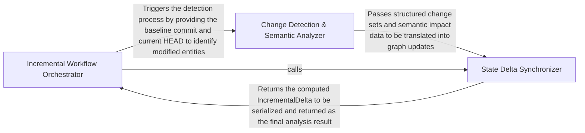

## Details

Optimizes performance by performing semantic diffing between repository states. It identifies changed files and affected code clusters to ensure that only modified components are re-analyzed by the LSP and LLM layers.

### Incremental Workflow Orchestrator
Acts as the central controller and external interface for the incremental analysis process. It manages the lifecycle of an analysis run, from CLI invocation and environment validation to state persistence and final payload serialization for the UI.

**Related Classes/Methods**:

- `diagram_analysis.incremental_pipeline.run_incremental_pipeline`:167-285
- `codeboarding_cli.commands.incremental_analysis.run_from_args`:63-122
- `diagram_analysis.run_metadata.write_incremental_run_metadata`:105-122
- `diagram_analysis.incremental_payload.IncrementalCompletedPayload`:94-126

**Source Files:**

- [`agents/agent_responses.py`](https://github.com/CodeBoarding/CodeBoarding/blob/main/.codeboardingagents/agent_responses.py)
  - `agents.agent_responses.MethodEntry.from_node` ([L164-L171](https://github.com/CodeBoarding/CodeBoarding/blob/main/.codeboardingagents/agent_responses.py#L164-L171)) - Method
- [`codeboarding_cli/commands/full_analysis.py`](https://github.com/CodeBoarding/CodeBoarding/blob/main/.codeboardingcodeboarding_cli/commands/full_analysis.py)
  - `codeboarding_cli.commands.full_analysis._run_local.scope` ([L85-L95](https://github.com/CodeBoarding/CodeBoarding/blob/main/.codeboardingcodeboarding_cli/commands/full_analysis.py#L85-L95)) - Function
- [`codeboarding_cli/commands/incremental_analysis.py`](https://github.com/CodeBoarding/CodeBoarding/blob/main/.codeboardingcodeboarding_cli/commands/incremental_analysis.py)
  - `codeboarding_cli.commands.incremental_analysis.add_arguments` ([L18-L41](https://github.com/CodeBoarding/CodeBoarding/blob/main/.codeboardingcodeboarding_cli/commands/incremental_analysis.py#L18-L41)) - Function
  - `codeboarding_cli.commands.incremental_analysis._error_payload` ([L44-L46](https://github.com/CodeBoarding/CodeBoarding/blob/main/.codeboardingcodeboarding_cli/commands/incremental_analysis.py#L44-L46)) - Function
  - `codeboarding_cli.commands.incremental_analysis._api_key_missing_dict` ([L49-L55](https://github.com/CodeBoarding/CodeBoarding/blob/main/.codeboardingcodeboarding_cli/commands/incremental_analysis.py#L49-L55)) - Function
  - `codeboarding_cli.commands.incremental_analysis.validate_arguments` ([L58-L60](https://github.com/CodeBoarding/CodeBoarding/blob/main/.codeboardingcodeboarding_cli/commands/incremental_analysis.py#L58-L60)) - Function
  - `codeboarding_cli.commands.incremental_analysis.run_from_args` ([L63-L122](https://github.com/CodeBoarding/CodeBoarding/blob/main/.codeboardingcodeboarding_cli/commands/incremental_analysis.py#L63-L122)) - Function
  - `codeboarding_cli.commands.incremental_analysis._emit_payload` ([L125-L127](https://github.com/CodeBoarding/CodeBoarding/blob/main/.codeboardingcodeboarding_cli/commands/incremental_analysis.py#L125-L127)) - Function
  - `codeboarding_cli.commands.incremental_analysis._emit_dict` ([L130-L137](https://github.com/CodeBoarding/CodeBoarding/blob/main/.codeboardingcodeboarding_cli/commands/incremental_analysis.py#L130-L137)) - Function
- [`codeboarding_cli/commands/partial_analysis.py`](https://github.com/CodeBoarding/CodeBoarding/blob/main/.codeboardingcodeboarding_cli/commands/partial_analysis.py)
  - `codeboarding_cli.commands.partial_analysis.run_from_args.scope` ([L49-L58](https://github.com/CodeBoarding/CodeBoarding/blob/main/.codeboardingcodeboarding_cli/commands/partial_analysis.py#L49-L58)) - Function
- [`codeboarding_workflows/analysis.py`](https://github.com/CodeBoarding/CodeBoarding/blob/main/.codeboardingcodeboarding_workflows/analysis.py)
  - `codeboarding_workflows.analysis._build_generator` ([L20-L40](https://github.com/CodeBoarding/CodeBoarding/blob/main/.codeboardingcodeboarding_workflows/analysis.py#L20-L40)) - Function
  - `codeboarding_workflows.analysis.run_full` ([L43-L66](https://github.com/CodeBoarding/CodeBoarding/blob/main/.codeboardingcodeboarding_workflows/analysis.py#L43-L66)) - Function
  - `codeboarding_workflows.analysis.run_partial` ([L69-L122](https://github.com/CodeBoarding/CodeBoarding/blob/main/.codeboardingcodeboarding_workflows/analysis.py#L69-L122)) - Function
  - `codeboarding_workflows.analysis.run_incremental` ([L125-L148](https://github.com/CodeBoarding/CodeBoarding/blob/main/.codeboardingcodeboarding_workflows/analysis.py#L125-L148)) - Function
- [`codeboarding_workflows/incremental.py`](https://github.com/CodeBoarding/CodeBoarding/blob/main/.codeboardingcodeboarding_workflows/incremental.py)
  - `codeboarding_workflows.incremental.detect_changes` ([L18-L28](https://github.com/CodeBoarding/CodeBoarding/blob/main/.codeboardingcodeboarding_workflows/incremental.py#L18-L28)) - Function
  - `codeboarding_workflows.incremental.run_incremental_workflow` ([L31-L61](https://github.com/CodeBoarding/CodeBoarding/blob/main/.codeboardingcodeboarding_workflows/incremental.py#L31-L61)) - Function
- [`diagram_analysis/ease.py`](https://github.com/CodeBoarding/CodeBoarding/blob/main/.codeboardingdiagram_analysis/ease.py)
  - `diagram_analysis.ease._next_key` ([L16-L21](https://github.com/CodeBoarding/CodeBoarding/blob/main/.codeboardingdiagram_analysis/ease.py#L16-L21)) - Function
  - `diagram_analysis.ease.ease_encode` ([L24-L49](https://github.com/CodeBoarding/CodeBoarding/blob/main/.codeboardingdiagram_analysis/ease.py#L24-L49)) - Function
  - `diagram_analysis.ease.ease_decode` ([L52-L68](https://github.com/CodeBoarding/CodeBoarding/blob/main/.codeboardingdiagram_analysis/ease.py#L52-L68)) - Function
- [`diagram_analysis/incremental_models.py`](https://github.com/CodeBoarding/CodeBoarding/blob/main/.codeboardingdiagram_analysis/incremental_models.py)
  - `diagram_analysis.incremental_models.TraceConfig` ([L17-L27](https://github.com/CodeBoarding/CodeBoarding/blob/main/.codeboardingdiagram_analysis/incremental_models.py#L17-L27)) - Class
  - `diagram_analysis.incremental_models.TraceStopReason` ([L36-L46](https://github.com/CodeBoarding/CodeBoarding/blob/main/.codeboardingdiagram_analysis/incremental_models.py#L36-L46)) - Class
  - `diagram_analysis.incremental_models.TraceResponse` ([L49-L98](https://github.com/CodeBoarding/CodeBoarding/blob/main/.codeboardingdiagram_analysis/incremental_models.py#L49-L98)) - Class
  - `diagram_analysis.incremental_models.TraceResponse.llm_str` ([L90-L98](https://github.com/CodeBoarding/CodeBoarding/blob/main/.codeboardingdiagram_analysis/incremental_models.py#L90-L98)) - Method
  - `diagram_analysis.incremental_models.ImpactedComponent` ([L105-L109](https://github.com/CodeBoarding/CodeBoarding/blob/main/.codeboardingdiagram_analysis/incremental_models.py#L105-L109)) - Class
  - `diagram_analysis.incremental_models.TraceResult` ([L113-L124](https://github.com/CodeBoarding/CodeBoarding/blob/main/.codeboardingdiagram_analysis/incremental_models.py#L113-L124)) - Class
  - `diagram_analysis.incremental_models.EscalationLevel` ([L130-L134](https://github.com/CodeBoarding/CodeBoarding/blob/main/.codeboardingdiagram_analysis/incremental_models.py#L130-L134)) - Class
  - `diagram_analysis.incremental_models.IncrementalSummaryKind` ([L137-L146](https://github.com/CodeBoarding/CodeBoarding/blob/main/.codeboardingdiagram_analysis/incremental_models.py#L137-L146)) - Class
  - `diagram_analysis.incremental_models.IncrementalSummary` ([L150-L168](https://github.com/CodeBoarding/CodeBoarding/blob/main/.codeboardingdiagram_analysis/incremental_models.py#L150-L168)) - Class
  - `diagram_analysis.incremental_models.IncrementalSummary.to_dict` ([L160-L168](https://github.com/CodeBoarding/CodeBoarding/blob/main/.codeboardingdiagram_analysis/incremental_models.py#L160-L168)) - Method
  - `diagram_analysis.incremental_models.IncrementalRunResult` ([L172-L205](https://github.com/CodeBoarding/CodeBoarding/blob/main/.codeboardingdiagram_analysis/incremental_models.py#L172-L205)) - Class
  - `diagram_analysis.incremental_models.IncrementalRunResult.to_dict` ([L184-L205](https://github.com/CodeBoarding/CodeBoarding/blob/main/.codeboardingdiagram_analysis/incremental_models.py#L184-L205)) - Method
  - `diagram_analysis.incremental_models.JsonPatchOp` ([L211-L216](https://github.com/CodeBoarding/CodeBoarding/blob/main/.codeboardingdiagram_analysis/incremental_models.py#L211-L216)) - Class
  - `diagram_analysis.incremental_models.AnalysisPatch` ([L219-L230](https://github.com/CodeBoarding/CodeBoarding/blob/main/.codeboardingdiagram_analysis/incremental_models.py#L219-L230)) - Class
  - `diagram_analysis.incremental_models.AnalysisPatch.llm_str` ([L228-L230](https://github.com/CodeBoarding/CodeBoarding/blob/main/.codeboardingdiagram_analysis/incremental_models.py#L228-L230)) - Method
- [`diagram_analysis/incremental_payload.py`](https://github.com/CodeBoarding/CodeBoarding/blob/main/.codeboardingdiagram_analysis/incremental_payload.py)
  - `diagram_analysis.incremental_payload._target_ref_wire` ([L27-L29](https://github.com/CodeBoarding/CodeBoarding/blob/main/.codeboardingdiagram_analysis/incremental_payload.py#L27-L29)) - Function
  - `diagram_analysis.incremental_payload.RequiresFullAnalysisPayload` ([L33-L56](https://github.com/CodeBoarding/CodeBoarding/blob/main/.codeboardingdiagram_analysis/incremental_payload.py#L33-L56)) - Class
  - `diagram_analysis.incremental_payload.RequiresFullAnalysisPayload.to_dict` ([L39-L52](https://github.com/CodeBoarding/CodeBoarding/blob/main/.codeboardingdiagram_analysis/incremental_payload.py#L39-L52)) - Method
  - `diagram_analysis.incremental_payload.RequiresFullAnalysisPayload.requires_full_analysis` ([L55-L56](https://github.com/CodeBoarding/CodeBoarding/blob/main/.codeboardingdiagram_analysis/incremental_payload.py#L55-L56)) - Method
  - `diagram_analysis.incremental_payload.NoChangesPayload` ([L60-L90](https://github.com/CodeBoarding/CodeBoarding/blob/main/.codeboardingdiagram_analysis/incremental_payload.py#L60-L90)) - Class
  - `diagram_analysis.incremental_payload.NoChangesPayload.to_dict` ([L70-L86](https://github.com/CodeBoarding/CodeBoarding/blob/main/.codeboardingdiagram_analysis/incremental_payload.py#L70-L86)) - Method
  - `diagram_analysis.incremental_payload.NoChangesPayload.requires_full_analysis` ([L89-L90](https://github.com/CodeBoarding/CodeBoarding/blob/main/.codeboardingdiagram_analysis/incremental_payload.py#L89-L90)) - Method
  - `diagram_analysis.incremental_payload.IncrementalCompletedPayload` ([L94-L126](https://github.com/CodeBoarding/CodeBoarding/blob/main/.codeboardingdiagram_analysis/incremental_payload.py#L94-L126)) - Class
  - `diagram_analysis.incremental_payload.IncrementalCompletedPayload.to_dict` ([L111-L122](https://github.com/CodeBoarding/CodeBoarding/blob/main/.codeboardingdiagram_analysis/incremental_payload.py#L111-L122)) - Method
  - `diagram_analysis.incremental_payload.IncrementalCompletedPayload.requires_full_analysis` ([L125-L126](https://github.com/CodeBoarding/CodeBoarding/blob/main/.codeboardingdiagram_analysis/incremental_payload.py#L125-L126)) - Method
- [`diagram_analysis/incremental_pipeline.py`](https://github.com/CodeBoarding/CodeBoarding/blob/main/.codeboardingdiagram_analysis/incremental_pipeline.py)
  - `diagram_analysis.incremental_pipeline.normalize_repo_path` ([L45-L46](https://github.com/CodeBoarding/CodeBoarding/blob/main/.codeboardingdiagram_analysis/incremental_pipeline.py#L45-L46)) - Function
  - `diagram_analysis.incremental_pipeline.collect_method_entries` ([L49-L65](https://github.com/CodeBoarding/CodeBoarding/blob/main/.codeboardingdiagram_analysis/incremental_pipeline.py#L49-L65)) - Function
  - `diagram_analysis.incremental_pipeline.StaticAnalysisSymbolResolver` ([L68-L89](https://github.com/CodeBoarding/CodeBoarding/blob/main/.codeboardingdiagram_analysis/incremental_pipeline.py#L68-L89)) - Class
  - `diagram_analysis.incremental_pipeline.StaticAnalysisSymbolResolver.__init__` ([L80-L82](https://github.com/CodeBoarding/CodeBoarding/blob/main/.codeboardingdiagram_analysis/incremental_pipeline.py#L80-L82)) - Method
  - `diagram_analysis.incremental_pipeline.StaticAnalysisSymbolResolver.__call__` ([L84-L85](https://github.com/CodeBoarding/CodeBoarding/blob/main/.codeboardingdiagram_analysis/incremental_pipeline.py#L84-L85)) - Method
  - `diagram_analysis.incremental_pipeline.StaticAnalysisSymbolResolver.resolve` ([L87-L89](https://github.com/CodeBoarding/CodeBoarding/blob/main/.codeboardingdiagram_analysis/incremental_pipeline.py#L87-L89)) - Method
  - `diagram_analysis.incremental_pipeline._resolve_source_identity` ([L97-L119](https://github.com/CodeBoarding/CodeBoarding/blob/main/.codeboardingdiagram_analysis/incremental_pipeline.py#L97-L119)) - Function
  - `diagram_analysis.incremental_pipeline._diff_base_for_successful_target` ([L122-L125](https://github.com/CodeBoarding/CodeBoarding/blob/main/.codeboardingdiagram_analysis/incremental_pipeline.py#L122-L125)) - Function
  - `diagram_analysis.incremental_pipeline._target_ref_matches_checkout` ([L128-L139](https://github.com/CodeBoarding/CodeBoarding/blob/main/.codeboardingdiagram_analysis/incremental_pipeline.py#L128-L139)) - Function
  - `diagram_analysis.incremental_pipeline._validate_target_ref` ([L142-L164](https://github.com/CodeBoarding/CodeBoarding/blob/main/.codeboardingdiagram_analysis/incremental_pipeline.py#L142-L164)) - Function
  - `diagram_analysis.incremental_pipeline.run_incremental_pipeline` ([L167-L285](https://github.com/CodeBoarding/CodeBoarding/blob/main/.codeboardingdiagram_analysis/incremental_pipeline.py#L167-L285)) - Function
  - `diagram_analysis.incremental_pipeline.run_incremental_pipeline._abort` ([L188-L190](https://github.com/CodeBoarding/CodeBoarding/blob/main/.codeboardingdiagram_analysis/incremental_pipeline.py#L188-L190)) - Function
- [`diagram_analysis/incremental_updater.py`](https://github.com/CodeBoarding/CodeBoarding/blob/main/.codeboardingdiagram_analysis/incremental_updater.py)
  - `diagram_analysis.incremental_updater.MethodChange.to_dict` ([L48-L58](https://github.com/CodeBoarding/CodeBoarding/blob/main/.codeboardingdiagram_analysis/incremental_updater.py#L48-L58)) - Method
  - `diagram_analysis.incremental_updater.FileDelta.to_dict` ([L74-L85](https://github.com/CodeBoarding/CodeBoarding/blob/main/.codeboardingdiagram_analysis/incremental_updater.py#L74-L85)) - Method
  - `diagram_analysis.incremental_updater.IncrementalDelta.is_purely_additive` ([L99-L104](https://github.com/CodeBoarding/CodeBoarding/blob/main/.codeboardingdiagram_analysis/incremental_updater.py#L99-L104)) - Method
  - `diagram_analysis.incremental_updater.IncrementalDelta.needs_semantic_trace` ([L107-L109](https://github.com/CodeBoarding/CodeBoarding/blob/main/.codeboardingdiagram_analysis/incremental_updater.py#L107-L109)) - Method
  - `diagram_analysis.incremental_updater.IncrementalDelta.to_dict` ([L111-L116](https://github.com/CodeBoarding/CodeBoarding/blob/main/.codeboardingdiagram_analysis/incremental_updater.py#L111-L116)) - Method
  - `diagram_analysis.incremental_updater.IncrementalUpdater` ([L153-L352](https://github.com/CodeBoarding/CodeBoarding/blob/main/.codeboardingdiagram_analysis/incremental_updater.py#L153-L352)) - Class
  - `diagram_analysis.incremental_updater.IncrementalUpdater.__init__` ([L160-L173](https://github.com/CodeBoarding/CodeBoarding/blob/main/.codeboardingdiagram_analysis/incremental_updater.py#L160-L173)) - Method
  - `diagram_analysis.incremental_updater.drop_deltas_for_pruned_components` ([L573-L577](https://github.com/CodeBoarding/CodeBoarding/blob/main/.codeboardingdiagram_analysis/incremental_updater.py#L573-L577)) - Function
- [`diagram_analysis/run_metadata.py`](https://github.com/CodeBoarding/CodeBoarding/blob/main/.codeboardingdiagram_analysis/run_metadata.py)
  - `diagram_analysis.run_metadata.RunMode` ([L18-L26](https://github.com/CodeBoarding/CodeBoarding/blob/main/.codeboardingdiagram_analysis/run_metadata.py#L18-L26)) - Class
  - `diagram_analysis.run_metadata.metadata_path` ([L29-L30](https://github.com/CodeBoarding/CodeBoarding/blob/main/.codeboardingdiagram_analysis/run_metadata.py#L29-L30)) - Function
  - `diagram_analysis.run_metadata.load_last_run_metadata` ([L33-L41](https://github.com/CodeBoarding/CodeBoarding/blob/main/.codeboardingdiagram_analysis/run_metadata.py#L33-L41)) - Function
  - `diagram_analysis.run_metadata._build_payload` ([L44-L67](https://github.com/CodeBoarding/CodeBoarding/blob/main/.codeboardingdiagram_analysis/run_metadata.py#L44-L67)) - Function
  - `diagram_analysis.run_metadata._write_metadata` ([L70-L75](https://github.com/CodeBoarding/CodeBoarding/blob/main/.codeboardingdiagram_analysis/run_metadata.py#L70-L75)) - Function
  - `diagram_analysis.run_metadata.write_full_run_metadata` ([L78-L102](https://github.com/CodeBoarding/CodeBoarding/blob/main/.codeboardingdiagram_analysis/run_metadata.py#L78-L102)) - Function
  - `diagram_analysis.run_metadata.write_incremental_run_metadata` ([L105-L122](https://github.com/CodeBoarding/CodeBoarding/blob/main/.codeboardingdiagram_analysis/run_metadata.py#L105-L122)) - Function
  - `diagram_analysis.run_metadata.last_successful_commit` ([L125-L146](https://github.com/CodeBoarding/CodeBoarding/blob/main/.codeboardingdiagram_analysis/run_metadata.py#L125-L146)) - Function
- [`repo_utils/change_detector.py`](https://github.com/CodeBoarding/CodeBoarding/blob/main/.codeboardingrepo_utils/change_detector.py)
  - `repo_utils.change_detector.ChangeDetectionError` ([L21-L22](https://github.com/CodeBoarding/CodeBoarding/blob/main/.codeboardingrepo_utils/change_detector.py#L21-L22)) - Class
  - `repo_utils.change_detector.ChangeType` ([L25-L42](https://github.com/CodeBoarding/CodeBoarding/blob/main/.codeboardingrepo_utils/change_detector.py#L25-L42)) - Class
  - `repo_utils.change_detector.ChangeType.from_status_code` ([L38-L42](https://github.com/CodeBoarding/CodeBoarding/blob/main/.codeboardingrepo_utils/change_detector.py#L38-L42)) - Method
  - `repo_utils.change_detector.FileChange.change_type` ([L82-L83](https://github.com/CodeBoarding/CodeBoarding/blob/main/.codeboardingrepo_utils/change_detector.py#L82-L83)) - Method
  - `repo_utils.change_detector.FileChange.is_rename` ([L85-L86](https://github.com/CodeBoarding/CodeBoarding/blob/main/.codeboardingrepo_utils/change_detector.py#L85-L86)) - Method
  - `repo_utils.change_detector.FileChange.is_content_change` ([L88-L90](https://github.com/CodeBoarding/CodeBoarding/blob/main/.codeboardingrepo_utils/change_detector.py#L88-L90)) - Method
  - `repo_utils.change_detector.FileChange.is_structural` ([L92-L94](https://github.com/CodeBoarding/CodeBoarding/blob/main/.codeboardingrepo_utils/change_detector.py#L92-L94)) - Method
  - `repo_utils.change_detector.ChangeSet.is_empty` ([L243-L244](https://github.com/CodeBoarding/CodeBoarding/blob/main/.codeboardingrepo_utils/change_detector.py#L243-L244)) - Method
  - `repo_utils.change_detector.ChangeSet.added_files` ([L247-L248](https://github.com/CodeBoarding/CodeBoarding/blob/main/.codeboardingrepo_utils/change_detector.py#L247-L248)) - Method
  - `repo_utils.change_detector.ChangeSet.modified_files` ([L251-L252](https://github.com/CodeBoarding/CodeBoarding/blob/main/.codeboardingrepo_utils/change_detector.py#L251-L252)) - Method
  - `repo_utils.change_detector.ChangeSet.deleted_files` ([L255-L256](https://github.com/CodeBoarding/CodeBoarding/blob/main/.codeboardingrepo_utils/change_detector.py#L255-L256)) - Method
  - `repo_utils.change_detector.ChangeSet.renames` ([L259-L261](https://github.com/CodeBoarding/CodeBoarding/blob/main/.codeboardingrepo_utils/change_detector.py#L259-L261)) - Method
  - `repo_utils.change_detector.ChangeSet.has_renames_or_copies` ([L263-L264](https://github.com/CodeBoarding/CodeBoarding/blob/main/.codeboardingrepo_utils/change_detector.py#L263-L264)) - Method
  - `repo_utils.change_detector.ChangeSet.to_dict` ([L279-L292](https://github.com/CodeBoarding/CodeBoarding/blob/main/.codeboardingrepo_utils/change_detector.py#L279-L292)) - Method
- [`repo_utils/git_ops.py`](https://github.com/CodeBoarding/CodeBoarding/blob/main/.codeboardingrepo_utils/git_ops.py)
  - `repo_utils.git_ops.get_current_commit` ([L27-L44](https://github.com/CodeBoarding/CodeBoarding/blob/main/.codeboardingrepo_utils/git_ops.py#L27-L44)) - Function
  - `repo_utils.git_ops.require_current_commit` ([L47-L56](https://github.com/CodeBoarding/CodeBoarding/blob/main/.codeboardingrepo_utils/git_ops.py#L47-L56)) - Function
  - `repo_utils.git_ops.is_git_repository` ([L59-L71](https://github.com/CodeBoarding/CodeBoarding/blob/main/.codeboardingrepo_utils/git_ops.py#L59-L71)) - Function
  - `repo_utils.git_ops.has_uncommitted_changes` ([L74-L92](https://github.com/CodeBoarding/CodeBoarding/blob/main/.codeboardingrepo_utils/git_ops.py#L74-L92)) - Function
  - `repo_utils.git_ops.read_file_at_ref` ([L179-L195](https://github.com/CodeBoarding/CodeBoarding/blob/main/.codeboardingrepo_utils/git_ops.py#L179-L195)) - Function
  - `repo_utils.git_ops.resolve_ref` ([L198-L210](https://github.com/CodeBoarding/CodeBoarding/blob/main/.codeboardingrepo_utils/git_ops.py#L198-L210)) - Function
  - `repo_utils.git_ops.git_object_type` ([L213-L230](https://github.com/CodeBoarding/CodeBoarding/blob/main/.codeboardingrepo_utils/git_ops.py#L213-L230)) - Function
  - `repo_utils.git_ops.worktree_has_changes` ([L233-L248](https://github.com/CodeBoarding/CodeBoarding/blob/main/.codeboardingrepo_utils/git_ops.py#L233-L248)) - Function
  - `repo_utils.git_ops.approve_https_credentials` ([L251-L257](https://github.com/CodeBoarding/CodeBoarding/blob/main/.codeboardingrepo_utils/git_ops.py#L251-L257)) - Function

### Change Detection & Semantic Analyzer
Responsible for identifying physical file changes via Git and performing deep structural inspection. It distinguishes between cosmetic modifications and functional logic shifts using tree-sitter parsing and method fingerprinting to determine the true impact of changes.

**Related Classes/Methods**:

- `repo_utils.change_detector.ChangeSet`:224-292
- `static_analyzer.cluster_change_analyzer.ClusterChangeAnalyzer`:80-329
- `static_analyzer.cosmetic_diff.is_file_cosmetic`:69-124
- `repo_utils.diff_parser.detect_changes`:32-56

**Source Files:**

- [`repo_utils/change_detector.py`](https://github.com/CodeBoarding/CodeBoarding/blob/main/.codeboardingrepo_utils/change_detector.py)
  - `repo_utils.change_detector.DiffHunk` ([L46-L53](https://github.com/CodeBoarding/CodeBoarding/blob/main/.codeboardingrepo_utils/change_detector.py#L46-L53)) - Class
  - `repo_utils.change_detector.FileChange` ([L71-L220](https://github.com/CodeBoarding/CodeBoarding/blob/main/.codeboardingrepo_utils/change_detector.py#L71-L220)) - Class
  - `repo_utils.change_detector.ChangeSet` ([L224-L292](https://github.com/CodeBoarding/CodeBoarding/blob/main/.codeboardingrepo_utils/change_detector.py#L224-L292)) - Class
- [`repo_utils/diff_parser.py`](https://github.com/CodeBoarding/CodeBoarding/blob/main/.codeboardingrepo_utils/diff_parser.py)
  - `repo_utils.diff_parser.detect_changes` ([L32-L56](https://github.com/CodeBoarding/CodeBoarding/blob/main/.codeboardingrepo_utils/diff_parser.py#L32-L56)) - Function
  - `repo_utils.diff_parser._run_diff_with_fetch_retry` ([L59-L81](https://github.com/CodeBoarding/CodeBoarding/blob/main/.codeboardingrepo_utils/diff_parser.py#L59-L81)) - Function
  - `repo_utils.diff_parser._is_source_path` ([L87-L89](https://github.com/CodeBoarding/CodeBoarding/blob/main/.codeboardingrepo_utils/diff_parser.py#L87-L89)) - Function
  - `repo_utils.diff_parser._file_is_relevant` ([L92-L98](https://github.com/CodeBoarding/CodeBoarding/blob/main/.codeboardingrepo_utils/diff_parser.py#L92-L98)) - Function
  - `repo_utils.diff_parser._parse_hunk_side` ([L101-L108](https://github.com/CodeBoarding/CodeBoarding/blob/main/.codeboardingrepo_utils/diff_parser.py#L101-L108)) - Function
  - `repo_utils.diff_parser._parse_raw_line` ([L111-L143](https://github.com/CodeBoarding/CodeBoarding/blob/main/.codeboardingrepo_utils/diff_parser.py#L111-L143)) - Function
  - `repo_utils.diff_parser._parse_patch_text` ([L146-L171](https://github.com/CodeBoarding/CodeBoarding/blob/main/.codeboardingrepo_utils/diff_parser.py#L146-L171)) - Function
  - `repo_utils.diff_parser._finalize_file_diff` ([L174-L177](https://github.com/CodeBoarding/CodeBoarding/blob/main/.codeboardingrepo_utils/diff_parser.py#L174-L177)) - Function
  - `repo_utils.diff_parser._split_patch_bodies` ([L183-L211](https://github.com/CodeBoarding/CodeBoarding/blob/main/.codeboardingrepo_utils/diff_parser.py#L183-L211)) - Function
  - `repo_utils.diff_parser._split_patch_bodies._flush` ([L196-L198](https://github.com/CodeBoarding/CodeBoarding/blob/main/.codeboardingrepo_utils/diff_parser.py#L196-L198)) - Function
  - `repo_utils.diff_parser._parse_diff_output` ([L214-L253](https://github.com/CodeBoarding/CodeBoarding/blob/main/.codeboardingrepo_utils/diff_parser.py#L214-L253)) - Function
  - `repo_utils.diff_parser._append_untracked_files` ([L256-L277](https://github.com/CodeBoarding/CodeBoarding/blob/main/.codeboardingrepo_utils/diff_parser.py#L256-L277)) - Function
- [`repo_utils/git_ops.py`](https://github.com/CodeBoarding/CodeBoarding/blob/main/.codeboardingrepo_utils/git_ops.py)
  - `repo_utils.git_ops.get_changed_files_since` ([L95-L119](https://github.com/CodeBoarding/CodeBoarding/blob/main/.codeboardingrepo_utils/git_ops.py#L95-L119)) - Function
  - `repo_utils.git_ops.run_raw_diff` ([L122-L152](https://github.com/CodeBoarding/CodeBoarding/blob/main/.codeboardingrepo_utils/git_ops.py#L122-L152)) - Function
  - `repo_utils.git_ops.fetch_all` ([L155-L163](https://github.com/CodeBoarding/CodeBoarding/blob/main/.codeboardingrepo_utils/git_ops.py#L155-L163)) - Function
  - `repo_utils.git_ops.list_untracked_files` ([L166-L176](https://github.com/CodeBoarding/CodeBoarding/blob/main/.codeboardingrepo_utils/git_ops.py#L166-L176)) - Function
  - `repo_utils.git_ops._list_uncommitted_changed_files` ([L260-L283](https://github.com/CodeBoarding/CodeBoarding/blob/main/.codeboardingrepo_utils/git_ops.py#L260-L283)) - Function
- [`static_analyzer/cluster_change_analyzer.py`](https://github.com/CodeBoarding/CodeBoarding/blob/main/.codeboardingstatic_analyzer/cluster_change_analyzer.py)
  - `static_analyzer.cluster_change_analyzer.ChangeClassification` ([L18-L23](https://github.com/CodeBoarding/CodeBoarding/blob/main/.codeboardingstatic_analyzer/cluster_change_analyzer.py#L18-L23)) - Class
  - `static_analyzer.cluster_change_analyzer.ClusterMatch` ([L27-L35](https://github.com/CodeBoarding/CodeBoarding/blob/main/.codeboardingstatic_analyzer/cluster_change_analyzer.py#L27-L35)) - Class
  - `static_analyzer.cluster_change_analyzer.ChangeMetrics` ([L39-L58](https://github.com/CodeBoarding/CodeBoarding/blob/main/.codeboardingstatic_analyzer/cluster_change_analyzer.py#L39-L58)) - Class
  - `static_analyzer.cluster_change_analyzer.ChangeMetrics.node_movement_ratio` ([L55-L58](https://github.com/CodeBoarding/CodeBoarding/blob/main/.codeboardingstatic_analyzer/cluster_change_analyzer.py#L55-L58)) - Method
  - `static_analyzer.cluster_change_analyzer.ClusterChangeResult` ([L62-L77](https://github.com/CodeBoarding/CodeBoarding/blob/main/.codeboardingstatic_analyzer/cluster_change_analyzer.py#L62-L77)) - Class
  - `static_analyzer.cluster_change_analyzer.ClusterChangeResult.__str__` ([L72-L77](https://github.com/CodeBoarding/CodeBoarding/blob/main/.codeboardingstatic_analyzer/cluster_change_analyzer.py#L72-L77)) - Method
  - `static_analyzer.cluster_change_analyzer.ClusterChangeAnalyzer` ([L80-L329](https://github.com/CodeBoarding/CodeBoarding/blob/main/.codeboardingstatic_analyzer/cluster_change_analyzer.py#L80-L329)) - Class
  - `static_analyzer.cluster_change_analyzer.ClusterChangeAnalyzer.__init__` ([L100-L108](https://github.com/CodeBoarding/CodeBoarding/blob/main/.codeboardingstatic_analyzer/cluster_change_analyzer.py#L100-L108)) - Method
  - `static_analyzer.cluster_change_analyzer.ClusterChangeAnalyzer.analyze_changes` ([L110-L145](https://github.com/CodeBoarding/CodeBoarding/blob/main/.codeboardingstatic_analyzer/cluster_change_analyzer.py#L110-L145)) - Method
  - `static_analyzer.cluster_change_analyzer.ClusterChangeAnalyzer._match_clusters` ([L147-L214](https://github.com/CodeBoarding/CodeBoarding/blob/main/.codeboardingstatic_analyzer/cluster_change_analyzer.py#L147-L214)) - Method
  - `static_analyzer.cluster_change_analyzer.ClusterChangeAnalyzer._calculate_metrics` ([L216-L282](https://github.com/CodeBoarding/CodeBoarding/blob/main/.codeboardingstatic_analyzer/cluster_change_analyzer.py#L216-L282)) - Method
  - `static_analyzer.cluster_change_analyzer.ClusterChangeAnalyzer._classify_change` ([L284-L329](https://github.com/CodeBoarding/CodeBoarding/blob/main/.codeboardingstatic_analyzer/cluster_change_analyzer.py#L284-L329)) - Method
  - `static_analyzer.cluster_change_analyzer.analyze_cluster_changes_for_languages` ([L332-L370](https://github.com/CodeBoarding/CodeBoarding/blob/main/.codeboardingstatic_analyzer/cluster_change_analyzer.py#L332-L370)) - Function
  - `static_analyzer.cluster_change_analyzer.get_overall_classification` ([L373-L391](https://github.com/CodeBoarding/CodeBoarding/blob/main/.codeboardingstatic_analyzer/cluster_change_analyzer.py#L373-L391)) - Function
- [`static_analyzer/cosmetic_diff.py`](https://github.com/CodeBoarding/CodeBoarding/blob/main/.codeboardingstatic_analyzer/cosmetic_diff.py)
  - `static_analyzer.cosmetic_diff._collect_error_positions` ([L23-L32](https://github.com/CodeBoarding/CodeBoarding/blob/main/.codeboardingstatic_analyzer/cosmetic_diff.py#L23-L32)) - Function
  - `static_analyzer.cosmetic_diff.check_syntax_errors` ([L35-L66](https://github.com/CodeBoarding/CodeBoarding/blob/main/.codeboardingstatic_analyzer/cosmetic_diff.py#L35-L66)) - Function
  - `static_analyzer.cosmetic_diff.is_file_cosmetic` ([L69-L124](https://github.com/CodeBoarding/CodeBoarding/blob/main/.codeboardingstatic_analyzer/cosmetic_diff.py#L69-L124)) - Function
  - `static_analyzer.cosmetic_diff._collect_extra_ranges` ([L127-L133](https://github.com/CodeBoarding/CodeBoarding/blob/main/.codeboardingstatic_analyzer/cosmetic_diff.py#L127-L133)) - Function
  - `static_analyzer.cosmetic_diff._line_col_to_byte_offset` ([L136-L140](https://github.com/CodeBoarding/CodeBoarding/blob/main/.codeboardingstatic_analyzer/cosmetic_diff.py#L136-L140)) - Function
  - `static_analyzer.cosmetic_diff._collect_python_docstring_ranges` ([L143-L183](https://github.com/CodeBoarding/CodeBoarding/blob/main/.codeboardingstatic_analyzer/cosmetic_diff.py#L143-L183)) - Function
  - `static_analyzer.cosmetic_diff._collect_python_docstring_ranges.visit` ([L156-L180](https://github.com/CodeBoarding/CodeBoarding/blob/main/.codeboardingstatic_analyzer/cosmetic_diff.py#L156-L180)) - Function
  - `static_analyzer.cosmetic_diff.strip_comments_from_source` ([L186-L228](https://github.com/CodeBoarding/CodeBoarding/blob/main/.codeboardingstatic_analyzer/cosmetic_diff.py#L186-L228)) - Function
- [`static_analyzer/graph.py`](https://github.com/CodeBoarding/CodeBoarding/blob/main/.codeboardingstatic_analyzer/graph.py)
  - `static_analyzer.graph.ClusterResult.get_cluster_ids` ([L39-L40](https://github.com/CodeBoarding/CodeBoarding/blob/main/.codeboardingstatic_analyzer/graph.py#L39-L40)) - Method
  - `static_analyzer.graph.ClusterResult.get_files_for_cluster` ([L42-L43](https://github.com/CodeBoarding/CodeBoarding/blob/main/.codeboardingstatic_analyzer/graph.py#L42-L43)) - Method
  - `static_analyzer.graph.ClusterResult.get_clusters_for_file` ([L45-L46](https://github.com/CodeBoarding/CodeBoarding/blob/main/.codeboardingstatic_analyzer/graph.py#L45-L46)) - Method
  - `static_analyzer.graph.ClusterResult.get_nodes_for_cluster` ([L48-L49](https://github.com/CodeBoarding/CodeBoarding/blob/main/.codeboardingstatic_analyzer/graph.py#L48-L49)) - Method
- [`static_analyzer/method_fingerprint.py`](https://github.com/CodeBoarding/CodeBoarding/blob/main/.codeboardingstatic_analyzer/method_fingerprint.py)
  - `static_analyzer.method_fingerprint.fingerprint_source_text` ([L12-L14](https://github.com/CodeBoarding/CodeBoarding/blob/main/.codeboardingstatic_analyzer/method_fingerprint.py#L12-L14)) - Function
  - `static_analyzer.method_fingerprint.fingerprint_method_signature` ([L17-L51](https://github.com/CodeBoarding/CodeBoarding/blob/main/.codeboardingstatic_analyzer/method_fingerprint.py#L17-L51)) - Function
- [`static_analyzer/tree_sitter_parsers.py`](https://github.com/CodeBoarding/CodeBoarding/blob/main/.codeboardingstatic_analyzer/tree_sitter_parsers.py)
  - `static_analyzer.tree_sitter_parsers._LangConfig` ([L15-L21](https://github.com/CodeBoarding/CodeBoarding/blob/main/.codeboardingstatic_analyzer/tree_sitter_parsers.py#L15-L21)) - Class
  - `static_analyzer.tree_sitter_parsers._get_parser` ([L124-L142](https://github.com/CodeBoarding/CodeBoarding/blob/main/.codeboardingstatic_analyzer/tree_sitter_parsers.py#L124-L142)) - Function
  - `static_analyzer.tree_sitter_parsers._load_ts_language` ([L145-L176](https://github.com/CodeBoarding/CodeBoarding/blob/main/.codeboardingstatic_analyzer/tree_sitter_parsers.py#L145-L176)) - Function
  - `static_analyzer.tree_sitter_parsers._get_old_content` ([L179-L189](https://github.com/CodeBoarding/CodeBoarding/blob/main/.codeboardingstatic_analyzer/tree_sitter_parsers.py#L179-L189)) - Function
  - `static_analyzer.tree_sitter_parsers._get_new_content` ([L192-L199](https://github.com/CodeBoarding/CodeBoarding/blob/main/.codeboardingstatic_analyzer/tree_sitter_parsers.py#L192-L199)) - Function
  - `static_analyzer.tree_sitter_parsers._to_structural_tuple` ([L202-L207](https://github.com/CodeBoarding/CodeBoarding/blob/main/.codeboardingstatic_analyzer/tree_sitter_parsers.py#L202-L207)) - Function
  - `static_analyzer.tree_sitter_parsers._to_normalized_tuple` ([L210-L259](https://github.com/CodeBoarding/CodeBoarding/blob/main/.codeboardingstatic_analyzer/tree_sitter_parsers.py#L210-L259)) - Function

### State Delta Synchronizer
Computes the specific delta between the previous analysis state and the current code structure. It maps file-level changes to method-level updates and prunes the internal graph to ensure the persistent index remains consistent with the source.

**Related Classes/Methods**:

- `diagram_analysis.incremental_updater.IncrementalUpdater`:153-352
- `diagram_analysis.incremental_updater.apply_method_delta`:466-504
- `repo_utils.change_detector.FileChange.classify_method_statuses`:179-220

**Source Files:**

- [`agents/agent_responses.py`](https://github.com/CodeBoarding/CodeBoarding/blob/main/.codeboardingagents/agent_responses.py)
  - `agents.agent_responses.MethodEntry.__hash__` ([L146-L147](https://github.com/CodeBoarding/CodeBoarding/blob/main/.codeboardingagents/agent_responses.py#L146-L147)) - Method
  - `agents.agent_responses.MethodEntry.__eq__` ([L149-L152](https://github.com/CodeBoarding/CodeBoarding/blob/main/.codeboardingagents/agent_responses.py#L149-L152)) - Method
  - `agents.agent_responses.MethodEntry.from_method_change` ([L155-L161](https://github.com/CodeBoarding/CodeBoarding/blob/main/.codeboardingagents/agent_responses.py#L155-L161)) - Method
- [`diagram_analysis/incremental_updater.py`](https://github.com/CodeBoarding/CodeBoarding/blob/main/.codeboardingdiagram_analysis/incremental_updater.py)
  - `diagram_analysis.incremental_updater.MethodChange` ([L38-L58](https://github.com/CodeBoarding/CodeBoarding/blob/main/.codeboardingdiagram_analysis/incremental_updater.py#L38-L58)) - Class
  - `diagram_analysis.incremental_updater.FileDelta` ([L62-L85](https://github.com/CodeBoarding/CodeBoarding/blob/main/.codeboardingdiagram_analysis/incremental_updater.py#L62-L85)) - Class
  - `diagram_analysis.incremental_updater.IncrementalDelta` ([L89-L116](https://github.com/CodeBoarding/CodeBoarding/blob/main/.codeboardingdiagram_analysis/incremental_updater.py#L89-L116)) - Class
  - `diagram_analysis.incremental_updater.IncrementalDelta.has_changes` ([L95-L96](https://github.com/CodeBoarding/CodeBoarding/blob/main/.codeboardingdiagram_analysis/incremental_updater.py#L95-L96)) - Method
  - `diagram_analysis.incremental_updater.resolve_component_id_by_path_prefix` ([L127-L147](https://github.com/CodeBoarding/CodeBoarding/blob/main/.codeboardingdiagram_analysis/incremental_updater.py#L127-L147)) - Function
  - `diagram_analysis.incremental_updater.IncrementalUpdater._get_current_methods` ([L175-L176](https://github.com/CodeBoarding/CodeBoarding/blob/main/.codeboardingdiagram_analysis/incremental_updater.py#L175-L176)) - Method
  - `diagram_analysis.incremental_updater.IncrementalUpdater._get_previous_methods` ([L178-L182](https://github.com/CodeBoarding/CodeBoarding/blob/main/.codeboardingdiagram_analysis/incremental_updater.py#L178-L182)) - Method
  - `diagram_analysis.incremental_updater.IncrementalUpdater._resolve_component_id` ([L184-L192](https://github.com/CodeBoarding/CodeBoarding/blob/main/.codeboardingdiagram_analysis/incremental_updater.py#L184-L192)) - Method
  - `diagram_analysis.incremental_updater.IncrementalUpdater._to_method_change` ([L195-L207](https://github.com/CodeBoarding/CodeBoarding/blob/main/.codeboardingdiagram_analysis/incremental_updater.py#L195-L207)) - Method
  - `diagram_analysis.incremental_updater.IncrementalUpdater._classify_method_statuses` ([L209-L221](https://github.com/CodeBoarding/CodeBoarding/blob/main/.codeboardingdiagram_analysis/incremental_updater.py#L209-L221)) - Method
  - `diagram_analysis.incremental_updater.IncrementalUpdater._compute_file_delta` ([L223-L313](https://github.com/CodeBoarding/CodeBoarding/blob/main/.codeboardingdiagram_analysis/incremental_updater.py#L223-L313)) - Method
  - `diagram_analysis.incremental_updater.IncrementalUpdater.compute_delta` ([L315-L352](https://github.com/CodeBoarding/CodeBoarding/blob/main/.codeboardingdiagram_analysis/incremental_updater.py#L315-L352)) - Method
  - `diagram_analysis.incremental_updater._component_lookup` ([L358-L363](https://github.com/CodeBoarding/CodeBoarding/blob/main/.codeboardingdiagram_analysis/incremental_updater.py#L358-L363)) - Function
  - `diagram_analysis.incremental_updater._ensure_file_entry` ([L366-L371](https://github.com/CodeBoarding/CodeBoarding/blob/main/.codeboardingdiagram_analysis/incremental_updater.py#L366-L371)) - Function
  - `diagram_analysis.incremental_updater._apply_method_changes` ([L374-L379](https://github.com/CodeBoarding/CodeBoarding/blob/main/.codeboardingdiagram_analysis/incremental_updater.py#L374-L379)) - Function
  - `diagram_analysis.incremental_updater._sorted_methods` ([L382-L383](https://github.com/CodeBoarding/CodeBoarding/blob/main/.codeboardingdiagram_analysis/incremental_updater.py#L382-L383)) - Function
  - `diagram_analysis.incremental_updater._apply_file_delta_to_index` ([L386-L398](https://github.com/CodeBoarding/CodeBoarding/blob/main/.codeboardingdiagram_analysis/incremental_updater.py#L386-L398)) - Function
  - `diagram_analysis.incremental_updater._sync_component_methods` ([L401-L463](https://github.com/CodeBoarding/CodeBoarding/blob/main/.codeboardingdiagram_analysis/incremental_updater.py#L401-L463)) - Function
  - `diagram_analysis.incremental_updater.apply_method_delta` ([L466-L504](https://github.com/CodeBoarding/CodeBoarding/blob/main/.codeboardingdiagram_analysis/incremental_updater.py#L466-L504)) - Function
  - `diagram_analysis.incremental_updater._component_is_empty` ([L507-L509](https://github.com/CodeBoarding/CodeBoarding/blob/main/.codeboardingdiagram_analysis/incremental_updater.py#L507-L509)) - Function
  - `diagram_analysis.incremental_updater._drop_relations` ([L512-L520](https://github.com/CodeBoarding/CodeBoarding/blob/main/.codeboardingdiagram_analysis/incremental_updater.py#L512-L520)) - Function
  - `diagram_analysis.incremental_updater.prune_empty_components` ([L523-L570](https://github.com/CodeBoarding/CodeBoarding/blob/main/.codeboardingdiagram_analysis/incremental_updater.py#L523-L570)) - Function
- [`repo_utils/change_detector.py`](https://github.com/CodeBoarding/CodeBoarding/blob/main/.codeboardingrepo_utils/change_detector.py)
  - `repo_utils.change_detector.ChangedLineRanges` ([L57-L67](https://github.com/CodeBoarding/CodeBoarding/blob/main/.codeboardingrepo_utils/change_detector.py#L57-L67)) - Class
  - `repo_utils.change_detector.FileChange.changed_line_ranges` ([L96-L177](https://github.com/CodeBoarding/CodeBoarding/blob/main/.codeboardingrepo_utils/change_detector.py#L96-L177)) - Method
  - `repo_utils.change_detector.FileChange.changed_line_ranges._flush` ([L122-L149](https://github.com/CodeBoarding/CodeBoarding/blob/main/.codeboardingrepo_utils/change_detector.py#L122-L149)) - Function
  - `repo_utils.change_detector.FileChange.classify_method_statuses` ([L179-L220](https://github.com/CodeBoarding/CodeBoarding/blob/main/.codeboardingrepo_utils/change_detector.py#L179-L220)) - Method
  - `repo_utils.change_detector.ChangeSet.get_file` ([L237-L241](https://github.com/CodeBoarding/CodeBoarding/blob/main/.codeboardingrepo_utils/change_detector.py#L237-L241)) - Method
  - `repo_utils.change_detector.ChangeSet.file_status` ([L266-L277](https://github.com/CodeBoarding/CodeBoarding/blob/main/.codeboardingrepo_utils/change_detector.py#L266-L277)) - Method
  - `repo_utils.change_detector._overlaps` ([L298-L302](https://github.com/CodeBoarding/CodeBoarding/blob/main/.codeboardingrepo_utils/change_detector.py#L298-L302)) - Function
  - `repo_utils.change_detector._fully_inside` ([L305-L315](https://github.com/CodeBoarding/CodeBoarding/blob/main/.codeboardingrepo_utils/change_detector.py#L305-L315)) - Function

### [FAQ](https://github.com/CodeBoarding/GeneratedOnBoardings/tree/main?tab=readme-ov-file#faq)