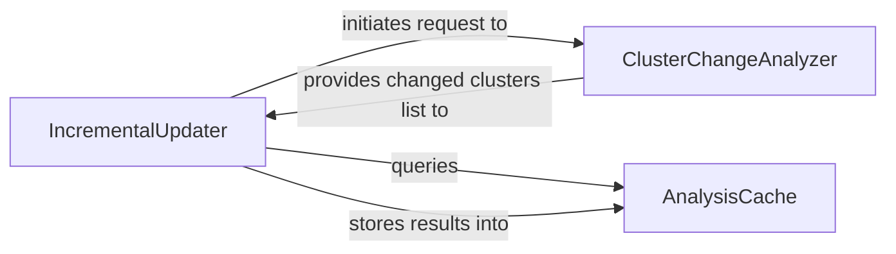

## Details

Optimizes analysis performance by managing the caching of static analysis results and orchestrating re-analysis only for changed parts of the codebase, ensuring efficiency and speed.

### IncrementalUpdater [[Expand]](./IncrementalUpdater.md)
Acts as the central orchestrator for the incremental analysis process, coordinating change detection, cache interactions, and targeted re-analysis of modified code sections.

**Related Classes/Methods**:

- <a href="https://github.com/CodeBoarding/CodeBoarding/blob/main/.codeboardingdiagram_analysis/incremental/updater.py" target="_blank" rel="noopener noreferrer">`repos.codeboarding.incremental.IncrementalUpdater`</a>

### AnalysisCache [[Expand]](./AnalysisCache.md)
Persistently stores and retrieves static analysis results, preventing re-computation on unchanged code and supporting performance optimization.

**Related Classes/Methods**:

- <a href="https://github.com/CodeBoarding/CodeBoarding/blob/main/.codeboardingdiagram_analysis/incremental/updater.py" target="_blank" rel="noopener noreferrer">`repos.codeboarding.incremental.AnalysisCache`</a>

### ClusterChangeAnalyzer [[Expand]](./ClusterChangeAnalyzer.md)
Identifies and analyzes logical code clusters that have been modified, providing precise information on which parts require re-analysis.

**Related Classes/Methods**:

- <a href="https://github.com/CodeBoarding/CodeBoarding/blob/main/.codeboardingdiagram_analysis/incremental/updater.py" target="_blank" rel="noopener noreferrer">`repos.codeboarding.incremental.ClusterChangeAnalyzer`</a>

### [FAQ](https://github.com/CodeBoarding/GeneratedOnBoardings/tree/main?tab=readme-ov-file#faq)