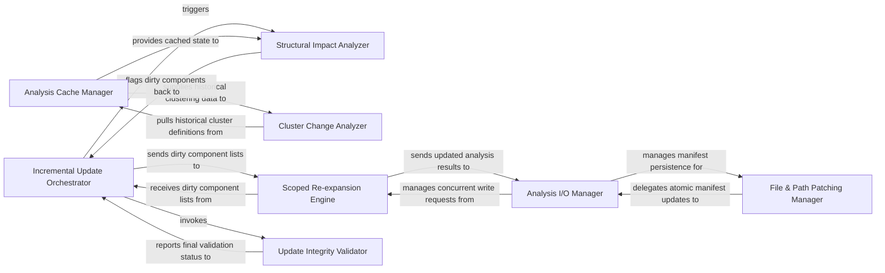

## Details

Optimizes analysis performance by managing the caching of static analysis results and orchestrating re-analysis only for changed parts of the codebase, ensuring efficiency and speed.

### Incremental Update Orchestrator
The central controller that coordinates the sequence of operations from change detection to final validation. It manages the high‑level workflow, ensuring that impact analysis, patching, and re‑analysis occur in the correct order.

**Related Classes/Methods**:

- <a href="https://github.com/CodeBoarding/CodeBoarding/blob/main/.codeboardingdiagram_analysis/incremental/updater.py" target="_blank" rel="noopener noreferrer">`repos.codeboarding.incremental.IncrementalUpdater`</a>
- <a href="https://github.com/CodeBoarding/CodeBoarding/blob/main/.codeboardingdiagram_analysis/incremental/updater.py" target="_blank" rel="noopener noreferrer">`repos.codeboarding.incremental.IncrementalUpdater.run_update`</a>
- <a href="https://github.com/CodeBoarding/CodeBoarding/blob/main/.codeboardingdiagram_analysis/incremental/updater.py" target="_blank" rel="noopener noreferrer">`repos.codeboarding.incremental.IncrementalUpdater._process_changes`</a>

### Analysis Cache Manager
Manages the lifecycle of serialized artifacts (call graphs, hierarchies) and validates their integrity for reuse. It acts as the primary data provider for components that need historical analysis state.

**Related Classes/Methods**:

- <a href="https://github.com/CodeBoarding/CodeBoarding/blob/main/.codeboardingdiagram_analysis/incremental/updater.py" target="_blank" rel="noopener noreferrer">`repos.codeboarding.incremental.AnalysisCache`</a>
- <a href="https://github.com/CodeBoarding/CodeBoarding/blob/main/.codeboardingdiagram_analysis/incremental/updater.py" target="_blank" rel="noopener noreferrer">`repos.codeboarding.incremental.AnalysisCache.load_artifacts`</a>
- <a href="https://github.com/CodeBoarding/CodeBoarding/blob/main/.codeboardingdiagram_analysis/incremental/updater.py" target="_blank" rel="noopener noreferrer">`repos.codeboarding.incremental.AnalysisCache.invalidate_entry`</a>

### Structural Impact Analyzer
Evaluates code changes to identify "dirty" sub‑graphs and determines if changes cross architectural boundaries, necessitating broader re‑analysis.

**Related Classes/Methods**:

- <a href="https://github.com/CodeBoarding/CodeBoarding/blob/main/.codeboardingdiagram_analysis/incremental/updater.py" target="_blank" rel="noopener noreferrer">`repos.codeboarding.incremental.ImpactAnalyzer`</a>
- <a href="https://github.com/CodeBoarding/CodeBoarding/blob/main/.codeboardingdiagram_analysis/incremental/updater.py" target="_blank" rel="noopener noreferrer">`repos.codeboarding.incremental.ImpactAnalyzer.detect_dirty_nodes`</a>
- <a href="https://github.com/CodeBoarding/CodeBoarding/blob/main/.codeboardingdiagram_analysis/incremental/updater.py" target="_blank" rel="noopener noreferrer">`repos.codeboarding.incremental.ImpactAnalyzer.check_boundary_violation`</a>

### Cluster Change Analyzer
Classifies the magnitude of architectural shifts (Small/Medium/Big) by comparing current and historical clustering data to detect significant drift.

**Related Classes/Methods**:

- <a href="https://github.com/CodeBoarding/CodeBoarding/blob/main/.codeboardingdiagram_analysis/incremental/updater.py" target="_blank" rel="noopener noreferrer">`repos.codeboarding.incremental.ClusterChangeAnalyzer`</a>
- <a href="https://github.com/CodeBoarding/CodeBoarding/blob/main/.codeboardingdiagram_analysis/incremental/updater.py" target="_blank" rel="noopener noreferrer">`repos.codeboarding.incremental.ClusterChangeAnalyzer.calculate_similarity`</a>
- <a href="https://github.com/CodeBoarding/CodeBoarding/blob/main/.codeboardingdiagram_analysis/incremental/updater.py" target="_blank" rel="noopener noreferrer">`repos.codeboarding.incremental.ClusterChangeAnalyzer.classify_shift`</a>

### Scoped Re‑expansion Engine
Orchestrates LLM‑based agents to perform deep re‑analysis specifically on sub‑graphs flagged as dirty, ensuring AI interpretation stays in sync with code changes.

**Related Classes/Methods**:

- <a href="https://github.com/CodeBoarding/CodeBoarding/blob/main/.codeboardingdiagram_analysis/incremental/updater.py" target="_blank" rel="noopener noreferrer">`repos.codeboarding.incremental.ReExpansionEngine`</a>
- <a href="https://github.com/CodeBoarding/CodeBoarding/blob/main/.codeboardingdiagram_analysis/incremental/updater.py" target="_blank" rel="noopener noreferrer">`repos.codeboarding.incremental.ReExpansionEngine.reanalyze_component`</a>
- <a href="https://github.com/CodeBoarding/CodeBoarding/blob/main/.codeboardingdiagram_analysis/incremental/updater.py" target="_blank" rel="noopener noreferrer">`repos.codeboarding.incremental.MetaAgentOrchestrator`</a>

### File & Path Patching Manager
Handles in‑place updates to the analysis manifest, such as file renames and component re‑assignments, without requiring a full re‑parse of the repository.

**Related Classes/Methods**:

- <a href="https://github.com/CodeBoarding/CodeBoarding/blob/main/.codeboardingdiagram_analysis/incremental/updater.py" target="_blank" rel="noopener noreferrer">`repos.codeboarding.incremental.ManifestPatcher`</a>
- <a href="https://github.com/CodeBoarding/CodeBoarding/blob/main/.codeboardingdiagram_analysis/incremental/updater.py" target="_blank" rel="noopener noreferrer">`repos.codeboarding.incremental.ManifestPatcher.apply_renames`</a>
- <a href="https://github.com/CodeBoarding/CodeBoarding/blob/main/.codeboardingdiagram_analysis/incremental/updater.py" target="_blank" rel="noopener noreferrer">`repos.codeboarding.incremental.ManifestPatcher.update_assignments`</a>

### Analysis I/O Manager
Provides thread‑safe, locked access to the analysis store (DuckDB and file system) to ensure data consistency during concurrent incremental updates.

**Related Classes/Methods**:

- <a href="https://github.com/CodeBoarding/CodeBoarding/blob/main/.codeboardingdiagram_analysis/incremental/updater.py" target="_blank" rel="noopener noreferrer">`repos.codeboarding.incremental.AnalysisIO`</a>
- <a href="https://github.com/CodeBoarding/CodeBoarding/blob/main/.codeboardingdiagram_analysis/incremental/updater.py" target="_blank" rel="noopener noreferrer">`repos.codeboarding.incremental.AnalysisIO.acquire_lock`</a>
- <a href="https://github.com/CodeBoarding/CodeBoarding/blob/main/.codeboardingdiagram_analysis/incremental/updater.py" target="_blank" rel="noopener noreferrer">`repos.codeboarding.incremental.AnalysisIO.write_atomic`</a>

### Update Integrity Validator
Performs final consistency checks between the updated analysis state and the physical file system to ensure no orphaned nodes or broken references remain.

**Related Classes/Methods**:

- <a href="https://github.com/CodeBoarding/CodeBoarding/blob/main/.codeboardingdiagram_analysis/incremental/updater.py" target="_blank" rel="noopener noreferrer">`repos.codeboarding.incremental.IntegrityValidator`</a>
- <a href="https://github.com/CodeBoarding/CodeBoarding/blob/main/.codeboardingdiagram_analysis/incremental/updater.py" target="_blank" rel="noopener noreferrer">`repos.codeboarding.incremental.IntegrityValidator.verify_filesystem_sync`</a>
- <a href="https://github.com/CodeBoarding/CodeBoarding/blob/main/.codeboardingdiagram_analysis/incremental/updater.py" target="_blank" rel="noopener noreferrer">`repos.codeboarding.incremental.IntegrityValidator.check_graph_consistency`</a>

### [FAQ](https://github.com/CodeBoarding/GeneratedOnBoardings/tree/main?tab=readme-ov-file#faq)