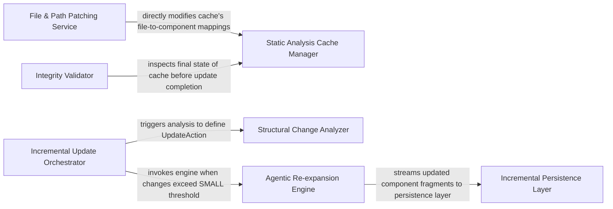

## Details

Optimizes analysis performance by managing the caching of static analysis results and orchestrating re-analysis only for changed parts of the codebase, ensuring efficiency and speed.

### Incremental Update Orchestrator
Central controller (IncrementalUpdater) that manages the update lifecycle, deciding between patching, re‑expansion, or full re‑analysis.

**Related Classes/Methods**:

- `diagram_analysis.incremental.updater.IncrementalUpdater`

### Static Analysis Cache Manager
Manages the AnalysisCache, acting as the source‑of‑truth for call graphs, class hierarchies, and previous diagnostics.

**Related Classes/Methods**:

- `diagram_analysis.incremental.updater.AnalysisCache`

### Structural Change Analyzer
Evaluates differences (ClusterChangeAnalyzer) between iterations to classify changes (SMALL/MEDIUM/BIG) and map file diffs to architectural impacts.

**Related Classes/Methods**:

- `diagram_analysis.incremental.updater.ClusterChangeAnalyzer`

### Agentic Re‑expansion Engine
LLM‑driven component that re‑synthesizes descriptions and relationships for "dirty" components using meta‑agents.

**Related Classes/Methods**:

- `diagram_analysis.incremental.updater.AgenticReexpansionEngine`

### File & Path Patching Service
Handles low‑level state updates such as file renames and deletions that do not require LLM intervention.

**Related Classes/Methods**:

- `diagram_analysis.incremental.updater.FilePathPatchingService`

### Incremental Persistence Layer
Provides thread‑safe I/O (_AnalysisFileStore) for atomic loading and saving of root and sub‑analysis fragments.

**Related Classes/Methods**:

- `diagram_analysis.incremental.updater._AnalysisFileStore`

### Integrity Validator
Performs post‑update consistency checks on the merged call graph and component mappings to prevent state corruption.

**Related Classes/Methods**:

- `diagram_analysis.incremental.updater.IntegrityValidator`

### [FAQ](https://github.com/CodeBoarding/GeneratedOnBoardings/tree/main?tab=readme-ov-file#faq)