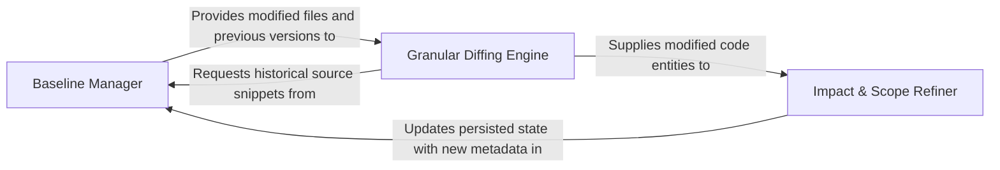

## Details

Compares current repository state against persisted baselines to identify modified files for the analysis engine.

### Baseline Manager
Manages the persistence and retrieval of the repository's known good state, handling serialization and initial filesystem change detection.

**Related Classes/Methods**: _None_

**Source Files:**

- [`diagram_analysis/io_utils.py`](https://github.com/CodeBoarding/CodeBoarding/blob/main/.codeboardingdiagram_analysis/io_utils.py)
  - `diagram_analysis.io_utils._get_store` ([L283-L288](https://github.com/CodeBoarding/CodeBoarding/blob/main/.codeboardingdiagram_analysis/io_utils.py#L283-L288)) - Function
  - `diagram_analysis.io_utils.load_full_analysis` ([L301-L311](https://github.com/CodeBoarding/CodeBoarding/blob/main/.codeboardingdiagram_analysis/io_utils.py#L301-L311)) - Function

### Granular Diffing Engine
Analyzes file-level changes to identify structural modifications and maps raw diffs to logical code entities to track identity.

**Related Classes/Methods**: _None_

**Source Files:**

- [`diagram_analysis/io_utils.py`](https://github.com/CodeBoarding/CodeBoarding/blob/main/.codeboardingdiagram_analysis/io_utils.py)
  - `diagram_analysis.io_utils.load_analysis_metadata` ([L314-L319](https://github.com/CodeBoarding/CodeBoarding/blob/main/.codeboardingdiagram_analysis/io_utils.py#L314-L319)) - Function
  - `diagram_analysis.io_utils.load_sub_analysis` ([L399-L401](https://github.com/CodeBoarding/CodeBoarding/blob/main/.codeboardingdiagram_analysis/io_utils.py#L399-L401)) - Function

### Impact & Scope Refiner
Calculates the blast radius of changes to determine which documentation artifacts are invalidated, pruning the analysis tree for LLM agents.

**Related Classes/Methods**: _None_

**Source Files:**

- [`diagram_analysis/io_utils.py`](https://github.com/CodeBoarding/CodeBoarding/blob/main/.codeboardingdiagram_analysis/io_utils.py)
  - `diagram_analysis.io_utils.load_root_analysis` ([L296-L298](https://github.com/CodeBoarding/CodeBoarding/blob/main/.codeboardingdiagram_analysis/io_utils.py#L296-L298)) - Function
  - `diagram_analysis.io_utils.save_sub_analysis` ([L404-L411](https://github.com/CodeBoarding/CodeBoarding/blob/main/.codeboardingdiagram_analysis/io_utils.py#L404-L411)) - Function

### [FAQ](https://github.com/CodeBoarding/GeneratedOnBoardings/tree/main?tab=readme-ov-file#faq)