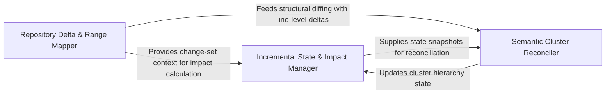

## Details

Core logic engine responsible for calculating deltas between repository states and providing granular line-range analysis.

### Repository Delta & Range Mapper
Responsible for the low-level extraction of changes from the version control system and the subsequent mapping of those raw line-level deltas to semantic code structures.

**Related Classes/Methods**: _None_

**Source Files:**

- [`repo_utils/__init__.py`](https://github.com/CodeBoarding/CodeBoarding/blob/main/.codeboardingrepo_utils/__init__.py)
  - `repo_utils.__init__.require_git_import.decorator.wrapper` ([L39-L57](https://github.com/CodeBoarding/CodeBoarding/blob/main/.codeboardingrepo_utils/__init__.py#L39-L57)) - Function
- [`repo_utils/change_detector.py`](https://github.com/CodeBoarding/CodeBoarding/blob/main/.codeboardingrepo_utils/change_detector.py)
  - `repo_utils.change_detector.FileChange.changed_line_ranges` ([L97-L178](https://github.com/CodeBoarding/CodeBoarding/blob/main/.codeboardingrepo_utils/change_detector.py#L97-L178)) - Method

### Incremental State & Impact Manager
Manages the persistence of analysis states and calculates the impact of detected changes, determining which architectural entities are invalidated and coordinating targeted updates.

**Related Classes/Methods**: _None_

**Source Files:**

- [`repo_utils/change_detector.py`](https://github.com/CodeBoarding/CodeBoarding/blob/main/.codeboardingrepo_utils/change_detector.py)
  - `repo_utils.change_detector.FileChange.changed_line_ranges._flush` ([L123-L150](https://github.com/CodeBoarding/CodeBoarding/blob/main/.codeboardingrepo_utils/change_detector.py#L123-L150)) - Function

### Semantic Cluster Reconciler
Ensures architectural consistency during incremental updates by reconciling cluster definitions and handling renames, moves, and merges to maintain hierarchy integrity.

**Related Classes/Methods**: _None_

**Source Files:**

- [`repo_utils/change_detector.py`](https://github.com/CodeBoarding/CodeBoarding/blob/main/.codeboardingrepo_utils/change_detector.py)
  - `repo_utils.change_detector.ChangedLineRanges` ([L58-L68](https://github.com/CodeBoarding/CodeBoarding/blob/main/.codeboardingrepo_utils/change_detector.py#L58-L68)) - Class

### [FAQ](https://github.com/CodeBoarding/GeneratedOnBoardings/tree/main?tab=readme-ov-file#faq)