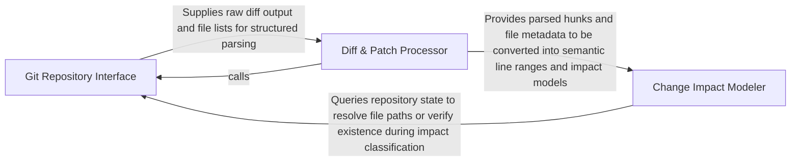

## Details

Interfaces with the host Git repository to identify modified files and specific line ranges, enabling targeted, incremental analysis.

### Git Repository Interface [[Expand]](./Git_Repository_Interface.md)
Acts as the low-level adapter for the Git binary, handling command execution, repository state verification, and the retrieval of raw file lists and diff streams.

**Related Classes/Methods**:

- `repo_utils.git_ops.get_changed_files_since`:115-137
- `repo_utils.git_ops.run_raw_diff`:140-169
- `repo_utils.git_ops.is_git_repository`:79-91

**Source Files:**

- [`repo_utils/__init__.py`](https://github.com/CodeBoarding/CodeBoarding/blob/main/.codeboardingrepo_utils/__init__.py)
  - `repo_utils.__init__.store_token` ([L136-L140](https://github.com/CodeBoarding/CodeBoarding/blob/main/.codeboardingrepo_utils/__init__.py#L136-L140)) - Function
- [`repo_utils/diff_parser.py`](https://github.com/CodeBoarding/CodeBoarding/blob/main/.codeboardingrepo_utils/diff_parser.py)
  - `repo_utils.diff_parser._run_diff_with_fetch_retry` ([L59-L81](https://github.com/CodeBoarding/CodeBoarding/blob/main/.codeboardingrepo_utils/diff_parser.py#L59-L81)) - Function
- [`repo_utils/errors.py`](https://github.com/CodeBoarding/CodeBoarding/blob/main/.codeboardingrepo_utils/errors.py)
  - `repo_utils.errors.NoGithubTokenFoundError` ([L1-L2](https://github.com/CodeBoarding/CodeBoarding/blob/main/.codeboardingrepo_utils/errors.py#L1-L2)) - Class
- [`repo_utils/git_ops.py`](https://github.com/CodeBoarding/CodeBoarding/blob/main/.codeboardingrepo_utils/git_ops.py)
  - `repo_utils.git_ops._git_argv` ([L36-L44](https://github.com/CodeBoarding/CodeBoarding/blob/main/.codeboardingrepo_utils/git_ops.py#L36-L44)) - Function
  - `repo_utils.git_ops.require_current_commit` ([L67-L76](https://github.com/CodeBoarding/CodeBoarding/blob/main/.codeboardingrepo_utils/git_ops.py#L67-L76)) - Function
  - `repo_utils.git_ops.is_git_repository` ([L79-L91](https://github.com/CodeBoarding/CodeBoarding/blob/main/.codeboardingrepo_utils/git_ops.py#L79-L91)) - Function
  - `repo_utils.git_ops.has_uncommitted_changes` ([L94-L112](https://github.com/CodeBoarding/CodeBoarding/blob/main/.codeboardingrepo_utils/git_ops.py#L94-L112)) - Function
  - `repo_utils.git_ops.get_changed_files_since` ([L115-L137](https://github.com/CodeBoarding/CodeBoarding/blob/main/.codeboardingrepo_utils/git_ops.py#L115-L137)) - Function
  - `repo_utils.git_ops.run_raw_diff` ([L140-L169](https://github.com/CodeBoarding/CodeBoarding/blob/main/.codeboardingrepo_utils/git_ops.py#L140-L169)) - Function
  - `repo_utils.git_ops.fetch_all` ([L172-L180](https://github.com/CodeBoarding/CodeBoarding/blob/main/.codeboardingrepo_utils/git_ops.py#L172-L180)) - Function
  - `repo_utils.git_ops.list_untracked_files` ([L183-L193](https://github.com/CodeBoarding/CodeBoarding/blob/main/.codeboardingrepo_utils/git_ops.py#L183-L193)) - Function
  - `repo_utils.git_ops.read_file_at_ref` ([L196-L214](https://github.com/CodeBoarding/CodeBoarding/blob/main/.codeboardingrepo_utils/git_ops.py#L196-L214)) - Function
  - `repo_utils.git_ops.resolve_ref` ([L217-L229](https://github.com/CodeBoarding/CodeBoarding/blob/main/.codeboardingrepo_utils/git_ops.py#L217-L229)) - Function
  - `repo_utils.git_ops.git_object_type` ([L232-L249](https://github.com/CodeBoarding/CodeBoarding/blob/main/.codeboardingrepo_utils/git_ops.py#L232-L249)) - Function
  - `repo_utils.git_ops.worktree_has_changes` ([L252-L267](https://github.com/CodeBoarding/CodeBoarding/blob/main/.codeboardingrepo_utils/git_ops.py#L252-L267)) - Function
  - `repo_utils.git_ops.approve_https_credentials` ([L270-L276](https://github.com/CodeBoarding/CodeBoarding/blob/main/.codeboardingrepo_utils/git_ops.py#L270-L276)) - Function
  - `repo_utils.git_ops._list_uncommitted_changed_files` ([L279-L302](https://github.com/CodeBoarding/CodeBoarding/blob/main/.codeboardingrepo_utils/git_ops.py#L279-L302)) - Function
  - `repo_utils.git_ops._parse_name_status_paths` ([L305-L319](https://github.com/CodeBoarding/CodeBoarding/blob/main/.codeboardingrepo_utils/git_ops.py#L305-L319)) - Function

### Diff & Patch Processor [[Expand]](./Diff_Patch_Processor.md)
Orchestrates the transformation of raw text diffs into structured objects by parsing unified diff formats and extracting granular hunks of code changes.

**Related Classes/Methods**:

- `repo_utils.diff_parser.detect_changes`:32-56
- `repo_utils.diff_parser._parse_patch_text`:159-184
- `repo_utils.change_detector.DiffHunk`:46-53

**Source Files:**

- [`repo_utils/change_detector.py`](https://github.com/CodeBoarding/CodeBoarding/blob/main/.codeboardingrepo_utils/change_detector.py)
  - `repo_utils.change_detector.ChangeDetectionError` ([L21-L22](https://github.com/CodeBoarding/CodeBoarding/blob/main/.codeboardingrepo_utils/change_detector.py#L21-L22)) - Class
  - `repo_utils.change_detector.ChangeType` ([L25-L42](https://github.com/CodeBoarding/CodeBoarding/blob/main/.codeboardingrepo_utils/change_detector.py#L25-L42)) - Class
  - `repo_utils.change_detector.DiffHunk` ([L46-L53](https://github.com/CodeBoarding/CodeBoarding/blob/main/.codeboardingrepo_utils/change_detector.py#L46-L53)) - Class
  - `repo_utils.change_detector.FileChange` ([L71-L220](https://github.com/CodeBoarding/CodeBoarding/blob/main/.codeboardingrepo_utils/change_detector.py#L71-L220)) - Class
  - `repo_utils.change_detector.ChangeSet` ([L224-L292](https://github.com/CodeBoarding/CodeBoarding/blob/main/.codeboardingrepo_utils/change_detector.py#L224-L292)) - Class
  - `repo_utils.change_detector.ChangeSet.is_empty` ([L243-L244](https://github.com/CodeBoarding/CodeBoarding/blob/main/.codeboardingrepo_utils/change_detector.py#L243-L244)) - Method
  - `repo_utils.change_detector.ChangeSet.to_dict` ([L279-L292](https://github.com/CodeBoarding/CodeBoarding/blob/main/.codeboardingrepo_utils/change_detector.py#L279-L292)) - Method
- [`repo_utils/diff_parser.py`](https://github.com/CodeBoarding/CodeBoarding/blob/main/.codeboardingrepo_utils/diff_parser.py)
  - `repo_utils.diff_parser.detect_changes` ([L32-L56](https://github.com/CodeBoarding/CodeBoarding/blob/main/.codeboardingrepo_utils/diff_parser.py#L32-L56)) - Function
  - `repo_utils.diff_parser._is_source_path` ([L87-L89](https://github.com/CodeBoarding/CodeBoarding/blob/main/.codeboardingrepo_utils/diff_parser.py#L87-L89)) - Function
  - `repo_utils.diff_parser._file_is_relevant` ([L92-L98](https://github.com/CodeBoarding/CodeBoarding/blob/main/.codeboardingrepo_utils/diff_parser.py#L92-L98)) - Function
  - `repo_utils.diff_parser._parse_hunk_side` ([L101-L108](https://github.com/CodeBoarding/CodeBoarding/blob/main/.codeboardingrepo_utils/diff_parser.py#L101-L108)) - Function
  - `repo_utils.diff_parser._parse_raw_line` ([L111-L143](https://github.com/CodeBoarding/CodeBoarding/blob/main/.codeboardingrepo_utils/diff_parser.py#L111-L143)) - Function
  - `repo_utils.diff_parser._strip_git_quotes` ([L146-L156](https://github.com/CodeBoarding/CodeBoarding/blob/main/.codeboardingrepo_utils/diff_parser.py#L146-L156)) - Function
  - `repo_utils.diff_parser._parse_patch_text` ([L159-L184](https://github.com/CodeBoarding/CodeBoarding/blob/main/.codeboardingrepo_utils/diff_parser.py#L159-L184)) - Function
  - `repo_utils.diff_parser._finalize_file_diff` ([L187-L190](https://github.com/CodeBoarding/CodeBoarding/blob/main/.codeboardingrepo_utils/diff_parser.py#L187-L190)) - Function
  - `repo_utils.diff_parser._split_patch_bodies` ([L196-L224](https://github.com/CodeBoarding/CodeBoarding/blob/main/.codeboardingrepo_utils/diff_parser.py#L196-L224)) - Function
  - `repo_utils.diff_parser._split_patch_bodies._flush` ([L209-L211](https://github.com/CodeBoarding/CodeBoarding/blob/main/.codeboardingrepo_utils/diff_parser.py#L209-L211)) - Function
  - `repo_utils.diff_parser._parse_diff_output` ([L227-L266](https://github.com/CodeBoarding/CodeBoarding/blob/main/.codeboardingrepo_utils/diff_parser.py#L227-L266)) - Function
  - `repo_utils.diff_parser._append_untracked_files` ([L269-L290](https://github.com/CodeBoarding/CodeBoarding/blob/main/.codeboardingrepo_utils/diff_parser.py#L269-L290)) - Function

### Change Impact Modeler [[Expand]](./Change_Impact_Modeler.md)
Provides the semantic domain model for changes by mapping line-level diffs to specific code ranges and classifying the status of methods or classes.

**Related Classes/Methods**:

- `repo_utils.change_detector.FileChange`:71-220
- `repo_utils.change_detector.ChangedLineRanges`:57-67
- `repo_utils.change_detector.FileChange.classify_method_statuses`:179-220

**Source Files:**

- [`repo_utils/change_detector.py`](https://github.com/CodeBoarding/CodeBoarding/blob/main/.codeboardingrepo_utils/change_detector.py)
  - `repo_utils.change_detector.ChangedLineRanges` ([L57-L67](https://github.com/CodeBoarding/CodeBoarding/blob/main/.codeboardingrepo_utils/change_detector.py#L57-L67)) - Class
  - `repo_utils.change_detector.FileChange.changed_line_ranges` ([L96-L177](https://github.com/CodeBoarding/CodeBoarding/blob/main/.codeboardingrepo_utils/change_detector.py#L96-L177)) - Method
  - `repo_utils.change_detector.FileChange.changed_line_ranges._flush` ([L122-L149](https://github.com/CodeBoarding/CodeBoarding/blob/main/.codeboardingrepo_utils/change_detector.py#L122-L149)) - Function
  - `repo_utils.change_detector.FileChange.classify_method_statuses` ([L179-L220](https://github.com/CodeBoarding/CodeBoarding/blob/main/.codeboardingrepo_utils/change_detector.py#L179-L220)) - Method
  - `repo_utils.change_detector._overlaps` ([L298-L302](https://github.com/CodeBoarding/CodeBoarding/blob/main/.codeboardingrepo_utils/change_detector.py#L298-L302)) - Function
  - `repo_utils.change_detector._fully_inside` ([L305-L315](https://github.com/CodeBoarding/CodeBoarding/blob/main/.codeboardingrepo_utils/change_detector.py#L305-L315)) - Function

### [FAQ](https://github.com/CodeBoarding/GeneratedOnBoardings/tree/main?tab=readme-ov-file#faq)