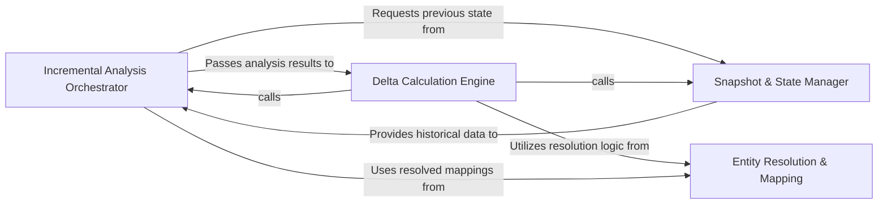

## Details

Implements the Incremental Analysis pattern by comparing current repository snapshots against previous runs to identify components requiring re-analysis.

### Incremental Analysis Orchestrator
Acts as the central controller for the incremental workflow, determining execution paths and triggering delta calculations.

**Related Classes/Methods**:

- `diagram_analysis.diagram_generator.DiagramGenerator.generate_analysis_incremental`:547-688

**Source Files:**

- [`agents/incremental_agent.py`](https://github.com/CodeBoarding/CodeBoarding/blob/main/.codeboardingagents/incremental_agent.py)
  - `agents.incremental_agent.IncrementalAgent` ([L50-L241](https://github.com/CodeBoarding/CodeBoarding/blob/main/.codeboardingagents/incremental_agent.py#L50-L241)) - Class
  - `agents.incremental_agent._scrub_one_analysis` ([L726-L742](https://github.com/CodeBoarding/CodeBoarding/blob/main/.codeboardingagents/incremental_agent.py#L726-L742)) - Function
- [`diagram_analysis/cluster_delta.py`](https://github.com/CodeBoarding/CodeBoarding/blob/main/.codeboardingdiagram_analysis/cluster_delta.py)
  - `diagram_analysis.cluster_delta.ClusterDelta.has_changes` ([L50-L51](https://github.com/CodeBoarding/CodeBoarding/blob/main/.codeboardingdiagram_analysis/cluster_delta.py#L50-L51)) - Method
- [`diagram_analysis/diagram_generator.py`](https://github.com/CodeBoarding/CodeBoarding/blob/main/.codeboardingdiagram_analysis/diagram_generator.py)
  - `diagram_analysis.diagram_generator.DiagramGenerator._build_file_coverage_summary` ([L535-L544](https://github.com/CodeBoarding/CodeBoarding/blob/main/.codeboardingdiagram_analysis/diagram_generator.py#L535-L544)) - Method

### Delta Calculation Engine
Compares current static analysis results against historical snapshots to identify structural mutations.

**Related Classes/Methods**:

- `diagram_analysis.cluster_delta.ClusterDelta`:46-66

**Source Files:**

- [`diagram_analysis/cluster_delta.py`](https://github.com/CodeBoarding/CodeBoarding/blob/main/.codeboardingdiagram_analysis/cluster_delta.py)
  - `diagram_analysis.cluster_delta.LanguageDelta.affected_cluster_ids` ([L41-L42](https://github.com/CodeBoarding/CodeBoarding/blob/main/.codeboardingdiagram_analysis/cluster_delta.py#L41-L42)) - Method
  - `diagram_analysis.cluster_delta.ClusterDelta.all_affected_cluster_ids` ([L53-L54](https://github.com/CodeBoarding/CodeBoarding/blob/main/.codeboardingdiagram_analysis/cluster_delta.py#L53-L54)) - Method
- [`diagram_analysis/diagram_generator.py`](https://github.com/CodeBoarding/CodeBoarding/blob/main/.codeboardingdiagram_analysis/diagram_generator.py)
  - `diagram_analysis.diagram_generator.DiagramGenerator.generate_analysis_incremental` ([L547-L688](https://github.com/CodeBoarding/CodeBoarding/blob/main/.codeboardingdiagram_analysis/diagram_generator.py#L547-L688)) - Method
- [`diagram_analysis/exceptions.py`](https://github.com/CodeBoarding/CodeBoarding/blob/main/.codeboardingdiagram_analysis/exceptions.py)
  - `diagram_analysis.exceptions.IncrementalCacheMissingError` ([L8-L43](https://github.com/CodeBoarding/CodeBoarding/blob/main/.codeboardingdiagram_analysis/exceptions.py#L8-L43)) - Class

### Snapshot & State Manager
Manages the persistence and retrieval of codebase snapshots for historical comparison.

**Related Classes/Methods**:

- `diagram_analysis.cluster_snapshot.ClusterSnapshot`:30-37

**Source Files:**

- [`agents/incremental_agent.py`](https://github.com/CodeBoarding/CodeBoarding/blob/main/.codeboardingagents/incremental_agent.py)
  - `agents.incremental_agent.remove_deleted_files` ([L713-L723](https://github.com/CodeBoarding/CodeBoarding/blob/main/.codeboardingagents/incremental_agent.py#L713-L723)) - Function
- [`diagram_analysis/cluster_delta.py`](https://github.com/CodeBoarding/CodeBoarding/blob/main/.codeboardingdiagram_analysis/cluster_delta.py)
  - `diagram_analysis.cluster_delta.ClusterDelta.cluster_results` ([L59-L60](https://github.com/CodeBoarding/CodeBoarding/blob/main/.codeboardingdiagram_analysis/cluster_delta.py#L59-L60)) - Method

### Entity Resolution & Mapping
Ensures entities are correctly identified across versions despite cosmetic changes like line shifts or renames.

**Related Classes/Methods**: _None_

**Source Files:**

- [`diagram_analysis/cluster_snapshot.py`](https://github.com/CodeBoarding/CodeBoarding/blob/main/.codeboardingdiagram_analysis/cluster_snapshot.py)
  - `diagram_analysis.cluster_snapshot.ClusterSnapshot.all_cluster_ids` ([L36-L37](https://github.com/CodeBoarding/CodeBoarding/blob/main/.codeboardingdiagram_analysis/cluster_snapshot.py#L36-L37)) - Method
- [`diagram_analysis/diagram_generator.py`](https://github.com/CodeBoarding/CodeBoarding/blob/main/.codeboardingdiagram_analysis/diagram_generator.py)
  - `diagram_analysis.diagram_generator._collect_components_by_id` ([L691-L706](https://github.com/CodeBoarding/CodeBoarding/blob/main/.codeboardingdiagram_analysis/diagram_generator.py#L691-L706)) - Function
  - `diagram_analysis.diagram_generator._merge_sub_analyses` ([L709-L744](https://github.com/CodeBoarding/CodeBoarding/blob/main/.codeboardingdiagram_analysis/diagram_generator.py#L709-L744)) - Function

### [FAQ](https://github.com/CodeBoarding/GeneratedOnBoardings/tree/main?tab=readme-ov-file#faq)