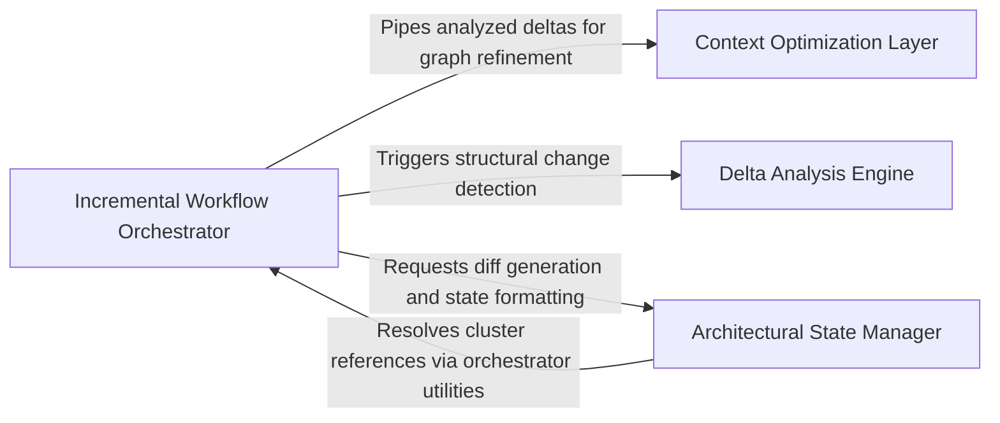

## Details

A specialized logic layer that optimizes analysis by calculating structural deltas between runs, pruning unchanged components to minimize LLM costs.

### Delta Analysis Engine [[Expand]](./Delta_Analysis_Engine.md)
Analyzes AST-level changes to determine if the architectural signature of a component has shifted, moving beyond simple text-based diffs.

**Related Classes/Methods**: _None_

**Source Files:**

- [`agents/agent_responses.py`](https://github.com/CodeBoarding/CodeBoarding/blob/main/.codeboardingagents/agent_responses.py)
  - `agents.agent_responses.iter_components` ([L662-L670](https://github.com/CodeBoarding/CodeBoarding/blob/main/.codeboardingagents/agent_responses.py#L662-L670)) - Function
  - `agents.agent_responses.index_components_by_id` ([L673-L682](https://github.com/CodeBoarding/CodeBoarding/blob/main/.codeboardingagents/agent_responses.py#L673-L682)) - Function
- [`agents/incremental_agent.py`](https://github.com/CodeBoarding/CodeBoarding/blob/main/.codeboardingagents/incremental_agent.py)
  - `agents.incremental_agent._collect_descendant_ids` ([L684-L701](https://github.com/CodeBoarding/CodeBoarding/blob/main/.codeboardingagents/incremental_agent.py#L684-L701)) - Function

### Incremental Workflow Orchestrator [[Expand]](./Incremental_Workflow_Orchestrator.md)
Manages the lifecycle of an incremental analysis run, coordinating between static analysis and the delta engine to determine which agents require re-invocation.

**Related Classes/Methods**:

- `agents.incremental_agent.prune_empty_components`:642-681

**Source Files:**

- [`agents/incremental_agent.py`](https://github.com/CodeBoarding/CodeBoarding/blob/main/.codeboardingagents/incremental_agent.py)
  - `agents.incremental_agent.prune_empty_components` ([L642-L681](https://github.com/CodeBoarding/CodeBoarding/blob/main/.codeboardingagents/incremental_agent.py#L642-L681)) - Function
  - `agents.incremental_agent.prune_empty_components.has_methods` ([L651-L656](https://github.com/CodeBoarding/CodeBoarding/blob/main/.codeboardingagents/incremental_agent.py#L651-L656)) - Function
  - `agents.incremental_agent.prune_empty_components.collect_empty` ([L658-L661](https://github.com/CodeBoarding/CodeBoarding/blob/main/.codeboardingagents/incremental_agent.py#L658-L661)) - Function
  - `agents.incremental_agent._strip_relations` ([L704-L709](https://github.com/CodeBoarding/CodeBoarding/blob/main/.codeboardingagents/incremental_agent.py#L704-L709)) - Function
- [`agents/incremental_planning_agent.py`](https://github.com/CodeBoarding/CodeBoarding/blob/main/.codeboardingagents/incremental_planning_agent.py)
  - `agents.incremental_planning_agent._format_language_diff` ([L197-L216](https://github.com/CodeBoarding/CodeBoarding/blob/main/.codeboardingagents/incremental_planning_agent.py#L197-L216)) - Function
  - `agents.incremental_planning_agent._format_cluster_ref` ([L300-L301](https://github.com/CodeBoarding/CodeBoarding/blob/main/.codeboardingagents/incremental_planning_agent.py#L300-L301)) - Function

### Architectural State Manager [[Expand]](./Architectural_State_Manager.md)
Handles the persistence and retrieval of previous analysis snapshots, serving as the system's memory for comparison operations.

**Related Classes/Methods**: _None_

**Source Files:**

- [`agents/incremental_planning_agent.py`](https://github.com/CodeBoarding/CodeBoarding/blob/main/.codeboardingagents/incremental_planning_agent.py)
  - `agents.incremental_planning_agent._format_member_delta` ([L219-L227](https://github.com/CodeBoarding/CodeBoarding/blob/main/.codeboardingagents/incremental_planning_agent.py#L219-L227)) - Function
  - `agents.incremental_planning_agent._format_new_cluster` ([L230-L236](https://github.com/CodeBoarding/CodeBoarding/blob/main/.codeboardingagents/incremental_planning_agent.py#L230-L236)) - Function
  - `agents.incremental_planning_agent._format_reshape` ([L239-L257](https://github.com/CodeBoarding/CodeBoarding/blob/main/.codeboardingagents/incremental_planning_agent.py#L239-L257)) - Function
  - `agents.incremental_planning_agent._sort_cluster_refs` ([L304-L305](https://github.com/CodeBoarding/CodeBoarding/blob/main/.codeboardingagents/incremental_planning_agent.py#L304-L305)) - Function

### Context Optimization Layer [[Expand]](./Context_Optimization_Layer.md)
Post-processes the graph after deltas are identified to ensure the LLM context window is clean and maintains graph integrity.

**Related Classes/Methods**: _None_

**Source Files:**

- [`diagram_analysis/cluster_delta.py`](https://github.com/CodeBoarding/CodeBoarding/blob/main/.codeboardingdiagram_analysis/cluster_delta.py)
  - `diagram_analysis.cluster_delta.ClusterRef` ([L58-L61](https://github.com/CodeBoarding/CodeBoarding/blob/main/.codeboardingdiagram_analysis/cluster_delta.py#L58-L61)) - Class
  - `diagram_analysis.cluster_delta.ClusterMemberDelta` ([L65-L71](https://github.com/CodeBoarding/CodeBoarding/blob/main/.codeboardingdiagram_analysis/cluster_delta.py#L65-L71)) - Class
  - `diagram_analysis.cluster_delta.ClusterReshape` ([L75-L79](https://github.com/CodeBoarding/CodeBoarding/blob/main/.codeboardingdiagram_analysis/cluster_delta.py#L75-L79)) - Class
  - `diagram_analysis.cluster_delta.LanguageStructuralDiff` ([L83-L94](https://github.com/CodeBoarding/CodeBoarding/blob/main/.codeboardingdiagram_analysis/cluster_delta.py#L83-L94)) - Class
  - `diagram_analysis.cluster_delta._structural_diff_for_language` ([L172-L272](https://github.com/CodeBoarding/CodeBoarding/blob/main/.codeboardingdiagram_analysis/cluster_delta.py#L172-L272)) - Function
  - `diagram_analysis.cluster_delta._build_new_cluster_delta` ([L275-L292](https://github.com/CodeBoarding/CodeBoarding/blob/main/.codeboardingdiagram_analysis/cluster_delta.py#L275-L292)) - Function
  - `diagram_analysis.cluster_delta._build_member_delta` ([L295-L313](https://github.com/CodeBoarding/CodeBoarding/blob/main/.codeboardingdiagram_analysis/cluster_delta.py#L295-L313)) - Function
  - `diagram_analysis.cluster_delta._build_reshape` ([L316-L345](https://github.com/CodeBoarding/CodeBoarding/blob/main/.codeboardingdiagram_analysis/cluster_delta.py#L316-L345)) - Function
  - `diagram_analysis.cluster_delta._dirty_files` ([L348-L363](https://github.com/CodeBoarding/CodeBoarding/blob/main/.codeboardingdiagram_analysis/cluster_delta.py#L348-L363)) - Function

### [FAQ](https://github.com/CodeBoarding/GeneratedOnBoardings/tree/main?tab=readme-ov-file#faq)