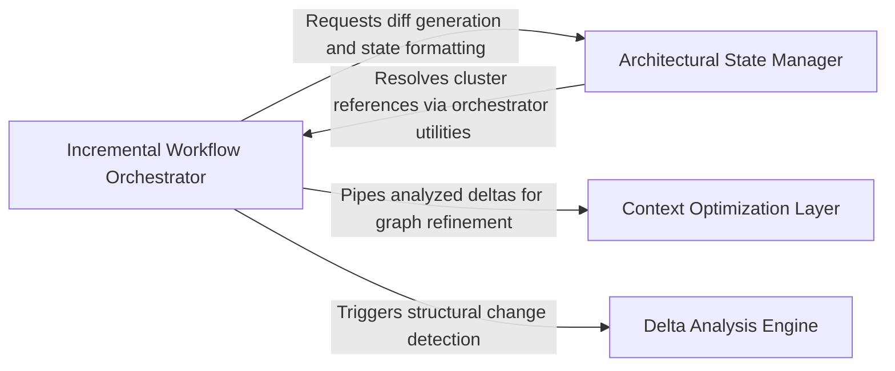

```mermaid
graph LR
    Delta_Analysis_Engine["Delta Analysis Engine"]
    Incremental_Workflow_Orchestrator["Incremental Workflow Orchestrator"]
    Architectural_State_Manager["Architectural State Manager"]
    Context_Optimization_Layer["Context Optimization Layer"]
    Incremental_Workflow_Orchestrator -- "Requests diff generation and state formatting" --> Architectural_State_Manager
    Incremental_Workflow_Orchestrator -- "Pipes analyzed deltas for graph refinement" --> Context_Optimization_Layer
    Incremental_Workflow_Orchestrator -- "Triggers structural change detection" --> Delta_Analysis_Engine
    Architectural_State_Manager -- "Resolves cluster references via orchestrator utilities" --> Incremental_Workflow_Orchestrator
    click Delta_Analysis_Engine href "https://github.com/CodeBoarding/CodeBoarding/blob/main/.codeboarding/Delta_Analysis_Engine.md" "Details"
    click Incremental_Workflow_Orchestrator href "https://github.com/CodeBoarding/CodeBoarding/blob/main/.codeboarding/Incremental_Workflow_Orchestrator.md" "Details"
    click Context_Optimization_Layer href "https://github.com/CodeBoarding/CodeBoarding/blob/main/.codeboarding/Context_Optimization_Layer.md" "Details"
```

## Details

A specialized logic layer that optimizes analysis by calculating structural deltas between runs, pruning unchanged components to minimize LLM costs.

### Delta Analysis Engine [[Expand]](./Delta_Analysis_Engine.md)
Analyzes AST-level changes to determine if the architectural signature of a component has shifted, moving beyond simple text-based diffs.

**Related Classes/Methods**: _None_

**Source Files:**

- [`agents/agent_responses.py`](https://github.com/CodeBoarding/CodeBoarding/blob/main/.codeboardingagents/agent_responses.py)
  - `agents.agent_responses.iter_components` ([L677-L685](https://github.com/CodeBoarding/CodeBoarding/blob/main/.codeboardingagents/agent_responses.py#L677-L685)) - Function
  - `agents.agent_responses.index_components_by_id` ([L688-L697](https://github.com/CodeBoarding/CodeBoarding/blob/main/.codeboardingagents/agent_responses.py#L688-L697)) - Function
- [`agents/incremental_agent.py`](https://github.com/CodeBoarding/CodeBoarding/blob/main/.codeboardingagents/incremental_agent.py)
  - `agents.incremental_agent._collect_descendant_ids` ([L855-L872](https://github.com/CodeBoarding/CodeBoarding/blob/main/.codeboardingagents/incremental_agent.py#L855-L872)) - Function

### Incremental Workflow Orchestrator [[Expand]](./Incremental_Workflow_Orchestrator.md)
Manages the lifecycle of an incremental analysis run, coordinating between static analysis and the delta engine to determine which agents require re-invocation.

**Related Classes/Methods**:

- `agents.incremental_agent.prune_empty_components`:642-681

**Source Files:**

- [`agents/incremental_agent.py`](https://github.com/CodeBoarding/CodeBoarding/blob/main/.codeboardingagents/incremental_agent.py)
  - `agents.incremental_agent.prune_empty_components` ([L813-L852](https://github.com/CodeBoarding/CodeBoarding/blob/main/.codeboardingagents/incremental_agent.py#L813-L852)) - Function
  - `agents.incremental_agent.prune_empty_components.has_methods` ([L822-L827](https://github.com/CodeBoarding/CodeBoarding/blob/main/.codeboardingagents/incremental_agent.py#L822-L827)) - Function
  - `agents.incremental_agent.prune_empty_components.collect_empty` ([L829-L832](https://github.com/CodeBoarding/CodeBoarding/blob/main/.codeboardingagents/incremental_agent.py#L829-L832)) - Function
  - `agents.incremental_agent._strip_relations` ([L875-L880](https://github.com/CodeBoarding/CodeBoarding/blob/main/.codeboardingagents/incremental_agent.py#L875-L880)) - Function

### Architectural State Manager
Handles the persistence and retrieval of previous analysis snapshots, serving as the system's memory for comparison operations.

**Related Classes/Methods**: _None_

### Context Optimization Layer [[Expand]](./Context_Optimization_Layer.md)
Post-processes the graph after deltas are identified to ensure the LLM context window is clean and maintains graph integrity.

**Related Classes/Methods**: _None_

**Source Files:**

- [`diagram_analysis/cluster_delta.py`](https://github.com/CodeBoarding/CodeBoarding/blob/main/.codeboardingdiagram_analysis/cluster_delta.py)
  - `diagram_analysis.cluster_delta.ClusterRef` ([L67-L70](https://github.com/CodeBoarding/CodeBoarding/blob/main/.codeboardingdiagram_analysis/cluster_delta.py#L67-L70)) - Class
  - `diagram_analysis.cluster_delta.ClusterMemberDelta` ([L74-L85](https://github.com/CodeBoarding/CodeBoarding/blob/main/.codeboardingdiagram_analysis/cluster_delta.py#L74-L85)) - Class
  - `diagram_analysis.cluster_delta.ClusterReshape` ([L89-L94](https://github.com/CodeBoarding/CodeBoarding/blob/main/.codeboardingdiagram_analysis/cluster_delta.py#L89-L94)) - Class
  - `diagram_analysis.cluster_delta.LanguageStructuralDiff` ([L98-L109](https://github.com/CodeBoarding/CodeBoarding/blob/main/.codeboardingdiagram_analysis/cluster_delta.py#L98-L109)) - Class
  - `diagram_analysis.cluster_delta._structural_diff_for_language` ([L345-L454](https://github.com/CodeBoarding/CodeBoarding/blob/main/.codeboardingdiagram_analysis/cluster_delta.py#L345-L454)) - Function
  - `diagram_analysis.cluster_delta._dirty_files` ([L348-L363](https://github.com/CodeBoarding/CodeBoarding/blob/main/.codeboardingdiagram_analysis/cluster_delta.py#L348-L363)) - Function
  - `diagram_analysis.cluster_delta._build_new_cluster_delta` ([L487-L505](https://github.com/CodeBoarding/CodeBoarding/blob/main/.codeboardingdiagram_analysis/cluster_delta.py#L487-L505)) - Function
  - `diagram_analysis.cluster_delta._build_member_delta` ([L508-L536](https://github.com/CodeBoarding/CodeBoarding/blob/main/.codeboardingdiagram_analysis/cluster_delta.py#L508-L536)) - Function
  - `diagram_analysis.cluster_delta._build_reshape` ([L539-L578](https://github.com/CodeBoarding/CodeBoarding/blob/main/.codeboardingdiagram_analysis/cluster_delta.py#L539-L578)) - Function

### [FAQ](https://github.com/CodeBoarding/GeneratedOnBoardings/tree/main?tab=readme-ov-file#faq)