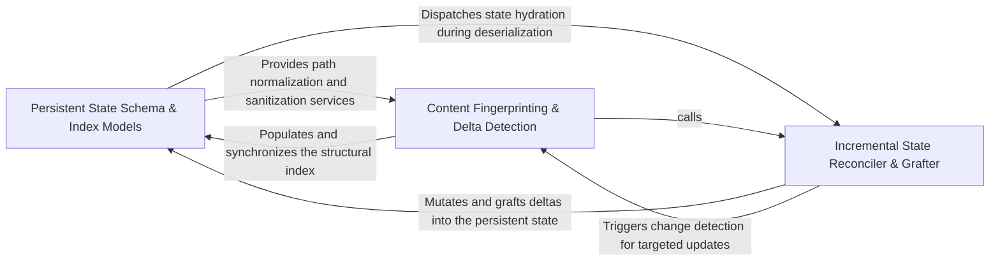

## Details

Manages the physical mapping of code symbols to architectural models through granular hashing and indexing to detect architectural deltas.

### Persistent State Schema & Index Models
Defines the structural models and serialization formats for the analysis state, managing the indexing of file entries and architectural metadata.

**Related Classes/Methods**:

- `agents.file_index_models.FileEntry`:55-114
- `diagram_analysis.analysis_json.UnifiedAnalysisJson`:156-170
- `agents.relation_edges.index_relation_endpoints`:33-52
- `diagram_analysis.analysis_json.AnalysisMetadata`:95-113

**Source Files:**

- [`agents/file_index_models.py`](https://github.com/CodeBoarding/CodeBoarding/blob/main/.codeboardingagents/file_index_models.py)
  - `agents.file_index_models.FileEntry` ([L55-L114](https://github.com/CodeBoarding/CodeBoarding/blob/main/.codeboardingagents/file_index_models.py#L55-L114)) - Class
  - `agents.file_index_models.FileEntry.merge_from` ([L75-L103](https://github.com/CodeBoarding/CodeBoarding/blob/main/.codeboardingagents/file_index_models.py#L75-L103)) - Method
  - `agents.file_index_models.FileEntry.merge_method_spans` ([L105-L114](https://github.com/CodeBoarding/CodeBoarding/blob/main/.codeboardingagents/file_index_models.py#L105-L114)) - Method
- [`agents/relation_edges.py`](https://github.com/CodeBoarding/CodeBoarding/blob/main/.codeboardingagents/relation_edges.py)
  - `agents.relation_edges.merge_relations_by_pair` ([L26-L30](https://github.com/CodeBoarding/CodeBoarding/blob/main/.codeboardingagents/relation_edges.py#L26-L30)) - Function
  - `agents.relation_edges.index_relation_endpoints` ([L33-L52](https://github.com/CodeBoarding/CodeBoarding/blob/main/.codeboardingagents/relation_edges.py#L33-L52)) - Function
- [`codeboarding_workflows/rendering.py`](https://github.com/CodeBoarding/CodeBoarding/blob/main/.codeboardingcodeboarding_workflows/rendering.py)
  - `codeboarding_workflows.rendering._load_entries` ([L75-L101](https://github.com/CodeBoarding/CodeBoarding/blob/main/.codeboardingcodeboarding_workflows/rendering.py#L75-L101)) - Function
- [`diagram_analysis/analysis_json.py`](https://github.com/CodeBoarding/CodeBoarding/blob/main/.codeboardingdiagram_analysis/analysis_json.py)
  - `diagram_analysis.analysis_json.RelationEdgeJson` ([L23-L27](https://github.com/CodeBoarding/CodeBoarding/blob/main/.codeboardingdiagram_analysis/analysis_json.py#L23-L27)) - Class
  - `diagram_analysis.analysis_json.RelationJson` ([L30-L43](https://github.com/CodeBoarding/CodeBoarding/blob/main/.codeboardingdiagram_analysis/analysis_json.py#L30-L43)) - Class
  - `diagram_analysis.analysis_json.FileCoverageSummary` ([L78-L84](https://github.com/CodeBoarding/CodeBoarding/blob/main/.codeboardingdiagram_analysis/analysis_json.py#L78-L84)) - Class
  - `diagram_analysis.analysis_json.AnalysisMetadata` ([L95-L113](https://github.com/CodeBoarding/CodeBoarding/blob/main/.codeboardingdiagram_analysis/analysis_json.py#L95-L113)) - Class
  - `diagram_analysis.analysis_json.MethodIndexEntry` ([L116-L125](https://github.com/CodeBoarding/CodeBoarding/blob/main/.codeboardingdiagram_analysis/analysis_json.py#L116-L125)) - Class
  - `diagram_analysis.analysis_json.ComponentFileMethodGroupJson` ([L128-L133](https://github.com/CodeBoarding/CodeBoarding/blob/main/.codeboardingdiagram_analysis/analysis_json.py#L128-L133)) - Class
  - `diagram_analysis.analysis_json.FileEntryJson` ([L136-L153](https://github.com/CodeBoarding/CodeBoarding/blob/main/.codeboardingdiagram_analysis/analysis_json.py#L136-L153)) - Class
  - `diagram_analysis.analysis_json.UnifiedAnalysisJson` ([L156-L170](https://github.com/CodeBoarding/CodeBoarding/blob/main/.codeboardingdiagram_analysis/analysis_json.py#L156-L170)) - Class
  - `diagram_analysis.analysis_json._build_files_index_from_analysis` ([L173-L186](https://github.com/CodeBoarding/CodeBoarding/blob/main/.codeboardingdiagram_analysis/analysis_json.py#L173-L186)) - Function
  - `diagram_analysis.analysis_json._method_key` ([L189-L191](https://github.com/CodeBoarding/CodeBoarding/blob/main/.codeboardingdiagram_analysis/analysis_json.py#L189-L191)) - Function
  - `diagram_analysis.analysis_json._source_reference_method_key` ([L194-L196](https://github.com/CodeBoarding/CodeBoarding/blob/main/.codeboardingdiagram_analysis/analysis_json.py#L194-L196)) - Function
  - `diagram_analysis.analysis_json._relation_edge_to_json` ([L216-L222](https://github.com/CodeBoarding/CodeBoarding/blob/main/.codeboardingdiagram_analysis/analysis_json.py#L216-L222)) - Function
  - `diagram_analysis.analysis_json._to_component_file_method_refs` ([L225-L237](https://github.com/CodeBoarding/CodeBoarding/blob/main/.codeboardingdiagram_analysis/analysis_json.py#L225-L237)) - Function
  - `diagram_analysis.analysis_json._build_methods_index_from_files` ([L252-L264](https://github.com/CodeBoarding/CodeBoarding/blob/main/.codeboardingdiagram_analysis/analysis_json.py#L252-L264)) - Function
  - `diagram_analysis.analysis_json._build_file_entry_json_from_files` ([L267-L276](https://github.com/CodeBoarding/CodeBoarding/blob/main/.codeboardingdiagram_analysis/analysis_json.py#L267-L276)) - Function
  - `diagram_analysis.analysis_json._relation_to_json` ([L314-L326](https://github.com/CodeBoarding/CodeBoarding/blob/main/.codeboardingdiagram_analysis/analysis_json.py#L314-L326)) - Function
  - `diagram_analysis.analysis_json.from_component_to_json_component` ([L329-L383](https://github.com/CodeBoarding/CodeBoarding/blob/main/.codeboardingdiagram_analysis/analysis_json.py#L329-L383)) - Function
  - `diagram_analysis.analysis_json.from_analysis_to_json` ([L386-L412](https://github.com/CodeBoarding/CodeBoarding/blob/main/.codeboardingdiagram_analysis/analysis_json.py#L386-L412)) - Function
  - `diagram_analysis.analysis_json._compute_depth_level` ([L415-L456](https://github.com/CodeBoarding/CodeBoarding/blob/main/.codeboardingdiagram_analysis/analysis_json.py#L415-L456)) - Function
  - `diagram_analysis.analysis_json._compute_depth_level.get_depth` ([L426-L436](https://github.com/CodeBoarding/CodeBoarding/blob/main/.codeboardingdiagram_analysis/analysis_json.py#L426-L436)) - Function
  - `diagram_analysis.analysis_json.build_unified_analysis_json` ([L459-L510](https://github.com/CodeBoarding/CodeBoarding/blob/main/.codeboardingdiagram_analysis/analysis_json.py#L459-L510)) - Function
  - `diagram_analysis.analysis_json.parse_unified_analysis` ([L513-L539](https://github.com/CodeBoarding/CodeBoarding/blob/main/.codeboardingdiagram_analysis/analysis_json.py#L513-L539)) - Function
  - `diagram_analysis.analysis_json._reconstruct_files_index` ([L542-L570](https://github.com/CodeBoarding/CodeBoarding/blob/main/.codeboardingdiagram_analysis/analysis_json.py#L542-L570)) - Function
  - `diagram_analysis.analysis_json.build_id_to_name_map` ([L573-L579](https://github.com/CodeBoarding/CodeBoarding/blob/main/.codeboardingdiagram_analysis/analysis_json.py#L573-L579)) - Function
- [`diagram_analysis/diagram_generator.py`](https://github.com/CodeBoarding/CodeBoarding/blob/main/.codeboardingdiagram_analysis/diagram_generator.py)
  - `diagram_analysis.diagram_generator.DiagramGenerator._refresh_files_index` ([L1506-L1524](https://github.com/CodeBoarding/CodeBoarding/blob/main/.codeboardingdiagram_analysis/diagram_generator.py#L1506-L1524)) - Method

### Content Fingerprinting & Delta Detection
Executes low-level hashing logic to identify changes at the method and file level, computing deltas to determine which codebase parts require recursive updates.

**Related Classes/Methods**:

- `agents.content_hash.hash_method_body`:52-61
- `diagram_analysis.cluster_delta.compute_changed_members`:142-219
- `agents.content_hash.MethodSpan`:33-37
- `diagram_analysis.file_index._cfg_method_spans`:85-98

**Source Files:**

- [`agents/cluster_methods_mixin.py`](https://github.com/CodeBoarding/CodeBoarding/blob/main/.codeboardingagents/cluster_methods_mixin.py)
  - `agents.cluster_methods_mixin.ClusterMethodsMixin._build_file_methods_from_nodes` ([L441-L495](https://github.com/CodeBoarding/CodeBoarding/blob/main/.codeboardingagents/cluster_methods_mixin.py#L441-L495)) - Method
  - `agents.cluster_methods_mixin.ClusterMethodsMixin._build_file_methods_from_nodes._is_more_specific` ([L455-L465](https://github.com/CodeBoarding/CodeBoarding/blob/main/.codeboardingagents/cluster_methods_mixin.py#L455-L465)) - Function
- [`agents/content_hash.py`](https://github.com/CodeBoarding/CodeBoarding/blob/main/.codeboardingagents/content_hash.py)
  - `agents.content_hash.MethodRef` ([L25-L30](https://github.com/CodeBoarding/CodeBoarding/blob/main/.codeboardingagents/content_hash.py#L25-L30)) - Class
  - `agents.content_hash.MethodSpan` ([L33-L37](https://github.com/CodeBoarding/CodeBoarding/blob/main/.codeboardingagents/content_hash.py#L33-L37)) - Class
  - `agents.content_hash.read_source_lines` ([L40-L49](https://github.com/CodeBoarding/CodeBoarding/blob/main/.codeboardingagents/content_hash.py#L40-L49)) - Function
  - `agents.content_hash.hash_method_body` ([L52-L61](https://github.com/CodeBoarding/CodeBoarding/blob/main/.codeboardingagents/content_hash.py#L52-L61)) - Function
  - `agents.content_hash.hash_whole_file` ([L64-L68](https://github.com/CodeBoarding/CodeBoarding/blob/main/.codeboardingagents/content_hash.py#L64-L68)) - Function
  - `agents.content_hash.hash_file_residual` ([L71-L90](https://github.com/CodeBoarding/CodeBoarding/blob/main/.codeboardingagents/content_hash.py#L71-L90)) - Function
- [`diagram_analysis/analysis_json.py`](https://github.com/CodeBoarding/CodeBoarding/blob/main/.codeboardingdiagram_analysis/analysis_json.py)
  - `diagram_analysis.analysis_json._relativize_key_entities` ([L199-L213](https://github.com/CodeBoarding/CodeBoarding/blob/main/.codeboardingdiagram_analysis/analysis_json.py#L199-L213)) - Function
- [`diagram_analysis/cluster_delta.py`](https://github.com/CodeBoarding/CodeBoarding/blob/main/.codeboardingdiagram_analysis/cluster_delta.py)
  - `diagram_analysis.cluster_delta.ChangedMembers` ([L122-L139](https://github.com/CodeBoarding/CodeBoarding/blob/main/.codeboardingdiagram_analysis/cluster_delta.py#L122-L139)) - Class
  - `diagram_analysis.cluster_delta.compute_changed_members` ([L142-L219](https://github.com/CodeBoarding/CodeBoarding/blob/main/.codeboardingdiagram_analysis/cluster_delta.py#L142-L219)) - Function
  - `diagram_analysis.cluster_delta._live_member_hashes` ([L222-L252](https://github.com/CodeBoarding/CodeBoarding/blob/main/.codeboardingdiagram_analysis/cluster_delta.py#L222-L252)) - Function
  - `diagram_analysis.cluster_delta._delta_for_language._fresh_file` ([L605-L610](https://github.com/CodeBoarding/CodeBoarding/blob/main/.codeboardingdiagram_analysis/cluster_delta.py#L605-L610)) - Function
  - `diagram_analysis.cluster_delta._delta_for_language._old_file` ([L612-L617](https://github.com/CodeBoarding/CodeBoarding/blob/main/.codeboardingdiagram_analysis/cluster_delta.py#L612-L617)) - Function
- [`diagram_analysis/diagram_generator.py`](https://github.com/CodeBoarding/CodeBoarding/blob/main/.codeboardingdiagram_analysis/diagram_generator.py)
  - `diagram_analysis.diagram_generator._child_scope_needs_recursive_update` ([L1596-L1622](https://github.com/CodeBoarding/CodeBoarding/blob/main/.codeboardingdiagram_analysis/diagram_generator.py#L1596-L1622)) - Function
- [`diagram_analysis/file_index.py`](https://github.com/CodeBoarding/CodeBoarding/blob/main/.codeboardingdiagram_analysis/file_index.py)
  - `diagram_analysis.file_index.build_files_index` ([L21-L65](https://github.com/CodeBoarding/CodeBoarding/blob/main/.codeboardingdiagram_analysis/file_index.py#L21-L65)) - Function
  - `diagram_analysis.file_index.refresh_method_spans_from_cfg` ([L68-L82](https://github.com/CodeBoarding/CodeBoarding/blob/main/.codeboardingdiagram_analysis/file_index.py#L68-L82)) - Function
  - `diagram_analysis.file_index._cfg_method_spans` ([L85-L98](https://github.com/CodeBoarding/CodeBoarding/blob/main/.codeboardingdiagram_analysis/file_index.py#L85-L98)) - Function
- [`repo_utils/path_utils.py`](https://github.com/CodeBoarding/CodeBoarding/blob/main/.codeboardingrepo_utils/path_utils.py)
  - `repo_utils.path_utils.normalize_repo_path` ([L5-L20](https://github.com/CodeBoarding/CodeBoarding/blob/main/.codeboardingrepo_utils/path_utils.py#L5-L20)) - Function
  - `repo_utils.path_utils.to_relative_path` ([L23-L32](https://github.com/CodeBoarding/CodeBoarding/blob/main/.codeboardingrepo_utils/path_utils.py#L23-L32)) - Function
  - `repo_utils.path_utils.to_absolute_path` ([L35-L41](https://github.com/CodeBoarding/CodeBoarding/blob/main/.codeboardingrepo_utils/path_utils.py#L35-L41)) - Function

### Incremental State Reconciler & Grafter
Orchestrates the merging of new analysis data into the existing state, handling the grafting of new methods and reconciliation of child scopes.

**Related Classes/Methods**:

- `agents.incremental_agent._patch_file_methods`:635-682
- `diagram_analysis.diagram_generator._reconcile_child_scope`:113-147
- `agents.file_index_models.FileMethodGroup`:45-52
- `diagram_analysis.diagram_generator._graft_entered_methods`:150-171

**Source Files:**

- [`agents/file_index_models.py`](https://github.com/CodeBoarding/CodeBoarding/blob/main/.codeboardingagents/file_index_models.py)
  - `agents.file_index_models.MethodEntry` ([L14-L42](https://github.com/CodeBoarding/CodeBoarding/blob/main/.codeboardingagents/file_index_models.py#L14-L42)) - Class
  - `agents.file_index_models.MethodEntry.__hash__` ([L26-L27](https://github.com/CodeBoarding/CodeBoarding/blob/main/.codeboardingagents/file_index_models.py#L26-L27)) - Method
  - `agents.file_index_models.MethodEntry.__eq__` ([L29-L32](https://github.com/CodeBoarding/CodeBoarding/blob/main/.codeboardingagents/file_index_models.py#L29-L32)) - Method
  - `agents.file_index_models.MethodEntry.from_node` ([L35-L42](https://github.com/CodeBoarding/CodeBoarding/blob/main/.codeboardingagents/file_index_models.py#L35-L42)) - Method
  - `agents.file_index_models.FileMethodGroup` ([L45-L52](https://github.com/CodeBoarding/CodeBoarding/blob/main/.codeboardingagents/file_index_models.py#L45-L52)) - Class
- [`agents/incremental_agent.py`](https://github.com/CodeBoarding/CodeBoarding/blob/main/.codeboardingagents/incremental_agent.py)
  - `agents.incremental_agent._patch_file_methods` ([L635-L682](https://github.com/CodeBoarding/CodeBoarding/blob/main/.codeboardingagents/incremental_agent.py#L635-L682)) - Function
  - `agents.incremental_agent._without_methods` ([L685-L700](https://github.com/CodeBoarding/CodeBoarding/blob/main/.codeboardingagents/incremental_agent.py#L685-L700)) - Function
  - `agents.incremental_agent._merge_file_method_groups` ([L703-L724](https://github.com/CodeBoarding/CodeBoarding/blob/main/.codeboardingagents/incremental_agent.py#L703-L724)) - Function
  - `agents.incremental_agent._method_physical_key` ([L727-L729](https://github.com/CodeBoarding/CodeBoarding/blob/main/.codeboardingagents/incremental_agent.py#L727-L729)) - Function
- [`diagram_analysis/analysis_json.py`](https://github.com/CodeBoarding/CodeBoarding/blob/main/.codeboardingdiagram_analysis/analysis_json.py)
  - `diagram_analysis.analysis_json._method_refs_to_placeholders` ([L240-L249](https://github.com/CodeBoarding/CodeBoarding/blob/main/.codeboardingdiagram_analysis/analysis_json.py#L240-L249)) - Function
  - `diagram_analysis.analysis_json._hydrate_component_methods_from_refs` ([L279-L311](https://github.com/CodeBoarding/CodeBoarding/blob/main/.codeboardingdiagram_analysis/analysis_json.py#L279-L311)) - Function
- [`diagram_analysis/diagram_generator.py`](https://github.com/CodeBoarding/CodeBoarding/blob/main/.codeboardingdiagram_analysis/diagram_generator.py)
  - `diagram_analysis.diagram_generator._reconcile_child_scope` ([L113-L147](https://github.com/CodeBoarding/CodeBoarding/blob/main/.codeboardingdiagram_analysis/diagram_generator.py#L113-L147)) - Function
  - `diagram_analysis.diagram_generator._graft_entered_methods` ([L150-L171](https://github.com/CodeBoarding/CodeBoarding/blob/main/.codeboardingdiagram_analysis/diagram_generator.py#L150-L171)) - Function
  - `diagram_analysis.diagram_generator._append_method` ([L174-L180](https://github.com/CodeBoarding/CodeBoarding/blob/main/.codeboardingdiagram_analysis/diagram_generator.py#L174-L180)) - Function

### [FAQ](https://github.com/CodeBoarding/GeneratedOnBoardings/tree/main?tab=readme-ov-file#faq)