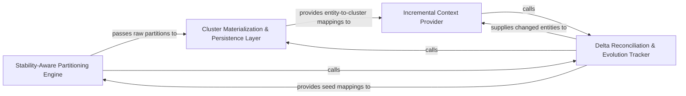

## Details

Manages the persistence, reconciliation, and temporal evolution of partitions across analysis runs to maintain architectural stability using seeded clustering and delta tracking.

### Stability-Aware Partitioning Engine
Manages the core algorithmic logic for generating new architectural partitions while respecting previous states using seeded Leiden community detection.

**Related Classes/Methods**:

- `static_analyzer.leiden_utils.find_partition_seeded`:66-103
- `static_analyzer.graph.ClusterResult`:49-67

**Source Files:**

- [`diagram_analysis/cluster_delta.py`](https://github.com/CodeBoarding/CodeBoarding/blob/main/.codeboardingdiagram_analysis/cluster_delta.py)
  - `diagram_analysis.cluster_delta.LanguageDelta` ([L32-L42](https://github.com/CodeBoarding/CodeBoarding/blob/main/.codeboardingdiagram_analysis/cluster_delta.py#L32-L42)) - Class
  - `diagram_analysis.cluster_delta._delta_for_language` ([L103-L186](https://github.com/CodeBoarding/CodeBoarding/blob/main/.codeboardingdiagram_analysis/cluster_delta.py#L103-L186)) - Function
  - `diagram_analysis.cluster_delta._absorb_orphans_by_file` ([L336-L377](https://github.com/CodeBoarding/CodeBoarding/blob/main/.codeboardingdiagram_analysis/cluster_delta.py#L336-L377)) - Function
  - `diagram_analysis.cluster_delta._materialize_cluster_result` ([L430-L455](https://github.com/CodeBoarding/CodeBoarding/blob/main/.codeboardingdiagram_analysis/cluster_delta.py#L430-L455)) - Function
- [`static_analyzer/graph.py`](https://github.com/CodeBoarding/CodeBoarding/blob/main/.codeboardingstatic_analyzer/graph.py)
  - `static_analyzer.graph.Edge.__init__` ([L71-L73](https://github.com/CodeBoarding/CodeBoarding/blob/main/.codeboardingstatic_analyzer/graph.py#L71-L73)) - Method

### Delta Reconciliation & Evolution Tracker
Calculates structural differences between previous states and the current filesystem, reconciling seeded partitions to handle changes.

**Related Classes/Methods**:

- `diagram_analysis.cluster_delta._reconcile_seeded_partition`:380-427

**Source Files:**

- [`diagram_analysis/cluster_delta.py`](https://github.com/CodeBoarding/CodeBoarding/blob/main/.codeboardingdiagram_analysis/cluster_delta.py)
  - `diagram_analysis.cluster_delta._flavor_b_seeded` ([L192-L292](https://github.com/CodeBoarding/CodeBoarding/blob/main/.codeboardingdiagram_analysis/cluster_delta.py#L192-L292)) - Function
  - `diagram_analysis.cluster_delta._affected_frontier` ([L295-L333](https://github.com/CodeBoarding/CodeBoarding/blob/main/.codeboardingdiagram_analysis/cluster_delta.py#L295-L333)) - Function
- [`static_analyzer/graph.py`](https://github.com/CodeBoarding/CodeBoarding/blob/main/.codeboardingstatic_analyzer/graph.py)
  - `static_analyzer.graph.ClusterResult` ([L49-L67](https://github.com/CodeBoarding/CodeBoarding/blob/main/.codeboardingstatic_analyzer/graph.py#L49-L67)) - Class
  - `static_analyzer.graph.Edge.__repr__` ([L81-L82](https://github.com/CodeBoarding/CodeBoarding/blob/main/.codeboardingstatic_analyzer/graph.py#L81-L82)) - Method
  - `static_analyzer.graph.CallGraph.__init__` ([L86-L108](https://github.com/CodeBoarding/CodeBoarding/blob/main/.codeboardingstatic_analyzer/graph.py#L86-L108)) - Method

### Cluster Materialization & Persistence Layer
Transforms abstract graph-based partitions into serializable data structures and maps internal QNames to stable cluster IDs.

**Related Classes/Methods**: _None_

**Source Files:**

- [`diagram_analysis/cluster_delta.py`](https://github.com/CodeBoarding/CodeBoarding/blob/main/.codeboardingdiagram_analysis/cluster_delta.py)
  - `diagram_analysis.cluster_delta._delta_for_language._fresh_file` ([L126-L131](https://github.com/CodeBoarding/CodeBoarding/blob/main/.codeboardingdiagram_analysis/cluster_delta.py#L126-L131)) - Function
  - `diagram_analysis.cluster_delta._reconcile_seeded_partition` ([L380-L427](https://github.com/CodeBoarding/CodeBoarding/blob/main/.codeboardingdiagram_analysis/cluster_delta.py#L380-L427)) - Function
- [`static_analyzer/graph.py`](https://github.com/CodeBoarding/CodeBoarding/blob/main/.codeboardingstatic_analyzer/graph.py)
  - `static_analyzer.graph.CallGraph.__str__` ([L725-L730](https://github.com/CodeBoarding/CodeBoarding/blob/main/.codeboardingstatic_analyzer/graph.py#L725-L730)) - Method
- [`static_analyzer/leiden_utils.py`](https://github.com/CodeBoarding/CodeBoarding/blob/main/.codeboardingstatic_analyzer/leiden_utils.py)
  - `static_analyzer.leiden_utils.nx_to_ig` ([L15-L23](https://github.com/CodeBoarding/CodeBoarding/blob/main/.codeboardingstatic_analyzer/leiden_utils.py#L15-L23)) - Function

### Incremental Context Provider
Filters the codebase to provide LLM agents with context only for changed regions, ensuring efficient re-summarization.

**Related Classes/Methods**: _None_

**Source Files:**

- [`static_analyzer/graph.py`](https://github.com/CodeBoarding/CodeBoarding/blob/main/.codeboardingstatic_analyzer/graph.py)
  - `static_analyzer.graph.ClusterResult.get_nodes_for_cluster` ([L66-L67](https://github.com/CodeBoarding/CodeBoarding/blob/main/.codeboardingstatic_analyzer/graph.py#L66-L67)) - Method
  - `static_analyzer.graph.CallGraph._build_result` ([L561-L592](https://github.com/CodeBoarding/CodeBoarding/blob/main/.codeboardingstatic_analyzer/graph.py#L561-L592)) - Method
- [`static_analyzer/leiden_utils.py`](https://github.com/CodeBoarding/CodeBoarding/blob/main/.codeboardingstatic_analyzer/leiden_utils.py)
  - `static_analyzer.leiden_utils.find_partition_seeded` ([L66-L103](https://github.com/CodeBoarding/CodeBoarding/blob/main/.codeboardingstatic_analyzer/leiden_utils.py#L66-L103)) - Function

### [FAQ](https://github.com/CodeBoarding/GeneratedOnBoardings/tree/main?tab=readme-ov-file#faq)