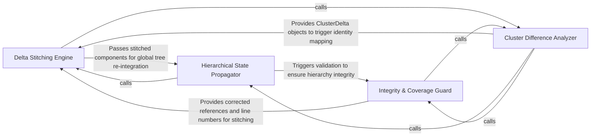

## Details

Handles the Delta Stitching logic that allows the agent's mental model of the code to evolve over time by mapping new fragments to existing component IDs.

### Delta Stitching Engine
Handles the primary logic of merging new analysis results into the existing state using identity mapping to maintain component continuity.

**Related Classes/Methods**:

- `agents.incremental_agent.stitch_delta`:381-487

**Source Files:**

- [`agents/incremental_agent.py`](https://github.com/CodeBoarding/CodeBoarding/blob/main/.codeboardingagents/incremental_agent.py)
  - `agents.incremental_agent._classify_verdict` ([L302-L305](https://github.com/CodeBoarding/CodeBoarding/blob/main/.codeboardingagents/incremental_agent.py#L302-L305)) - Function
  - `agents.incremental_agent._ancestor_ids` ([L344-L351](https://github.com/CodeBoarding/CodeBoarding/blob/main/.codeboardingagents/incremental_agent.py#L344-L351)) - Function
  - `agents.incremental_agent._attach_new_components` ([L490-L516](https://github.com/CodeBoarding/CodeBoarding/blob/main/.codeboardingagents/incremental_agent.py#L490-L516)) - Function

### Hierarchical State Propagator
Manages recursive updates to the component tree, ensuring parent clusters and ancestors reflect changes in leaf nodes.

**Related Classes/Methods**:

- `agents.incremental_agent._propagate_clusters_to_ancestors`:354-378

**Source Files:**

- [`agents/incremental_agent.py`](https://github.com/CodeBoarding/CodeBoarding/blob/main/.codeboardingagents/incremental_agent.py)
  - `agents.incremental_agent._log_stitch_summary` ([L321-L333](https://github.com/CodeBoarding/CodeBoarding/blob/main/.codeboardingagents/incremental_agent.py#L321-L333)) - Function
  - `agents.incremental_agent._propagate_clusters_to_ancestors` ([L354-L378](https://github.com/CodeBoarding/CodeBoarding/blob/main/.codeboardingagents/incremental_agent.py#L354-L378)) - Function
  - `agents.incremental_agent._parent_id_for_scope` ([L539-L550](https://github.com/CodeBoarding/CodeBoarding/blob/main/.codeboardingagents/incremental_agent.py#L539-L550)) - Function

### Cluster Difference Analyzer
Calculates the mathematical delta between the current state and new static analysis output to identify modifications.

**Related Classes/Methods**:

- `diagram_analysis.cluster_delta.ClusterDelta`:46-66

**Source Files:**

- [`agents/agent_responses.py`](https://github.com/CodeBoarding/CodeBoarding/blob/main/.codeboardingagents/agent_responses.py)
  - `agents.agent_responses.SourceCodeReference` ([L123-L162](https://github.com/CodeBoarding/CodeBoarding/blob/main/.codeboardingagents/agent_responses.py#L123-L162)) - Class
  - `agents.agent_responses.Relation` ([L165-L177](https://github.com/CodeBoarding/CodeBoarding/blob/main/.codeboardingagents/agent_responses.py#L165-L177)) - Class
  - `agents.agent_responses.Component` ([L292-L339](https://github.com/CodeBoarding/CodeBoarding/blob/main/.codeboardingagents/agent_responses.py#L292-L339)) - Class
  - `agents.agent_responses.AnalysisInsights` ([L342-L367](https://github.com/CodeBoarding/CodeBoarding/blob/main/.codeboardingagents/agent_responses.py#L342-L367)) - Class
- [`agents/incremental_agent.py`](https://github.com/CodeBoarding/CodeBoarding/blob/main/.codeboardingagents/incremental_agent.py)
  - `agents.incremental_agent.stitch_delta` ([L381-L487](https://github.com/CodeBoarding/CodeBoarding/blob/main/.codeboardingagents/incremental_agent.py#L381-L487)) - Function
  - `agents.incremental_agent._scope_for_parent` ([L519-L536](https://github.com/CodeBoarding/CodeBoarding/blob/main/.codeboardingagents/incremental_agent.py#L519-L536)) - Function
- [`diagram_analysis/analysis_json.py`](https://github.com/CodeBoarding/CodeBoarding/blob/main/.codeboardingdiagram_analysis/analysis_json.py)
  - `diagram_analysis.analysis_json._method_refs_to_placeholders` ([L168-L177](https://github.com/CodeBoarding/CodeBoarding/blob/main/.codeboardingdiagram_analysis/analysis_json.py#L168-L177)) - Function
  - `diagram_analysis.analysis_json._extract_analysis_recursive` ([L468-L541](https://github.com/CodeBoarding/CodeBoarding/blob/main/.codeboardingdiagram_analysis/analysis_json.py#L468-L541)) - Function

### Integrity & Coverage Guard
Validates state consistency, ensures full coverage, and corrects line-number drifts to prevent model de-syncing.

**Related Classes/Methods**: _None_

**Source Files:**

- [`diagram_analysis/cluster_delta.py`](https://github.com/CodeBoarding/CodeBoarding/blob/main/.codeboardingdiagram_analysis/cluster_delta.py)
  - `diagram_analysis.cluster_delta.ClusterDelta.all_dropped_cluster_ids` ([L56-L57](https://github.com/CodeBoarding/CodeBoarding/blob/main/.codeboardingdiagram_analysis/cluster_delta.py#L56-L57)) - Method
  - `diagram_analysis.cluster_delta.ClusterDelta.merged_cluster_id_remap` ([L62-L66](https://github.com/CodeBoarding/CodeBoarding/blob/main/.codeboardingdiagram_analysis/cluster_delta.py#L62-L66)) - Method
- [`static_analyzer/cluster_relations.py`](https://github.com/CodeBoarding/CodeBoarding/blob/main/.codeboardingstatic_analyzer/cluster_relations.py)
  - `static_analyzer.cluster_relations.merge_relations` ([L86-L175](https://github.com/CodeBoarding/CodeBoarding/blob/main/.codeboardingstatic_analyzer/cluster_relations.py#L86-L175)) - Function

### [FAQ](https://github.com/CodeBoarding/GeneratedOnBoardings/tree/main?tab=readme-ov-file#faq)