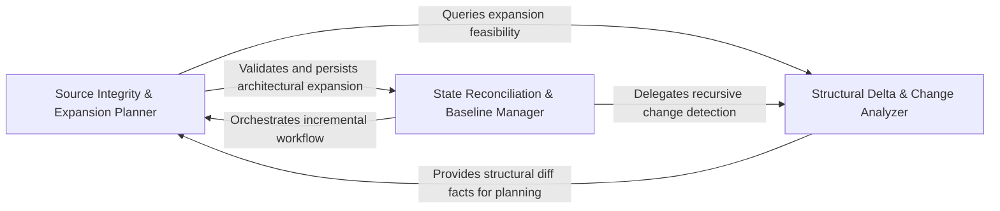

## Details

Manages the persistence and evolution of the analysis state, computing source tree hashes to detect changes and determining component expandability for the LLM planner.

### Source Integrity & Expansion Planner
Responsible for calculating the cryptographic state of the repository and determining the strategic frontier for the LLM by evaluating component expandability.

**Related Classes/Methods**:

- `agents.content_hash.compute_source_tree_hash`:133-135
- `agents.planner_agent.get_expandable_components`:146-181
- `diagram_analysis.analysis_json.FileCoverageReport`:87-92
- `diagram_analysis.diagram_generator.DiagramGenerator`:529-1589

**Source Files:**

- [`agents/content_hash.py`](https://github.com/CodeBoarding/CodeBoarding/blob/main/.codeboardingagents/content_hash.py)
  - `agents.content_hash.tree_hash_from_file_hashes` ([L93-L103](https://github.com/CodeBoarding/CodeBoarding/blob/main/.codeboardingagents/content_hash.py#L93-L103)) - Function
  - `agents.content_hash.hash_repo_source_files` ([L106-L130](https://github.com/CodeBoarding/CodeBoarding/blob/main/.codeboardingagents/content_hash.py#L106-L130)) - Function
  - `agents.content_hash.compute_source_tree_hash` ([L133-L135](https://github.com/CodeBoarding/CodeBoarding/blob/main/.codeboardingagents/content_hash.py#L133-L135)) - Function
- [`agents/planner_agent.py`](https://github.com/CodeBoarding/CodeBoarding/blob/main/.codeboardingagents/planner_agent.py)
  - `agents.planner_agent.leaf_load` ([L46-L49](https://github.com/CodeBoarding/CodeBoarding/blob/main/.codeboardingagents/planner_agent.py#L46-L49)) - Function
  - `agents.planner_agent.component_is_separable` ([L52-L82](https://github.com/CodeBoarding/CodeBoarding/blob/main/.codeboardingagents/planner_agent.py#L52-L82)) - Function
  - `agents.planner_agent.get_expandable_components` ([L146-L181](https://github.com/CodeBoarding/CodeBoarding/blob/main/.codeboardingagents/planner_agent.py#L146-L181)) - Function
- [`diagram_analysis/analysis_json.py`](https://github.com/CodeBoarding/CodeBoarding/blob/main/.codeboardingdiagram_analysis/analysis_json.py)
  - `diagram_analysis.analysis_json.NotAnalyzedFile` ([L73-L75](https://github.com/CodeBoarding/CodeBoarding/blob/main/.codeboardingdiagram_analysis/analysis_json.py#L73-L75)) - Class
  - `diagram_analysis.analysis_json.FileCoverageReport` ([L87-L92](https://github.com/CodeBoarding/CodeBoarding/blob/main/.codeboardingdiagram_analysis/analysis_json.py#L87-L92)) - Class
- [`diagram_analysis/diagram_generator.py`](https://github.com/CodeBoarding/CodeBoarding/blob/main/.codeboardingdiagram_analysis/diagram_generator.py)
  - `diagram_analysis.diagram_generator.DiagramGenerator` ([L529-L1589](https://github.com/CodeBoarding/CodeBoarding/blob/main/.codeboardingdiagram_analysis/diagram_generator.py#L529-L1589)) - Class
  - `diagram_analysis.diagram_generator.DiagramGenerator.__init__` ([L530-L603](https://github.com/CodeBoarding/CodeBoarding/blob/main/.codeboardingdiagram_analysis/diagram_generator.py#L530-L603)) - Method
  - `diagram_analysis.diagram_generator.DiagramGenerator.process_component` ([L606-L609](https://github.com/CodeBoarding/CodeBoarding/blob/main/.codeboardingdiagram_analysis/diagram_generator.py#L606-L609)) - Method
  - `diagram_analysis.diagram_generator.DiagramGenerator._component_separable` ([L611-L649](https://github.com/CodeBoarding/CodeBoarding/blob/main/.codeboardingdiagram_analysis/diagram_generator.py#L611-L649)) - Method
  - `diagram_analysis.diagram_generator.DiagramGenerator._expandable_ids_for_tree` ([L651-L698](https://github.com/CodeBoarding/CodeBoarding/blob/main/.codeboardingdiagram_analysis/diagram_generator.py#L651-L698)) - Method
  - `diagram_analysis.diagram_generator.DiagramGenerator._expandable_ids_for_tree.expandable_ids` ([L675-L690](https://github.com/CodeBoarding/CodeBoarding/blob/main/.codeboardingdiagram_analysis/diagram_generator.py#L675-L690)) - Function
  - `diagram_analysis.diagram_generator.DiagramGenerator._process_component` ([L700-L725](https://github.com/CodeBoarding/CodeBoarding/blob/main/.codeboardingdiagram_analysis/diagram_generator.py#L700-L725)) - Method
  - `diagram_analysis.diagram_generator.DiagramGenerator._strip_ignored` ([L747-L767](https://github.com/CodeBoarding/CodeBoarding/blob/main/.codeboardingdiagram_analysis/diagram_generator.py#L747-L767)) - Method
  - `diagram_analysis.diagram_generator.DiagramGenerator._write_file_coverage` ([L780-L796](https://github.com/CodeBoarding/CodeBoarding/blob/main/.codeboardingdiagram_analysis/diagram_generator.py#L780-L796)) - Method
  - `diagram_analysis.diagram_generator.DiagramGenerator._get_static_with_injected_analyzer` ([L813-L829](https://github.com/CodeBoarding/CodeBoarding/blob/main/.codeboardingdiagram_analysis/diagram_generator.py#L813-L829)) - Method
  - `diagram_analysis.diagram_generator.DiagramGenerator._get_static_with_new_analyzer` ([L831-L845](https://github.com/CodeBoarding/CodeBoarding/blob/main/.codeboardingdiagram_analysis/diagram_generator.py#L831-L845)) - Method
  - `diagram_analysis.diagram_generator.DiagramGenerator._source_tree_fingerprint_map` ([L873-L877](https://github.com/CodeBoarding/CodeBoarding/blob/main/.codeboardingdiagram_analysis/diagram_generator.py#L873-L877)) - Method
  - `diagram_analysis.diagram_generator.DiagramGenerator._source_tree_hash` ([L879-L881](https://github.com/CodeBoarding/CodeBoarding/blob/main/.codeboardingdiagram_analysis/diagram_generator.py#L879-L881)) - Method
  - `diagram_analysis.diagram_generator.DiagramGenerator._initialize_meta_agent` ([L883-L892](https://github.com/CodeBoarding/CodeBoarding/blob/main/.codeboardingdiagram_analysis/diagram_generator.py#L883-L892)) - Method
  - `diagram_analysis.diagram_generator.DiagramGenerator.pre_analysis` ([L936-L1007](https://github.com/CodeBoarding/CodeBoarding/blob/main/.codeboardingdiagram_analysis/diagram_generator.py#L936-L1007)) - Method
  - `diagram_analysis.diagram_generator.DiagramGenerator._generate_subcomponents` ([L1009-L1101](https://github.com/CodeBoarding/CodeBoarding/blob/main/.codeboardingdiagram_analysis/diagram_generator.py#L1009-L1101)) - Method
  - `diagram_analysis.diagram_generator.DiagramGenerator._generate_subcomponents.submit_component` ([L1033-L1037](https://github.com/CodeBoarding/CodeBoarding/blob/main/.codeboardingdiagram_analysis/diagram_generator.py#L1033-L1037)) - Function
  - `diagram_analysis.diagram_generator.DiagramGenerator.generate_analysis` ([L1104-L1132](https://github.com/CodeBoarding/CodeBoarding/blob/main/.codeboardingdiagram_analysis/diagram_generator.py#L1104-L1132)) - Method
  - `diagram_analysis.diagram_generator.DiagramGenerator.finalize_for_save` ([L1189-L1202](https://github.com/CodeBoarding/CodeBoarding/blob/main/.codeboardingdiagram_analysis/diagram_generator.py#L1189-L1202)) - Method
  - `diagram_analysis.diagram_generator.DiagramGenerator.finalize_and_save` ([L1204-L1253](https://github.com/CodeBoarding/CodeBoarding/blob/main/.codeboardingdiagram_analysis/diagram_generator.py#L1204-L1253)) - Method
  - `diagram_analysis.diagram_generator.DiagramGenerator._build_file_coverage_summary` ([L1255-L1264](https://github.com/CodeBoarding/CodeBoarding/blob/main/.codeboardingdiagram_analysis/diagram_generator.py#L1255-L1264)) - Method
- [`telemetry/events.py`](https://github.com/CodeBoarding/CodeBoarding/blob/main/.codeboardingtelemetry/events.py)
  - `telemetry.events.track_analysis` ([L160-L222](https://github.com/CodeBoarding/CodeBoarding/blob/main/.codeboardingtelemetry/events.py#L160-L222)) - Function

### State Reconciliation & Baseline Manager
Manages the cleanup and synchronization of the persistent analysis state, identifying unchanged components and scrubbing stale data.

**Related Classes/Methods**:

- `agents.incremental_agent.remove_deleted_files`:837-847
- `diagram_analysis.diagram_generator._capture_membership_baseline`:261-298
- `diagram_analysis.diagram_generator._drop_removed_subtree_analyses`:1637-1641
- `diagram_analysis.diagram_generator._fully_unchanged_component_ids`:398-429

**Source Files:**

- [`agents/incremental_agent.py`](https://github.com/CodeBoarding/CodeBoarding/blob/main/.codeboardingagents/incremental_agent.py)
  - `agents.incremental_agent.remove_deleted_files` ([L837-L847](https://github.com/CodeBoarding/CodeBoarding/blob/main/.codeboardingagents/incremental_agent.py#L837-L847)) - Function
  - `agents.incremental_agent._scrub_one_analysis` ([L850-L868](https://github.com/CodeBoarding/CodeBoarding/blob/main/.codeboardingagents/incremental_agent.py#L850-L868)) - Function
- [`diagram_analysis/cluster_delta.py`](https://github.com/CodeBoarding/CodeBoarding/blob/main/.codeboardingdiagram_analysis/cluster_delta.py)
  - `diagram_analysis.cluster_delta.ClusterDelta.cluster_results` ([L62-L63](https://github.com/CodeBoarding/CodeBoarding/blob/main/.codeboardingdiagram_analysis/cluster_delta.py#L62-L63)) - Method
- [`diagram_analysis/diagram_generator.py`](https://github.com/CodeBoarding/CodeBoarding/blob/main/.codeboardingdiagram_analysis/diagram_generator.py)
  - `diagram_analysis.diagram_generator._member_keys` ([L108-L112](https://github.com/CodeBoarding/CodeBoarding/blob/main/.codeboardingdiagram_analysis/diagram_generator.py#L108-L112)) - Function
  - `diagram_analysis.diagram_generator._owned_method_keys` ([L115-L117](https://github.com/CodeBoarding/CodeBoarding/blob/main/.codeboardingdiagram_analysis/diagram_generator.py#L115-L117)) - Function
  - `diagram_analysis.diagram_generator._ComponentBaseline` ([L204-L213](https://github.com/CodeBoarding/CodeBoarding/blob/main/.codeboardingdiagram_analysis/diagram_generator.py#L204-L213)) - Class
  - `diagram_analysis.diagram_generator._MembershipBaseline` ([L217-L228](https://github.com/CodeBoarding/CodeBoarding/blob/main/.codeboardingdiagram_analysis/diagram_generator.py#L217-L228)) - Class
  - `diagram_analysis.diagram_generator._iter_incremental_scopes` ([L231-L238](https://github.com/CodeBoarding/CodeBoarding/blob/main/.codeboardingdiagram_analysis/diagram_generator.py#L231-L238)) - Function
  - `diagram_analysis.diagram_generator._capture_baseline_member_keys` ([L241-L258](https://github.com/CodeBoarding/CodeBoarding/blob/main/.codeboardingdiagram_analysis/diagram_generator.py#L241-L258)) - Function
  - `diagram_analysis.diagram_generator._capture_membership_baseline` ([L261-L298](https://github.com/CodeBoarding/CodeBoarding/blob/main/.codeboardingdiagram_analysis/diagram_generator.py#L261-L298)) - Function
  - `diagram_analysis.diagram_generator._restore_unchanged_membership` ([L301-L341](https://github.com/CodeBoarding/CodeBoarding/blob/main/.codeboardingdiagram_analysis/diagram_generator.py#L301-L341)) - Function
  - `diagram_analysis.diagram_generator._restore_unchanged_metadata` ([L344-L395](https://github.com/CodeBoarding/CodeBoarding/blob/main/.codeboardingdiagram_analysis/diagram_generator.py#L344-L395)) - Function
  - `diagram_analysis.diagram_generator._fully_unchanged_component_ids` ([L398-L429](https://github.com/CodeBoarding/CodeBoarding/blob/main/.codeboardingdiagram_analysis/diagram_generator.py#L398-L429)) - Function
  - `diagram_analysis.diagram_generator._restore_unchanged_subtrees` ([L432-L468](https://github.com/CodeBoarding/CodeBoarding/blob/main/.codeboardingdiagram_analysis/diagram_generator.py#L432-L468)) - Function
  - `diagram_analysis.diagram_generator._incremental_changed_component_ids` ([L471-L526](https://github.com/CodeBoarding/CodeBoarding/blob/main/.codeboardingdiagram_analysis/diagram_generator.py#L471-L526)) - Function
  - `diagram_analysis.diagram_generator.DiagramGenerator._rescope_child_analyses` ([L1266-L1300](https://github.com/CodeBoarding/CodeBoarding/blob/main/.codeboardingdiagram_analysis/diagram_generator.py#L1266-L1300)) - Method
  - `diagram_analysis.diagram_generator.DiagramGenerator.generate_analysis_incremental` ([L1361-L1569](https://github.com/CodeBoarding/CodeBoarding/blob/main/.codeboardingdiagram_analysis/diagram_generator.py#L1361-L1569)) - Method
  - `diagram_analysis.diagram_generator.assert_scope_containment` ([L1592-L1616](https://github.com/CodeBoarding/CodeBoarding/blob/main/.codeboardingdiagram_analysis/diagram_generator.py#L1592-L1616)) - Function
  - `diagram_analysis.diagram_generator._collect_components_by_id` ([L1619-L1634](https://github.com/CodeBoarding/CodeBoarding/blob/main/.codeboardingdiagram_analysis/diagram_generator.py#L1619-L1634)) - Function
  - `diagram_analysis.diagram_generator._drop_removed_subtree_analyses` ([L1637-L1641](https://github.com/CodeBoarding/CodeBoarding/blob/main/.codeboardingdiagram_analysis/diagram_generator.py#L1637-L1641)) - Function
  - `diagram_analysis.diagram_generator._cluster_backed_empty_component_ids` ([L1644-L1658](https://github.com/CodeBoarding/CodeBoarding/blob/main/.codeboardingdiagram_analysis/diagram_generator.py#L1644-L1658)) - Function
  - `diagram_analysis.diagram_generator._merge_sub_analyses` ([L1740-L1770](https://github.com/CodeBoarding/CodeBoarding/blob/main/.codeboardingdiagram_analysis/diagram_generator.py#L1740-L1770)) - Function
- [`diagram_analysis/exceptions.py`](https://github.com/CodeBoarding/CodeBoarding/blob/main/.codeboardingdiagram_analysis/exceptions.py)
  - `diagram_analysis.exceptions.IncrementalCacheMissingError` ([L8-L43](https://github.com/CodeBoarding/CodeBoarding/blob/main/.codeboardingdiagram_analysis/exceptions.py#L8-L43)) - Class
  - `diagram_analysis.exceptions.IncrementalCacheMissingError.__init__` ([L25-L43](https://github.com/CodeBoarding/CodeBoarding/blob/main/.codeboardingdiagram_analysis/exceptions.py#L25-L43)) - Method
  - `diagram_analysis.exceptions.ScopeContainmentError` ([L66-L78](https://github.com/CodeBoarding/CodeBoarding/blob/main/.codeboardingdiagram_analysis/exceptions.py#L66-L78)) - Class
  - `diagram_analysis.exceptions.ScopeContainmentError.__init__` ([L76-L78](https://github.com/CodeBoarding/CodeBoarding/blob/main/.codeboardingdiagram_analysis/exceptions.py#L76-L78)) - Method
- [`static_analyzer/cluster_relations.py`](https://github.com/CodeBoarding/CodeBoarding/blob/main/.codeboardingstatic_analyzer/cluster_relations.py)
  - `static_analyzer.cluster_relations.is_self_or_descendant` ([L332-L334](https://github.com/CodeBoarding/CodeBoarding/blob/main/.codeboardingstatic_analyzer/cluster_relations.py#L332-L334)) - Function

### Structural Delta & Change Analyzer
Performs fine-grained structural diffing between analysis states to determine if internal cluster changes necessitate re-analysis.

**Related Classes/Methods**:

- `diagram_analysis.cluster_delta.LanguageStructuralDiff`:98-109
- `diagram_analysis.cluster_delta.ClusterReshape`:89-94
- `diagram_analysis.cluster_delta._dirty_signal`:464-480
- `agents.incremental_results.RecursiveScopeUpdateResult`:28-34

**Source Files:**

- [`agents/incremental_results.py`](https://github.com/CodeBoarding/CodeBoarding/blob/main/.codeboardingagents/incremental_results.py)
  - `agents.incremental_results.RecursiveScopeUpdateResult` ([L28-L34](https://github.com/CodeBoarding/CodeBoarding/blob/main/.codeboardingagents/incremental_results.py#L28-L34)) - Class
- [`diagram_analysis/cluster_delta.py`](https://github.com/CodeBoarding/CodeBoarding/blob/main/.codeboardingdiagram_analysis/cluster_delta.py)
  - `diagram_analysis.cluster_delta.ClusterRef` ([L67-L70](https://github.com/CodeBoarding/CodeBoarding/blob/main/.codeboardingdiagram_analysis/cluster_delta.py#L67-L70)) - Class
  - `diagram_analysis.cluster_delta.ClusterMemberDelta` ([L74-L85](https://github.com/CodeBoarding/CodeBoarding/blob/main/.codeboardingdiagram_analysis/cluster_delta.py#L74-L85)) - Class
  - `diagram_analysis.cluster_delta.ClusterReshape` ([L89-L94](https://github.com/CodeBoarding/CodeBoarding/blob/main/.codeboardingdiagram_analysis/cluster_delta.py#L89-L94)) - Class
  - `diagram_analysis.cluster_delta.LanguageStructuralDiff` ([L98-L109](https://github.com/CodeBoarding/CodeBoarding/blob/main/.codeboardingdiagram_analysis/cluster_delta.py#L98-L109)) - Class
  - `diagram_analysis.cluster_delta.LanguageStructuralDiff.has_changes` ([L108-L109](https://github.com/CodeBoarding/CodeBoarding/blob/main/.codeboardingdiagram_analysis/cluster_delta.py#L108-L109)) - Method
  - `diagram_analysis.cluster_delta.StructuralClusterDiff.has_changes` ([L117-L118](https://github.com/CodeBoarding/CodeBoarding/blob/main/.codeboardingdiagram_analysis/cluster_delta.py#L117-L118)) - Method
  - `diagram_analysis.cluster_delta._structural_diff_for_language` ([L345-L454](https://github.com/CodeBoarding/CodeBoarding/blob/main/.codeboardingdiagram_analysis/cluster_delta.py#L345-L454)) - Function
  - `diagram_analysis.cluster_delta._member_delta_has_change` ([L457-L461](https://github.com/CodeBoarding/CodeBoarding/blob/main/.codeboardingdiagram_analysis/cluster_delta.py#L457-L461)) - Function
  - `diagram_analysis.cluster_delta._dirty_signal` ([L464-L480](https://github.com/CodeBoarding/CodeBoarding/blob/main/.codeboardingdiagram_analysis/cluster_delta.py#L464-L480)) - Function
  - `diagram_analysis.cluster_delta._normalize_files` ([L483-L484](https://github.com/CodeBoarding/CodeBoarding/blob/main/.codeboardingdiagram_analysis/cluster_delta.py#L483-L484)) - Function
  - `diagram_analysis.cluster_delta._build_new_cluster_delta` ([L487-L505](https://github.com/CodeBoarding/CodeBoarding/blob/main/.codeboardingdiagram_analysis/cluster_delta.py#L487-L505)) - Function
  - `diagram_analysis.cluster_delta._build_member_delta` ([L508-L536](https://github.com/CodeBoarding/CodeBoarding/blob/main/.codeboardingdiagram_analysis/cluster_delta.py#L508-L536)) - Function
  - `diagram_analysis.cluster_delta._build_reshape` ([L539-L578](https://github.com/CodeBoarding/CodeBoarding/blob/main/.codeboardingdiagram_analysis/cluster_delta.py#L539-L578)) - Function
- [`diagram_analysis/diagram_generator.py`](https://github.com/CodeBoarding/CodeBoarding/blob/main/.codeboardingdiagram_analysis/diagram_generator.py)
  - `diagram_analysis.diagram_generator._component_depth` ([L92-L96](https://github.com/CodeBoarding/CodeBoarding/blob/main/.codeboardingdiagram_analysis/diagram_generator.py#L92-L96)) - Function
  - `diagram_analysis.diagram_generator._component_expansion_seeds` ([L99-L105](https://github.com/CodeBoarding/CodeBoarding/blob/main/.codeboardingdiagram_analysis/diagram_generator.py#L99-L105)) - Function
  - `diagram_analysis.diagram_generator.DiagramGenerator._apply_incremental_scope_recursively` ([L1302-L1358](https://github.com/CodeBoarding/CodeBoarding/blob/main/.codeboardingdiagram_analysis/diagram_generator.py#L1302-L1358)) - Method

### [FAQ](https://github.com/CodeBoarding/GeneratedOnBoardings/tree/main?tab=readme-ov-file#faq)