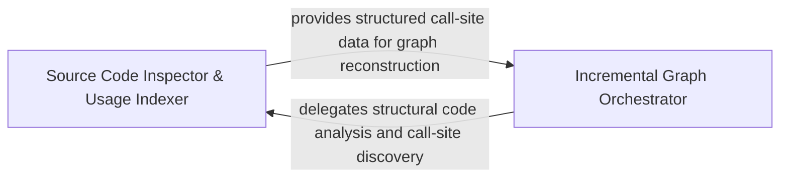

## Details

Manages the stateful evolution of the graph, identifying changed files and executing surgical updates to maintain consistency during codebase modifications.

### Source Code Inspector & Usage Indexer
Provides low-level structural analysis of source files using parsers to index usage patterns and perform spatial queries to identify modified or referenced code entities.

**Related Classes/Methods**:

- `static_analyzer.engine.source_inspector.SourceInspector`:96-400
- `static_analyzer.engine.source_inspector.SourceUsageIndex`:91-93
- `static_analyzer.engine.source_inspector.ParsedSource`:85-87
- `static_analyzer.incremental_orchestrator._reference_matches_edge_kind`:342-359

**Source Files:**

- [`static_analyzer/engine/source_inspector.py`](https://github.com/CodeBoarding/CodeBoarding/blob/main/.codeboardingstatic_analyzer/engine/source_inspector.py)
  - `static_analyzer.engine.source_inspector.ParsedSource` ([L85-L87](https://github.com/CodeBoarding/CodeBoarding/blob/main/.codeboardingstatic_analyzer/engine/source_inspector.py#L85-L87)) - Class
  - `static_analyzer.engine.source_inspector.SourceUsageIndex` ([L91-L93](https://github.com/CodeBoarding/CodeBoarding/blob/main/.codeboardingstatic_analyzer/engine/source_inspector.py#L91-L93)) - Class
  - `static_analyzer.engine.source_inspector.SourceInspector` ([L96-L400](https://github.com/CodeBoarding/CodeBoarding/blob/main/.codeboardingstatic_analyzer/engine/source_inspector.py#L96-L400)) - Class
  - `static_analyzer.engine.source_inspector.SourceInspector.__init__` ([L99-L104](https://github.com/CodeBoarding/CodeBoarding/blob/main/.codeboardingstatic_analyzer/engine/source_inspector.py#L99-L104)) - Method
  - `static_analyzer.engine.source_inspector.SourceInspector.get_source_line` ([L106-L111](https://github.com/CodeBoarding/CodeBoarding/blob/main/.codeboardingstatic_analyzer/engine/source_inspector.py#L106-L111)) - Method
  - `static_analyzer.engine.source_inspector.SourceInspector.get_file_lines` ([L113-L121](https://github.com/CodeBoarding/CodeBoarding/blob/main/.codeboardingstatic_analyzer/engine/source_inspector.py#L113-L121)) - Method
  - `static_analyzer.engine.source_inspector.SourceInspector.is_invocation` ([L123-L128](https://github.com/CodeBoarding/CodeBoarding/blob/main/.codeboardingstatic_analyzer/engine/source_inspector.py#L123-L128)) - Method
  - `static_analyzer.engine.source_inspector.SourceInspector.is_callable_usage` ([L130-L135](https://github.com/CodeBoarding/CodeBoarding/blob/main/.codeboardingstatic_analyzer/engine/source_inspector.py#L130-L135)) - Method
  - `static_analyzer.engine.source_inspector.SourceInspector.is_reference_in_declaration_body` ([L137-L168](https://github.com/CodeBoarding/CodeBoarding/blob/main/.codeboardingstatic_analyzer/engine/source_inspector.py#L137-L168)) - Method
  - `static_analyzer.engine.source_inspector.SourceInspector._read_file_bytes` ([L189-L196](https://github.com/CodeBoarding/CodeBoarding/blob/main/.codeboardingstatic_analyzer/engine/source_inspector.py#L189-L196)) - Method
  - `static_analyzer.engine.source_inspector.SourceInspector._parse` ([L198-L212](https://github.com/CodeBoarding/CodeBoarding/blob/main/.codeboardingstatic_analyzer/engine/source_inspector.py#L198-L212)) - Method
  - `static_analyzer.engine.source_inspector.SourceInspector._usage_index` ([L214-L242](https://github.com/CodeBoarding/CodeBoarding/blob/main/.codeboardingstatic_analyzer/engine/source_inspector.py#L214-L242)) - Method
  - `static_analyzer.engine.source_inspector.SourceInspector._parser_for` ([L244-L253](https://github.com/CodeBoarding/CodeBoarding/blob/main/.codeboardingstatic_analyzer/engine/source_inspector.py#L244-L253)) - Method
  - `static_analyzer.engine.source_inspector.SourceInspector._call_target_node` ([L255-L271](https://github.com/CodeBoarding/CodeBoarding/blob/main/.codeboardingstatic_analyzer/engine/source_inspector.py#L255-L271)) - Method
  - `static_analyzer.engine.source_inspector.SourceInspector._select_query_node` ([L273-L285](https://github.com/CodeBoarding/CodeBoarding/blob/main/.codeboardingstatic_analyzer/engine/source_inspector.py#L273-L285)) - Method
  - `static_analyzer.engine.source_inspector.SourceInspector._node_is_call_target` ([L287-L294](https://github.com/CodeBoarding/CodeBoarding/blob/main/.codeboardingstatic_analyzer/engine/source_inspector.py#L287-L294)) - Method
  - `static_analyzer.engine.source_inspector.SourceInspector._node_is_return_value` ([L297-L306](https://github.com/CodeBoarding/CodeBoarding/blob/main/.codeboardingstatic_analyzer/engine/source_inspector.py#L297-L306)) - Method
  - `static_analyzer.engine.source_inspector.SourceInspector._node_is_call_argument` ([L308-L317](https://github.com/CodeBoarding/CodeBoarding/blob/main/.codeboardingstatic_analyzer/engine/source_inspector.py#L308-L317)) - Method
  - `static_analyzer.engine.source_inspector.SourceInspector._parent_is_call_like` ([L320-L324](https://github.com/CodeBoarding/CodeBoarding/blob/main/.codeboardingstatic_analyzer/engine/source_inspector.py#L320-L324)) - Method
  - `static_analyzer.engine.source_inspector.SourceInspector._smallest_named_node_ending_at` ([L326-L337](https://github.com/CodeBoarding/CodeBoarding/blob/main/.codeboardingstatic_analyzer/engine/source_inspector.py#L326-L337)) - Method
  - `static_analyzer.engine.source_inspector.SourceInspector._smallest_named_node_covering_range` ([L339-L354](https://github.com/CodeBoarding/CodeBoarding/blob/main/.codeboardingstatic_analyzer/engine/source_inspector.py#L339-L354)) - Method
  - `static_analyzer.engine.source_inspector.SourceInspector._node_contains_point` ([L357-L366](https://github.com/CodeBoarding/CodeBoarding/blob/main/.codeboardingstatic_analyzer/engine/source_inspector.py#L357-L366)) - Method
  - `static_analyzer.engine.source_inspector.SourceInspector._node_covers_range` ([L369-L378](https://github.com/CodeBoarding/CodeBoarding/blob/main/.codeboardingstatic_analyzer/engine/source_inspector.py#L369-L378)) - Method
  - `static_analyzer.engine.source_inspector.SourceInspector._node_size` ([L381-L382](https://github.com/CodeBoarding/CodeBoarding/blob/main/.codeboardingstatic_analyzer/engine/source_inspector.py#L381-L382)) - Method
  - `static_analyzer.engine.source_inspector.SourceInspector._first_named_child_of_type` ([L384-L388](https://github.com/CodeBoarding/CodeBoarding/blob/main/.codeboardingstatic_analyzer/engine/source_inspector.py#L384-L388)) - Method
  - `static_analyzer.engine.source_inspector.SourceInspector._last_named_child_of_type` ([L390-L395](https://github.com/CodeBoarding/CodeBoarding/blob/main/.codeboardingstatic_analyzer/engine/source_inspector.py#L390-L395)) - Method
  - `static_analyzer.engine.source_inspector.SourceInspector._walk` ([L397-L400](https://github.com/CodeBoarding/CodeBoarding/blob/main/.codeboardingstatic_analyzer/engine/source_inspector.py#L397-L400)) - Method
- [`static_analyzer/incremental_orchestrator.py`](https://github.com/CodeBoarding/CodeBoarding/blob/main/.codeboardingstatic_analyzer/incremental_orchestrator.py)
  - `static_analyzer.incremental_orchestrator._reference_matches_edge_kind` ([L342-L359](https://github.com/CodeBoarding/CodeBoarding/blob/main/.codeboardingstatic_analyzer/incremental_orchestrator.py#L342-L359)) - Function

### Incremental Graph Orchestrator
Manages high-level logic for surgical graph updates, coordinating the removal of stale edges and the restoration of cross-boundary relationships to keep the global dependency map synchronized.

**Related Classes/Methods**:

- `static_analyzer.incremental_orchestrator._rebuild_changed_file_edges`:111-129
- `static_analyzer.incremental_orchestrator._restore_cross_boundary_edges`:132-184
- `static_analyzer.__init__.StaticAnalyzer.discover_file_dependencies`:463-512
- `static_analyzer.internal_references.parent_qualified_name`:23-28
- `static_analyzer.engine.models.CallSite`:34-59

**Source Files:**

- [`static_analyzer/__init__.py`](https://github.com/CodeBoarding/CodeBoarding/blob/main/.codeboardingstatic_analyzer/__init__.py)
  - `static_analyzer.__init__.StaticAnalyzer.discover_file_dependencies` ([L463-L512](https://github.com/CodeBoarding/CodeBoarding/blob/main/.codeboardingstatic_analyzer/__init__.py#L463-L512)) - Method
- [`static_analyzer/engine/edge_builder.py`](https://github.com/CodeBoarding/CodeBoarding/blob/main/.codeboardingstatic_analyzer/engine/edge_builder.py)
  - `static_analyzer.engine.edge_builder._call_site` ([L477-L479](https://github.com/CodeBoarding/CodeBoarding/blob/main/.codeboardingstatic_analyzer/engine/edge_builder.py#L477-L479)) - Function
- [`static_analyzer/engine/language_adapter.py`](https://github.com/CodeBoarding/CodeBoarding/blob/main/.codeboardingstatic_analyzer/engine/language_adapter.py)
  - `static_analyzer.engine.language_adapter.LanguageAdapter.edge_strategy` ([L304-L310](https://github.com/CodeBoarding/CodeBoarding/blob/main/.codeboardingstatic_analyzer/engine/language_adapter.py#L304-L310)) - Method
- [`static_analyzer/engine/models.py`](https://github.com/CodeBoarding/CodeBoarding/blob/main/.codeboardingstatic_analyzer/engine/models.py)
  - `static_analyzer.engine.models.CallSite` ([L34-L59](https://github.com/CodeBoarding/CodeBoarding/blob/main/.codeboardingstatic_analyzer/engine/models.py#L34-L59)) - Class
  - `static_analyzer.engine.models.CallSite.from_lsp_position` ([L42-L43](https://github.com/CodeBoarding/CodeBoarding/blob/main/.codeboardingstatic_analyzer/engine/models.py#L42-L43)) - Method
  - `static_analyzer.engine.models.CallSite.human_line` ([L46-L47](https://github.com/CodeBoarding/CodeBoarding/blob/main/.codeboardingstatic_analyzer/engine/models.py#L46-L47)) - Method
  - `static_analyzer.engine.models.CallSite.human_column` ([L50-L51](https://github.com/CodeBoarding/CodeBoarding/blob/main/.codeboardingstatic_analyzer/engine/models.py#L50-L51)) - Method
  - `static_analyzer.engine.models.CallSite.lsp_line` ([L54-L55](https://github.com/CodeBoarding/CodeBoarding/blob/main/.codeboardingstatic_analyzer/engine/models.py#L54-L55)) - Method
  - `static_analyzer.engine.models.CallSite.lsp_column` ([L58-L59](https://github.com/CodeBoarding/CodeBoarding/blob/main/.codeboardingstatic_analyzer/engine/models.py#L58-L59)) - Method
- [`static_analyzer/engine/source_inspector.py`](https://github.com/CodeBoarding/CodeBoarding/blob/main/.codeboardingstatic_analyzer/engine/source_inspector.py)
  - `static_analyzer.engine.source_inspector.SourceInspector.find_call_sites` ([L170-L187](https://github.com/CodeBoarding/CodeBoarding/blob/main/.codeboardingstatic_analyzer/engine/source_inspector.py#L170-L187)) - Method
- [`static_analyzer/engine/utils.py`](https://github.com/CodeBoarding/CodeBoarding/blob/main/.codeboardingstatic_analyzer/engine/utils.py)
  - `static_analyzer.engine.utils.uri_to_path` ([L16-L32](https://github.com/CodeBoarding/CodeBoarding/blob/main/.codeboardingstatic_analyzer/engine/utils.py#L16-L32)) - Function
  - `static_analyzer.engine.utils.definition_location` ([L35-L51](https://github.com/CodeBoarding/CodeBoarding/blob/main/.codeboardingstatic_analyzer/engine/utils.py#L35-L51)) - Function
- [`static_analyzer/incremental_orchestrator.py`](https://github.com/CodeBoarding/CodeBoarding/blob/main/.codeboardingstatic_analyzer/incremental_orchestrator.py)
  - `static_analyzer.incremental_orchestrator._rebuild_changed_file_edges` ([L111-L129](https://github.com/CodeBoarding/CodeBoarding/blob/main/.codeboardingstatic_analyzer/incremental_orchestrator.py#L111-L129)) - Function
  - `static_analyzer.incremental_orchestrator._restore_cross_boundary_edges` ([L132-L184](https://github.com/CodeBoarding/CodeBoarding/blob/main/.codeboardingstatic_analyzer/incremental_orchestrator.py#L132-L184)) - Function
  - `static_analyzer.incremental_orchestrator._edge_reference_call_sites` ([L187-L213](https://github.com/CodeBoarding/CodeBoarding/blob/main/.codeboardingstatic_analyzer/incremental_orchestrator.py#L187-L213)) - Function
  - `static_analyzer.incremental_orchestrator._add_outbound_edges_from_changed_files` ([L216-L267](https://github.com/CodeBoarding/CodeBoarding/blob/main/.codeboardingstatic_analyzer/incremental_orchestrator.py#L216-L267)) - Function
  - `static_analyzer.incremental_orchestrator._most_specific_node_at_position` ([L270-L294](https://github.com/CodeBoarding/CodeBoarding/blob/main/.codeboardingstatic_analyzer/incremental_orchestrator.py#L270-L294)) - Function
  - `static_analyzer.incremental_orchestrator._definition_nodes` ([L297-L330](https://github.com/CodeBoarding/CodeBoarding/blob/main/.codeboardingstatic_analyzer/incremental_orchestrator.py#L297-L330)) - Function
  - `static_analyzer.incremental_orchestrator._position_inside_node` ([L333-L339](https://github.com/CodeBoarding/CodeBoarding/blob/main/.codeboardingstatic_analyzer/incremental_orchestrator.py#L333-L339)) - Function
- [`static_analyzer/internal_references.py`](https://github.com/CodeBoarding/CodeBoarding/blob/main/.codeboardingstatic_analyzer/internal_references.py)
  - `static_analyzer.internal_references.ReferenceNode` ([L9-L10](https://github.com/CodeBoarding/CodeBoarding/blob/main/.codeboardingstatic_analyzer/internal_references.py#L9-L10)) - Class
  - `static_analyzer.internal_references.parent_qualified_name` ([L23-L28](https://github.com/CodeBoarding/CodeBoarding/blob/main/.codeboardingstatic_analyzer/internal_references.py#L23-L28)) - Function
- [`static_analyzer/node.py`](https://github.com/CodeBoarding/CodeBoarding/blob/main/.codeboardingstatic_analyzer/node.py)
  - `static_analyzer.node.Node.is_callable` ([L33-L35](https://github.com/CodeBoarding/CodeBoarding/blob/main/.codeboardingstatic_analyzer/node.py#L33-L35)) - Method

### [FAQ](https://github.com/CodeBoarding/GeneratedOnBoardings/tree/main?tab=readme-ov-file#faq)