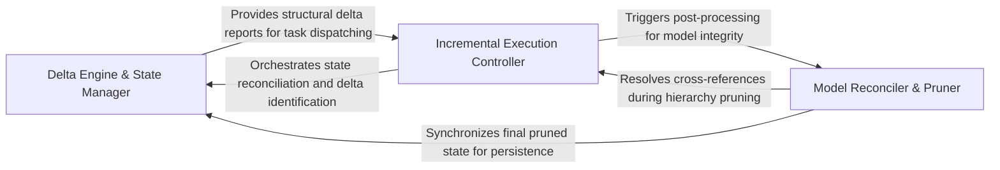

## Details

Manages the lifecycle of an incremental analysis run, coordinating between static analysis and the delta engine to determine which agents require re-invocation.

### Delta Engine & State Manager
Responsible for the persistence and comparison of architectural states, loading previous baselines, and identifying modified or new entities.

**Related Classes/Methods**: _None_

**Source Files:**

- [`agents/incremental_agent.py`](https://github.com/CodeBoarding/CodeBoarding/blob/main/.codeboardingagents/incremental_agent.py)
  - `agents.incremental_agent.prune_empty_components.collect_empty` ([L658-L661](https://github.com/CodeBoarding/CodeBoarding/blob/main/.codeboardingagents/incremental_agent.py#L658-L661)) - Function
  - `agents.incremental_agent._strip_relations` ([L704-L709](https://github.com/CodeBoarding/CodeBoarding/blob/main/.codeboardingagents/incremental_agent.py#L704-L709)) - Function

### Incremental Execution Controller
The central coordinator that orchestrates the end-to-end incremental workflow, interpreting delta reports to dispatch specialized agents and managing context-specific prompts.

**Related Classes/Methods**: _None_

**Source Files:**

- [`agents/incremental_agent.py`](https://github.com/CodeBoarding/CodeBoarding/blob/main/.codeboardingagents/incremental_agent.py)
  - `agents.incremental_agent.prune_empty_components` ([L642-L681](https://github.com/CodeBoarding/CodeBoarding/blob/main/.codeboardingagents/incremental_agent.py#L642-L681)) - Function
  - `agents.incremental_agent.prune_empty_components.has_methods` ([L651-L656](https://github.com/CodeBoarding/CodeBoarding/blob/main/.codeboardingagents/incremental_agent.py#L651-L656)) - Function
- [`agents/incremental_planning_agent.py`](https://github.com/CodeBoarding/CodeBoarding/blob/main/.codeboardingagents/incremental_planning_agent.py)
  - `agents.incremental_planning_agent._format_cluster_ref` ([L307-L308](https://github.com/CodeBoarding/CodeBoarding/blob/main/.codeboardingagents/incremental_planning_agent.py#L307-L308)) - Function

### Model Reconciler & Pruner
A post-processing engine that ensures architectural hierarchy consistency by removing ghost components and re-indexing IDs.

**Related Classes/Methods**: _None_

**Source Files:**

- [`agents/incremental_planning_agent.py`](https://github.com/CodeBoarding/CodeBoarding/blob/main/.codeboardingagents/incremental_planning_agent.py)
  - `agents.incremental_planning_agent._format_language_diff` ([L197-L216](https://github.com/CodeBoarding/CodeBoarding/blob/main/.codeboardingagents/incremental_planning_agent.py#L197-L216)) - Function

### [FAQ](https://github.com/CodeBoarding/GeneratedOnBoardings/tree/main?tab=readme-ov-file#faq)