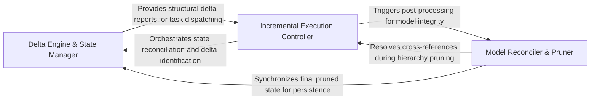

```mermaid
graph LR
    Delta_Engine_State_Manager["Delta Engine & State Manager"]
    Incremental_Execution_Controller["Incremental Execution Controller"]
    Model_Reconciler_Pruner["Model Reconciler & Pruner"]
    Delta_Engine_State_Manager -- "Provides structural delta reports for task dispatching" --> Incremental_Execution_Controller
    Incremental_Execution_Controller -- "Orchestrates state reconciliation and delta identification" --> Delta_Engine_State_Manager
    Incremental_Execution_Controller -- "Triggers post-processing for model integrity" --> Model_Reconciler_Pruner
    Model_Reconciler_Pruner -- "Synchronizes final pruned state for persistence" --> Delta_Engine_State_Manager
    Model_Reconciler_Pruner -- "Resolves cross-references during hierarchy pruning" --> Incremental_Execution_Controller
```

## Details

Manages the lifecycle of an incremental analysis run, coordinating between static analysis and the delta engine to determine which agents require re-invocation.

### Delta Engine & State Manager
Responsible for the persistence and comparison of architectural states, loading previous baselines, and identifying modified or new entities.

**Related Classes/Methods**: _None_

**Source Files:**

- [`agents/incremental_agent.py`](https://github.com/CodeBoarding/CodeBoarding/blob/main/.codeboardingagents/incremental_agent.py)
  - `agents.incremental_agent.prune_empty_components.collect_empty` ([L749-L752](https://github.com/CodeBoarding/CodeBoarding/blob/main/.codeboardingagents/incremental_agent.py#L749-L752)) - Function
  - `agents.incremental_agent._strip_relations` ([L795-L800](https://github.com/CodeBoarding/CodeBoarding/blob/main/.codeboardingagents/incremental_agent.py#L795-L800)) - Function

### Incremental Execution Controller
The central coordinator that orchestrates the end-to-end incremental workflow, interpreting delta reports to dispatch specialized agents and managing context-specific prompts.

**Related Classes/Methods**: _None_

**Source Files:**

- [`agents/incremental_agent.py`](https://github.com/CodeBoarding/CodeBoarding/blob/main/.codeboardingagents/incremental_agent.py)
  - `agents.incremental_agent.prune_empty_components` ([L733-L772](https://github.com/CodeBoarding/CodeBoarding/blob/main/.codeboardingagents/incremental_agent.py#L733-L772)) - Function
  - `agents.incremental_agent.prune_empty_components.has_methods` ([L742-L747](https://github.com/CodeBoarding/CodeBoarding/blob/main/.codeboardingagents/incremental_agent.py#L742-L747)) - Function

### Model Reconciler & Pruner
A post-processing engine that ensures architectural hierarchy consistency by removing ghost components and re-indexing IDs.

**Related Classes/Methods**: _None_

### [FAQ](https://github.com/CodeBoarding/GeneratedOnBoardings/tree/main?tab=readme-ov-file#faq)