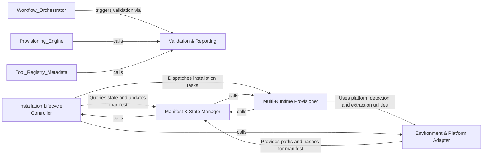

## Details

Primary controller that evaluates environment state against the manifest and triggers installation workflows.

### Validation & Reporting
Verifies the integrity of the installed tools and provides feedback to the user regarding the capabilities of the current environment.

**Related Classes/Methods**: _None_

**Source Files:**

- [`tool_registry/manifest.py`](https://github.com/CodeBoarding/CodeBoarding/blob/main/.codeboardingtool_registry/manifest.py)
  - `tool_registry.manifest.installed_version` ([L40-L44](https://github.com/CodeBoarding/CodeBoarding/blob/main/.codeboardingtool_registry/manifest.py#L40-L44)) - Function
  - `tool_registry.manifest.manifest_path` ([L47-L48](https://github.com/CodeBoarding/CodeBoarding/blob/main/.codeboardingtool_registry/manifest.py#L47-L48)) - Function
  - `tool_registry.manifest.read_manifest` ([L51-L55](https://github.com/CodeBoarding/CodeBoarding/blob/main/.codeboardingtool_registry/manifest.py#L51-L55)) - Function
  - `tool_registry.manifest.npm_specs_fingerprint` ([L58-L68](https://github.com/CodeBoarding/CodeBoarding/blob/main/.codeboardingtool_registry/manifest.py#L58-L68)) - Function
  - `tool_registry.manifest.tools_fingerprint` ([L71-L91](https://github.com/CodeBoarding/CodeBoarding/blob/main/.codeboardingtool_registry/manifest.py#L71-L91)) - Function
  - `tool_registry.manifest.write_manifest` ([L94-L116](https://github.com/CodeBoarding/CodeBoarding/blob/main/.codeboardingtool_registry/manifest.py#L94-L116)) - Function
  - `tool_registry.manifest.needs_install` ([L119-L128](https://github.com/CodeBoarding/CodeBoarding/blob/main/.codeboardingtool_registry/manifest.py#L119-L128)) - Function
  - `tool_registry.manifest.resolve_config_from_path` ([L252-L275](https://github.com/CodeBoarding/CodeBoarding/blob/main/.codeboardingtool_registry/manifest.py#L252-L275)) - Function
- [`tool_registry/paths.py`](https://github.com/CodeBoarding/CodeBoarding/blob/main/.codeboardingtool_registry/paths.py)
  - `tool_registry.paths.get_servers_dir` ([L81-L83](https://github.com/CodeBoarding/CodeBoarding/blob/main/.codeboardingtool_registry/paths.py#L81-L83)) - Function

### Installation Lifecycle Controller
The central authority that orchestrates the sequence of installation. It evaluates whether an installation is necessary and triggers the appropriate provisioning workflows based on the environment's delta.

**Related Classes/Methods**:

- `install.ensure_tools`:658-691
- `install.run_install`:694-741

**Source Files:**

- [`install.py`](https://github.com/CodeBoarding/CodeBoarding/blob/main/.codeboardinginstall.py)
  - `install.LanguageSupportCheck` ([L42-L58](https://github.com/CodeBoarding/CodeBoarding/blob/main/.codeboardinginstall.py#L42-L58)) - Class
  - `install.LanguageSupportCheck.evaluate` ([L50-L58](https://github.com/CodeBoarding/CodeBoarding/blob/main/.codeboardinginstall.py#L50-L58)) - Method
  - `install.parse_args` ([L255-L268](https://github.com/CodeBoarding/CodeBoarding/blob/main/.codeboardinginstall.py#L255-L268)) - Function
  - `install.install_pre_commit_hooks` ([L517-L552](https://github.com/CodeBoarding/CodeBoarding/blob/main/.codeboardinginstall.py#L517-L552)) - Function
  - `install._language_checks_from_registry` ([L555-L645](https://github.com/CodeBoarding/CodeBoarding/blob/main/.codeboardinginstall.py#L555-L645)) - Function
  - `install.main` ([L744-L769](https://github.com/CodeBoarding/CodeBoarding/blob/main/.codeboardinginstall.py#L744-L769)) - Function

### Manifest & State Manager
Manages the 'Source of Truth' for the installation. It handles version fingerprinting, manifest persistence, and the logic for determining if a tool is missing or outdated.

**Related Classes/Methods**:

- `tool_registry.manifest.needs_install`:119-128
- `tool_registry.manifest.write_manifest`:94-116

**Source Files:**

- [`install.py`](https://github.com/CodeBoarding/CodeBoarding/blob/main/.codeboardinginstall.py)
  - `install.download_binaries` ([L438-L477](https://github.com/CodeBoarding/CodeBoarding/blob/main/.codeboardinginstall.py#L438-L477)) - Function
  - `install.download_jdtls` ([L480-L488](https://github.com/CodeBoarding/CodeBoarding/blob/main/.codeboardinginstall.py#L480-L488)) - Function
  - `install.print_language_support_summary` ([L648-L655](https://github.com/CodeBoarding/CodeBoarding/blob/main/.codeboardinginstall.py#L648-L655)) - Function
  - `install.run_install` ([L694-L741](https://github.com/CodeBoarding/CodeBoarding/blob/main/.codeboardinginstall.py#L694-L741)) - Function
  - `install.run_install.unified_progress` ([L726-L730](https://github.com/CodeBoarding/CodeBoarding/blob/main/.codeboardinginstall.py#L726-L730)) - Function

### Multi-Runtime Provisioner
A specialized worker layer that handles the technical specifics of different tool ecosystems, including Node.js packages, native binaries, and Java-based language servers.

**Related Classes/Methods**:

- `install.install_node_servers`:276-301
- `install.download_binaries`:438-477
- `install.download_jdtls`:480-488

**Source Files:**

- [`install.py`](https://github.com/CodeBoarding/CodeBoarding/blob/main/.codeboardinginstall.py)
  - `install.get_platform_bin_dir` ([L271-L273](https://github.com/CodeBoarding/CodeBoarding/blob/main/.codeboardinginstall.py#L271-L273)) - Function
  - `install.install_node_servers` ([L276-L301](https://github.com/CodeBoarding/CodeBoarding/blob/main/.codeboardinginstall.py#L276-L301)) - Function
  - `install.verify_binary` ([L316-L341](https://github.com/CodeBoarding/CodeBoarding/blob/main/.codeboardinginstall.py#L316-L341)) - Function
  - `install.ensure_tools` ([L658-L691](https://github.com/CodeBoarding/CodeBoarding/blob/main/.codeboardinginstall.py#L658-L691)) - Function
- [`tool_registry/installers.py`](https://github.com/CodeBoarding/CodeBoarding/blob/main/.codeboardingtool_registry/installers.py)
  - `tool_registry.installers.install_node_tools` ([L429-L469](https://github.com/CodeBoarding/CodeBoarding/blob/main/.codeboardingtool_registry/installers.py#L429-L469)) - Function
- [`tool_registry/manifest.py`](https://github.com/CodeBoarding/CodeBoarding/blob/main/.codeboardingtool_registry/manifest.py)
  - `tool_registry.manifest.acquire_lock` ([L134-L160](https://github.com/CodeBoarding/CodeBoarding/blob/main/.codeboardingtool_registry/manifest.py#L134-L160)) - Function

### Environment & Platform Adapter
Provides low-level utilities for platform detection, archive extraction, and path resolution. It ensures that installed tools are correctly mapped to the host OS and accessible via the system path.

**Related Classes/Methods**: _None_

**Source Files:**

- [`tool_registry/manifest.py`](https://github.com/CodeBoarding/CodeBoarding/blob/main/.codeboardingtool_registry/manifest.py)
  - `tool_registry.manifest.installed_version` ([L40-L44](https://github.com/CodeBoarding/CodeBoarding/blob/main/.codeboardingtool_registry/manifest.py#L40-L44)) - Function
  - `tool_registry.manifest.manifest_path` ([L47-L48](https://github.com/CodeBoarding/CodeBoarding/blob/main/.codeboardingtool_registry/manifest.py#L47-L48)) - Function
  - `tool_registry.manifest.read_manifest` ([L51-L55](https://github.com/CodeBoarding/CodeBoarding/blob/main/.codeboardingtool_registry/manifest.py#L51-L55)) - Function
  - `tool_registry.manifest.npm_specs_fingerprint` ([L58-L68](https://github.com/CodeBoarding/CodeBoarding/blob/main/.codeboardingtool_registry/manifest.py#L58-L68)) - Function
  - `tool_registry.manifest.tools_fingerprint` ([L71-L91](https://github.com/CodeBoarding/CodeBoarding/blob/main/.codeboardingtool_registry/manifest.py#L71-L91)) - Function
  - `tool_registry.manifest.write_manifest` ([L94-L116](https://github.com/CodeBoarding/CodeBoarding/blob/main/.codeboardingtool_registry/manifest.py#L94-L116)) - Function
  - `tool_registry.manifest.needs_install` ([L119-L128](https://github.com/CodeBoarding/CodeBoarding/blob/main/.codeboardingtool_registry/manifest.py#L119-L128)) - Function

### [FAQ](https://github.com/CodeBoarding/GeneratedOnBoardings/tree/main?tab=readme-ov-file#faq)