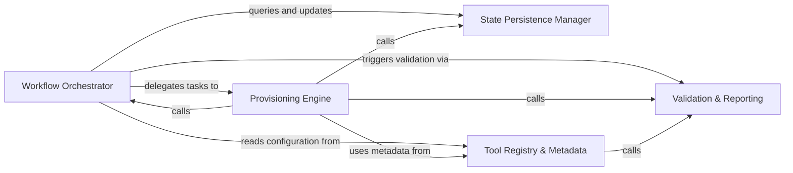

## Details

The central controller for the subsystem. it manages the high-level installation workflow, ensures idempotency via manifest tracking, and serves as the primary entry point for environment setup.

### Workflow Orchestrator
Acts as the central nervous system of the subsystem, managing the high-level execution flow and concurrency control to prevent corrupted installations.

**Related Classes/Methods**:

- `install.run_install`:694-741
- `install.ensure_tools`:658-691

**Source Files:**

- [`install.py`](https://github.com/CodeBoarding/CodeBoarding/blob/main/.codeboardinginstall.py)
  - `install.ensure_node_runtime` ([L161-L214](https://github.com/CodeBoarding/CodeBoarding/blob/main/.codeboardinginstall.py#L161-L214)) - Function
  - `install.BinaryStatus` ([L308-L313](https://github.com/CodeBoarding/CodeBoarding/blob/main/.codeboardinginstall.py#L308-L313)) - Class
  - `install.download_binaries` ([L438-L477](https://github.com/CodeBoarding/CodeBoarding/blob/main/.codeboardinginstall.py#L438-L477)) - Function
  - `install.ensure_tools` ([L658-L691](https://github.com/CodeBoarding/CodeBoarding/blob/main/.codeboardinginstall.py#L658-L691)) - Function

### State Persistence Manager
Maintains the 'Source of Truth' for the current local environment, enabling idempotency by tracking what has been successfully installed.

**Related Classes/Methods**:

- `tool_registry.manifest.read_manifest`:51-55
- `tool_registry.manifest.write_manifest`:94-116
- `tool_registry.manifest.needs_install`:119-128

**Source Files:**

- [`install.py`](https://github.com/CodeBoarding/CodeBoarding/blob/main/.codeboardinginstall.py)
  - `install.install_node_servers` ([L276-L301](https://github.com/CodeBoarding/CodeBoarding/blob/main/.codeboardinginstall.py#L276-L301)) - Function
  - `install.install_vcpp_redistributable` ([L344-L411](https://github.com/CodeBoarding/CodeBoarding/blob/main/.codeboardinginstall.py#L344-L411)) - Function
  - `install.install_pre_commit_hooks` ([L517-L552](https://github.com/CodeBoarding/CodeBoarding/blob/main/.codeboardinginstall.py#L517-L552)) - Function

### Provisioning Engine
The heavy-lifting layer that interacts with the network and filesystem to download, extract, and configure specific tool runtimes.

**Related Classes/Methods**:

- `install.ensure_node_runtime`:161-214
- `install.download_binaries`:438-477
- `install.install_node_servers`:276-301

**Source Files:**

- [`install.py`](https://github.com/CodeBoarding/CodeBoarding/blob/main/.codeboardinginstall.py)
  - `install.is_non_interactive_mode` ([L152-L158](https://github.com/CodeBoarding/CodeBoarding/blob/main/.codeboardinginstall.py#L152-L158)) - Function
  - `install.parse_args` ([L255-L268](https://github.com/CodeBoarding/CodeBoarding/blob/main/.codeboardinginstall.py#L255-L268)) - Function
  - `install.resolve_missing_vcpp` ([L414-L435](https://github.com/CodeBoarding/CodeBoarding/blob/main/.codeboardinginstall.py#L414-L435)) - Function
  - `install.run_install` ([L694-L741](https://github.com/CodeBoarding/CodeBoarding/blob/main/.codeboardinginstall.py#L694-L741)) - Function
  - `install.main` ([L744-L769](https://github.com/CodeBoarding/CodeBoarding/blob/main/.codeboardinginstall.py#L744-L769)) - Function

### Tool Registry & Metadata
Provides the static definitions and configuration schemas that drive the orchestration logic.

**Related Classes/Methods**: _None_

**Source Files:**

- [`install.py`](https://github.com/CodeBoarding/CodeBoarding/blob/main/.codeboardinginstall.py)
  - `install.verify_binary` ([L316-L341](https://github.com/CodeBoarding/CodeBoarding/blob/main/.codeboardinginstall.py#L316-L341)) - Function
  - `install.run_install.unified_progress` ([L726-L730](https://github.com/CodeBoarding/CodeBoarding/blob/main/.codeboardinginstall.py#L726-L730)) - Function
- [`tool_registry/manifest.py`](https://github.com/CodeBoarding/CodeBoarding/blob/main/.codeboardingtool_registry/manifest.py)
  - `tool_registry.manifest.acquire_lock` ([L134-L160](https://github.com/CodeBoarding/CodeBoarding/blob/main/.codeboardingtool_registry/manifest.py#L134-L160)) - Function
  - `tool_registry.manifest.build_config` ([L166-L186](https://github.com/CodeBoarding/CodeBoarding/blob/main/.codeboardingtool_registry/manifest.py#L166-L186)) - Function

### Validation & Reporting
Verifies the integrity of the installed tools and provides feedback to the user regarding the capabilities of the current environment.

**Related Classes/Methods**: _None_

**Source Files:**

- [`tool_registry/manifest.py`](https://github.com/CodeBoarding/CodeBoarding/blob/main/.codeboardingtool_registry/manifest.py)
  - `tool_registry.manifest.installed_version` ([L40-L44](https://github.com/CodeBoarding/CodeBoarding/blob/main/.codeboardingtool_registry/manifest.py#L40-L44)) - Function
  - `tool_registry.manifest.manifest_path` ([L47-L48](https://github.com/CodeBoarding/CodeBoarding/blob/main/.codeboardingtool_registry/manifest.py#L47-L48)) - Function
  - `tool_registry.manifest.read_manifest` ([L51-L55](https://github.com/CodeBoarding/CodeBoarding/blob/main/.codeboardingtool_registry/manifest.py#L51-L55)) - Function
  - `tool_registry.manifest.npm_specs_fingerprint` ([L58-L68](https://github.com/CodeBoarding/CodeBoarding/blob/main/.codeboardingtool_registry/manifest.py#L58-L68)) - Function
  - `tool_registry.manifest.tools_fingerprint` ([L71-L91](https://github.com/CodeBoarding/CodeBoarding/blob/main/.codeboardingtool_registry/manifest.py#L71-L91)) - Function
  - `tool_registry.manifest.write_manifest` ([L94-L116](https://github.com/CodeBoarding/CodeBoarding/blob/main/.codeboardingtool_registry/manifest.py#L94-L116)) - Function
  - `tool_registry.manifest.needs_install` ([L119-L128](https://github.com/CodeBoarding/CodeBoarding/blob/main/.codeboardingtool_registry/manifest.py#L119-L128)) - Function
  - `tool_registry.manifest.resolve_config_from_path` ([L252-L275](https://github.com/CodeBoarding/CodeBoarding/blob/main/.codeboardingtool_registry/manifest.py#L252-L275)) - Function
- [`tool_registry/paths.py`](https://github.com/CodeBoarding/CodeBoarding/blob/main/.codeboardingtool_registry/paths.py)
  - `tool_registry.paths.get_servers_dir` ([L64-L66](https://github.com/CodeBoarding/CodeBoarding/blob/main/.codeboardingtool_registry/paths.py#L64-L66)) - Function

### [FAQ](https://github.com/CodeBoarding/GeneratedOnBoardings/tree/main?tab=readme-ov-file#faq)