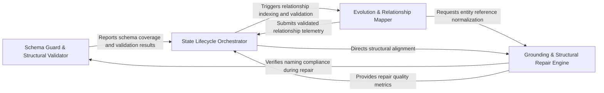

## Details

Ensures the reliability and continuity of the architectural model by validating LLM outputs against structural schemas and mapping relationships across incremental analysis runs.

### Schema Guard & Structural Validator
Enforces strict schema compliance on LLM outputs, ensuring that the generated architectural insights are unique, well-formed, and ready for integration.

**Related Classes/Methods**: _None_

**Source Files:**

- [`agents/incremental_agent.py`](https://github.com/CodeBoarding/CodeBoarding/blob/main/.codeboardingagents/incremental_agent.py)
  - `agents.incremental_agent._log_scope_relations_summary` ([L398-L403](https://github.com/CodeBoarding/CodeBoarding/blob/main/.codeboardingagents/incremental_agent.py#L398-L403)) - Function
- [`agents/repair.py`](https://github.com/CodeBoarding/CodeBoarding/blob/main/.codeboardingagents/repair.py)
  - `agents.repair._fuzzy_match_group_name` ([L243-L255](https://github.com/CodeBoarding/CodeBoarding/blob/main/.codeboardingagents/repair.py#L243-L255)) - Function
- [`agents/validation.py`](https://github.com/CodeBoarding/CodeBoarding/blob/main/.codeboardingagents/validation.py)
  - `agents.validation.validate_group_name_coverage` ([L285-L371](https://github.com/CodeBoarding/CodeBoarding/blob/main/.codeboardingagents/validation.py#L285-L371)) - Function
- [`monitoring/context.py`](https://github.com/CodeBoarding/CodeBoarding/blob/main/.codeboardingmonitoring/context.py)
  - `monitoring.context.monitor_execution.MonitorContext.__init__` ([L74-L75](https://github.com/CodeBoarding/CodeBoarding/blob/main/.codeboardingmonitoring/context.py#L74-L75)) - Method

### Grounding & Structural Repair Engine
Reconciles the abstract architectural model with the source code by fixing line references and verifying existence of files and methods.

**Related Classes/Methods**: _None_

**Source Files:**

- [`agents/repair.py`](https://github.com/CodeBoarding/CodeBoarding/blob/main/.codeboardingagents/repair.py)
  - `agents.repair.ComponentRepairContext` ([L44-L47](https://github.com/CodeBoarding/CodeBoarding/blob/main/.codeboardingagents/repair.py#L44-L47)) - Class
  - `agents.repair._canonical_group_name` ([L229-L234](https://github.com/CodeBoarding/CodeBoarding/blob/main/.codeboardingagents/repair.py#L229-L234)) - Function
- [`agents/validation.py`](https://github.com/CodeBoarding/CodeBoarding/blob/main/.codeboardingagents/validation.py)
  - `agents.validation.score_validation_results` ([L161-L180](https://github.com/CodeBoarding/CodeBoarding/blob/main/.codeboardingagents/validation.py#L161-L180)) - Function
- [`static_analyzer/reference_resolver.py`](https://github.com/CodeBoarding/CodeBoarding/blob/main/.codeboardingstatic_analyzer/reference_resolver.py)
  - `static_analyzer.reference_resolver.KeyEntityRepair` ([L27-L32](https://github.com/CodeBoarding/CodeBoarding/blob/main/.codeboardingstatic_analyzer/reference_resolver.py#L27-L32)) - Class
  - `static_analyzer.reference_resolver.StaticReferenceResolver.repair_key_entity_references` ([L68-L109](https://github.com/CodeBoarding/CodeBoarding/blob/main/.codeboardingstatic_analyzer/reference_resolver.py#L68-L109)) - Method
  - `static_analyzer.reference_resolver.StaticReferenceResolver._absolute_reference_path` ([L426-L428](https://github.com/CodeBoarding/CodeBoarding/blob/main/.codeboardingstatic_analyzer/reference_resolver.py#L426-L428)) - Method

### Evolution & Relationship Mapper
Maps relationships between code entities and higher-level components, indexing endpoints and resolving cluster evolution.

**Related Classes/Methods**: _None_

**Source Files:**

- [`agents/incremental_agent.py`](https://github.com/CodeBoarding/CodeBoarding/blob/main/.codeboardingagents/incremental_agent.py)
  - `agents.incremental_agent._local_graph_cluster_ids` ([L378-L395](https://github.com/CodeBoarding/CodeBoarding/blob/main/.codeboardingagents/incremental_agent.py#L378-L395)) - Function
- [`agents/repair.py`](https://github.com/CodeBoarding/CodeBoarding/blob/main/.codeboardingagents/repair.py)
  - `agents.repair.repair_key_entities` ([L258-L276](https://github.com/CodeBoarding/CodeBoarding/blob/main/.codeboardingagents/repair.py#L258-L276)) - Function
- [`agents/validation.py`](https://github.com/CodeBoarding/CodeBoarding/blob/main/.codeboardingagents/validation.py)
  - `agents.validation.validate_relations` ([L588-L610](https://github.com/CodeBoarding/CodeBoarding/blob/main/.codeboardingagents/validation.py#L588-L610)) - Function
- [`static_analyzer/reference_resolver.py`](https://github.com/CodeBoarding/CodeBoarding/blob/main/.codeboardingstatic_analyzer/reference_resolver.py)
  - `static_analyzer.reference_resolver.StaticReferenceResolver.fix_key_entities_refs` ([L49-L66](https://github.com/CodeBoarding/CodeBoarding/blob/main/.codeboardingstatic_analyzer/reference_resolver.py#L49-L66)) - Method

### State Lifecycle Orchestrator
Manages the staged execution of the integrity and evolution logic, coordinating the transition between discovery, clustering, and validation.

**Related Classes/Methods**: _None_

**Source Files:**

- [`agents/relation_edges.py`](https://github.com/CodeBoarding/CodeBoarding/blob/main/.codeboardingagents/relation_edges.py)
  - `agents.relation_edges.index_relation_endpoints` ([L33-L52](https://github.com/CodeBoarding/CodeBoarding/blob/main/.codeboardingagents/relation_edges.py#L33-L52)) - Function
- [`agents/repair.py`](https://github.com/CodeBoarding/CodeBoarding/blob/main/.codeboardingagents/repair.py)
  - `agents.repair.repair_component_group_names` ([L207-L226](https://github.com/CodeBoarding/CodeBoarding/blob/main/.codeboardingagents/repair.py#L207-L226)) - Function
  - `agents.repair._normalize_group_name` ([L237-L240](https://github.com/CodeBoarding/CodeBoarding/blob/main/.codeboardingagents/repair.py#L237-L240)) - Function
- [`agents/validation.py`](https://github.com/CodeBoarding/CodeBoarding/blob/main/.codeboardingagents/validation.py)
  - `agents.validation.ValidationContext` ([L44-L60](https://github.com/CodeBoarding/CodeBoarding/blob/main/.codeboardingagents/validation.py#L44-L60)) - Class
  - `agents.validation.ValidationResult` ([L71-L76](https://github.com/CodeBoarding/CodeBoarding/blob/main/.codeboardingagents/validation.py#L71-L76)) - Class
  - `agents.validation._effective_validation_score` ([L154-L158](https://github.com/CodeBoarding/CodeBoarding/blob/main/.codeboardingagents/validation.py#L154-L158)) - Function
  - `agents.validation.validate_cluster_coverage` ([L183-L247](https://github.com/CodeBoarding/CodeBoarding/blob/main/.codeboardingagents/validation.py#L183-L247)) - Function
  - `agents.validation.validate_existing_component_ids` ([L250-L282](https://github.com/CodeBoarding/CodeBoarding/blob/main/.codeboardingagents/validation.py#L250-L282)) - Function
  - `agents.validation.validate_key_entities` ([L374-L390](https://github.com/CodeBoarding/CodeBoarding/blob/main/.codeboardingagents/validation.py#L374-L390)) - Function
  - `agents.validation.validate_relation_component_names` ([L456-L506](https://github.com/CodeBoarding/CodeBoarding/blob/main/.codeboardingagents/validation.py#L456-L506)) - Function
  - `agents.validation.validate_scope_relation_names` ([L641-L667](https://github.com/CodeBoarding/CodeBoarding/blob/main/.codeboardingagents/validation.py#L641-L667)) - Function
- [`monitoring/context.py`](https://github.com/CodeBoarding/CodeBoarding/blob/main/.codeboardingmonitoring/context.py)
  - `monitoring.context.monitor_execution.DummyContext.end_step` ([L36-L37](https://github.com/CodeBoarding/CodeBoarding/blob/main/.codeboardingmonitoring/context.py#L36-L37)) - Method
  - `monitoring.context.trace` ([L131-L173](https://github.com/CodeBoarding/CodeBoarding/blob/main/.codeboardingmonitoring/context.py#L131-L173)) - Function
- [`static_analyzer/cluster_helpers.py`](https://github.com/CodeBoarding/CodeBoarding/blob/main/.codeboardingstatic_analyzer/cluster_helpers.py)
  - `static_analyzer.cluster_helpers.get_all_cluster_ids` ([L480-L493](https://github.com/CodeBoarding/CodeBoarding/blob/main/.codeboardingstatic_analyzer/cluster_helpers.py#L480-L493)) - Function
- [`static_analyzer/reference_resolver.py`](https://github.com/CodeBoarding/CodeBoarding/blob/main/.codeboardingstatic_analyzer/reference_resolver.py)
  - `static_analyzer.reference_resolver.StaticReferenceResolver.fix_source_code_reference_lines` ([L42-L47](https://github.com/CodeBoarding/CodeBoarding/blob/main/.codeboardingstatic_analyzer/reference_resolver.py#L42-L47)) - Method
  - `static_analyzer.reference_resolver.StaticReferenceResolver.relative_paths` ([L369-L386](https://github.com/CodeBoarding/CodeBoarding/blob/main/.codeboardingstatic_analyzer/reference_resolver.py#L369-L386)) - Method

### [FAQ](https://github.com/CodeBoarding/GeneratedOnBoardings/tree/main?tab=readme-ov-file#faq)