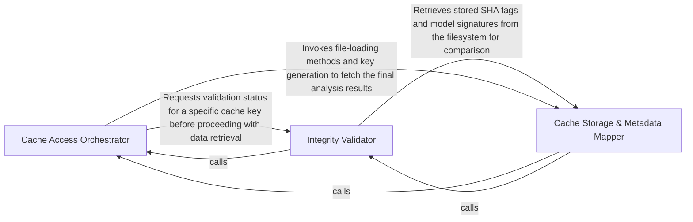

## Details

Orchestrates the lookup of cached analysis data by validating source code SHAs and AI model signatures.

### Cache Access Orchestrator
Manages the high-level lifecycle of a cache request, acting as the primary entry point for the AbstractionAgent and coordinating between integrity checks and data retrieval.

**Related Classes/Methods**:

- `static_analyzer.analysis_cache.StaticAnalysisCache.get`:166-178

**Source Files:**

- [`caching/cache.py`](https://github.com/CodeBoarding/CodeBoarding/blob/main/.codeboardingcaching/cache.py)
  - `caching.cache.BaseCache` ([L30-L268](https://github.com/CodeBoarding/CodeBoarding/blob/main/.codeboardingcaching/cache.py#L30-L268)) - Class
  - `caching.cache.BaseCache.close` ([L259-L268](https://github.com/CodeBoarding/CodeBoarding/blob/main/.codeboardingcaching/cache.py#L259-L268)) - Method
  - `caching.cache.ModelSettings` ([L271-L310](https://github.com/CodeBoarding/CodeBoarding/blob/main/.codeboardingcaching/cache.py#L271-L310)) - Class
  - `caching.cache.ModelSettings.canonical_json` ([L284-L286](https://github.com/CodeBoarding/CodeBoarding/blob/main/.codeboardingcaching/cache.py#L284-L286)) - Method
- [`static_analyzer/analysis_cache.py`](https://github.com/CodeBoarding/CodeBoarding/blob/main/.codeboardingstatic_analyzer/analysis_cache.py)
  - `static_analyzer.analysis_cache.StaticAnalysisCache._legacy_pkl_path` ([L142-L143](https://github.com/CodeBoarding/CodeBoarding/blob/main/.codeboardingstatic_analyzer/analysis_cache.py#L142-L143)) - Method

### Integrity Validator
The core logic engine that performs verification by comparing current file SHAs and model signatures against historical cache metadata.

**Related Classes/Methods**:

- `static_analyzer.analysis_cache.StaticAnalysisCache.read_tag_sha`:112-126
- `caching.cache.ModelSettings.signature`:288-289

**Source Files:**

- [`caching/cache.py`](https://github.com/CodeBoarding/CodeBoarding/blob/main/.codeboardingcaching/cache.py)
  - `caching.cache.ModelSettings.signature` ([L288-L289](https://github.com/CodeBoarding/CodeBoarding/blob/main/.codeboardingcaching/cache.py#L288-L289)) - Method
- [`static_analyzer/analysis_cache.py`](https://github.com/CodeBoarding/CodeBoarding/blob/main/.codeboardingstatic_analyzer/analysis_cache.py)
  - `static_analyzer.analysis_cache.StaticAnalysisCache.lock_path` ([L109-L110](https://github.com/CodeBoarding/CodeBoarding/blob/main/.codeboardingstatic_analyzer/analysis_cache.py#L109-L110)) - Method
  - `static_analyzer.analysis_cache.StaticAnalysisCache._read_tag_sha_unlocked` ([L128-L140](https://github.com/CodeBoarding/CodeBoarding/blob/main/.codeboardingstatic_analyzer/analysis_cache.py#L128-L140)) - Method

### Cache Storage & Metadata Mapper
Handles the translation of logical code entities into physical filesystem paths and manages the persistence of metadata tags and cache keys.

**Related Classes/Methods**: _None_

**Source Files:**

- [`static_analyzer/analysis_cache.py`](https://github.com/CodeBoarding/CodeBoarding/blob/main/.codeboardingstatic_analyzer/analysis_cache.py)
  - `static_analyzer.analysis_cache.StaticAnalysisCache.sha_path` ([L105-L106](https://github.com/CodeBoarding/CodeBoarding/blob/main/.codeboardingstatic_analyzer/analysis_cache.py#L105-L106)) - Method
  - `static_analyzer.analysis_cache.StaticAnalysisCache.read_tag_sha` ([L112-L126](https://github.com/CodeBoarding/CodeBoarding/blob/main/.codeboardingstatic_analyzer/analysis_cache.py#L112-L126)) - Method
  - `static_analyzer.analysis_cache.StaticAnalysisCache.load_with_sha` ([L145-L164](https://github.com/CodeBoarding/CodeBoarding/blob/main/.codeboardingstatic_analyzer/analysis_cache.py#L145-L164)) - Method
  - `static_analyzer.analysis_cache.StaticAnalysisCache.get` ([L166-L178](https://github.com/CodeBoarding/CodeBoarding/blob/main/.codeboardingstatic_analyzer/analysis_cache.py#L166-L178)) - Method
  - `static_analyzer.analysis_cache.StaticAnalysisCache._get_unlocked` ([L180-L214](https://github.com/CodeBoarding/CodeBoarding/blob/main/.codeboardingstatic_analyzer/analysis_cache.py#L180-L214)) - Method

### [FAQ](https://github.com/CodeBoarding/GeneratedOnBoardings/tree/main?tab=readme-ov-file#faq)