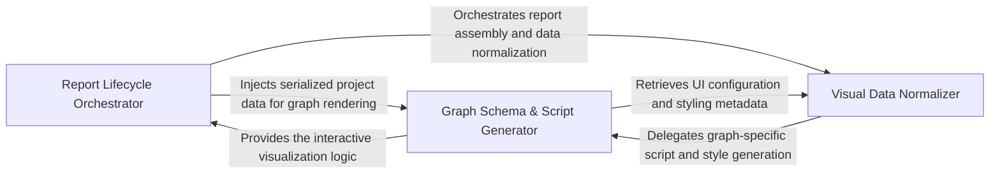

## Details

Orchestrates the creation of rich, interactive HTML reports by mapping graph relationships into Cytoscape.js configurations for dynamic exploration.

### Report Lifecycle Orchestrator [[Expand]](./Report_Lifecycle_Orchestrator.md)
Acts as the primary controller for the visualization pipeline, managing the sequence of operations from receiving analyzed project data to writing the final HTML file.

**Related Classes/Methods**: _None_

**Source Files:**

- [`agents/agent_responses.py`](https://github.com/CodeBoarding/CodeBoarding/blob/main/.codeboardingagents/agent_responses.py)
  - `agents.agent_responses.SourceCodeReference.llm_str` ([L153-L161](https://github.com/CodeBoarding/CodeBoarding/blob/main/.codeboardingagents/agent_responses.py#L153-L161)) - Method
  - `agents.agent_responses.ComponentApiSurface.llm_str` ([L575-L587](https://github.com/CodeBoarding/CodeBoarding/blob/main/.codeboardingagents/agent_responses.py#L575-L587)) - Method
- [`output_generators/html.py`](https://github.com/CodeBoarding/CodeBoarding/blob/main/.codeboardingoutput_generators/html.py)
  - `output_generators.html.generate_cytoscape_data` ([L10-L56](https://github.com/CodeBoarding/CodeBoarding/blob/main/.codeboardingoutput_generators/html.py#L10-L56)) - Function

### Graph Schema & Script Generator [[Expand]](./Graph_Schema_Script_Generator.md)
Translates internal architectural entities into the JSON format required by Cytoscape.js and generates the JavaScript logic for node styling, layout, and event handling.

**Related Classes/Methods**:

- `output_generators.html_template._generate_cytoscape_script`:314-357

**Source Files:**

- [`output_generators/html.py`](https://github.com/CodeBoarding/CodeBoarding/blob/main/.codeboardingoutput_generators/html.py)
  - `output_generators.html.generate_html` ([L59-L125](https://github.com/CodeBoarding/CodeBoarding/blob/main/.codeboardingoutput_generators/html.py#L59-L125)) - Function
  - `output_generators.html.generate_html_file` ([L128-L152](https://github.com/CodeBoarding/CodeBoarding/blob/main/.codeboardingoutput_generators/html.py#L128-L152)) - Function
- [`output_generators/html_template.py`](https://github.com/CodeBoarding/CodeBoarding/blob/main/.codeboardingoutput_generators/html_template.py)
  - `output_generators.html_template._generate_css_styles` ([L4-L86](https://github.com/CodeBoarding/CodeBoarding/blob/main/.codeboardingoutput_generators/html_template.py#L4-L86)) - Function
  - `output_generators.html_template._generate_html_body` ([L89-L119](https://github.com/CodeBoarding/CodeBoarding/blob/main/.codeboardingoutput_generators/html_template.py#L89-L119)) - Function
  - `output_generators.html_template._generate_cytoscape_script` ([L314-L357](https://github.com/CodeBoarding/CodeBoarding/blob/main/.codeboardingoutput_generators/html_template.py#L314-L357)) - Function

### Visual Data Normalizer [[Expand]](./Visual_Data_Normalizer.md)
Prepares and indexes relational data for the UI, resolving qualified names, building cluster hierarchies, and mapping dependencies to visual containers.

**Related Classes/Methods**: _None_

**Source Files:**

- [`output_generators/html_template.py`](https://github.com/CodeBoarding/CodeBoarding/blob/main/.codeboardingoutput_generators/html_template.py)
  - `output_generators.html_template._get_library_checks` ([L122-L142](https://github.com/CodeBoarding/CodeBoarding/blob/main/.codeboardingoutput_generators/html_template.py#L122-L142)) - Function
  - `output_generators.html_template._get_dagre_registration` ([L145-L156](https://github.com/CodeBoarding/CodeBoarding/blob/main/.codeboardingoutput_generators/html_template.py#L145-L156)) - Function
  - `output_generators.html_template._get_cytoscape_style` ([L159-L218](https://github.com/CodeBoarding/CodeBoarding/blob/main/.codeboardingoutput_generators/html_template.py#L159-L218)) - Function
  - `output_generators.html_template._get_layout_config` ([L221-L232](https://github.com/CodeBoarding/CodeBoarding/blob/main/.codeboardingoutput_generators/html_template.py#L221-L232)) - Function
  - `output_generators.html_template._get_event_handlers` ([L235-L282](https://github.com/CodeBoarding/CodeBoarding/blob/main/.codeboardingoutput_generators/html_template.py#L235-L282)) - Function
  - `output_generators.html_template._get_control_functions` ([L285-L311](https://github.com/CodeBoarding/CodeBoarding/blob/main/.codeboardingoutput_generators/html_template.py#L285-L311)) - Function
  - `output_generators.html_template.populate_html_template` ([L360-L382](https://github.com/CodeBoarding/CodeBoarding/blob/main/.codeboardingoutput_generators/html_template.py#L360-L382)) - Function

### [FAQ](https://github.com/CodeBoarding/GeneratedOnBoardings/tree/main?tab=readme-ov-file#faq)