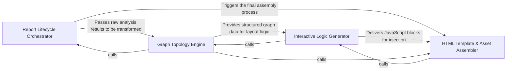

## Details

Generates browser-based reports featuring dynamic relationship graphs using Cytoscape.js.

### Report Lifecycle Orchestrator
Manages the end-to-end execution flow of the visualization generation process, coordinating data extraction and serialization into the final HTML artifact.

**Related Classes/Methods**:

- `output_generators.html.generate_html`:59-125

**Source Files:**

- [`agents/agent_responses.py`](https://github.com/CodeBoarding/CodeBoarding/blob/main/.codeboardingagents/agent_responses.py)
  - `agents.agent_responses.SourceCodeReference.llm_str` ([L144-L152](https://github.com/CodeBoarding/CodeBoarding/blob/main/.codeboardingagents/agent_responses.py#L144-L152)) - Method

### Graph Topology Engine
Translates raw static analysis entities and their dependencies into a schema compatible with graph theory visualizations.

**Related Classes/Methods**:

- `output_generators.html.generate_cytoscape_data`:10-56

**Source Files:**

- [`output_generators/html.py`](https://github.com/CodeBoarding/CodeBoarding/blob/main/.codeboardingoutput_generators/html.py)
  - `output_generators.html.generate_cytoscape_data` ([L10-L56](https://github.com/CodeBoarding/CodeBoarding/blob/main/.codeboardingoutput_generators/html.py#L10-L56)) - Function
  - `output_generators.html.generate_html` ([L59-L125](https://github.com/CodeBoarding/CodeBoarding/blob/main/.codeboardingoutput_generators/html.py#L59-L125)) - Function
  - `output_generators.html.component_header_html` ([L155-L163](https://github.com/CodeBoarding/CodeBoarding/blob/main/.codeboardingoutput_generators/html.py#L155-L163)) - Function

### Interactive Logic Generator
Constructs the client-side JavaScript environment, including Cytoscape.js configurations, layout algorithms, and interactive event handlers.

**Related Classes/Methods**:

- `output_generators.html_template._generate_cytoscape_script`:314-357

**Source Files:**

- [`output_generators/html.py`](https://github.com/CodeBoarding/CodeBoarding/blob/main/.codeboardingoutput_generators/html.py)
  - `output_generators.html.generate_html_file` ([L128-L152](https://github.com/CodeBoarding/CodeBoarding/blob/main/.codeboardingoutput_generators/html.py#L128-L152)) - Function
- [`output_generators/html_template.py`](https://github.com/CodeBoarding/CodeBoarding/blob/main/.codeboardingoutput_generators/html_template.py)
  - `output_generators.html_template._generate_css_styles` ([L4-L86](https://github.com/CodeBoarding/CodeBoarding/blob/main/.codeboardingoutput_generators/html_template.py#L4-L86)) - Function
  - `output_generators.html_template._generate_html_body` ([L89-L119](https://github.com/CodeBoarding/CodeBoarding/blob/main/.codeboardingoutput_generators/html_template.py#L89-L119)) - Function
  - `output_generators.html_template._generate_cytoscape_script` ([L314-L357](https://github.com/CodeBoarding/CodeBoarding/blob/main/.codeboardingoutput_generators/html_template.py#L314-L357)) - Function

### HTML Template & Asset Assembler
Handles the final composition of the report by merging data payloads and scripts into a predefined HTML/CSS boilerplate.

**Related Classes/Methods**:

- `output_generators.html_template.populate_html_template`:360-382

**Source Files:**

- [`output_generators/html_template.py`](https://github.com/CodeBoarding/CodeBoarding/blob/main/.codeboardingoutput_generators/html_template.py)
  - `output_generators.html_template._get_library_checks` ([L122-L142](https://github.com/CodeBoarding/CodeBoarding/blob/main/.codeboardingoutput_generators/html_template.py#L122-L142)) - Function
  - `output_generators.html_template._get_dagre_registration` ([L145-L156](https://github.com/CodeBoarding/CodeBoarding/blob/main/.codeboardingoutput_generators/html_template.py#L145-L156)) - Function
  - `output_generators.html_template._get_cytoscape_style` ([L159-L218](https://github.com/CodeBoarding/CodeBoarding/blob/main/.codeboardingoutput_generators/html_template.py#L159-L218)) - Function
  - `output_generators.html_template._get_layout_config` ([L221-L232](https://github.com/CodeBoarding/CodeBoarding/blob/main/.codeboardingoutput_generators/html_template.py#L221-L232)) - Function
  - `output_generators.html_template._get_event_handlers` ([L235-L282](https://github.com/CodeBoarding/CodeBoarding/blob/main/.codeboardingoutput_generators/html_template.py#L235-L282)) - Function
  - `output_generators.html_template._get_control_functions` ([L285-L311](https://github.com/CodeBoarding/CodeBoarding/blob/main/.codeboardingoutput_generators/html_template.py#L285-L311)) - Function
  - `output_generators.html_template.populate_html_template` ([L360-L382](https://github.com/CodeBoarding/CodeBoarding/blob/main/.codeboardingoutput_generators/html_template.py#L360-L382)) - Function
- [`output_generators/markdown.py`](https://github.com/CodeBoarding/CodeBoarding/blob/main/.codeboardingoutput_generators/markdown.py)
  - `output_generators.markdown.generated_mermaid_str` ([L9-L40](https://github.com/CodeBoarding/CodeBoarding/blob/main/.codeboardingoutput_generators/markdown.py#L9-L40)) - Function
- [`utils.py`](https://github.com/CodeBoarding/CodeBoarding/blob/main/.codeboardingutils.py)
  - `utils.sanitize` ([L108-L110](https://github.com/CodeBoarding/CodeBoarding/blob/main/.codeboardingutils.py#L108-L110)) - Function

### [FAQ](https://github.com/CodeBoarding/GeneratedOnBoardings/tree/main?tab=readme-ov-file#faq)