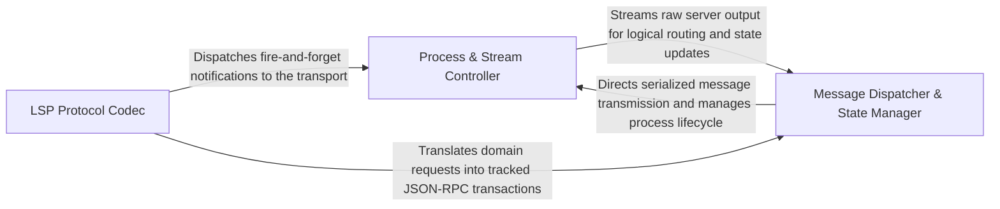

## Details

The foundational layer responsible for managing the asynchronous I/O streams, process lifecycle, and the low-level serialization of JSON-RPC messages.

### Process & Stream Controller
Manages the physical lifecycle of the Language Server process and the low-level asynchronous pipes, including spawning, stream management, and shutdown.

**Related Classes/Methods**:

- `static_analyzer.engine.lsp_client.LSPClient.start`:96-188
- `static_analyzer.engine.lsp_client.LSPClient._write_message`:588-601

**Source Files:**

- [`static_analyzer/engine/lsp_client.py`](https://github.com/CodeBoarding/CodeBoarding/blob/main/.codeboardingstatic_analyzer/engine/lsp_client.py)
  - `static_analyzer.engine.lsp_client.LSPClient.__enter__` ([L89-L91](https://github.com/CodeBoarding/CodeBoarding/blob/main/.codeboardingstatic_analyzer/engine/lsp_client.py#L89-L91)) - Method
  - `static_analyzer.engine.lsp_client.LSPClient.start` ([L96-L188](https://github.com/CodeBoarding/CodeBoarding/blob/main/.codeboardingstatic_analyzer/engine/lsp_client.py#L96-L188)) - Method
  - `static_analyzer.engine.lsp_client.LSPClient._send_notification` ([L579-L586](https://github.com/CodeBoarding/CodeBoarding/blob/main/.codeboardingstatic_analyzer/engine/lsp_client.py#L579-L586)) - Method
  - `static_analyzer.engine.lsp_client.LSPClient._write_message` ([L588-L601](https://github.com/CodeBoarding/CodeBoarding/blob/main/.codeboardingstatic_analyzer/engine/lsp_client.py#L588-L601)) - Method
  - `static_analyzer.engine.lsp_client.LSPClient._handle_server_request` ([L718-L732](https://github.com/CodeBoarding/CodeBoarding/blob/main/.codeboardingstatic_analyzer/engine/lsp_client.py#L718-L732)) - Method

### Message Dispatcher & State Manager
Orchestrates the flow of JSON-RPC messages, tracking pending requests, matching responses to futures, and routing notifications.

**Related Classes/Methods**: _None_

**Source Files:**

- [`static_analyzer/engine/lsp_client.py`](https://github.com/CodeBoarding/CodeBoarding/blob/main/.codeboardingstatic_analyzer/engine/lsp_client.py)
  - `static_analyzer.engine.lsp_client.LSPClient.did_change` ([L248-L259](https://github.com/CodeBoarding/CodeBoarding/blob/main/.codeboardingstatic_analyzer/engine/lsp_client.py#L248-L259)) - Method
  - `static_analyzer.engine.lsp_client.LSPClient._reader_loop` ([L680-L716](https://github.com/CodeBoarding/CodeBoarding/blob/main/.codeboardingstatic_analyzer/engine/lsp_client.py#L680-L716)) - Method
  - `static_analyzer.engine.lsp_client.LSPClient._read_single_message` ([L793-L833](https://github.com/CodeBoarding/CodeBoarding/blob/main/.codeboardingstatic_analyzer/engine/lsp_client.py#L793-L833)) - Method

### LSP Protocol Codec
Handles serialization and deserialization of data according to the LSP wire format, including header parsing and JSON encoding/decoding.

**Related Classes/Methods**: _None_

**Source Files:**

- [`static_analyzer/engine/lsp_client.py`](https://github.com/CodeBoarding/CodeBoarding/blob/main/.codeboardingstatic_analyzer/engine/lsp_client.py)
  - `static_analyzer.engine.lsp_client.LSPClient.did_close` ([L261-L269](https://github.com/CodeBoarding/CodeBoarding/blob/main/.codeboardingstatic_analyzer/engine/lsp_client.py#L261-L269)) - Method

### [FAQ](https://github.com/CodeBoarding/GeneratedOnBoardings/tree/main?tab=readme-ov-file#faq)