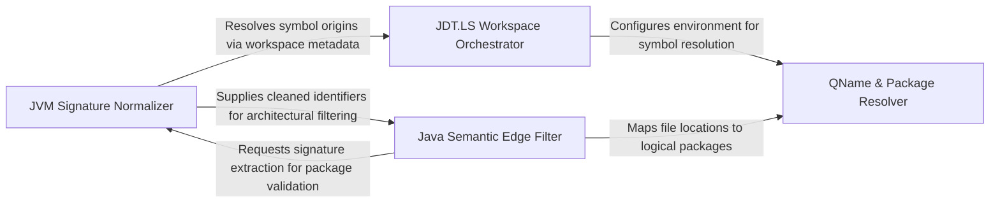

## Details

Handles languages with strict package-to-file mappings and complex symbol signatures, focusing on JDT.LS workspace management and normalization of Java-specific constructs like generics.

### JDT.LS Workspace Orchestrator
Manages the specialized lifecycle and environment configuration required for the Java Language Server, including root URI detection and workspace initialization.

**Related Classes/Methods**: _None_

**Source Files:**

- [`static_analyzer/engine/adapters/java_adapter.py`](https://github.com/CodeBoarding/CodeBoarding/blob/main/.codeboardingstatic_analyzer/engine/adapters/java_adapter.py)
  - `static_analyzer.engine.adapters.java_adapter.JavaAdapter` ([L25-L300](https://github.com/CodeBoarding/CodeBoarding/blob/main/.codeboardingstatic_analyzer/engine/adapters/java_adapter.py#L25-L300)) - Class
  - `static_analyzer.engine.adapters.java_adapter.JavaAdapter._clean_symbol_name` ([L161-L199](https://github.com/CodeBoarding/CodeBoarding/blob/main/.codeboardingstatic_analyzer/engine/adapters/java_adapter.py#L161-L199)) - Method
  - `static_analyzer.engine.adapters.java_adapter.JavaAdapter._strip_generics` ([L202-L213](https://github.com/CodeBoarding/CodeBoarding/blob/main/.codeboardingstatic_analyzer/engine/adapters/java_adapter.py#L202-L213)) - Method
  - `static_analyzer.engine.adapters.java_adapter.JavaAdapter._split_params` ([L216-L235](https://github.com/CodeBoarding/CodeBoarding/blob/main/.codeboardingstatic_analyzer/engine/adapters/java_adapter.py#L216-L235)) - Method

### JVM Signature Normalizer
Transforms verbose JVM-specific symbol signatures into normalized identifiers by stripping generics and handling type erasure artifacts.

**Related Classes/Methods**: _None_

**Source Files:**

- [`static_analyzer/engine/adapters/java_adapter.py`](https://github.com/CodeBoarding/CodeBoarding/blob/main/.codeboardingstatic_analyzer/engine/adapters/java_adapter.py)
  - `static_analyzer.engine.adapters.java_adapter.JavaAdapter.build_qualified_name` ([L133-L158](https://github.com/CodeBoarding/CodeBoarding/blob/main/.codeboardingstatic_analyzer/engine/adapters/java_adapter.py#L133-L158)) - Method
  - `static_analyzer.engine.adapters.java_adapter.JavaAdapter.extract_package` ([L237-L267](https://github.com/CodeBoarding/CodeBoarding/blob/main/.codeboardingstatic_analyzer/engine/adapters/java_adapter.py#L237-L267)) - Method
  - `static_analyzer.engine.adapters.java_adapter.JavaAdapter.edge_strategy` ([L284-L286](https://github.com/CodeBoarding/CodeBoarding/blob/main/.codeboardingstatic_analyzer/engine/adapters/java_adapter.py#L284-L286)) - Method
  - `static_analyzer.engine.adapters.java_adapter.JavaAdapter.get_all_packages` ([L296-L300](https://github.com/CodeBoarding/CodeBoarding/blob/main/.codeboardingstatic_analyzer/engine/adapters/java_adapter.py#L296-L300)) - Method

### Java Semantic Edge Filter
Implements architectural noise reduction by filtering out standard library calls and verifying if a package is internal to the project.

**Related Classes/Methods**: _None_

**Source Files:**

- [`static_analyzer/engine/adapters/java_adapter.py`](https://github.com/CodeBoarding/CodeBoarding/blob/main/.codeboardingstatic_analyzer/engine/adapters/java_adapter.py)
  - `static_analyzer.engine.adapters.java_adapter.JavaAdapter.language` ([L36-L37](https://github.com/CodeBoarding/CodeBoarding/blob/main/.codeboardingstatic_analyzer/engine/adapters/java_adapter.py#L36-L37)) - Method
  - `static_analyzer.engine.adapters.java_adapter.JavaAdapter.language_enum` ([L40-L41](https://github.com/CodeBoarding/CodeBoarding/blob/main/.codeboardingstatic_analyzer/engine/adapters/java_adapter.py#L40-L41)) - Method
  - `static_analyzer.engine.adapters.java_adapter.JavaAdapter.get_workspace_settings` ([L269-L281](https://github.com/CodeBoarding/CodeBoarding/blob/main/.codeboardingstatic_analyzer/engine/adapters/java_adapter.py#L269-L281)) - Method
  - `static_analyzer.engine.adapters.java_adapter.JavaAdapter.get_package_for_file` ([L291-L294](https://github.com/CodeBoarding/CodeBoarding/blob/main/.codeboardingstatic_analyzer/engine/adapters/java_adapter.py#L291-L294)) - Method

### QName & Package Resolver
Maps physical source code locations to logical Fully Qualified Names (QNames) to ensure correct attribution of symbols to classes and packages.

**Related Classes/Methods**: _None_

**Source Files:**

- [`static_analyzer/engine/adapters/java_adapter.py`](https://github.com/CodeBoarding/CodeBoarding/blob/main/.codeboardingstatic_analyzer/engine/adapters/java_adapter.py)
  - `static_analyzer.engine.adapters.java_adapter.JavaAdapter.wait_for_workspace_ready` ([L28-L33](https://github.com/CodeBoarding/CodeBoarding/blob/main/.codeboardingstatic_analyzer/engine/adapters/java_adapter.py#L28-L33)) - Method
  - `static_analyzer.engine.adapters.java_adapter.JavaAdapter.lsp_command` ([L44-L45](https://github.com/CodeBoarding/CodeBoarding/blob/main/.codeboardingstatic_analyzer/engine/adapters/java_adapter.py#L44-L45)) - Method
  - `static_analyzer.engine.adapters.java_adapter.JavaAdapter.language_id` ([L48-L49](https://github.com/CodeBoarding/CodeBoarding/blob/main/.codeboardingstatic_analyzer/engine/adapters/java_adapter.py#L48-L49)) - Method
  - `static_analyzer.engine.adapters.java_adapter.JavaAdapter.should_track_for_edges` ([L288-L289](https://github.com/CodeBoarding/CodeBoarding/blob/main/.codeboardingstatic_analyzer/engine/adapters/java_adapter.py#L288-L289)) - Method

### [FAQ](https://github.com/CodeBoarding/GeneratedOnBoardings/tree/main?tab=readme-ov-file#faq)