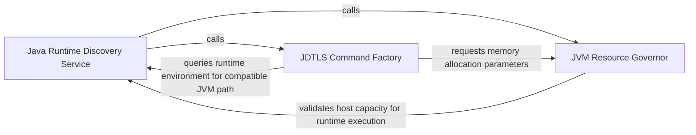

## Details

Automates discovery of Java 21+ runtimes and manages resource allocation for Eclipse JDT.LS to prevent OOM errors.

### Java Runtime Discovery Service
Scans the host environment to identify and validate Java installations, specifically targeting Java 21 or later to ensure compatibility with modern JDT.LS versions.

**Related Classes/Methods**: _None_

**Source Files:**

- [`static_analyzer/engine/adapters/java_adapter.py`](https://github.com/CodeBoarding/CodeBoarding/blob/main/.codeboardingstatic_analyzer/engine/adapters/java_adapter.py)
  - `static_analyzer.engine.adapters.java_adapter.JavaAdapter.get_lsp_command` ([L51-L71](https://github.com/CodeBoarding/CodeBoarding/blob/main/.codeboardingstatic_analyzer/engine/adapters/java_adapter.py#L51-L71)) - Method
  - `static_analyzer.engine.adapters.java_adapter.JavaAdapter._calculate_heap_size` ([L106-L131](https://github.com/CodeBoarding/CodeBoarding/blob/main/.codeboardingstatic_analyzer/engine/adapters/java_adapter.py#L106-L131)) - Method

### JVM Resource Governor
Dynamically calculates the memory footprint for the JDT.LS process by analyzing project size and system RAM to determine optimal heap settings.

**Related Classes/Methods**: _None_

**Source Files:**

- [`static_analyzer/engine/utils.py`](https://github.com/CodeBoarding/CodeBoarding/blob/main/.codeboardingstatic_analyzer/engine/utils.py)
  - `static_analyzer.engine.utils._MemoryStatusEx` ([L54-L65](https://github.com/CodeBoarding/CodeBoarding/blob/main/.codeboardingstatic_analyzer/engine/utils.py#L54-L65)) - Class
  - `static_analyzer.engine.utils.total_ram_gb` ([L68-L87](https://github.com/CodeBoarding/CodeBoarding/blob/main/.codeboardingstatic_analyzer/engine/utils.py#L68-L87)) - Function
- [`static_analyzer/java_utils.py`](https://github.com/CodeBoarding/CodeBoarding/blob/main/.codeboardingstatic_analyzer/java_utils.py)
  - `static_analyzer.java_utils.get_java_version` ([L12-L34](https://github.com/CodeBoarding/CodeBoarding/blob/main/.codeboardingstatic_analyzer/java_utils.py#L12-L34)) - Function
  - `static_analyzer.java_utils.detect_java_installations` ([L37-L92](https://github.com/CodeBoarding/CodeBoarding/blob/main/.codeboardingstatic_analyzer/java_utils.py#L37-L92)) - Function

### JDTLS Command Factory
Orchestrates the final assembly of the execution string by integrating environment paths, memory flags, and internal plugin configurations to spawn the language server.

**Related Classes/Methods**:

- `static_analyzer.java_utils.create_jdtls_command`:184-242

**Source Files:**

- [`static_analyzer/java_utils.py`](https://github.com/CodeBoarding/CodeBoarding/blob/main/.codeboardingstatic_analyzer/java_utils.py)
  - `static_analyzer.java_utils.find_java_21_or_later` ([L95-L137](https://github.com/CodeBoarding/CodeBoarding/blob/main/.codeboardingstatic_analyzer/java_utils.py#L95-L137)) - Function
  - `static_analyzer.java_utils._is_arm64` ([L140-L142](https://github.com/CodeBoarding/CodeBoarding/blob/main/.codeboardingstatic_analyzer/java_utils.py#L140-L142)) - Function
  - `static_analyzer.java_utils.get_jdtls_config_dir` ([L145-L157](https://github.com/CodeBoarding/CodeBoarding/blob/main/.codeboardingstatic_analyzer/java_utils.py#L145-L157)) - Function
  - `static_analyzer.java_utils.find_launcher_jar` ([L160-L181](https://github.com/CodeBoarding/CodeBoarding/blob/main/.codeboardingstatic_analyzer/java_utils.py#L160-L181)) - Function
  - `static_analyzer.java_utils.create_jdtls_command` ([L184-L242](https://github.com/CodeBoarding/CodeBoarding/blob/main/.codeboardingstatic_analyzer/java_utils.py#L184-L242)) - Function

### [FAQ](https://github.com/CodeBoarding/GeneratedOnBoardings/tree/main?tab=readme-ov-file#faq)