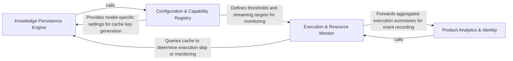

## Details

Manages state, observability, persistence, and execution metrics across the pipeline.

### Knowledge Persistence Engine
Manages the long-term storage and retrieval of static analysis artifacts using content-addressable keys to enable incremental processing.

**Related Classes/Methods**:

- `static_analyzer.analysis_cache.StaticAnalysisCache`:59-272
- `caching.cache.BaseCache`:30-268
- `static_analyzer.language_results.LanguageResults`:114-128

**Source Files:**

- [`agents/model_capabilities.py`](https://github.com/CodeBoarding/CodeBoarding/blob/main/.codeboardingagents/model_capabilities.py)
  - `agents.model_capabilities.get_context_window` ([L30-L44](https://github.com/CodeBoarding/CodeBoarding/blob/main/.codeboardingagents/model_capabilities.py#L30-L44)) - Function
  - `agents.model_capabilities._resolve_env` ([L47-L61](https://github.com/CodeBoarding/CodeBoarding/blob/main/.codeboardingagents/model_capabilities.py#L47-L61)) - Function
  - `agents.model_capabilities._resolve_ollama` ([L82-L91](https://github.com/CodeBoarding/CodeBoarding/blob/main/.codeboardingagents/model_capabilities.py#L82-L91)) - Function
  - `agents.model_capabilities._ollama_show` ([L94-L124](https://github.com/CodeBoarding/CodeBoarding/blob/main/.codeboardingagents/model_capabilities.py#L94-L124)) - Function
  - `agents.model_capabilities._parse_num_ctx` ([L127-L130](https://github.com/CodeBoarding/CodeBoarding/blob/main/.codeboardingagents/model_capabilities.py#L127-L130)) - Function
  - `agents.model_capabilities._resolve_modelsdev` ([L133-L145](https://github.com/CodeBoarding/CodeBoarding/blob/main/.codeboardingagents/model_capabilities.py#L133-L145)) - Function
  - `agents.model_capabilities._resolve_litellm` ([L148-L159](https://github.com/CodeBoarding/CodeBoarding/blob/main/.codeboardingagents/model_capabilities.py#L148-L159)) - Function
  - `agents.model_capabilities._resolve_openrouter` ([L162-L171](https://github.com/CodeBoarding/CodeBoarding/blob/main/.codeboardingagents/model_capabilities.py#L162-L171)) - Function
  - `agents.model_capabilities._openrouter_id` ([L174-L180](https://github.com/CodeBoarding/CodeBoarding/blob/main/.codeboardingagents/model_capabilities.py#L174-L180)) - Function
  - `agents.model_capabilities._load` ([L184-L203](https://github.com/CodeBoarding/CodeBoarding/blob/main/.codeboardingagents/model_capabilities.py#L184-L203)) - Function
  - `agents.model_capabilities._read_cache` ([L206-L213](https://github.com/CodeBoarding/CodeBoarding/blob/main/.codeboardingagents/model_capabilities.py#L206-L213)) - Function
  - `agents.model_capabilities._normalize` ([L216-L221](https://github.com/CodeBoarding/CodeBoarding/blob/main/.codeboardingagents/model_capabilities.py#L216-L221)) - Function
- [`caching/cache.py`](https://github.com/CodeBoarding/CodeBoarding/blob/main/.codeboardingcaching/cache.py)
  - `caching.cache.BaseCache` ([L30-L268](https://github.com/CodeBoarding/CodeBoarding/blob/main/.codeboardingcaching/cache.py#L30-L268)) - Class
  - `caching.cache.BaseCache.__init__` ([L36-L63](https://github.com/CodeBoarding/CodeBoarding/blob/main/.codeboardingcaching/cache.py#L36-L63)) - Method
  - `caching.cache.BaseCache.close` ([L259-L268](https://github.com/CodeBoarding/CodeBoarding/blob/main/.codeboardingcaching/cache.py#L259-L268)) - Method
  - `caching.cache.ModelSettings` ([L271-L310](https://github.com/CodeBoarding/CodeBoarding/blob/main/.codeboardingcaching/cache.py#L271-L310)) - Class
  - `caching.cache.ModelSettings.canonical_json` ([L284-L286](https://github.com/CodeBoarding/CodeBoarding/blob/main/.codeboardingcaching/cache.py#L284-L286)) - Method
  - `caching.cache.ModelSettings.signature` ([L288-L289](https://github.com/CodeBoarding/CodeBoarding/blob/main/.codeboardingcaching/cache.py#L288-L289)) - Method
- [`caching/details_cache.py`](https://github.com/CodeBoarding/CodeBoarding/blob/main/.codeboardingcaching/details_cache.py)
  - `caching.details_cache.FinalAnalysisCache.__init__` ([L24-L30](https://github.com/CodeBoarding/CodeBoarding/blob/main/.codeboardingcaching/details_cache.py#L24-L30)) - Method
  - `caching.details_cache.ClusterCache.__init__` ([L43-L49](https://github.com/CodeBoarding/CodeBoarding/blob/main/.codeboardingcaching/details_cache.py#L43-L49)) - Method
- [`caching/meta_cache.py`](https://github.com/CodeBoarding/CodeBoarding/blob/main/.codeboardingcaching/meta_cache.py)
  - `caching.meta_cache.MetaCache.__init__` ([L46-L55](https://github.com/CodeBoarding/CodeBoarding/blob/main/.codeboardingcaching/meta_cache.py#L46-L55)) - Method
- [`diagram_analysis/diagram_generator.py`](https://github.com/CodeBoarding/CodeBoarding/blob/main/.codeboardingdiagram_analysis/diagram_generator.py)
  - `diagram_analysis.diagram_generator.DiagramGenerator._persist_static_analysis_artifact` ([L248-L255](https://github.com/CodeBoarding/CodeBoarding/blob/main/.codeboardingdiagram_analysis/diagram_generator.py#L248-L255)) - Method
- [`static_analyzer/__init__.py`](https://github.com/CodeBoarding/CodeBoarding/blob/main/.codeboardingstatic_analyzer/__init__.py)
  - `static_analyzer.__init__.StaticAnalyzer.flush_cache` ([L319-L335](https://github.com/CodeBoarding/CodeBoarding/blob/main/.codeboardingstatic_analyzer/__init__.py#L319-L335)) - Method
  - `static_analyzer.__init__.StaticAnalyzer.load_from_disk_cache` ([L355-L385](https://github.com/CodeBoarding/CodeBoarding/blob/main/.codeboardingstatic_analyzer/__init__.py#L355-L385)) - Method
- [`static_analyzer/analysis_cache.py`](https://github.com/CodeBoarding/CodeBoarding/blob/main/.codeboardingstatic_analyzer/analysis_cache.py)
  - `static_analyzer.analysis_cache.StaticAnalysisCache` ([L59-L272](https://github.com/CodeBoarding/CodeBoarding/blob/main/.codeboardingstatic_analyzer/analysis_cache.py#L59-L272)) - Class
  - `static_analyzer.analysis_cache.StaticAnalysisCache.__init__` ([L68-L70](https://github.com/CodeBoarding/CodeBoarding/blob/main/.codeboardingstatic_analyzer/analysis_cache.py#L68-L70)) - Method
  - `static_analyzer.analysis_cache.StaticAnalysisCache._to_relative` ([L72-L73](https://github.com/CodeBoarding/CodeBoarding/blob/main/.codeboardingstatic_analyzer/analysis_cache.py#L72-L73)) - Method
  - `static_analyzer.analysis_cache.StaticAnalysisCache._to_absolute` ([L75-L76](https://github.com/CodeBoarding/CodeBoarding/blob/main/.codeboardingstatic_analyzer/analysis_cache.py#L75-L76)) - Method
  - `static_analyzer.analysis_cache.StaticAnalysisCache._relativize` ([L78-L87](https://github.com/CodeBoarding/CodeBoarding/blob/main/.codeboardingstatic_analyzer/analysis_cache.py#L78-L87)) - Method
  - `static_analyzer.analysis_cache.StaticAnalysisCache._absolutize` ([L89-L97](https://github.com/CodeBoarding/CodeBoarding/blob/main/.codeboardingstatic_analyzer/analysis_cache.py#L89-L97)) - Method
  - `static_analyzer.analysis_cache.StaticAnalysisCache.pkl_path` ([L100-L101](https://github.com/CodeBoarding/CodeBoarding/blob/main/.codeboardingstatic_analyzer/analysis_cache.py#L100-L101)) - Method
  - `static_analyzer.analysis_cache.StaticAnalysisCache.sha_path` ([L104-L105](https://github.com/CodeBoarding/CodeBoarding/blob/main/.codeboardingstatic_analyzer/analysis_cache.py#L104-L105)) - Method
  - `static_analyzer.analysis_cache.StaticAnalysisCache.lock_path` ([L108-L109](https://github.com/CodeBoarding/CodeBoarding/blob/main/.codeboardingstatic_analyzer/analysis_cache.py#L108-L109)) - Method
  - `static_analyzer.analysis_cache.StaticAnalysisCache.read_tag_sha` ([L111-L125](https://github.com/CodeBoarding/CodeBoarding/blob/main/.codeboardingstatic_analyzer/analysis_cache.py#L111-L125)) - Method
  - `static_analyzer.analysis_cache.StaticAnalysisCache._read_tag_sha_unlocked` ([L127-L139](https://github.com/CodeBoarding/CodeBoarding/blob/main/.codeboardingstatic_analyzer/analysis_cache.py#L127-L139)) - Method
  - `static_analyzer.analysis_cache.StaticAnalysisCache._legacy_pkl_path` ([L141-L142](https://github.com/CodeBoarding/CodeBoarding/blob/main/.codeboardingstatic_analyzer/analysis_cache.py#L141-L142)) - Method
  - `static_analyzer.analysis_cache.StaticAnalysisCache.load_with_sha` ([L144-L163](https://github.com/CodeBoarding/CodeBoarding/blob/main/.codeboardingstatic_analyzer/analysis_cache.py#L144-L163)) - Method
  - `static_analyzer.analysis_cache.StaticAnalysisCache.get` ([L165-L177](https://github.com/CodeBoarding/CodeBoarding/blob/main/.codeboardingstatic_analyzer/analysis_cache.py#L165-L177)) - Method
  - `static_analyzer.analysis_cache.StaticAnalysisCache._get_unlocked` ([L179-L213](https://github.com/CodeBoarding/CodeBoarding/blob/main/.codeboardingstatic_analyzer/analysis_cache.py#L179-L213)) - Method
  - `static_analyzer.analysis_cache.StaticAnalysisCache.save` ([L215-L272](https://github.com/CodeBoarding/CodeBoarding/blob/main/.codeboardingstatic_analyzer/analysis_cache.py#L215-L272)) - Method
  - `static_analyzer.analysis_cache.copy_cache_files` ([L275-L314](https://github.com/CodeBoarding/CodeBoarding/blob/main/.codeboardingstatic_analyzer/analysis_cache.py#L275-L314)) - Function
  - `static_analyzer.analysis_cache._atomic_copy` ([L317-L332](https://github.com/CodeBoarding/CodeBoarding/blob/main/.codeboardingstatic_analyzer/analysis_cache.py#L317-L332)) - Function
- [`static_analyzer/language_results.py`](https://github.com/CodeBoarding/CodeBoarding/blob/main/.codeboardingstatic_analyzer/language_results.py)
  - `static_analyzer.language_results.ControlFlowGraph` ([L18-L37](https://github.com/CodeBoarding/CodeBoarding/blob/main/.codeboardingstatic_analyzer/language_results.py#L18-L37)) - Class
  - `static_analyzer.language_results.ControlFlowGraph.visit_paths` ([L33-L37](https://github.com/CodeBoarding/CodeBoarding/blob/main/.codeboardingstatic_analyzer/language_results.py#L33-L37)) - Method
  - `static_analyzer.language_results.ClassHierarchy` ([L41-L59](https://github.com/CodeBoarding/CodeBoarding/blob/main/.codeboardingstatic_analyzer/language_results.py#L41-L59)) - Class
  - `static_analyzer.language_results.ClassHierarchy.visit_paths` ([L54-L59](https://github.com/CodeBoarding/CodeBoarding/blob/main/.codeboardingstatic_analyzer/language_results.py#L54-L59)) - Method
  - `static_analyzer.language_results.References` ([L63-L77](https://github.com/CodeBoarding/CodeBoarding/blob/main/.codeboardingstatic_analyzer/language_results.py#L63-L77)) - Class
  - `static_analyzer.language_results.References.visit_paths` ([L72-L77](https://github.com/CodeBoarding/CodeBoarding/blob/main/.codeboardingstatic_analyzer/language_results.py#L72-L77)) - Method
  - `static_analyzer.language_results.PackageDependencies` ([L81-L95](https://github.com/CodeBoarding/CodeBoarding/blob/main/.codeboardingstatic_analyzer/language_results.py#L81-L95)) - Class
  - `static_analyzer.language_results.PackageDependencies.visit_paths` ([L90-L95](https://github.com/CodeBoarding/CodeBoarding/blob/main/.codeboardingstatic_analyzer/language_results.py#L90-L95)) - Method
  - `static_analyzer.language_results.SourceFiles` ([L99-L110](https://github.com/CodeBoarding/CodeBoarding/blob/main/.codeboardingstatic_analyzer/language_results.py#L99-L110)) - Class
  - `static_analyzer.language_results.SourceFiles.visit_paths` ([L107-L110](https://github.com/CodeBoarding/CodeBoarding/blob/main/.codeboardingstatic_analyzer/language_results.py#L107-L110)) - Method
  - `static_analyzer.language_results.LanguageResults.visit_paths` ([L123-L128](https://github.com/CodeBoarding/CodeBoarding/blob/main/.codeboardingstatic_analyzer/language_results.py#L123-L128)) - Method
- [`utils.py`](https://github.com/CodeBoarding/CodeBoarding/blob/main/.codeboardingutils.py)
  - `utils.get_cache_dir` ([L34-L41](https://github.com/CodeBoarding/CodeBoarding/blob/main/.codeboardingutils.py#L34-L41)) - Function
  - `utils.get_artifact_dir` ([L44-L52](https://github.com/CodeBoarding/CodeBoarding/blob/main/.codeboardingutils.py#L44-L52)) - Function
  - `utils.to_relative_path` ([L88-L94](https://github.com/CodeBoarding/CodeBoarding/blob/main/.codeboardingutils.py#L88-L94)) - Function
  - `utils.to_absolute_path` ([L97-L105](https://github.com/CodeBoarding/CodeBoarding/blob/main/.codeboardingutils.py#L97-L105)) - Function

### Execution & Resource Monitor
Provides real-time tracking of the pipeline's execution state, including step-level timing and LLM token consumption metrics.

**Related Classes/Methods**:

- `monitoring.context.monitor_execution`:19-128
- `monitoring.stats.RunStats`:10-46
- `monitoring.writers.StreamingStatsWriter`:18-172

**Source Files:**

- [`monitoring/callbacks.py`](https://github.com/CodeBoarding/CodeBoarding/blob/main/.codeboardingmonitoring/callbacks.py)
  - `monitoring.callbacks.MonitoringCallback` ([L16-L163](https://github.com/CodeBoarding/CodeBoarding/blob/main/.codeboardingmonitoring/callbacks.py#L16-L163)) - Class
- [`monitoring/context.py`](https://github.com/CodeBoarding/CodeBoarding/blob/main/.codeboardingmonitoring/context.py)
  - `monitoring.context.monitor_execution` ([L19-L128](https://github.com/CodeBoarding/CodeBoarding/blob/main/.codeboardingmonitoring/context.py#L19-L128)) - Function
  - `monitoring.context.monitor_execution.DummyContext` ([L32-L37](https://github.com/CodeBoarding/CodeBoarding/blob/main/.codeboardingmonitoring/context.py#L32-L37)) - Class
  - `monitoring.context.monitor_execution.MonitorContext` ([L73-L91](https://github.com/CodeBoarding/CodeBoarding/blob/main/.codeboardingmonitoring/context.py#L73-L91)) - Class
  - `monitoring.context.monitor_execution.MonitorContext.end_step` ([L83-L87](https://github.com/CodeBoarding/CodeBoarding/blob/main/.codeboardingmonitoring/context.py#L83-L87)) - Method
  - `monitoring.context.monitor_execution.MonitorContext.close` ([L89-L91](https://github.com/CodeBoarding/CodeBoarding/blob/main/.codeboardingmonitoring/context.py#L89-L91)) - Method
- [`monitoring/mixin.py`](https://github.com/CodeBoarding/CodeBoarding/blob/main/.codeboardingmonitoring/mixin.py)
  - `monitoring.mixin.MonitoringMixin` ([L5-L16](https://github.com/CodeBoarding/CodeBoarding/blob/main/.codeboardingmonitoring/mixin.py#L5-L16)) - Class
  - `monitoring.mixin.MonitoringMixin.__init__` ([L6-L12](https://github.com/CodeBoarding/CodeBoarding/blob/main/.codeboardingmonitoring/mixin.py#L6-L12)) - Method
  - `monitoring.mixin.MonitoringMixin.get_monitoring_results` ([L14-L16](https://github.com/CodeBoarding/CodeBoarding/blob/main/.codeboardingmonitoring/mixin.py#L14-L16)) - Method
- [`monitoring/stats.py`](https://github.com/CodeBoarding/CodeBoarding/blob/main/.codeboardingmonitoring/stats.py)
  - `monitoring.stats.RunStats` ([L10-L46](https://github.com/CodeBoarding/CodeBoarding/blob/main/.codeboardingmonitoring/stats.py#L10-L46)) - Class
  - `monitoring.stats.RunStats.__init__` ([L13-L15](https://github.com/CodeBoarding/CodeBoarding/blob/main/.codeboardingmonitoring/stats.py#L13-L15)) - Method
  - `monitoring.stats.RunStats.reset` ([L17-L26](https://github.com/CodeBoarding/CodeBoarding/blob/main/.codeboardingmonitoring/stats.py#L17-L26)) - Method
  - `monitoring.stats.RunStats.to_dict` ([L28-L46](https://github.com/CodeBoarding/CodeBoarding/blob/main/.codeboardingmonitoring/stats.py#L28-L46)) - Method
- [`monitoring/writers.py`](https://github.com/CodeBoarding/CodeBoarding/blob/main/.codeboardingmonitoring/writers.py)
  - `monitoring.writers.StreamingStatsWriter.llm_usage_file` ([L47-L48](https://github.com/CodeBoarding/CodeBoarding/blob/main/.codeboardingmonitoring/writers.py#L47-L48)) - Method
  - `monitoring.writers.StreamingStatsWriter.__enter__` ([L50-L52](https://github.com/CodeBoarding/CodeBoarding/blob/main/.codeboardingmonitoring/writers.py#L50-L52)) - Method
  - `monitoring.writers.StreamingStatsWriter.__exit__` ([L54-L56](https://github.com/CodeBoarding/CodeBoarding/blob/main/.codeboardingmonitoring/writers.py#L54-L56)) - Method
  - `monitoring.writers.StreamingStatsWriter.start` ([L58-L68](https://github.com/CodeBoarding/CodeBoarding/blob/main/.codeboardingmonitoring/writers.py#L58-L68)) - Method
  - `monitoring.writers.StreamingStatsWriter.stop` ([L70-L82](https://github.com/CodeBoarding/CodeBoarding/blob/main/.codeboardingmonitoring/writers.py#L70-L82)) - Method
  - `monitoring.writers.StreamingStatsWriter._loop` ([L84-L88](https://github.com/CodeBoarding/CodeBoarding/blob/main/.codeboardingmonitoring/writers.py#L84-L88)) - Method
  - `monitoring.writers.StreamingStatsWriter._stream_token_usage` ([L90-L114](https://github.com/CodeBoarding/CodeBoarding/blob/main/.codeboardingmonitoring/writers.py#L90-L114)) - Method
  - `monitoring.writers.StreamingStatsWriter._save_llm_usage` ([L116-L137](https://github.com/CodeBoarding/CodeBoarding/blob/main/.codeboardingmonitoring/writers.py#L116-L137)) - Method
  - `monitoring.writers.StreamingStatsWriter._save_run_metadata` ([L139-L172](https://github.com/CodeBoarding/CodeBoarding/blob/main/.codeboardingmonitoring/writers.py#L139-L172)) - Method
- [`telemetry/events.py`](https://github.com/CodeBoarding/CodeBoarding/blob/main/.codeboardingtelemetry/events.py)
  - `telemetry.events._token_usage` ([L58-L70](https://github.com/CodeBoarding/CodeBoarding/blob/main/.codeboardingtelemetry/events.py#L58-L70)) - Function
- [`telemetry/schemas.py`](https://github.com/CodeBoarding/CodeBoarding/blob/main/.codeboardingtelemetry/schemas.py)
  - `telemetry.schemas.TokenSnapshot` ([L63-L67](https://github.com/CodeBoarding/CodeBoarding/blob/main/.codeboardingtelemetry/schemas.py#L63-L67)) - Class

### Product Analytics & Identity
Captures high-level functional events and anonymized usage data to track tool effectiveness and user engagement.

**Related Classes/Methods**:

- `telemetry.service.ProductTelemetry`:21-94
- `telemetry.events.track_analysis`:160-222
- `telemetry.device_id.generate_device_id`:85-91

**Source Files:**

- [`telemetry/device_id.py`](https://github.com/CodeBoarding/CodeBoarding/blob/main/.codeboardingtelemetry/device_id.py)
  - `telemetry.device_id._sha256` ([L10-L11](https://github.com/CodeBoarding/CodeBoarding/blob/main/.codeboardingtelemetry/device_id.py#L10-L11)) - Function
  - `telemetry.device_id._shell` ([L14-L16](https://github.com/CodeBoarding/CodeBoarding/blob/main/.codeboardingtelemetry/device_id.py#L14-L16)) - Function
  - `telemetry.device_id._linux_machine_id` ([L19-L24](https://github.com/CodeBoarding/CodeBoarding/blob/main/.codeboardingtelemetry/device_id.py#L19-L24)) - Function
  - `telemetry.device_id._system_uuid` ([L27-L42](https://github.com/CodeBoarding/CodeBoarding/blob/main/.codeboardingtelemetry/device_id.py#L27-L42)) - Function
  - `telemetry.device_id._disk_serial` ([L45-L60](https://github.com/CodeBoarding/CodeBoarding/blob/main/.codeboardingtelemetry/device_id.py#L45-L60)) - Function
  - `telemetry.device_id._raw_cpu_model` ([L63-L82](https://github.com/CodeBoarding/CodeBoarding/blob/main/.codeboardingtelemetry/device_id.py#L63-L82)) - Function
  - `telemetry.device_id.generate_device_id` ([L85-L91](https://github.com/CodeBoarding/CodeBoarding/blob/main/.codeboardingtelemetry/device_id.py#L85-L91)) - Function
- [`telemetry/events.py`](https://github.com/CodeBoarding/CodeBoarding/blob/main/.codeboardingtelemetry/events.py)
  - `telemetry.events._app_version` ([L41-L45](https://github.com/CodeBoarding/CodeBoarding/blob/main/.codeboardingtelemetry/events.py#L41-L45)) - Function
  - `telemetry.events._resolve_run_id` ([L53-L55](https://github.com/CodeBoarding/CodeBoarding/blob/main/.codeboardingtelemetry/events.py#L53-L55)) - Function
  - `telemetry.events.track_tech_stack` ([L73-L91](https://github.com/CodeBoarding/CodeBoarding/blob/main/.codeboardingtelemetry/events.py#L73-L91)) - Function
  - `telemetry.events.track_lsp_result` ([L94-L157](https://github.com/CodeBoarding/CodeBoarding/blob/main/.codeboardingtelemetry/events.py#L94-L157)) - Function
  - `telemetry.events.track_analysis.wrapper` ([L170-L220](https://github.com/CodeBoarding/CodeBoarding/blob/main/.codeboardingtelemetry/events.py#L170-L220)) - Function
  - `telemetry.events.capture_error` ([L225-L240](https://github.com/CodeBoarding/CodeBoarding/blob/main/.codeboardingtelemetry/events.py#L225-L240)) - Function
  - `telemetry.events._exception_properties` ([L243-L246](https://github.com/CodeBoarding/CodeBoarding/blob/main/.codeboardingtelemetry/events.py#L243-L246)) - Function
- [`telemetry/schemas.py`](https://github.com/CodeBoarding/CodeBoarding/blob/main/.codeboardingtelemetry/schemas.py)
  - `telemetry.schemas.LanguageStat` ([L10-L13](https://github.com/CodeBoarding/CodeBoarding/blob/main/.codeboardingtelemetry/schemas.py#L10-L13)) - Class
  - `telemetry.schemas.RepoScanned` ([L16-L22](https://github.com/CodeBoarding/CodeBoarding/blob/main/.codeboardingtelemetry/schemas.py#L16-L22)) - Class
  - `telemetry.schemas.LspAnalysisResult` ([L25-L40](https://github.com/CodeBoarding/CodeBoarding/blob/main/.codeboardingtelemetry/schemas.py#L25-L40)) - Class
  - `telemetry.schemas.AnalysisStarted` ([L43-L47](https://github.com/CodeBoarding/CodeBoarding/blob/main/.codeboardingtelemetry/schemas.py#L43-L47)) - Class
  - `telemetry.schemas.AnalysisCompleted` ([L50-L60](https://github.com/CodeBoarding/CodeBoarding/blob/main/.codeboardingtelemetry/schemas.py#L50-L60)) - Class
- [`telemetry/service.py`](https://github.com/CodeBoarding/CodeBoarding/blob/main/.codeboardingtelemetry/service.py)
  - `telemetry.service._telemetry_disabled` ([L15-L18](https://github.com/CodeBoarding/CodeBoarding/blob/main/.codeboardingtelemetry/service.py#L15-L18)) - Function
  - `telemetry.service.ProductTelemetry` ([L21-L94](https://github.com/CodeBoarding/CodeBoarding/blob/main/.codeboardingtelemetry/service.py#L21-L94)) - Class
  - `telemetry.service.ProductTelemetry.__new__` ([L26-L30](https://github.com/CodeBoarding/CodeBoarding/blob/main/.codeboardingtelemetry/service.py#L26-L30)) - Method
  - `telemetry.service.ProductTelemetry._init` ([L32-L49](https://github.com/CodeBoarding/CodeBoarding/blob/main/.codeboardingtelemetry/service.py#L32-L49)) - Method
  - `telemetry.service.ProductTelemetry.user_id` ([L52-L58](https://github.com/CodeBoarding/CodeBoarding/blob/main/.codeboardingtelemetry/service.py#L52-L58)) - Method
  - `telemetry.service.ProductTelemetry.capture` ([L60-L73](https://github.com/CodeBoarding/CodeBoarding/blob/main/.codeboardingtelemetry/service.py#L60-L73)) - Method
  - `telemetry.service.ProductTelemetry.capture_exception` ([L75-L87](https://github.com/CodeBoarding/CodeBoarding/blob/main/.codeboardingtelemetry/service.py#L75-L87)) - Method
  - `telemetry.service.ProductTelemetry.flush` ([L89-L94](https://github.com/CodeBoarding/CodeBoarding/blob/main/.codeboardingtelemetry/service.py#L89-L94)) - Method

### Configuration & Capability Registry
Centralizes user settings and AI model constraints, acting as the policy engine for the entire pipeline.

**Related Classes/Methods**:

- `user_config.UserConfig`:114-123
- `agents.model_capabilities.get_context_window`:30-44
- `user_config.load_user_config`:126-160

**Source Files:**

- [`agents/model_capabilities.py`](https://github.com/CodeBoarding/CodeBoarding/blob/main/.codeboardingagents/model_capabilities.py)
  - `agents.model_capabilities._resolve_user_config` ([L64-L70](https://github.com/CodeBoarding/CodeBoarding/blob/main/.codeboardingagents/model_capabilities.py#L64-L70)) - Function
  - `agents.model_capabilities._user_context_window_override` ([L74-L79](https://github.com/CodeBoarding/CodeBoarding/blob/main/.codeboardingagents/model_capabilities.py#L74-L79)) - Function
- [`user_config.py`](https://github.com/CodeBoarding/CodeBoarding/blob/main/.codeboardinguser_config.py)
  - `user_config.ProviderUserConfig` ([L86-L103](https://github.com/CodeBoarding/CodeBoarding/blob/main/.codeboardinguser_config.py#L86-L103)) - Class
  - `user_config.LLMUserConfig` ([L107-L110](https://github.com/CodeBoarding/CodeBoarding/blob/main/.codeboardinguser_config.py#L107-L110)) - Class
  - `user_config.UserConfig` ([L114-L123](https://github.com/CodeBoarding/CodeBoarding/blob/main/.codeboardinguser_config.py#L114-L123)) - Class
  - `user_config.load_user_config` ([L126-L160](https://github.com/CodeBoarding/CodeBoarding/blob/main/.codeboardinguser_config.py#L126-L160)) - Function

### [FAQ](https://github.com/CodeBoarding/GeneratedOnBoardings/tree/main?tab=readme-ov-file#faq)