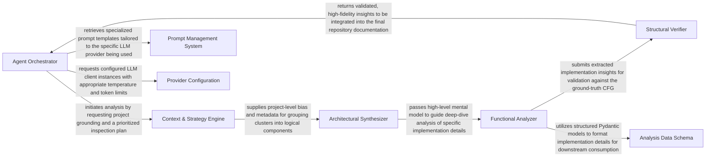

## Details

The intelligent core responsible for driving the code analysis and documentation generation using large language models. It orchestrates agent workflows, manages interactions with various tools, and structures the analysis insights.

### Agent Orchestrator
Central controller (CodeBoardingAgent) that manages the analysis lifecycle, maintains shared state, and sequences agent execution.

**Related Classes/Methods**:

- <a href="https://github.com/CodeBoarding/CodeBoarding/blob/main/.codeboardingagents/prompts/gemini_flash_prompts.py" target="_blank" rel="noopener noreferrer">`agents.prompts.gemini_flash_prompts.CodeBoardingAgent`</a>

### Context & Strategy Engine
Combines metadata extraction (MetaAgent) and recursive planning (PlannerAgent) to determine analysis scope and priorities.

**Related Classes/Methods**:

- <a href="https://github.com/CodeBoarding/CodeBoarding/blob/main/.codeboardingagents/prompts/gemini_flash_prompts.py" target="_blank" rel="noopener noreferrer">`agents.prompts.gemini_flash_prompts.MetaAgent`</a>
- <a href="https://github.com/CodeBoarding/CodeBoarding/blob/main/.codeboardingagents/prompts/gemini_flash_prompts.py" target="_blank" rel="noopener noreferrer">`agents.prompts.gemini_flash_prompts.PlannerAgent`</a>

### Architectural Synthesizer
AbstractionAgent responsible for grouping files and clusters into high‑level logical components based on CFG patterns.

**Related Classes/Methods**:

- <a href="https://github.com/CodeBoarding/CodeBoarding/blob/main/.codeboardingagents/prompts/gemini_flash_prompts.py" target="_blank" rel="noopener noreferrer">`agents.prompts.gemini_flash_prompts.AbstractionAgent`</a>

### Functional Analyzer
DetailsAgent that performs deep‑dives into specific subgraphs to extract implementation details and class/function relationships.

**Related Classes/Methods**:

- <a href="https://github.com/CodeBoarding/CodeBoarding/blob/main/.codeboardingagents/prompts/gemini_flash_prompts.py" target="_blank" rel="noopener noreferrer">`agents.prompts.gemini_flash_prompts.DetailsAgent`</a>

### Structural Verifier
ValidationEngine that cross‑references LLM insights against raw CFG data to ensure architectural claims match the actual call graph.

**Related Classes/Methods**:

- <a href="https://github.com/CodeBoarding/CodeBoarding/blob/main/.codeboardingagents/prompts/gemini_flash_prompts.py" target="_blank" rel="noopener noreferrer">`agents.prompts.gemini_flash_prompts.ValidationEngine`</a>

### Prompt Management System
PromptRegistry that provides model‑specific templates (Claude, GPT, Gemini) to ensure consistent LLM interactions.

**Related Classes/Methods**:

- <a href="https://github.com/CodeBoarding/CodeBoarding/blob/main/.codeboardingagents/prompts/gemini_flash_prompts.py" target="_blank" rel="noopener noreferrer">`agents.prompts.gemini_flash_prompts.PromptRegistry`</a>

### Provider Configuration
Manages LLM initialization, provider‑specific settings (Ollama, Bedrock, etc.), and system‑wide constants.

**Related Classes/Methods**:

- <a href="https://github.com/CodeBoarding/CodeBoarding/blob/main/.codeboardingagents/prompts/gemini_flash_prompts.py" target="_blank" rel="noopener noreferrer">`agents.prompts.gemini_flash_prompts.ProviderConfig`</a>

### Analysis Data Schema
Pydantic ResponseModels (e.g., AnalysisInsights) used for type‑safe communication between agents.

**Related Classes/Methods**:

- <a href="https://github.com/CodeBoarding/CodeBoarding/blob/main/.codeboardingagents/prompts/gemini_flash_prompts.py" target="_blank" rel="noopener noreferrer">`agents.prompts.gemini_flash_prompts.AnalysisInsights`</a>

### [FAQ](https://github.com/CodeBoarding/GeneratedOnBoardings/tree/main?tab=readme-ov-file#faq)