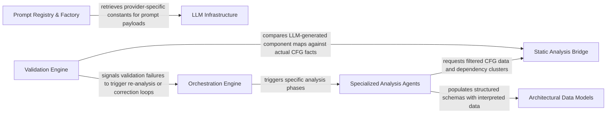

## Details

The intelligent core responsible for driving the code analysis and documentation generation using large language models. It orchestrates agent workflows, manages interactions with various tools, and structures the analysis insights.

### Orchestration Engine
Central supervisor that manages the analysis lifecycle, file classification, and depth planning, coordinating prompts and delegating tasks to specialized agents.

**Related Classes/Methods**: _None_

### Prompt Registry & Factory
Decoupled system for generating provider‑specific system messages and task templates, interfacing with LLM infrastructure for correct prompt formatting.

**Related Classes/Methods**:

- <a href="https://github.com/CodeBoarding/CodeBoarding/blob/main/.codeboardingagents/prompts/__init__.py" target="_blank" rel="noopener noreferrer">`repos.codeboarding.prompts.PromptGenerator`</a>

### Specialized Analysis Agents
Suite of agents (Meta, Abstraction, Details) that perform domain‑specific interpretation of code facts, querying the static analysis bridge and populating data models.

**Related Classes/Methods**:

- <a href="https://github.com/CodeBoarding/CodeBoarding/blob/main/.codeboardingagents/__init__.py" target="_blank" rel="noopener noreferrer">`repos.codeboarding.agents.meta_agent`</a>

### Validation Engine
Feedback loop that cross‑references LLM‑generated insights against the ground‑truth CFG to prevent hallucinations and informs the orchestrator of failures.

**Related Classes/Methods**:

- <a href="https://github.com/CodeBoarding/CodeBoarding/blob/main/.codeboardingagents/validation.py" target="_blank" rel="noopener noreferrer">`repos.codeboarding.agent.validation`</a>

### Architectural Data Models
Pydantic schemas defining the contract layer for inter‑agent communication and final insight representation.

**Related Classes/Methods**:

- <a href="https://github.com/CodeBoarding/CodeBoarding/blob/main/.codeboardingagents/agent_responses.py" target="_blank" rel="noopener noreferrer">`repos.codeboarding.models.AnalysisInsights`</a>

### Static Analysis Bridge
Utility layer that provides agents with filtered, relevant facts from the raw CFG and dependency graphs.

**Related Classes/Methods**:

- <a href="https://github.com/CodeBoarding/CodeBoarding/blob/main/.codeboardingagents/cluster_methods_mixin.py" target="_blank" rel="noopener noreferrer">`repos.codeboarding.utils.cluster_utils`</a>

### LLM Infrastructure
Manages multi‑provider configurations, API authentication, and shared runtime constants.

**Related Classes/Methods**:

- <a href="https://github.com/CodeBoarding/CodeBoarding/blob/main/.codeboardingagents/llm_config.py" target="_blank" rel="noopener noreferrer">`repos.codeboarding.config`</a>

### [FAQ](https://github.com/CodeBoarding/GeneratedOnBoardings/tree/main?tab=readme-ov-file#faq)