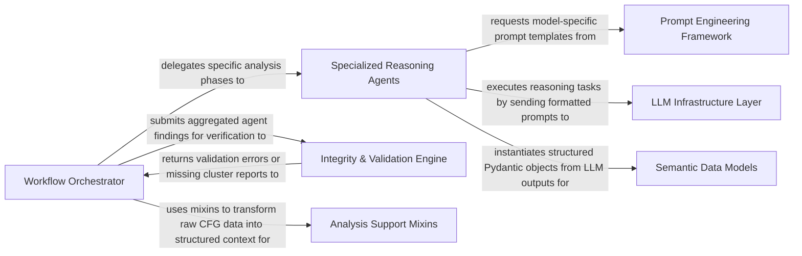

## Details

The intelligent core responsible for driving the code analysis and documentation generation using large language models. It orchestrates agent workflows, manages interactions with various tools, and structures the analysis insights.

### Workflow Orchestrator
The central brain of the subsystem. It manages the state machine of the analysis process, coordinates the sequence of agent invocations, and handles the logic for retrying failed analysis steps when validation fails.

**Related Classes/Methods**: _None_

### Specialized Reasoning Agents
A suite of task‑specific LLM agents that decompose the complex problem of code understanding into manageable phases: context gathering, planning, high‑level abstraction, and detailed component analysis.

**Related Classes/Methods**:

- <a href="https://github.com/CodeBoarding/CodeBoarding/blob/main/.codeboardingagents/__init__.py" target="_blank" rel="noopener noreferrer">`repos.codeboarding.agents.MetaAgent`</a>
- <a href="https://github.com/CodeBoarding/CodeBoarding/blob/main/.codeboardingagents/__init__.py" target="_blank" rel="noopener noreferrer">`repos.codeboarding.agents.PlannerAgent`</a>
- <a href="https://github.com/CodeBoarding/CodeBoarding/blob/main/.codeboardingagents/__init__.py" target="_blank" rel="noopener noreferrer">`repos.codeboarding.agents.AbstractionAgent`</a>
- <a href="https://github.com/CodeBoarding/CodeBoarding/blob/main/.codeboardingagents/__init__.py" target="_blank" rel="noopener noreferrer">`repos.codeboarding.agents.DetailsAgent`</a>

### Prompt Engineering Framework
A provider‑agnostic layer that manages the complex templates required for different LLMs. It ensures that reasoning agents receive the correct system instructions and context formatting regardless of the underlying model (Claude, GPT, Gemini).

**Related Classes/Methods**:

- <a href="https://github.com/CodeBoarding/CodeBoarding/blob/main/.codeboardingagents/prompts/__init__.py" target="_blank" rel="noopener noreferrer">`repos.codeboarding.prompts.PromptFactory`</a>
- <a href="https://github.com/CodeBoarding/CodeBoarding/blob/main/.codeboardingagents/prompts/__init__.py" target="_blank" rel="noopener noreferrer">`repos.codeboarding.prompts.PromptGenerator`</a>
- <a href="https://github.com/CodeBoarding/CodeBoarding/blob/main/.codeboardingagents/prompts/__init__.py" target="_blank" rel="noopener noreferrer">`repos.codeboarding.agents.prompts.gemini_flash_prompts`</a>

### Integrity & Validation Engine
The "ground‑truth" gatekeeper. It compares the semantic components proposed by LLMs against the hard static analysis data (CFG clusters) to ensure no code is left unanalyzed and that the architecture is technically sound.

**Related Classes/Methods**:

- <a href="https://github.com/CodeBoarding/CodeBoarding/blob/main/.codeboardingagents/validation.py" target="_blank" rel="noopener noreferrer">`repos.codeboarding.validation.IntegrityChecker`</a>
- <a href="https://github.com/CodeBoarding/CodeBoarding/blob/main/.codeboardingagents/validation.py" target="_blank" rel="noopener noreferrer">`repos.codeboarding.validation.IntegrityChecker.verify_cluster_coverage`</a>
- <a href="https://github.com/CodeBoarding/CodeBoarding/blob/main/.codeboardingagents/validation.py" target="_blank" rel="noopener noreferrer">`repos.codeboarding.validation.IntegrityChecker.validate_schema_conformity`</a>

### Semantic Data Models
Pydantic‑based schemas that define the "language" of the subsystem. These models enforce strict typing on LLM outputs, ensuring that downstream components receive predictable data structures.

**Related Classes/Methods**:

- <a href="https://github.com/CodeBoarding/CodeBoarding/blob/main/.codeboardingagents/agent_responses.py" target="_blank" rel="noopener noreferrer">`repos.codeboarding.models.AnalysisInsights`</a>
- <a href="https://github.com/CodeBoarding/CodeBoarding/blob/main/.codeboardingagents/agent_responses.py" target="_blank" rel="noopener noreferrer">`repos.codeboarding.models.Component`</a>
- <a href="https://github.com/CodeBoarding/CodeBoarding/blob/main/.codeboardingagents/agent_responses.py" target="_blank" rel="noopener noreferrer">`repos.codeboarding.models.Relation`</a>

### Analysis Support Mixins
Utility layers that bridge the gap between raw static analysis data and LLM‑friendly text. They handle the heavy lifting of mapping CFG nodes to source files and cleaning data for prompt inclusion.

**Related Classes/Methods**:

- <a href="https://github.com/CodeBoarding/CodeBoarding/blob/main/.codeboardingagents/cluster_methods_mixin.py" target="_blank" rel="noopener noreferrer">`repos.codeboarding.mixins.ClusterMethodsMixin`</a>
- <a href="https://github.com/CodeBoarding/CodeBoarding/blob/main/.codeboardingagents/cluster_methods_mixin.py" target="_blank" rel="noopener noreferrer">`repos.codeboarding.mixins.ClusterMethodsMixin.get_cluster_context`</a>
- <a href="https://github.com/CodeBoarding/CodeBoarding/blob/main/.codeboardingagents/cluster_methods_mixin.py" target="_blank" rel="noopener noreferrer">`repos.codeboarding.utils.DataSanitizer`</a>

### LLM Infrastructure Layer
Manages the lifecycle and configuration of LLM connections. It abstracts the complexities of different API providers (OpenAI, Anthropic, Gemini) and provides a unified interface for the agents.

**Related Classes/Methods**:

- <a href="https://github.com/CodeBoarding/CodeBoarding/blob/main/.codeboardingagents/llm_config.py" target="_blank" rel="noopener noreferrer">`repos.codeboarding.infrastructure.LLMProviderManager`</a>
- <a href="https://github.com/CodeBoarding/CodeBoarding/blob/main/.codeboardingagents/llm_config.py" target="_blank" rel="noopener noreferrer">`repos.codeboarding.infrastructure.ChatModelFactory`</a>
- <a href="https://github.com/CodeBoarding/CodeBoarding/blob/main/.codeboardingagents/llm_config.py" target="_blank" rel="noopener noreferrer">`repos.codeboarding.config.LLMSettings`</a>

### [FAQ](https://github.com/CodeBoarding/GeneratedOnBoardings/tree/main?tab=readme-ov-file#faq)