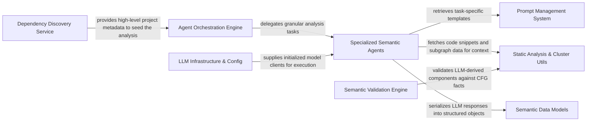

## Details

The intelligent core responsible for driving the code analysis and documentation generation using large language models. It orchestrates agent workflows, manages interactions with various tools, and structures the analysis insights.

### Agent Orchestration Engine
Coordinates the analysis workflow, manages agent lifecycles, and ensures full coverage of CFG clusters.

**Related Classes/Methods**:

- `agents.code_boarding.CodeBoardingAgent`

### Specialized Semantic Agents
Task‑specific agents (Abstraction, Meta, Details) that perform targeted analysis of code components.

**Related Classes/Methods**:

- `agents.abstraction.AbstractionAgent`
- `agents.meta.MetaAgent`
- `agents.details.DetailsAgent`

### Prompt Management System
Decouples prompt engineering from logic, providing provider‑specific templates (OpenAI, Gemini, etc.).

**Related Classes/Methods**:

- `prompts.prompt_generator.PromptGenerator`
- `prompts.prompt_factory.PromptFactory`:49-99

### Semantic Validation Engine
Cross‑references LLM interpretations with static analysis facts to ensure no clusters are missed or hallucinated.

**Related Classes/Methods**:

- `validation.ValidationContext`:14-27

### LLM Infrastructure & Config
Manages provider configurations, API keys, and model initialization (Ollama, Anthropic, etc.).

**Related Classes/Methods**:

- `config.llm_config.LLMConfig`
- `config.initialize_llms`:319-322

### Static Analysis & Cluster Utils
Provides utility methods for agents to map clusters to file sets and extract relevant code subgraphs.

**Related Classes/Methods**:

- `utils.cluster_utils`

### Semantic Data Models
Defines the structured Pydantic schemas for LLM communication and final documentation output.

**Related Classes/Methods**:

- `models.analysis_insights.AnalysisInsights`
- `models.component.Component`
- `models.relation.Relation`

### Dependency Discovery Service
Scans for manifest files (e.g., package.json) to provide ecosystem context to the agents.

**Related Classes/Methods**:

- `discovery.discover_dependency_files`:103-159

### [FAQ](https://github.com/CodeBoarding/GeneratedOnBoardings/tree/main?tab=readme-ov-file#faq)