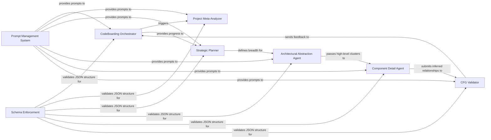

## Details

The intelligent core responsible for driving the code analysis and documentation generation using large language models. It orchestrates agent workflows, manages interactions with various tools, and structures the analysis insights.

### CodeBoarding Orchestrator
Primary controller managing the analysis lifecycle, maintaining global state and coordinating the flow between specialized agents.

**Related Classes/Methods**:

- `agents.agent.CodeBoardingAgent`

### Prompt Management System
Provider‑agnostic factory that abstracts LLM‑specific templates (Claude, GPT, Gemini) and supplies optimized system messages.

**Related Classes/Methods**:

- `agents.prompts.prompt_generator.PromptGenerator`
- `agents.prompts.prompt_factory.PromptFactory`

### Project Meta-Analyzer
Identifies the tech stack, domain, and architectural bias to provide high‑level context that primes the rest of the pipeline.

**Related Classes/Methods**:

- `agents.meta_analyzer.MetaAgent`

### Strategic Planner
Analyzes component complexity and file counts to decide which areas require deeper recursive analysis or "expansion."

**Related Classes/Methods**:

- `agents.planner.PlannerAgent`

### Architectural Abstraction Agent
Performs coarse‑grained reasoning to identify broad patterns and top‑level components, establishing the project skeleton.

**Related Classes/Methods**:

- `agents.abstraction.AbstractionAgent`

### Component Detail Agent
Conducts deep dives into specific clusters, extracting responsibilities and internal logic using filtered CFG sub‑graphs.

**Related Classes/Methods**:

- `agents.detail_agent.DetailAgent`

### CFG Validator
Grounding mechanism that cross‑references LLM‑generated maps against the actual static analysis graph to detect hallucinations.

**Related Classes/Methods**:

- `agents.validation.ValidationContext`

### Schema Enforcement
Defines Pydantic models used by all agents to ensure complex LLM outputs are strictly typed before being passed to other stages.

**Related Classes/Methods**:

- `models.analysis_insights.AnalysisInsights`
- `models.agent_responses.AgentResponses`

### [FAQ](https://github.com/CodeBoarding/GeneratedOnBoardings/tree/main?tab=readme-ov-file#faq)