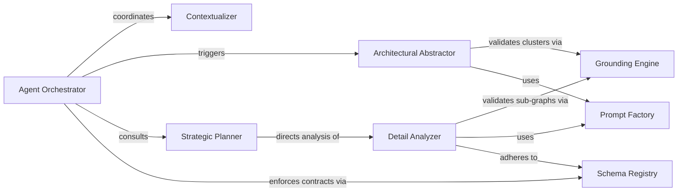

## Details

The intelligent core responsible for driving the code analysis and documentation generation using large language models. It orchestrates agent workflows, manages interactions with various tools, and structures the analysis insights.

### Agent Orchestrator
The central controller managing the pipeline lifecycle, state transitions, and handoffs between specialized agents. It maintains the global state of the analysis job.

**Related Classes/Methods**:

- `repos.codeboarding.agent.CodeBoardingAgent`

### Contextualizer
Analyzes project‑wide metadata (tech stack, domain, READMEs) to provide the grounding context for all subsequent LLM reasoning.

**Related Classes/Methods**:

- `repos.codeboarding.agent.MetaAgent`

### Architectural Abstractor
Performs high‑level clustering of files and modules into logical architectural components based on naming conventions and structural proximity.

**Related Classes/Methods**:

- `repos.codeboarding.agent.AbstractionAgent`

### Strategic Planner
Evaluates the complexity of the initial abstraction and determines which specific components require granular "drill‑down" analysis.

**Related Classes/Methods**:

- `repos.codeboarding.agent.PlannerAgent`

### Detail Analyzer
Conducts deep‑dive inspections of specific components to extract internal logic, sub‑graph relationships, and fine‑grained dependencies.

**Related Classes/Methods**:

- `repos.codeboarding.agent.DetailsAgent`

### Grounding Engine
Cross‑references LLM‑proposed mappings with deterministic CFG data to ensure structural validity and prevent hallucinations.

**Related Classes/Methods**:

- `repos.codeboarding.agent.ValidationContext`

### Prompt Factory
A decoupled interface for generating provider‑specific prompts (Gemini, OpenAI, etc.) and managing templates to ensure consistent agent behavior.

**Related Classes/Methods**:

- `repos.codeboarding.prompts.PromptFactory`
- `repos.codeboarding.prompts.PromptGenerator`

### Schema Registry
Defines the Pydantic models and structured contracts used for inter‑agent communication and final output serialization.

**Related Classes/Methods**:

- `repos.codeboarding.models.AnalysisInsights`
- `repos.codeboarding.models.AgentResponses`

### [FAQ](https://github.com/CodeBoarding/GeneratedOnBoardings/tree/main?tab=readme-ov-file#faq)