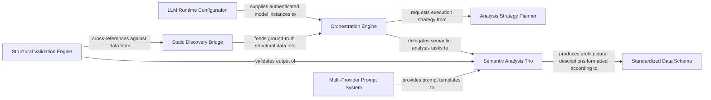

## Details

The intelligent core responsible for driving the code analysis and documentation generation using large language models. It orchestrates agent workflows, manages interactions with various tools, and structures the analysis insights.

### Orchestration Engine
The central lifecycle manager that coordinates the analysis flow, manages state, and sequences the execution of specialized agents. It handles retry logic and maintains the overall progress of the codebase visualization task.

**Related Classes/Methods**:

- `repos.codeboarding.agent.CodeBoardingAgent`
- `repos.codeboarding.agent.AgentState`

### Analysis Strategy Planner
Evaluates repository characteristics (file density, cluster count) to determine the optimal analysis strategy, such as whether components should be processed as flat lists or recursive sub-graphs.

**Related Classes/Methods**:

- `repos.codeboarding.agent.PlannerAgent`

### Semantic Analysis Trio
A specialized group of agents that interpret the codebase at three granularities: project metadata (Meta), high-level abstractions (Abstraction), and implementation details (Details).

**Related Classes/Methods**:

- `repos.codeboarding.agent.MetaAgent`
- `repos.codeboarding.agent.AbstractionAgent`
- `repos.codeboarding.agent.DetailsAgent`

### Structural Validation Engine
Acts as a deterministic gatekeeper, cross-referencing LLM-generated mappings against the static Control Flow Graph (CFG) to prevent hallucinations and ensure structural integrity.

**Related Classes/Methods**:

- `repos.codeboarding.agent.ValidationContext`

### Multi-Provider Prompt System
A decoupled management layer that serves provider-specific templates (OpenAI, Gemini, Anthropic, etc.) to agents via a factory pattern, ensuring the system is model‑agnostic.

**Related Classes/Methods**:

- `repos.codeboarding.prompts.PromptFactory`
- `repos.codeboarding.prompts.AbstractPromptFactory`

### LLM Runtime Configuration
Handles the initialization of LLM providers, API key resolution, and global model settings such as token limits and temperature.

**Related Classes/Methods**:

- `repos.codeboarding.config.LLMConfig`

### Static Discovery Bridge
Identifies the project ecosystem and extracts specific sub‑graphs from the codebase to deliver ground‑truth structural data to the agents.

**Related Classes/Methods**:

- `repos.codeboarding.discovery.DependencyDiscovery`
- `repos.codeboarding.discovery.ClusterMethodsMixin`

### Standardized Data Schema
Defines the shared Pydantic models that ensure all agents produce and consume data in a consistent, validated format across the pipeline.

**Related Classes/Methods**:

- `repos.codeboarding.models.AnalysisInsights`

### [FAQ](https://github.com/CodeBoarding/GeneratedOnBoardings/tree/main?tab=readme-ov-file#faq)