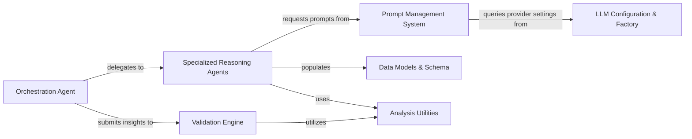

## Details

The intelligent core responsible for driving the code analysis and documentation generation using large language models. It orchestrates agent workflows, manages interactions with various tools, and structures the analysis insights.

### Orchestration Agent
Central controller that manages the multi‑agent state machine, loads static analysis facts, classifies files, and coordinates the execution sequence of worker agents to ensure a coherent analysis lifecycle.

**Related Classes/Methods**:

- <a href="https://github.com/CodeBoarding/CodeBoarding/blob/main/.codeboardingagents/prompts/gemini_flash_prompts.py" target="_blank" rel="noopener noreferrer">`agents.prompts.gemini_flash_prompts.CodeBoardingAgent`</a>
- <a href="https://github.com/CodeBoarding/CodeBoarding/blob/main/.codeboardingagents/prompts/gemini_flash_prompts.py" target="_blank" rel="noopener noreferrer">`agents.prompts.gemini_flash_prompts.AgentState`</a>

### Specialized Reasoning Agents
Suite of task‑specific workers that perform granular analysis. Each agent focuses on a specific abstraction level: metadata extraction, high‑level component mapping, detailed implementation analysis, or project planning.

**Related Classes/Methods**:

- <a href="https://github.com/CodeBoarding/CodeBoarding/blob/main/.codeboardingagents/prompts/gemini_flash_prompts.py" target="_blank" rel="noopener noreferrer">`agents.prompts.gemini_flash_prompts.MetaAgent`</a>
- <a href="https://github.com/CodeBoarding/CodeBoarding/blob/main/.codeboardingagents/prompts/gemini_flash_prompts.py" target="_blank" rel="noopener noreferrer">`agents.prompts.gemini_flash_prompts.AbstractionAgent`</a>
- <a href="https://github.com/CodeBoarding/CodeBoarding/blob/main/.codeboardingagents/prompts/gemini_flash_prompts.py" target="_blank" rel="noopener noreferrer">`agents.prompts.gemini_flash_prompts.DetailsAgent`</a>
- <a href="https://github.com/CodeBoarding/CodeBoarding/blob/main/.codeboardingagents/prompts/gemini_flash_prompts.py" target="_blank" rel="noopener noreferrer">`agents.prompts.gemini_flash_prompts.PlannerAgent`</a>

### Prompt Management System
Strategy‑based factory that generates provider‑specific templates (GPT, Claude, Gemini). It decouples the reasoning logic from the linguistic requirements of different LLM providers.

**Related Classes/Methods**:

- <a href="https://github.com/CodeBoarding/CodeBoarding/blob/main/.codeboardingagents/prompts/prompt_factory.py" target="_blank" rel="noopener noreferrer">`agents.prompts.prompt_factory.PromptFactory`</a>
- <a href="https://github.com/CodeBoarding/CodeBoarding/blob/main/.codeboardingagents/prompts/gemini_flash_prompts.py" target="_blank" rel="noopener noreferrer">`agents.prompts.gemini_flash_prompts.PromptGenerator`</a>

### Validation Engine
Quality gate that verifies LLM‑generated architectural maps against ground‑truth static analysis facts, such as file existence and cluster coverage.

**Related Classes/Methods**:

- <a href="https://github.com/CodeBoarding/CodeBoarding/blob/main/.codeboardingagents/validation.py" target="_blank" rel="noopener noreferrer">`agents.validation.ValidationEngine`</a>

### LLM Configuration & Factory
Manages provider initialization, API credentials, and runtime settings (temperature, token limits). Exposes a unified interface for the rest of the subsystem to interact with various LLM backends.

**Related Classes/Methods**:

- <a href="https://github.com/CodeBoarding/CodeBoarding/blob/main/.codeboardingagents/llm_config.py" target="_blank" rel="noopener noreferrer">`agents.config.LLMConfig`</a>

### Data Models & Schema
Defines the Pydantic contracts used for structured data exchange. These models ensure that LLM outputs are parsed into strictly typed objects used by the rest of the application.

**Related Classes/Methods**:

- <a href="https://github.com/CodeBoarding/CodeBoarding/blob/main/.codeboardingagents/prompts/gemini_flash_prompts.py" target="_blank" rel="noopener noreferrer">`agents.prompts.gemini_flash_prompts.AnalysisInsights`</a>
- <a href="https://github.com/CodeBoarding/CodeBoarding/blob/main/.codeboardingagents/prompts/gemini_flash_prompts.py" target="_blank" rel="noopener noreferrer">`agents.prompts.gemini_flash_prompts.Component`</a>
- <a href="https://github.com/CodeBoarding/CodeBoarding/blob/main/.codeboardingagents/prompts/gemini_flash_prompts.py" target="_blank" rel="noopener noreferrer">`agents.prompts.gemini_flash_prompts.Relation`</a>

### Analysis Utilities
Shared logic for manipulating static analysis clusters and mapping files to component structures. Provides the bridge between raw CFG data and LLM‑friendly formats.

**Related Classes/Methods**:

- <a href="https://github.com/CodeBoarding/CodeBoarding/blob/main/.codeboardingagents/cluster_methods_mixin.py" target="_blank" rel="noopener noreferrer">`agents.utils.ClusterMethodsMixin`</a>

### [FAQ](https://github.com/CodeBoarding/GeneratedOnBoardings/tree/main?tab=readme-ov-file#faq)