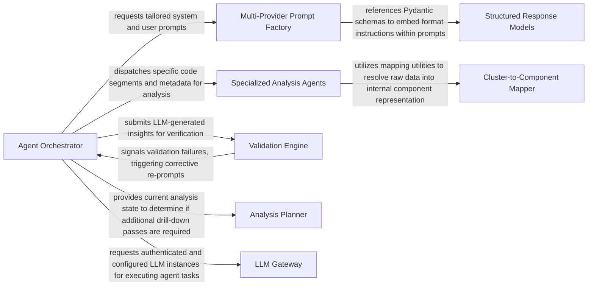

```mermaid
graph LR
    Agent_Orchestrator["Agent Orchestrator"]
    Specialized_Analysis_Agents["Specialized Analysis Agents"]
    Multi_Provider_Prompt_Factory["Multi-Provider Prompt Factory"]
    Validation_Engine["Validation Engine"]
    Analysis_Planner["Analysis Planner"]
    LLM_Gateway["LLM Gateway"]
    Structured_Response_Models["Structured Response Models"]
    Cluster_to_Component_Mapper["Cluster-to-Component Mapper"]
    Agent_Orchestrator -- "requests tailored system and user prompts" --> Multi_Provider_Prompt_Factory
    Agent_Orchestrator -- "dispatches specific code segments and metadata for analysis" --> Specialized_Analysis_Agents
    Specialized_Analysis_Agents -- "utilizes mapping utilities to resolve raw data into internal component representation" --> Cluster_to_Component_Mapper
    Agent_Orchestrator -- "submits LLM‑generated insights for verification" --> Validation_Engine
    Validation_Engine -- "signals validation failures, triggering corrective re‑prompts" --> Agent_Orchestrator
    Agent_Orchestrator -- "provides current analysis state to determine if additional drill‑down passes are required" --> Analysis_Planner
    Multi_Provider_Prompt_Factory -- "references Pydantic schemas to embed format instructions within prompts" --> Structured_Response_Models
    Agent_Orchestrator -- "requests authenticated and configured LLM instances for executing agent tasks" --> LLM_Gateway
```

## Details

The intelligent core responsible for driving the code analysis and documentation generation using large language models. It orchestrates agent workflows, manages interactions with various tools, and structures the analysis insights.

### Agent Orchestrator
The central coordinator (CodeBoardingAgent) that manages the analysis lifecycle, initializes LLM providers, and dispatches tasks to specialized agents.

**Related Classes/Methods**:

- `agents.codeboarding_agent.CodeBoardingAgent`

### Specialized Analysis Agents
A suite of domain‑specific agents (AbstractionAgent, DetailsAgent, MetaAgent) that analyze code for architectural patterns, low‑level logic, and project‑wide context.

**Related Classes/Methods**:

- `agents.specialized_agents.AbstractionAgent`
- `agents.specialized_agents.DetailsAgent`
- `agents.specialized_agents.MetaAgent`

### Multi-Provider Prompt Factory
Generates provider‑specific instructions (Claude, Gemini, GPT) to ensure consistent agent behavior across different LLM backends.

**Related Classes/Methods**:

- `agents.prompts.factory.PromptFactory`
- `agents.prompts.gemini_flash_prompts`

### Validation Engine
A quality‑gate component that verifies LLM outputs against static analysis data to ensure every code cluster is correctly mapped and relationships are consistent.

**Related Classes/Methods**:

- `agents.validation.ValidationEngine`

### Analysis Planner
Strategic component that determines the depth of analysis, identifying which components require further "drill‑down" or expansion based on initial findings.

**Related Classes/Methods**:

- `agents.planner_agent.PlannerAgent`

### LLM Gateway
Manages API configurations, model selection, and the initialization of LangChain‑compatible clients for various providers.

**Related Classes/Methods**:

- `agents.llm_config.LLMGateway`

### Structured Response Models
Pydantic‑based schemas (e.g., AnalysisInsights) that define the strict data contract for all LLM communications.

**Related Classes/Methods**:

- `agents.models.AnalysisInsights`

### Cluster-to-Component Mapper
Provides the logic (ClusterMethodsMixin) to translate raw CFG clusters and file paths into logical architectural components.

**Related Classes/Methods**:

- `agents.mixins.cluster_methods.ClusterMethodsMixin`

### [FAQ](https://github.com/CodeBoarding/GeneratedOnBoardings/tree/main?tab=readme-ov-file#faq)