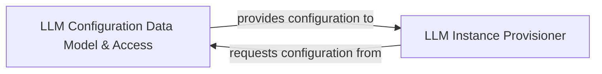

## Details

Handles configuration, initialization, and management of different LLMs, storing API keys, model names, temperature settings, and provider‑specific parameters.

### LLM Configuration Data Model & Access
Defines the canonical data model for LLM configurations, manages secure storage and retrieval of API keys, resolves additional parameters, and determines the active status of LLM configurations, acting as the single source of truth for all LLM‑related settings.

**Related Classes/Methods**:

- <a href="https://github.com/CodeBoarding/CodeBoarding/blob/main/.codeboardingagents/llm_config.py" target="_blank" rel="noopener noreferrer">`agents.llm_config`</a>

### LLM Instance Provisioner
Orchestrates the creation and instantiation of diverse LLM instances (generic chat models, agent‑specific LLMs, parsing‑focused LLMs) by consuming configuration data, selecting the appropriate chat class or LLM implementation, and building concrete, usable LLM objects.

**Related Classes/Methods**: _None_

### [FAQ](https://github.com/CodeBoarding/GeneratedOnBoardings/tree/main?tab=readme-ov-file#faq)