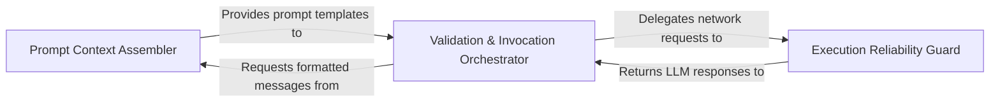

## Details

Handles technical communication with LLM providers and encapsulates retry logic for resilience.

### Prompt Context Assembler
Transforms internal repository structures and cluster relationships into optimized prompts and system instructions for LLM consumption.

**Related Classes/Methods**: _None_

**Source Files:**

- [`agents/agent.py`](https://github.com/CodeBoarding/CodeBoarding/blob/main/.codeboardingagents/agent.py)
  - `agents.agent.CodeBoardingAgent.read_source_reference` ([L62-L63](https://github.com/CodeBoarding/CodeBoarding/blob/main/.codeboardingagents/agent.py#L62-L63)) - Method
  - `agents.agent.CodeBoardingAgent.read_structure_tool` ([L70-L71](https://github.com/CodeBoarding/CodeBoarding/blob/main/.codeboardingagents/agent.py#L70-L71)) - Method
- [`agents/agent_responses.py`](https://github.com/CodeBoarding/CodeBoarding/blob/main/.codeboardingagents/agent_responses.py)
  - `agents.agent_responses.ComponentFiles.llm_str` ([L554-L559](https://github.com/CodeBoarding/CodeBoarding/blob/main/.codeboardingagents/agent_responses.py#L554-L559)) - Method

### Execution Reliability Guard
Implements technical resilience using exponential backoff, jitter, and transient error handling to ensure stable API communication.

**Related Classes/Methods**: _None_

**Source Files:**

- [`agents/agent.py`](https://github.com/CodeBoarding/CodeBoarding/blob/main/.codeboardingagents/agent.py)
  - `agents.agent.CodeBoardingAgent.read_packages_tool` ([L66-L67](https://github.com/CodeBoarding/CodeBoarding/blob/main/.codeboardingagents/agent.py#L66-L67)) - Method
  - `agents.agent.CodeBoardingAgent.read_method_invocations_tool` ([L82-L83](https://github.com/CodeBoarding/CodeBoarding/blob/main/.codeboardingagents/agent.py#L82-L83)) - Method
  - `agents.agent.CodeBoardingAgent.read_file_tool` ([L86-L87](https://github.com/CodeBoarding/CodeBoarding/blob/main/.codeboardingagents/agent.py#L86-L87)) - Method

### Validation & Invocation Orchestrator
The central controller managing the Invoke-Validate-Retry loop, ensuring LLM responses conform to strict Pydantic schemas.

**Related Classes/Methods**: _None_

**Source Files:**

- [`agents/agent.py`](https://github.com/CodeBoarding/CodeBoarding/blob/main/.codeboardingagents/agent.py)
  - `agents.agent.CodeBoardingAgent.read_file_structure` ([L74-L75](https://github.com/CodeBoarding/CodeBoarding/blob/main/.codeboardingagents/agent.py#L74-L75)) - Method
  - `agents.agent.CodeBoardingAgent.read_cfg_tool` ([L78-L79](https://github.com/CodeBoarding/CodeBoarding/blob/main/.codeboardingagents/agent.py#L78-L79)) - Method
  - `agents.agent.CodeBoardingAgent.read_docs` ([L90-L91](https://github.com/CodeBoarding/CodeBoarding/blob/main/.codeboardingagents/agent.py#L90-L91)) - Method
  - `agents.agent.CodeBoardingAgent.external_deps_tool` ([L94-L95](https://github.com/CodeBoarding/CodeBoarding/blob/main/.codeboardingagents/agent.py#L94-L95)) - Method

### [FAQ](https://github.com/CodeBoarding/GeneratedOnBoardings/tree/main?tab=readme-ov-file#faq)