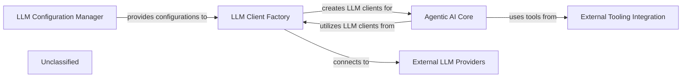

## Details

The `agents` subsystem forms the intelligent core of the project, orchestrating AI-driven code analysis through a modular architecture. It begins with the **LLM Configuration Manager**, which centralizes the setup for various Large Language Model providers. This configuration is then consumed by the **LLM Client Factory**, responsible for dynamically instantiating LLM clients tailored for both general interactions and structured data extraction. These clients are the primary interface for the **Agentic AI Core**, a collection of specialized agents (e.g., Abstraction, Details, Planner) that perform the actual code analysis by interacting with the LLMs. To gather necessary context from the codebase, the **Agentic AI Core** integrates with **External Tooling Integration**, a suite of tools for reading files, analyzing dependencies, and retrieving source code. Ultimately, the **LLM Client Factory** establishes connections with **External LLM Providers**, facilitating the communication with services like OpenAI, Google, and Anthropic to execute AI tasks. This layered approach ensures flexibility, maintainability, and efficient utilization of AI capabilities for comprehensive code understanding.

### LLM Configuration Manager
Responsible for loading, validating, and providing LLM configurations, including API keys, model names, and provider-specific settings.

**Related Classes/Methods**:

- <a href="https://github.com/CodeBoarding/CodeBoarding/blob/main/.codeboardingagents/llm_config.py#L29-L92" target="_blank" rel="noopener noreferrer">`agents.llm_config.LLMConfig`:29-92</a>
- <a href="https://github.com/CodeBoarding/CodeBoarding/blob/main/.codeboardingagents/llm_config.py" target="_blank" rel="noopener noreferrer">`agents.llm_config.LLM_PROVIDERS`</a>
- <a href="https://github.com/CodeBoarding/CodeBoarding/blob/main/.codeboardingagents/llm_config.py#L20-L26" target="_blank" rel="noopener noreferrer">`agents.llm_config.InstructorProvider`:20-26</a>

### LLM Client Factory
Manages the creation and instantiation of LLM clients (both for general chat and structured output via `instructor`) based on the active configuration. It abstracts the complexities of different LLM APIs.

**Related Classes/Methods**:

- <a href="https://github.com/CodeBoarding/CodeBoarding/blob/main/.codeboardingagents/llm_config.py#L199-L205" target="_blank" rel="noopener noreferrer">`agents.llm_config.create_instructor_client_from_env`:199-205</a>
- <a href="https://github.com/CodeBoarding/CodeBoarding/blob/main/.codeboardingagents/llm_config.py#L208-L229" target="_blank" rel="noopener noreferrer">`agents.llm_config.create_llm_from_env`:208-229</a>
- <a href="https://github.com/CodeBoarding/CodeBoarding/blob/main/.codeboardingagents/llm_config.py" target="_blank" rel="noopener noreferrer">`agents.llm_config.LLMConfig.create_instructor_client`</a>

### Agentic AI Core
Contains the core logic for various AI agents that interact with LLMs to perform tasks like code abstraction, detail analysis, planning, and validation. These agents interpret LLM responses and drive the overall analysis process.

**Related Classes/Methods**:

- <a href="https://github.com/CodeBoarding/CodeBoarding/blob/main/.codeboardingagents/abstraction_agent.py" target="_blank" rel="noopener noreferrer">`agents.abstraction_agent.AbstractionAgent`</a>
- <a href="https://github.com/CodeBoarding/CodeBoarding/blob/main/.codeboardingagents/details_agent.py" target="_blank" rel="noopener noreferrer">`agents.details_agent.DetailsAgent`</a>
- <a href="https://github.com/CodeBoarding/CodeBoarding/blob/main/.codeboardingagents/planner_agent.py" target="_blank" rel="noopener noreferrer">`agents.planner_agent.PlannerAgent`</a>
- <a href="https://github.com/CodeBoarding/CodeBoarding/blob/main/.codeboardingagents/validator_agent.py" target="_blank" rel="noopener noreferrer">`agents.validator_agent.ValidatorAgent`</a>
- <a href="https://github.com/CodeBoarding/CodeBoarding/blob/main/.codeboardingagents/meta_agent.py" target="_blank" rel="noopener noreferrer">`agents.meta_agent.MetaAgent`</a>

### External Tooling Integration
Provides a set of tools that agents can use to interact with the repository, such as reading files, analyzing dependencies, and retrieving source code.

**Related Classes/Methods**:

- <a href="https://github.com/CodeBoarding/CodeBoarding/blob/main/.codeboardingagents/tools/external_deps.py" target="_blank" rel="noopener noreferrer">`agents.tools.external_deps.ExternalDepsTool`</a>
- <a href="https://github.com/CodeBoarding/CodeBoarding/blob/main/.codeboardingagents/tools/read_file.py" target="_blank" rel="noopener noreferrer">`agents.tools.read_file.ReadFileTool`</a>
- <a href="https://github.com/CodeBoarding/CodeBoarding/blob/main/.codeboardingagents/tools/read_source.py" target="_blank" rel="noopener noreferrer">`agents.tools.read_source.ReadSourceTool`</a>

### External LLM Providers
Represents various external Large Language Model services (e.g., OpenAI, Anthropic, Google, AWS Bedrock, Ollama, Cerebras) that are integrated and consumed by the system. These are defined and configured within the `LLM_PROVIDERS` dictionary.

**Related Classes/Methods**:

- <a href="https://github.com/CodeBoarding/CodeBoarding/blob/main/.codeboardingagents/llm_config.py#L20-L26" target="_blank" rel="noopener noreferrer">`agents.llm_config.InstructorProvider`:20-26</a>
- <a href="https://github.com/CodeBoarding/CodeBoarding/blob/main/.codeboardingagents/llm_config.py" target="_blank" rel="noopener noreferrer">`agents.llm_config.LLM_PROVIDERS`</a>

### Unclassified
Component for all unclassified files and utility functions (Utility functions/External Libraries/Dependencies)

**Related Classes/Methods**: _None_

### [FAQ](https://github.com/CodeBoarding/GeneratedOnBoardings/tree/main?tab=readme-ov-file#faq)
